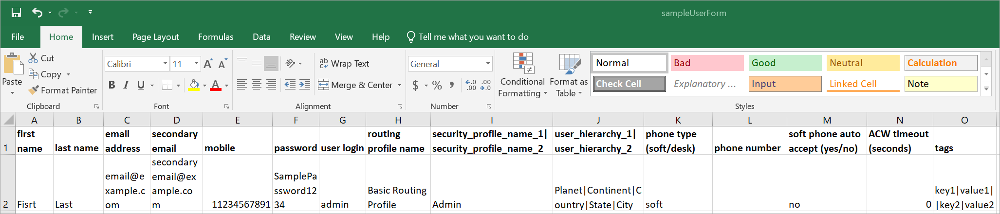
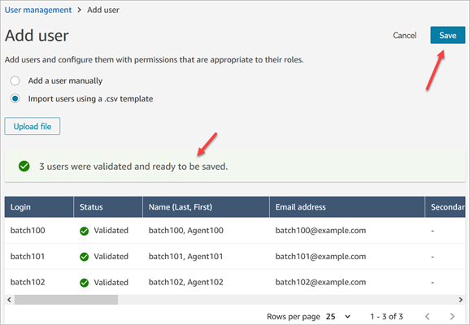
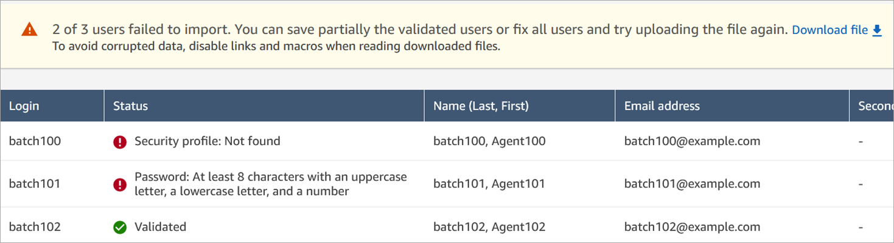
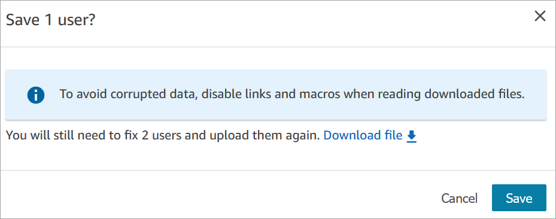
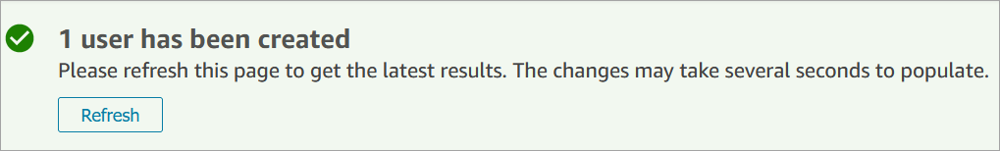
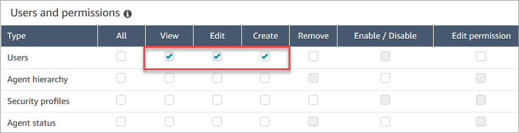

# Add users to Amazon Connect

When you add users to Amazon Connect, you can configure them with information appropriate to
their roles. For example, you specify their [security profile](connect-security-profiles.md "connect-security-profiles.md"), which indicates the tasks they can perform in Amazon Connect admin website. For
agents you specify their [routing profile](routing-profiles.md "routing-profiles.md"), which
indicates the contacts that can be routed to them.

This topic explains how to add users using the Amazon Connect admin website. To add users programmatically,
see [CreateUser](../APIReference/API_CreateUser.md "../APIReference/API_CreateUser.md") in the _Amazon Connect API Reference Guide_. To use the CLI, see [create-user](../../../cli/latest/reference/connect/create-user.md "../../../cli/latest/reference/connect/create-user.md").

## Add a user individually

1. Log in to the Amazon Connect admin website at https://`instance name`.my.connect.aws/. Use an **Admin** account, or an account
   assigned to a security profile that has **Users - Create**
   permission.
2. In Amazon Connect, on the left navigation menu, choose **Users**,
   **User management**.
3. Choose **Add new users**.
4. Choose **Create and set up a new user** and then choose
   **Next**.
5. Enter the name, email address, secondary email address, mobile number, and
   password for the user.

###### Note

SAML users don't have primary email addresses, they have username logins. A username login
is typically an email address but it doesn't have to be. For these users the field label
**Email address** is empty inside Amazon Connect. When email notifications are sent for SAML users, they must have
a secondary email configured in order to get it. If a secondary email is not configured, the user won't receive the email.

###### Tip

Mobile number is not currently used by Amazon Connect. 6. Choose a routing profile and a security profile. 7. Optionally, add tags to identify, organize, search for, filter, and
control who can access this hours of operation record. For more information,
see [Add tags to resources in Amazon Connect](tagging.md "tagging.md"). 8. Choose **Save**. If the Save button isn't active, it
means you're logged in with an Amazon Connect account that doesn't have
the required security profile permissions.

To fix this issue, log in with an account that is assigned to the Amazon Connect Admin security profile. Or, ask another Admin to help. 9. For information about adding agents, see [Configure the agent's profiles and task settings in
Amazon Connect](configure-agents.md "configure-agents.md").

## Add users in bulk from a .csv file

You can add up to 1000 users at a time by using a .csv file.

###### Note

Avoid adding too many unique resources in the .csv file. For example, don't
add more than 100 different routing profiles. This may cause a timeout or
failure during the validation process.

Bulk upload is for adding new records, not for editing existing records. To
edit user records in bulk, see [Edit users in bulk in Amazon Connect](edit-users-in-bulk.md "edit-users-in-bulk.md").

Use these steps to add several users from a .csv file such as an Excel
spreadsheet.

1. Log in to Amazon Connect with an **Admin** account,
   or an account assigned to a security profile that has **Users -
   Create** permission.
2. In Amazon Connect, on the left navigation menu, choose **Users**,
   **User management**.
3. Choose **Add new users**.
4. Choose **Import users using a .csv template** and then
   choose **.csv template**.

The .csv template has the following columns in the first row:

    * first name
    * last name
    * email address
    * secondary email address
    * mobile: This is not currently used by Amazon Connect.
    * password
    * user login
    * agent hierarchy
    * routing profile name
    * security\_profile\_name\_1|security\_profile\_name\_2
    * user\_hierarchy\_1|user\_hierarchy\_2
    * phone type (soft/desk)
    * phone number
    * soft phone auto accept (yes/no)
    * ACW timeout (seconds)
    * tags

The following image shows a sample of what the .csv template looks like in
an Excel spreadsheet. The first row in the spreadsheet contains the column
headings, and the second row contains sample user data.

 5. Add your users to the template and upload it to Amazon Connect. Choose
**Upload file and verify**. 6. Amazon Connect validates the data in the file. Choose **Save** to
create the new user records.

If you get a validation error message, it usually indicates that one of
the required columns is missing information, or there's a typo in one of the
cells.

The following image shows an example validation error message. In this
case, the security profile was misspelled and a password didn't meet
requirements.

 7. To upload only the validated user records, choose
**Save**. A dialog box prompts you for
confirmation.

 8. A banner displays the status of the upload and confirms when it's
complete.

###### Tip

While a batch of additions is being processed, you can continue
working on the **User management** page, choosing
another batch of user records to create, edit, or delete, in bulk or
individually. This is useful for quickly updating settings such as
routing profiles for groups of agents.

Amazon Connect sequentially processes the records in bulk. 9. Choose **Refresh** to update the **User
management** page with the users that have been created.

## Required permissions for adding

users

Before you can add users to Amazon Connect, you need the following permissions
assigned to your security profile: **Users - Create**. The
following image shows that this security profile permission is in the
**Users and permissions** section of the **Add/Edit
security profile** page.

By default, the Amazon Connect
**Admin** security profile has these permissions.

For information about how to add more permissions to an existing security profile,
see [Update security profiles in Amazon Connect](update-security-profiles.md "update-security-profiles.md").
