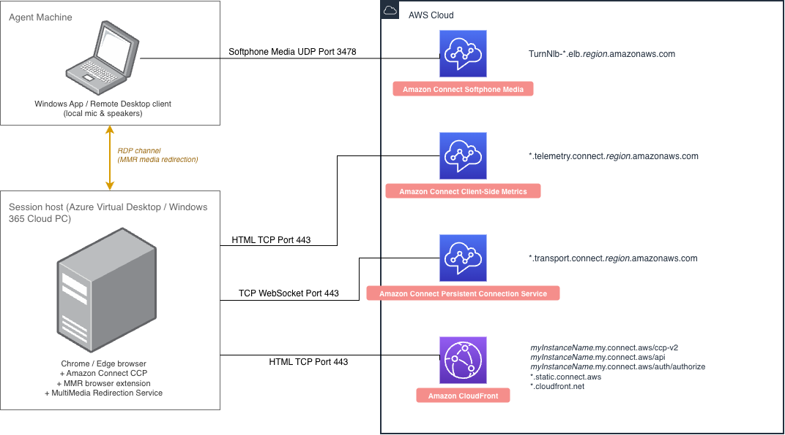
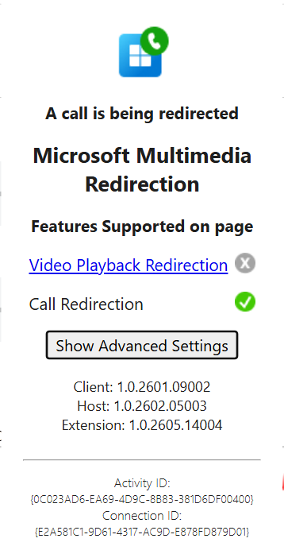

# Optimize Connect Customer audio for Azure Virtual Desktop and Windows 365

Connect Customer delivers high-quality voice experiences for agents who use Azure
Virtual Desktop (AVD) or Windows 365 Cloud PC. With Microsoft Multimedia Redirection
(MMR), agents offload audio processing to their local device and redirect audio
directly to Connect Customer, improving audio quality over challenging networks.

To get started, you can use the agent workspace, or the [Connect Customer open source
Streams library](https://github.com/amazon-connect/amazon-connect-streams "https://github.com/amazon-connect/amazon-connect-streams") on the GitHub website to create a new or update an
existing agent user interface, such as a custom Contact Control Panel (CCP).

## System requirements

This section describes the system requirements for using Microsoft
Multimedia Redirection (MMR) with Connect Customer. For the complete set of Microsoft
requirements, see [Prerequisites for multimedia redirection](https://learn.microsoft.com/en-us/azure/virtual-desktop/multimedia-redirection-video-playback-calls?tabs=intune&pivots=azure-virtual-desktop#prerequisites "https://learn.microsoft.com/en-us/azure/virtual-desktop/multimedia-redirection-video-playback-calls?tabs=intune&pivots=azure-virtual-desktop#prerequisites") in the Microsoft
documentation.

- **Agent local device**

  - Connect to the remote session from one of the following
    supported apps: Windows App on Windows, version 2.0.297.0 or
    later, or Remote Desktop app on Windows, version 1.2.5709 or
    later.
  - Microsoft Visual C++ Redistributable version 14.32.31332.0 or
    later.

- **Azure session host (AVD or Windows 365)**

  - Multimedia redirection installed on the session host. For
    instructions, see [Install multimedia redirection on session hosts](https://learn.microsoft.com/en-us/azure/virtual-desktop/multimedia-redirection-video-playback-calls?tabs=intune&pivots=azure-virtual-desktop#install-multimedia-redirection-on-session-hosts "https://learn.microsoft.com/en-us/azure/virtual-desktop/multimedia-redirection-video-playback-calls?tabs=intune&pivots=azure-virtual-desktop#install-multimedia-redirection-on-session-hosts") in
    the Microsoft documentation.
  - Microsoft Visual C++ Redistributable version 14.32.31332.0 or
    later.

- **Browser support**

  - The latest version of Google Chrome or Microsoft Edge
    on the session host. MMR Call Redirection does not
    support other browsers.

- **MMR browser extension**

  - The Multimedia Redirection browser extension, version
    1.0.2605.29004 or later, installed on the session
    host for Microsoft Edge or Google Chrome. The single installer
    that installs the Remote Desktop Multimedia Redirection Service
    also installs the browser extension. After installation, enable
    the extension. For instructions, see [Install multimedia redirection on session hosts](https://learn.microsoft.com/en-us/azure/virtual-desktop/multimedia-redirection-video-playback-calls?tabs=intune&pivots=azure-virtual-desktop#install-multimedia-redirection-on-session-hosts "https://learn.microsoft.com/en-us/azure/virtual-desktop/multimedia-redirection-video-playback-calls?tabs=intune&pivots=azure-virtual-desktop#install-multimedia-redirection-on-session-hosts") in
    the Microsoft documentation.
  - If you want to test and validate with prerelease MMR features,
    you can configure the MMR Insider extension. For more
    information, see [Deploy the Insider version of the multimedia redirection
    extension](https://learn.microsoft.com/en-us/azure/virtual-desktop/deploy-insider-extension "https://learn.microsoft.com/en-us/azure/virtual-desktop/deploy-insider-extension") in the Microsoft documentation.

- **Call redirection allowlist**: The MMR
  extension only redirects calls for domains on its
  `AllowedCallRedirectionSites` policy allowlist.

  - If your agents use the Connect Customer agent workspace or a CCP hosted
    on a Connect Customer domain (that is, if you pass
    `allowFramedSoftphone` as `true` when
    you initialize the CCP using [Connect Customer Streams JS](https://github.com/amazon-connect/amazon-connect-streams "https://github.com/amazon-connect/amazon-connect-streams") on the GitHub website), you don't
    need to take any action. Connect Customer domains are included in the
    Microsoft MMR extension default allowlist.
  - If your agents use a custom CCP hosted on your own domain (that
    is, with `allowFramedSoftphone: false`), your IT
    administrator must add the domain hosting your custom CCP to the
    `AllowedCallRedirectionSites` policy using Group
    Policy, the registry, or Microsoft Intune. For instructions and
    supported domain formats, see [Enable call redirection for specific domains](https://learn.microsoft.com/en-us/azure/virtual-desktop/multimedia-redirection-video-playback-calls?tabs=intune&pivots=azure-virtual-desktop#enable-call-redirection-for-specific-domains "https://learn.microsoft.com/en-us/azure/virtual-desktop/multimedia-redirection-video-playback-calls?tabs=intune&pivots=azure-virtual-desktop#enable-call-redirection-for-specific-domains") in the
    Microsoft documentation.

- **Networking and firewall
  configuration**

  - **Session host configuration**:
    Allow the Azure session host to reach Connect Customer over TCP/443 for the
    domains shown in the following diagram. For more information, see
    [Set up your network](ccp-networking.md "ccp-networking.md").
  - **Agent local device
    configuration**: This solution requires a media
    connection between the agent's local device and Connect Customer over
    Softphone Media UDP Port 3478. For more information, see [Set up your network](ccp-networking.md "ccp-networking.md").



## Configure the VDI platform parameter

To enable MMR Call Redirection in an Azure VDI environment, set the
`VDIPlatform` parameter to `AZURE`. You can set this
parameter in one of the following ways, depending on how your agents access the
CCP:

- **Agent workspace**: Add the
  `VDIPlatform=AZURE` query parameter to the URL. For more
  information, see [How to use audio
  optimization in the agent workspace](optimize-audio-cdd.md#howto-optimize-audio-cdd "optimize-audio-cdd.md#howto-optimize-audio-cdd").
- **Embedded or custom CCP**: Add the
  parameter to your `initCCP` configuration.

```
softphone: {
    allowFramedSoftphone: true,
    VDIPlatform: "AZURE"
}
```

###### Note

When `VDIPlatform` is set to `AZURE`, the CCP uses
Azure audio optimization exclusively and does not fall back to standard web
browser audio. Make sure that agents access the CCP from a properly configured
Azure VDI environment with the MMR extension active and a supported
browser.

If you do not set the `VDIPlatform` parameter, Connect Customer
automatically detects and enables Azure audio optimization when available.
We recommend setting the parameter explicitly to ensure the optimized audio
path is used consistently.

## Verify the media flow between the local device and Connect Customer

1. Confirm that the MMR browser extension is installed and active. In the
   virtual desktop browser, choose the **Multimedia Redirection**
   extension icon.
   When the CCP is open, the extension status shows as loaded (highlighted
   icon), and **Call
   Redirection** displays a check mark indicating it is
   active. For more information,
   see [Browser extension status](https://learn.microsoft.com/en-us/azure/virtual-desktop/multimedia-redirection-video-playback-calls#browser-extension-status "https://learn.microsoft.com/en-us/azure/virtual-desktop/multimedia-redirection-video-playback-calls#browser-extension-status") in the Microsoft
   documentation.

The extension icon changes to indicate the redirection status. The
following table shows the icon states that are relevant to call
redirection.

| Icon                                                                  | Meaning                                                                                                                                                              |
| --------------------------------------------------------------------- | -------------------------------------------------------------------------------------------------------------------------------------------------------------------- |
| The multimedia redirection extension is loaded.                       | The extension is loaded, indicating that the website<br>can be redirected.                                                                                           |
| The multimedia redirection extension is currently redirecting a call. | The extension is currently redirecting a call.                                                                                                                       |
| The multimedia redirection extension is not loaded.                   | The extension is not loaded, indicating that content<br>on the web page is not redirected.                                                                           |
| The multimedia redirection extension failed to load correctly.        | The extension failed to load correctly. You might<br>need to reinstall the extension or the Remote Desktop<br>Multimedia Redirection Service, and then try<br>again. |

2. Confirm that call redirection is enabled. Open the browser developer
   tools (F12), and in the console run the following command. The expected
   result is `true`.

```
navigator.mediaDevices.isCallRedirectionEnabled
```

3. Test the media flow. In the virtual desktop browser, disable the
   microphone permission for the CCP domain, and then refresh the page.
   Confirm that the **Multimedia Redirection** extension
   icon shows the loaded status.

Initiate a call. Confirm that the extension icon shows the call
symbol. Speak into the microphone and confirm that the other party
hears your audio. Because the agent's local device processes audio
rather than the virtual desktop, the call works even though the
microphone is disabled for the virtual desktop browser.

If the extension is disabled or call
redirection is not working, the agent sees an error banner that states
that the microphone is not accessible.



### Collect MMR debug logs

If you need to collect MMR logs for troubleshooting, use the browser
extension to capture them.

1. In the virtual desktop browser, choose the **Multimedia Redirection**
   extension icon, and then choose **Show Advanced
   Settings**.
2. For **Collect logs**, choose
   **Start**.
3. Reproduce the issue, choose the extension icon again, and then for
   **Collect logs**, choose **Stop**. The browser prompts you to download one or
   more log files.

|                                                                              |
| ---------------------------------------------------------------------------- |
| Collecting logs from the multimedia redirection extension advanced settings. |

For more information, see [Troubleshoot multimedia redirection](https://learn.microsoft.com/en-us/troubleshoot/azure/virtual-desktop/troubleshoot-multimedia-redirection#collect-logs "https://learn.microsoft.com/en-us/troubleshoot/azure/virtual-desktop/troubleshoot-multimedia-redirection#collect-logs") in the Microsoft
documentation.

###### Note

For current MMR known issues and limitations, see [Known issues and limitations](https://learn.microsoft.com/en-us/troubleshoot/azure/virtual-desktop/troubleshoot-multimedia-redirection#known-issues-and-limitations "https://learn.microsoft.com/en-us/troubleshoot/azure/virtual-desktop/troubleshoot-multimedia-redirection#known-issues-and-limitations") in the Microsoft
documentation.

## Limitations

- **Government clouds**: Microsoft does not
  support MMR on Azure Virtual Desktop for Azure US Government, or on Windows
  365 for GCC, GCC-High, or DoD environments.
- **Voice Focus**: VDI environments do not
  support noise suppression (Voice Focus) because it is incompatible with
  audio redirection.
- **Video**: Connect Customer does not currently
  support MMR Call Redirection for video.
