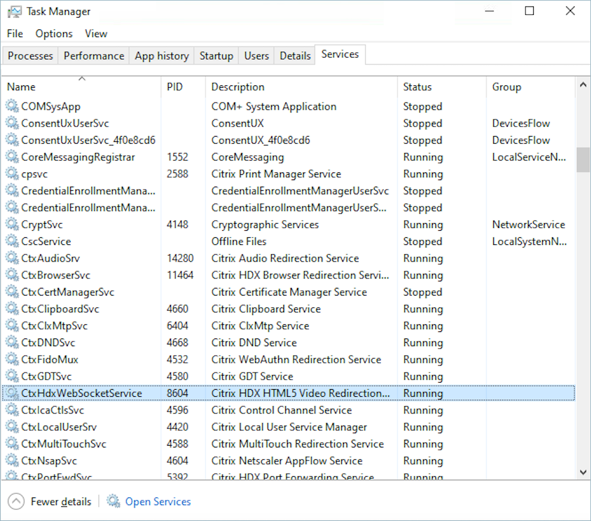
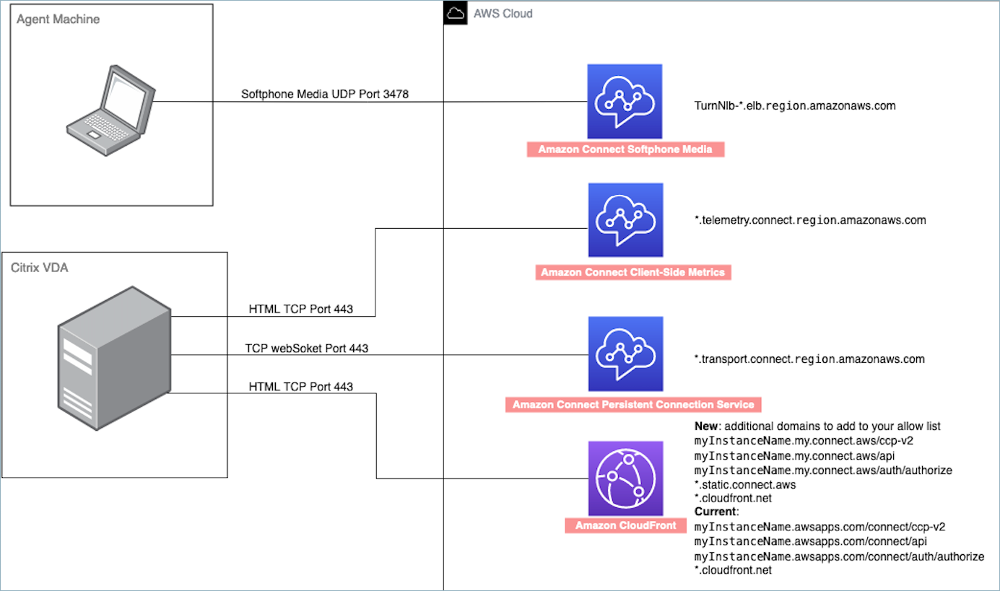
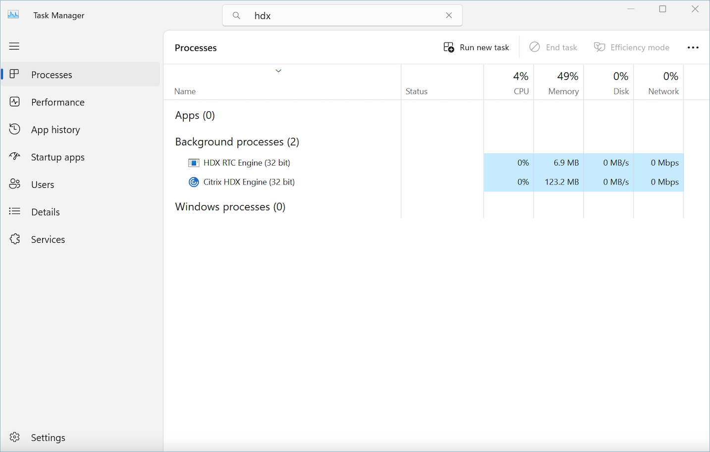

# Optimize Amazon Connect audio for Citrix

cloud desktops

Amazon Connect makes it easier to deliver high-quality voice experiences when your agents
are using Citrix Virtual Desktop Infrastructure (VDI) environments. Your agents can
leverage their Citrix remote desktop applications such as Citrix Workspaces, to
offload audio processing to the agent's local device and to automatically redirect
audio to Amazon Connect, resulting in improved audio quality over challenging networks.

To get started, you can use the [Amazon Connect open source
libraries](https://github.com/amazon-connect/amazon-connect-streams "https://github.com/amazon-connect/amazon-connect-streams") to create a new or update an existing agent user interface,
such as a custom Contact Control Panel (CCP).

## System

requirements

This section describes the system requirements for using the Citrix Unified
Communications SDK with Amazon Connect.

- **Citrix Workspace Application
  Version**

It is recommended to use the latest version of the Citrix Workspace
Application, as outlined in [this documentation](https://community.citrix.com/tech-zone/learn/tech-briefs/ucssdk/ "https://community.citrix.com/tech-zone/learn/tech-briefs/ucssdk/"). However, at a minimum, you must use CWA
2305 or later.

- **Citrix Server Version**

The version of Citrix VDA (Virtual Delivery Agent) is recommended to
be 2203 LTSR or later.

- **Citrix Server Setup**

The Citrix UC SDK is not supported to use by default and the admin of
the system needs to add an allow-list registry entry as follows:

    + **Key Path:**
    `Computer\HKEY_LOCAL_MACHINE\SOFTWARE\WOW6432Node\Citrix\WebSocketService`
    + **Key Name:**
    `ProcessWhitelist`
    + **Key Type:**
    `REG_MULTI_SZ`
    + **Key Value:**

    	- `Chrome.exe`
    	- `msedge.exe`

After you configure the registry successfully, restart the
`CitrixHdxWebSocketService` using **Task
Manager** to finish the setup.

- **Networking/Firewall
  Configurations**
  - **Citrix server
    configuration**

  The admin needs to allow the Citrix server to access Amazon Connect
  TCP/443 traffic to the domains mentioned in the following
  diagram. For more information, see [Set up your network](ccp-networking.md "ccp-networking.md").
  - **Agent machine
    configuration**

  This solution requires a media connection between the agent's
  thin client and Amazon Connect. To allow traffic between the agent's
  machine and Amazon Connect's Softphone Media UDP Port 3478, see [Set up your network](ccp-networking.md "ccp-networking.md").

- **Unsupported CCP Deployment**
  - Native CCP

## Confirm media flows

between thin client and Amazon Connect during the call

- **Use Task Manager (Windows) to
  verify**

Launch the **Task Manager** on the agent's thin
client and check to see if the HDX service is running or not. If it is
running, then it means that the media is being redirected as
expected.

