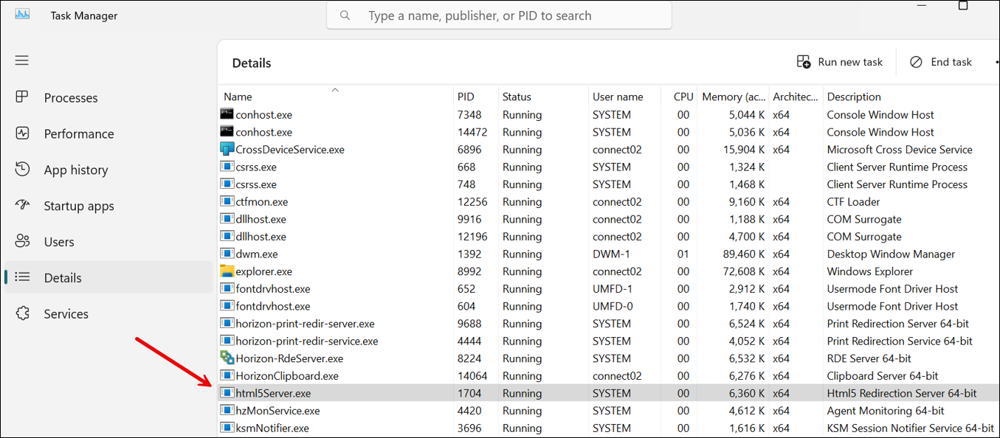
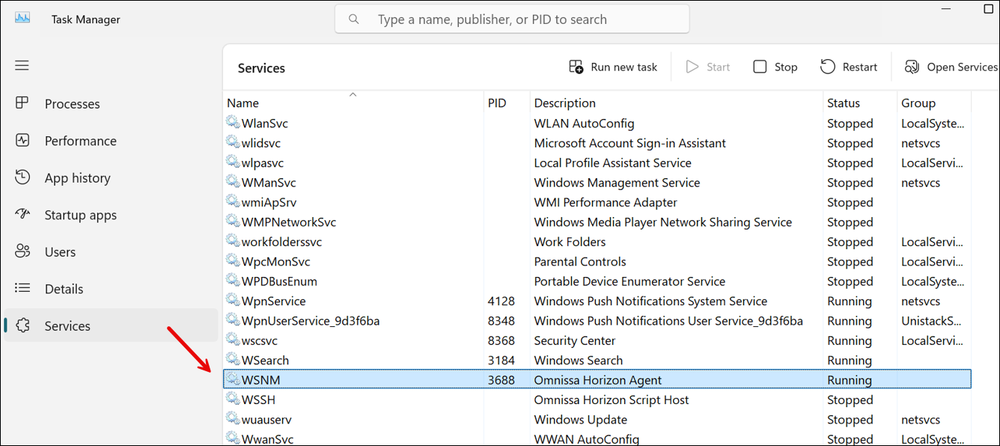
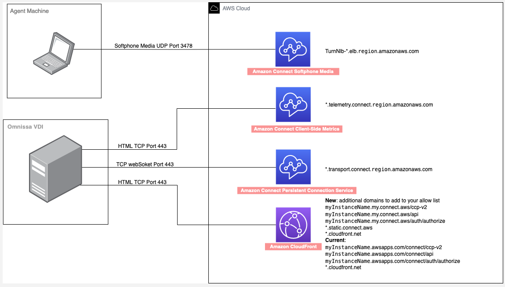
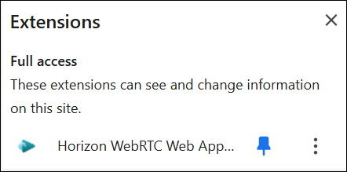
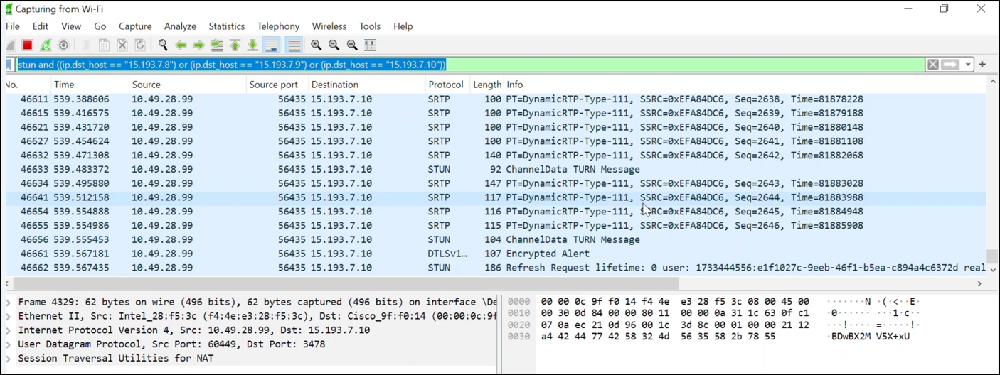

# Optimize Amazon Connect audio for

Omnissa cloud desktops

Amazon Connect makes it easier to deliver high-quality voice experiences when your agents
are using Omnissa Virtual Desktop Infrastructure (VDI) environments. Your agents can
leverage their Omnissa remote desktop applications, such as Omnissa Horizon Client,
to offload audio processing to the agent's local device and to automatically
redirect audio to Amazon Connect, resulting in improved audio quality over challenging
networks.

To get started, you can use the [Amazon Connect open source
libraries](https://github.com/amazon-connect/amazon-connect-streams "https://github.com/amazon-connect/amazon-connect-streams") to create a new or update an existing agent user interface,
such as a custom Contact Control Panel (CCP).

## System

requirements

This section describes the system requirements for using the Omnissa Horizon
SDK with Amazon Connect.

- **Omnissa Horizon Client Version**
  - Minimum required version: 8.15.0 (Horizon 2503) for both agent
    and client
  - Omnissa only supports agent workstations running Windows for
    this feature at present.
  - Download the latest Omnissa Client

  ###### Important

      - The 2503 release will be the first version to
       support ICE restart functionality. Earlier versions
       do not support this feature.
      - Omnissa Horizon Client version 2503 will be
       available through [Omnissa Customer Connect](https://customerconnect.omnissa.com/downloads/info/slug/desktop_end_user_computing/omnissa_horizon_clients/8 "https://customerconnect.omnissa.com/downloads/info/slug/desktop_end_user_computing/omnissa_horizon_clients/8"). Check Customer
       Connect for the latest version.

- **Omnissa Extension and SDK
  Requirements**
  - Horizon WebRTC Web App Supports both Extension and SDK 8.15.0
    or above.
  - This browser extension enables webapp support for the WebRTC
    SDK inside Horizon Agent and can be downloaded from the Chrome
    Store from [here](https://chromewebstore.google.com/detail/horizon-webrtc-web-app-su/emildoafpcgihdmhphelfhghioccllfi?pli=1 "https://chromewebstore.google.com/detail/horizon-webrtc-web-app-su/emildoafpcgihdmhphelfhghioccllfi?pli=1").

- **Browser Support (latest 3 versions)**
  - Google Chrome
  - Microsoft Edge (Chromium)

- **Omnissa Server Setup**: Omnissa Horizon
  SDK is not enabled by default. The system administrator needs to
  configure the following registry settings inside the Omnissa Horizon
  Agent Virtual Machine (preferably through Registry Editor
  (regedit)):

      + **Open Registry Editor**


      	- For Windows:


      		* Press **Windows + R**
      		* Type **regedit** and press
      		 **Enter**.
      + Create/Navigate to the following registry path:


      ```
      Key Path: Computer\HKLM\SOFTWARE\Policies\Omnissa\Horizon\WebRTCRedirSDKWebApp
      Key Names and Values:
      chrome_enabled (REG_DWORD) = 1
      edge_chrome_enabled (REG_DWORD) = 1
      enabled (REG_DWORD) = 1
      ```


      ```
      Key Path: Computer\HKLM\SOFTWARE\Policies\Omnissa\Horizon\WebRTCRedirSDKWebApp\UrlAllowList
      Key Name: https://*.connect.aws/*
      Key Name: https://*.connect.aws.a2z.com/*
      Key Type: REG_SZ
      ```

  After Omnissa agent installation, html5server.exe and wsnm.exe
  processes will always be running in Task Manager, regardless of SDK
  enablement status. The following image shows the html5server.exe process
  running in Task Manager.



The following image shows the wsnm.exe process running in Task
Manager.



- **Troubleshooting**
  - The Omnissa log file can be found at:

  `%tmp%\omnissa-{username}\horizon-html5Client-{pid}.log`

  ###### Note

  The `{pid}` refers to the horizon client
  "horizon-protocol.exe" process ID, which can be found in
  Task Manager.
  - Registry settings for enhanced logging

  To enable detailed logging for troubleshooting, add the
  following registry entries:

  ```
  HKEY_LOCAL_MACHINE\SOFTWARE\Omnissa\Horizon\Html5mmr: - "html5mmr.log.noThrottle" = dword:00000001
  ```

  ```
  HKEY_LOCAL_MACHINE\SOFTWARE\Omnissa\Horizon\Html5mmr\WebrtcRedir:
   - "html5mmr.log.webrtc.allowFullText" = dword:00000001
   - "html5mmr.log.webrtc.allowThrottle" = dword:00000000
   - "html5mmr.log.webrtc.sharedlib.internal" = dword:00000001
   - "html5mmr.log.webrtc.sharedlib.network" = dword:00000001
   - "html5mmr.log.webrtc.sharedlib.media" = dword:00000001
   - "html5mmr.log.webrtc.shim.logToConsole" = dword:00000001
   - "html5mmr.log.webrtc.sharedlib.signal" = dword:00000001
   - "html5mmr.log.noThrottle" = dword:00000001
   - "html5mmr.log.webrtc.tracelevel" = dword:00000001
  ```

  These registry settings enable detailed logging which can help
  in diagnosing issues with the Omnissa VDI integration.

- **Networking/ Firewall
  Configurations**
  - **Omnissa VDI
    configuration**

  The Admin needs to allow the Omnissa server to access Amazon
  Connect TCP/443 traffic to the domains mentioned in the diagram
  below. Refer to the [Set up your network](ccp-networking.md "ccp-networking.md") topic for this
  setup.
  - **Agent Workstation
    configuration**

  This solution requires the media connection between agent thin
  client to Amazon Connect. Follow the [Set up your network](ccp-networking.md "ccp-networking.md") topic to allow the
  traffic between agent's machine and Amazon Connect Softphone Media UDP
  Port 3478.

  The following diagram illustrates the use of UDP Port 3478.

  

## Required code changes on your

custom CCP

To enable audio optimization in Omnissa VDI environment, you must configure
your custom CCP with the following changes.

1. Add the following code snippet before CCP initialization. It helps
   manage window identification for the CCP, especially important when
   agents have multiple windows open. It adds a timestamp and 'Active
   Softphone Tab' marker to help identify the active CCP window.

```
const ACTIVE_SOFTPHONE_TAB = "Active Softphone Tab";

    window.addEventListener('message', (event) => {

        if (event.data.type === 'get_horizon_window_title') {
            let title = document.title;
           const currentTime = new Date();
            if (!title.endsWith(ACTIVE_SOFTPHONE_TAB)) {
                title += ` ${currentTime.getHours()}${currentTime.getMinutes()}${currentTime.getSeconds()} ` + ACTIVE_SOFTPHONE_TAB;
                document.title += ` ${currentTime.getHours()}${currentTime.getMinutes()}${currentTime.getSeconds()} ` + ACTIVE_SOFTPHONE_TAB;
            }

            event.source.postMessage(
                { type: 'horizon_window_title_response', title: title, source: 'parent' },
                event.origin
            );
        }
    });
```

2. Add the VDI platform parameter in your initCCP configuration. This is
   to enable audio redirection.

```
softphone: {
    allowFramedSoftphone: true,
    VDIPlatform: "OMNISSA"
}
```

###### Important

When `VDIPlatform: "OMNISSA"` is set, the CCP will not
fall back to standard web browser audio if Omnissa audio
optimization fails. This means:

    * Calls will fail if an agent accesses the CCP outside the
     Omnissa VM.
    * CCP developers must determine whether the CCP is running
     inside Omnissa VM before setting this parameter.**Implementation Options**:


    1. Use separate URL paths for Omnissa and non-Omnissa
     access.
    2. Use URL parameters to determine environment.
    3. Implement an API to determine the correct configuration
     based on user context.

## How to verify the media flow between thin

client and Amazon Connect during the call

1.  Ensure Omnissa Horizon WebRTC browser extension is enabled and in
    Ready state.
2.  Check the extension icon in your browser toolbar:

        1. Blue icon indicates Ready state and proper
         functionality.
        2. Grey icon indicates Not Ready state and potential
         issues.

    The following image shows what the Omnissa Horizon WebRTC browser
    extension looks like when it is enabled and in Ready state.

 3. Check process status:

    1. Open Task Manager.
    2. Verify html5server.exe and wsnm.exe processes are
     running.
    3. Ensure these processes remain running during calls. If either
     process crashes, the VDI functionality will fail.

4. Test audio flow:
   1. Make a test call
   2. Verify audio optimization by disabling microphone access in
      the VM's browser - calls should continue to work as audio is
      being processed locally
   3. Check for any audio latency or quality issues.

5. Use Wireshark to verify:

Wireshark is a free and open-source network packet analyzer. For more
information, see the the Wireshark [website](https://www.wireshark.org/ "https://www.wireshark.org/").

    1. Download Wireshark from [here](https://www.wireshark.org/download.html "https://www.wireshark.org/download.html").
    2. After Wireshark has been installed, open the wireshark on thin
     client, and start monitoring your local network.
    3. Connect to a call, and in the filter bar at the top, enter the
     following filter:


    ```
    (udp.srcport == 3478 or udp.dstport == 3478) and ((ip.dst_host = "15.193.6.0/24"))
    ```
    4. Verify you can see the media packets flow between agent's
     machine and Amazon Connect.
    5. If no packets are visible:


    	* Check network connectivity and firewall rules.
    	* Verify audio optimization settings.

###### Note

The IP range shown above is for the US East (N. Virginia) AWS
Region. For IP ranges of other Regions, see [Set up your network](ccp-networking.md "ccp-networking.md").

The following image shows IP ranges for .

 6. Console logging

    1. For Windows: Open browser developer tools (F12).
    2. Look for the following WebRTC-related message confirming
     Omnissa initialization: R`TC.js is using
     OmnissaVDIStrategy`


    Following is an example of what the confirmation message looks
     like.


    ```
    {
            "component": "softphone",
            "level": "LOG",
            "text": " RTC.js is using OmnissaVDIStrategy",
            "time": "2025-04-03T20:47:40.460Z",
            "exception": null,
            "objects": [],
            "line": 64,
            "agentResourceId": "20c6b5a3-259e-4e18-a8a7-b962d54a6344",
            "loggerId": "1743713238678-pz6yp1q4n9s",
            "contextLayer": "CRM"
        },
    ```

## Limitations

The following CCP configurations are not supported:

- Native CCP: Audio optimization for native CCP is not supported. Media
  will continue to flow through the browser inside the VM for calls
  handled using the same.
- Salesforce CTI Adapter: Does not support VDI platform detection,
  resulting in media routing through VM's browser instead of optimized
  client-side audio processing.
