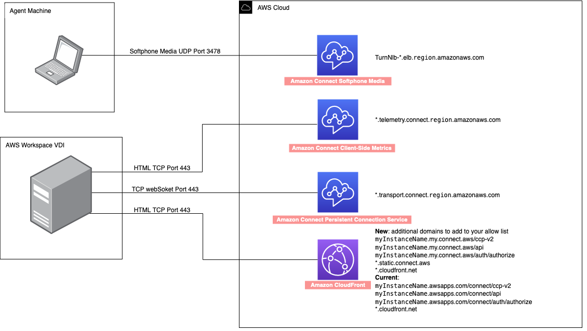

# Optimize Amazon Connect audio for Amazon WorkSpaces cloud

desktops

Amazon Connect simplifies delivery of high-quality voice experiences for agents operating
within Amazon WorkSpaces Virtual Desktop Infrastructure (VDI) environments. By leveraging
Amazon WorkSpaces with the WebRTC redirection feature, agents can redirect Amazon Connect audio
processing to their local devices. This approach results in enhanced audio quality,
even over challenging network conditions. To take advantage of this feature, you
need to do the following:

- Use [Amazon Connect
  open source libraries](https://github.com/amazon-connect/amazon-connect-streams "https://github.com/amazon-connect/amazon-connect-streams") to create a new or update an existing
  agent user interface, such as a custom Contact Control Panel (CCP).
- Configure Amazon WorkSpaces to enable WebRTC redirection.

## System

requirements

This section describes the system requirements for using Amazon Connect with WorkSpaces
WebRTC redirection.

- **WorkSpaces Protocol**

WorkSpaces needs to use Amazon DCV. For more information, see [What Is Amazon DCV?](../../../dcv/latest/adminguide/what-is-dcv.md "../../../dcv/latest/adminguide/what-is-dcv.md").

- **Client version**

Users should use WorkSpaces Web Access or WorkSpaces Windows client
version 5.21.0 or higher. Complete the [Setup and installation](../../../workspaces/latest/userguide/amazon-workspaces-windows-client.md#windows_setup "../../../workspaces/latest/userguide/amazon-workspaces-windows-client.md#windows_setup") instructions.

- **Group policy**

WebRTC redirection needs to be enabled in the DCV group policy. In the
topic [Manage Group Policy settings for DCV](../../../workspaces/latest/adminguide/group_policy.md#gp_configurations_dcv "../../../workspaces/latest/adminguide/group_policy.md#gp_configurations_dcv"), open the collapsed
section titled **Enable or disable WebRTC redirection for
DCV** and complete those instructions.

- **Networking/firewall
  configurations**
  - **Workspace VDI
    configuration**

  The admin needs to allow the Workspaces to access Amazon Connect
  TCP/443 traffic to the domains mentioned in the following
  diagram. For more information, see [Set up your network](ccp-networking.md "ccp-networking.md").
  - **Agent machine
    configuration**

  This solution requires a media connection between the agent
  thin client to Amazon Connect. To allow traffic between the agent's
  machine and Amazon Connect Softphone Media UDP Port 3478, see [Set up your network](ccp-networking.md "ccp-networking.md").

- **Unsupported CCP Deployment**
  - Native CCP

## Confirm media flows

between agent machine and Amazon Connect during the call

- Ensure DCV WebRTC browser extension is enabled and in Ready
  state.
