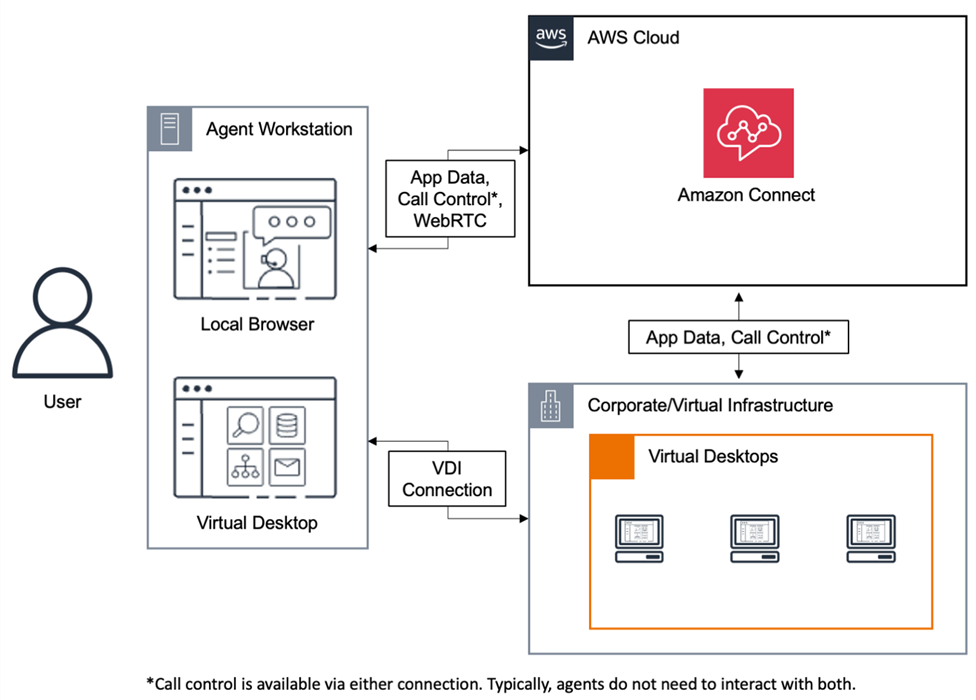

# Use Amazon Connect in a VDI environment

Virtual Desktop Infrastructure (VDI) environments add another layer of complexity to
your solution that warrants separate POC efforts and performance testing to optimize.
The Contact Control Panel (CCP) can operate in thick, thin, and zero client VDI
environments as any other WebRTC based browser application does, and the
configuration/support/optimization is best handled by your VDI support team. That being
said, the following is a collection of considerations and best practices that have been
helpful for our VDI-based customers.

## Use a split CCP model

We recommend using a split CCP model with a medialess CCP running in the VDI and a
CCP carrying the media on the local PC. You can build a custom CCP with the Amazon Connect
Streams API by creating a CCP with no media for application data and call signaling.
This way, the media is delivered to the local desktop using standard CCP, with data
and call controls delivered to the remote connection with the medialess CCP. For
more information about the streams API, see the GitHub repository at [https://github.com/aws/amazon-connect-streams](https://github.com/aws/amazon-connect-streams "https://github.com/aws/amazon-connect-streams").

###### Note

**Firefox users**: If you are using VDI in split
mode, you cannot use the Firefox browser for CCP outside of the VDI. The CCP
conforms to Firefox microphone usage guidance, and only has access to connect to
the user's microphone when the CCP tab is in focus.

The following diagram shows how the agent workstation is comprised of a local
browser and virtual desktop. It connects to Amazon Connect through WebRTC, and connects to
the corporate virtual infrastructure through a VDI connection.

## Cloud desktops

If you use Citrix, Amazon WorkSpaces, or Omnissa cloud desktops, you can create a new or
update an existing agent user interface, such as a custom CCP, to offload audio
processing to your agent's local device and to automatically redirect audio to
Amazon Connect. This results in a more streamlined agent experience and improves audio
quality over challenging networks. To get started, you can use the [Amazon Connect open source libraries](https://github.com/amazon-connect/amazon-connect-streams "https://github.com/amazon-connect/amazon-connect-streams") to create a new or update an existing agent
user interface, such as a custom CCP.

## Things to consider when designing your VDI

environment

- **Location of your agents**—Ideally,
  there are as few hops as possible with the lowest round trip time between
  the location from which your agents use the CCP and the VDI host
  location.
- **Host location of your VDI
  solution**—Ideally, your VDI host location is on the same
  network segment as your agents, with as few hops as possible from both
  internal resources as well as an edge router. You also want the lowest
  round-trip time possible to both WebRTC and Amazon EC2 range endpoints.
- **Network**—Each hop that traffic goes
  through between endpoints increases the possibility of failure and adds
  opportunity to introduce latency. VDI environments are particularly
  susceptible to call quality issues if the underlying route is not optimized
  or the pipe isn't either fast or wide enough. While AWS Direct Connect can improve
  call quality from the edge router to AWS, it will not address internal
  routing issues. You may need to upgrade or optimize your private LAN/WAN, or
  redirect to an external device to circumvent call audio issues. In most
  scenarios, if this is required, the CCP is not the only application that is
  having issues.
- **Dedicated resources**—at the Network
  and desktop level are recommended to prevent an impact to available agent
  resources from activities, such as backups and large file transfers. One way
  to prevent resource contention is by restricting the desktop access to Amazon Connect
  users who will be using their environment similarly, instead of sharing
  resources with other business units who may use those resources
  differently.
- **Using a soft phone with remote
  connections**—in VDI environments can cause impact to
  audio quality.

###### Tip

If your agents connect to a remote endpoint and operates in that
environment, we recommend either rerouting audio to an external E.164
endpoint or connecting the media through the local device and then
signaling through the remote connection.
