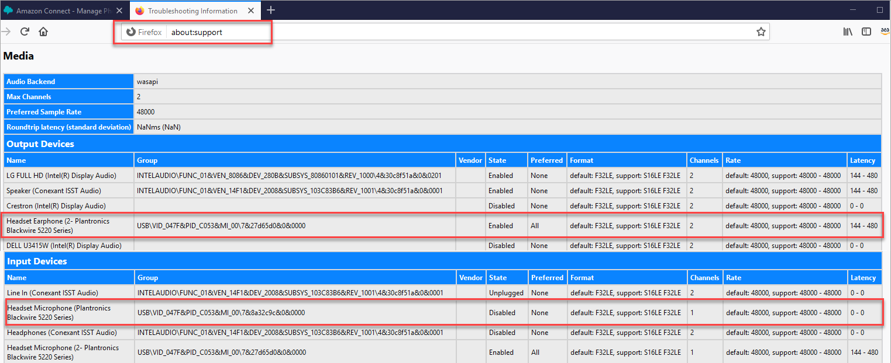
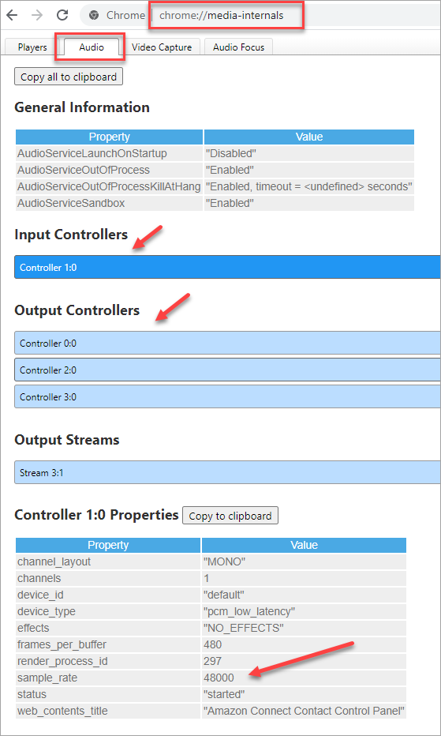

# Humming sound in the agent's audio device: Verify

the headset and browser sample rates

This topic is for IT administrators who are experienced with investigating audio
device issues.

If the agent's audio device does not support up to 48khz and the browser asserts a
sample rate of 48khz, audio issues such as an audible humming sound may be present in
the agent's outgoing audio. This has been seen with Firefox but not with Chrome. For
example, when an agent has used a headset with a preferred sample rate of audio to
16000, it causes issues.

Perform the following steps to verify your headset and browser sample rates.

## Verify Firefox sample rate

1. Open the agent's CCP in FireFox, and set their status to
   **Available**.
2. Accept a call.
3. Open a second Firefox tab, and type **about:support** in
   the Search box.
4. Scroll down the page to **Media**.
5. Verify that the sample rates for the input and output devices are
   **48000**, as shown in the following image.

 6. The sample rate is primary controlled by the operating system sound
settings. Go to the computer's sound settings and change the sample rate if
it isn't 48000. For specific instructions for your operating system, search
the internet.

If you can't change the sample rate in your audio device settings, for
example, because your headset doesn't support 48000, we recommend switching
to a headset with a preferred sample rate 48000.

## Verify Chrome sample rate

1. Open the agent's CCP in Chrome, and set their status to
   **Available**.
2. Accept a call.
3. Open a second Chrome tab, and type **chrome://about** in
   the Search box.
4. Scroll down the page and choose
   **chrome://media-internals**.
5. On the **Audio** tab, choose the **Input
   Controllers** and verify that the sample rate is
   **48000**. Then verify the sample rate for the Output
   Controllers.

 6. The sample rate is primary controlled by the operating system sound
settings. Go to the computer's sound settings and change the sample rate if
it isn't 48000. For specific instructions for your operating system, search
the internet.

If you can't change the sample rate in your audio device settings, for
example, because your headset doesn't support 48000, we recommend switching
to a headset with a preferred sample rate 48000.
