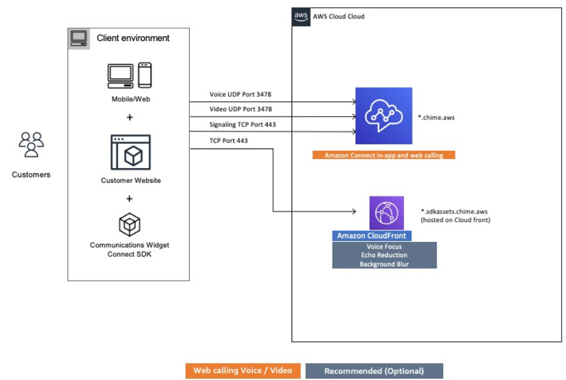

# Agent workstation requirements

for app, web, and video calling in Amazon Connect

The Amazon Connect in-app, web, and video calling capabilities enable your
customers to contact you without ever leaving your web or mobile application. The video
calling capabilities leverage the Amazon Chime SDK communication primitives for
the video stream. The voice experience is handled through Amazon Connect.

###### Important

Video calling does not support VDI environments.

The following table shows the additional networking requirements for your agents'
workstation.

| Domain       | Subnet         | Ports                |
| ------------ | -------------- | -------------------- | ------------------------------------------------------------------------------------------------------------------------------------------------------------------------------------------------------------------------------------------- |
| \*.chime.aws | 99.77.128.0/18 | 443 (TCP) 3478 (UDP) | The following diagram shows the networking requirements for the customers who are using the communications widgets to contact you.  |
