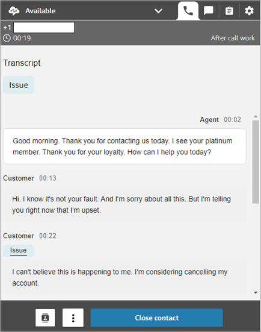

# View a call transcript during ACW in the

CCP or Amazon Connect agent workspace

At the end of a call, you can see an unredacted transcript of your conversation in
the CCP or agent workspace. You can view the entire transcript for reference, and
copy any useful text into your notes.

The call transcript displays any [categories](rules.md "rules.md")
identified by Contact Lens. For example, in the following image, an issue has
been identified at 22 seconds.

If a call is transferred to you from another agent, you will see an unredacted
transcript of their conversation with the customer.

Customer sentiment score is not included in the CCP or agent workspace.

###### Note

**IT administrators**: This feature is available
in the CCP and the agent workspace. To make this feature available to agents:

1. [Enable conversational
   analytics](enable-analytics.md "enable-analytics.md") for your Amazon Connect
   instance.
2. Add the following permissions to the agent's security profile:
   - **Analytics and Optimization** -
     **Contact transcripts (unredacted) - Access**
   - **Analytics and Optimization** -
     **View My Contacts** or **Contact
     search**
   - **Contact Control Panel (CCP)** -
     **Contact Lens data**
