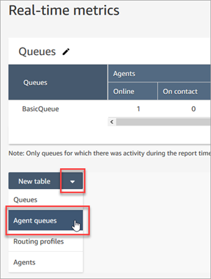
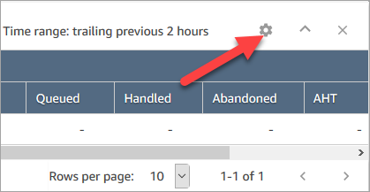
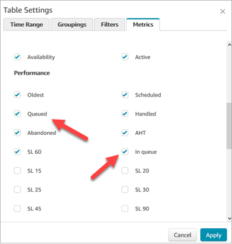

# View how many contacts are in a

contact center agent's queue

To see how many contacts are in an agent's personal queue, add an
**Agent queues** table to your **Real-time
metrics**, **Queues** report. Then view these two
metrics:

- **In Queue**—how many contacts are in an
  agent's personal queue.
- **Queued**—the number of contacts added to
  their personal queue during the specified time range.
  Use the following procedure.

1. Go to **Analytics and optimization**,
   **Real-time metrics**,
   **Queues.**
2. Choose **New table**, **Agent
   queues** as shown in the following image.

The **In queue** column displays how many contacts
are in the agent's queue. 3. Review the metrics in then **In queue** and
**Queue** columns.

###### Tip

An agent is included in the **Agent queues**
table only if they are online or there is at least one contact in
the their queue.

## Add In Queue and Queue to the Agent

queue table

If **In queue** or **Queue** don't
appear in your **Agent queue** table, use the following
steps to add them.

1. On the **Agent queues** table, choose
   **Settings**, as shown in the following
   image.

 2. Choose the **Metrics** tab. 3. Scroll to the **Performance** section and choose
**In queue** and **Queued**,
and then **Apply**, as shown in the following
table.

The changes appear in your table immediately. 4. Choose **Save** to add this report to your list
of Saved reports.
