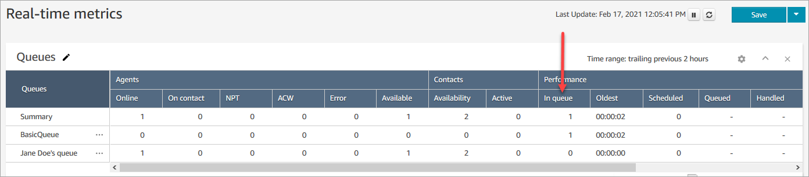

# View the number of contacts waiting in an

Amazon Connect contact center queue

###### To view the number of contacts waiting in a queue for an agent

1. Log in to the Amazon Connect admin website at https://`instance
name`.my.connect.aws/. Use an **Admin**
   account, or an account assigned to a security profile that has
   **Real-time metrics** - **Access
   metrics** permissions.
2. In Amazon Connect, on the left navigation menu, choose **Analytics and
   Optimization**, **Real-time metrics**, and
   then choose **Queues**.
3. In the **Queues** table, check the **In
   queue** column.

The **In queue** value shows the total number of
customers who are waiting for an agent, including those who have requested a
callback.

