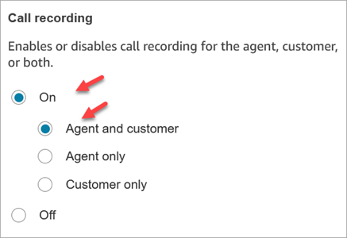
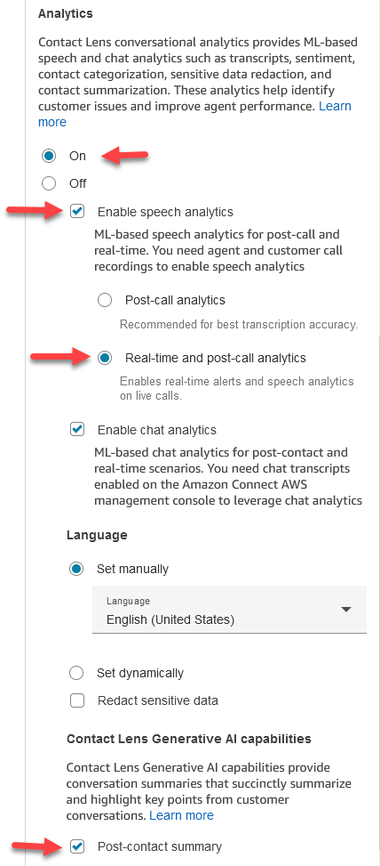
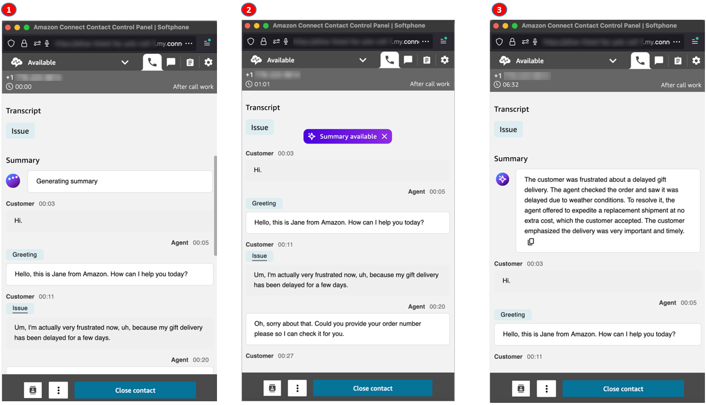
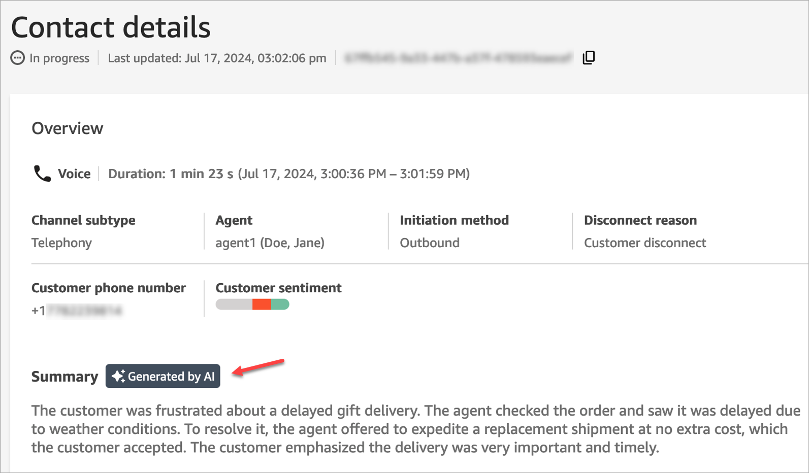
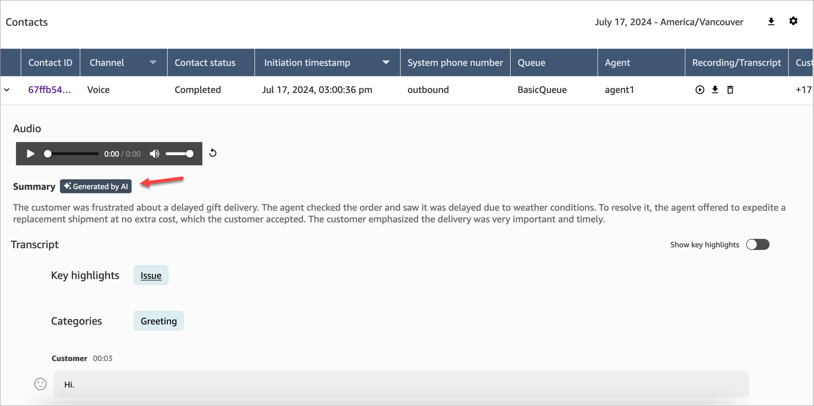

# View generative AI-powered post-contact summaries in

Amazon Connect

###### Note

**Powered by Amazon Bedrock**: AWS implements [automated abuse detection](../../../bedrock/latest/userguide/abuse-detection.md "../../../bedrock/latest/userguide/abuse-detection.md"). Because generative AI-powered post-contact summaries is built on
Amazon Bedrock, users can take full advantage of the controls implemented in Amazon Bedrock to
enforce safety, security, and the responsible use of artificial intelligence
(AI).

You can save valuable time with generative AI-powered post-contact summaries that provide essential
information from customer conversations in a structured, concise, and easy to read
format. You can quickly review the summaries and understand the context instead of
reading through transcripts and monitoring calls.

You can access generative AI-powered post-contact summaries multiple ways:

- **Agents** can access post-contact summaries
  for voice contacts on the Contact Control Panel (CCP). They can use the
  summaries to quickly complete their After Contact Work (ACW). To learn about
  the agent's experience, see [View post-contact summaries on the
  CCP](#summaries-on-agentws "#summaries-on-agentws").
- **Managers and supervisors** can access
  summaries for voice and chat contacts on the Amazon Connect admin website, on the **Contact
  details** and the **Contact search** pages.
  They can use the summaries to quickly understand the issues and outcomes for
  the contacts they are reviewing. To learn about the managers experience, see
  [View post-contact summaries on the
  Amazon Connect admin website](#summaries-on-website "#summaries-on-website").
- **Developers** can directly ingest the
  summaries from the [APIs](contact-lens-api.md "contact-lens-api.md") into
  third-party systems. They can also [integrate with
  Amazon Kinesis Data Streams](contact-analysis-segment-streams.md "contact-analysis-segment-streams.md") for streaming. This latter option is useful when you
  have higher loads and you want avoid having the TPS throttled.

###### Contents

- [Enable post-contact summaries](#gen-ai-getstarted "#gen-ai-getstarted")
- [View post-contact summaries
  on the CCP](#summaries-on-agentws "#summaries-on-agentws")
- [View post-contact summaries
  on the Amazon Connect admin website](#summaries-on-website "#summaries-on-website")
- [Why a summary is not generated](#summary-not-generated "#summary-not-generated")

## Enable post-contact summaries

###### To enable post-contact summaries on the agent's CCP for voice

contacts

1.  Add a [Set recording and analytics
    behavior](set-recording-behavior.md "set-recording-behavior.md") block to your flow.
2.  Configure the **Properties** page of the
    block:

        1. Set **Call recording** to
         **On**. Choose **Agent and
         customer**, as shown in the following image.


        
        2. Set **Analytics** to **On**.
        3. Choose **Enable speech analytics**.
        4. Choose **Real-time and post-call
         analytics**.
        5. Under **Contact Lens Generative AI
         capabilities**, choose **Post-contact
         summary**.

    The following image shows the **Analytics** section
    of a **Properties** page that is configured to enable
    post-contact summaries on the agent's CCP:

 3. Assign the following permissions to the agent's security
profile:

    * **Contact Control Panel (CCP) - Contact Lens
     data - Access**
    * **Analysis and Optimization -
     Contact Lens–post-contact summary -
     View**
    * **Analysis and Optimization - Recorded conversations
     (redacted)**, **View Recorded conversations
     (unredacted)**, **All** or
     **Access** (least privilege is
     **Access** which is recommended)
    * **Analysis and Optimization - View my contacts**  or **Contact Search**

###### To enable post-contact summaries on Amazon Connect admin website

1.  Configure the **Properties** page of the [Set recording and analytics
    behavior](set-recording-behavior.md "set-recording-behavior.md") as follows:
    1. Set **Analytics** to **On**.
    2. Choose either **Enable speech analytics**,
       **Enable chat analytics**, or both.

    If you choose speech analytics, then choose either:

        * **Post-call analytics**
        * **Real-time and post-call
         analytics**: Choose this option if the user
         wants to view post-contact summaries for in progress
         contacts (that is, the agent is still in ACW but the
         call has ended).

    3. Granular redaction is not supported for post-contact summary.
       When granular redaction is selected, post-contact summary
       redacts all PII identified in text and replaces it with a [PII]
       tag.
    4. Under **Contact Lens Generative AI
       capabilities**, choose **Post-contact
       summary**.

2.  Assign the following permissions to the user's security
    profile:
    - **Analysis and Optimization - Contact
      Search** OR **View my
      contacts**
    - **Analysis and Optimization -
      Contact Lens–post-contact summary -
      View**
    - **Analysis and Optimization - Recorded conversations
      (redacted)**, **View Recorded conversations
      (unredacted)**, **All** or
      **Access** (least privilege is
      **Access** which is recommended)

## View post-contact summaries on the

CCP

To help agents perform their After contact work (ACW), Amazon Connect displays a
generative AI-powered post-contact summary on their CCP for voice contacts. The
following image shows an example summary.



1. The agent is in ACW. They can browse the transcript while a
   "Generating summary" banner is displayed on the top of the page.
2. While the agent is browsing, a message appears that the summary is
   available. If the agent clicks the banner, the CCP scrolls to the top of
   the page when the summary is displayed.
3. The banner disappears after the agent clicks on it.

###### Note

Generative AI-powered post-contact summaries support only voice contacts
on the CCP.

## View post-contact summaries on the

Amazon Connect admin website

To help managers and other users review contacts, they can view post-contact
summaries on the Amazon Connect admin website. The following image shows an example of
generative AI-powered post-contact summaries on the **Contact details** page.



The following image shows an example of generative AI-powered post-contact summaries on the
**Contact search** page.



Each contact has no more than one summary generated. Not all contacts will
have a summary generated; for more information, see [Why a summary is not generated](#summary-not-generated "#summary-not-generated").

## Why a summary is not generated

If a summary is not generated, an error message is displayed on the
**Contact details** and **Contact search**
pages. In addition, the ReasonCode for the error appears in the
`ContactSummary` object in the Contact Lens output file,
similar to the following example:

```
"JobDetails": {
    "SkippedAnalysis": [
      {
        "Feature": "POST_CONTACT_SUMMARY",
        "ReasonCode": "INSUFFICIENT_CONVERSATION_CONTENT"
      }
    ]
  },
```

Following is a list of error messages that may be displayed on the Contact
details or search pages if a summary is not generated. Also listed is the
associated reason code that appears in the Contact Lens output file.

- **Summary could not be generated due to exceeding quota of
  concurrent summaries**. ReasonCode:
  `QUOTA_EXCEEDED`.

If you receive this message, we recommend that you [submit a
ticket](https://console.aws.amazon.com/support/home#/case/create?issueType=service-limit-increase&limitType=service-code-connect "https://console.aws.amazon.com/support/home#/case/create?issueType=service-limit-increase&limitType=service-code-connect") to increase the [Concurrent post-contact summary jobs](amazon-connect-service-limits.md#contactlens-quotas "amazon-connect-service-limits.md#contactlens-quotas") quota.

- **Summary could not be generated due to not enough eligible
  conversation**. ReasonCode:
  `INSUFFICIENT_CONVERSATION_CONTENT`.

For voice, there must be 1 utterance from each participant. For chat,
there must be 1 message of supported types from each participant.
Supported message types are `text/plain` and
`text/markdown`. Messages of other types, such as
`application/json`, are not used for the summary.

- **Contact Flow had invalid Contact Lens configuration
  for PostContact Summary, such as unsupported or invalid language
  code**. ReasonCode:
  `INVALID_ANALYSIS_CONFIGURATION`.

This error is returned if the enabled summary is incompatible with
other Contact Lens settings, particularly if it's enabled for an
unsupported locale.

- **Summary cannot be provided because it failed to satisfy
  security and quality guardrails**. ReasonCode:
  `FAILED_SAFETY_GUIDELINES`.

This error can occur in Amazon Connect for Concurrent post-contact summary
jobs. Amazon Connect passes contact data to Amazon Bedrock for summary generation. If the
contact data contains unredacted Personally Identifiable Information
(PII), Amazon Bedrock's safety guidelines are triggered. As a result, Amazon Bedrock refuses
to generate the summary to protect sensitive information, leading to the
error in Amazon Connect.

- Internal system error. ReasonCode: `INTERNAL_ERROR`
