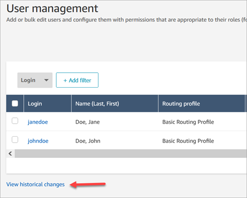
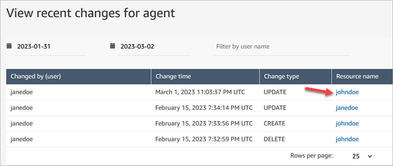
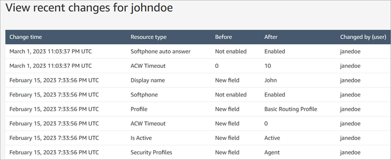

# View historical changes to user

records

1. Log in to the Amazon Connect admin website at https://`instance name`.my.connect.aws/. Use an **Admin** account, or an account
   assigned to a security profile that has \*\*Users and permissions - Users

- View\*\* permissions.

2. In Amazon Connect, on the left navigation menu, choose **Users**,
   **User management**.
3. On the **User management** page, choose **View
   historical changes**, as shown in the following image.

 4. On the **View recent changes for agent** page, there is one
row for each time a user record was changed. In the following image, there are
multiple rows for **johndoe** because that user record has been
updated multiple times.

To view the past changes for a specific user, choose their user name.

 5. On the **View recent changes for [resource name]** page, you
can view details about what has been changed in the user record, when, and who
made the change, as shown in the following image.

