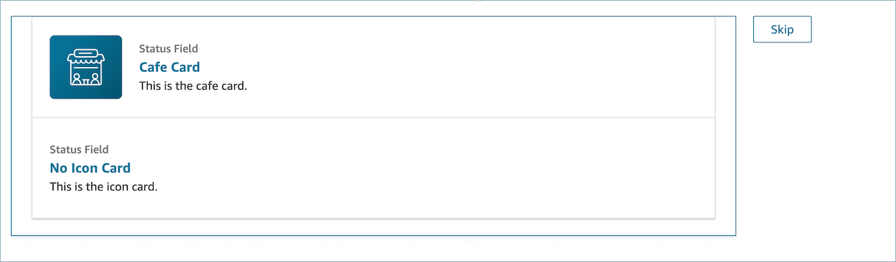

# Custom views in the Amazon Connect agent

workspace

Using APIs you can create your own view resources. The View resource includes
CloudFormation, CloudTrail, and tagging support.

## Views API example

**View description**

This view nests two cards within a container, and places a skip button to
their right.

**CLI command**

```

aws connect create-view --name CustomerManagedCardsNoContainer \
--status PUBLISHED --content file://view-content.json \
--instance-id $INSTANCE_ID --region $REGION

```

**view-content.json**

```

{
  "Template": <stringified-template-json>
  "Actions": ["CardSelected", "Skip"]
}

```

**Template JSON (not stringified)**

```

{
    "Head": {
        "Title": "CustomerManagedFormView",
        "Configuration": {
            "Layout": {
                "Columns": ["10", "2"] // Default column width for each component is 12, which is also the width of the entire view.
            }
        }
    },
    "Body": [
        {
            "_id": "card-container",
            "Type": "Container",
            "Props": {},
            "Content": [
                {
                    "_id": "cafe_card",
                    "Type": "Card",
                    "Props": {

                        "Id": "cafe-card",
                        "Heading": "Cafe Card",
                        "Icon": "Cafe",
                        "Status": "Status Field",
                        "Description": "This is the cafe card.",
                        "Action": "CardSelected" // Note that these actions also appear in the view-content.json file.

                    },
                    "Content": []
                },
                {
                    "_id": "no_icon_card",
                    "Type": "Card",
                    "Props": {
                        "Id": "NoIconCard",
                        "Heading": "$.NoIconCardHeading",
                        "Status": "Status Field",
                        "Description": "This is the icon card.",
                        "Action": "CardSelected" // Note that these actions also appear in the view-content.json file.
                    },
                    "Content": []
                }
            ]
        },
        {
            "_id": "button",
            "Type": "Button",
            "Props": { "Action": "Skip" }, // Note that these actions also appear in the view-content.json file.
            "Content": ["Skip"]
        }
    ]
}

```

## The View

**Inputs**

`$.NoIconCardHeading` indicates that an input for the field
`NoIconCardHeading` is necessary to render the view.

Let's say `NoIconCardHeading` is set to `No Icon
 Card`.

**Appearance**



## View output

example

Views output two main pieces of data: the `Action` taken, and the
`Output` data.

When using a view with the [Show view
block](show-view-block.md "show-view-block.md"), `Action` represents a branch, and `Output`
data is set to the `$.Views.ViewResultData` flow attribute, as
mentioned in the Show View block documentation.

**Scenario 1: Choose the **Cafe Card**
Card**

```

"Action": "CardSelected"
"Output": {
    "Heading": "CafeCard",
    "Id": "CafeCard"
}

```

**Scenario 2: Choose the **Skip**
Button**

```

"Action": "Skip"
"Output": {
    "action": "Button"
}

```

## Form View

output example

When using the **AWS-managed view (Form view)**, the result
of form data will be under _FormData_.

```

{
   FormData: {
       email: "a@amazon.com"
   }
}

```

You can access the data in the show view block such as
`$.Views.ViewResultData.FormData.email`.

When using the **Custom view (with form component)**, the
result of form data be come directly under output.

```

{
    email: "a@amazon.com"
}

```

You can access the data in the show view block such as
`$.Views.ViewResultData.email`.
