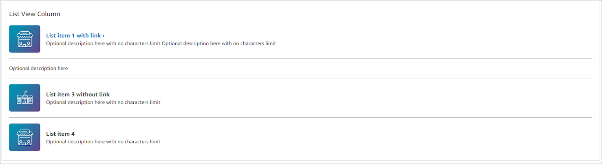
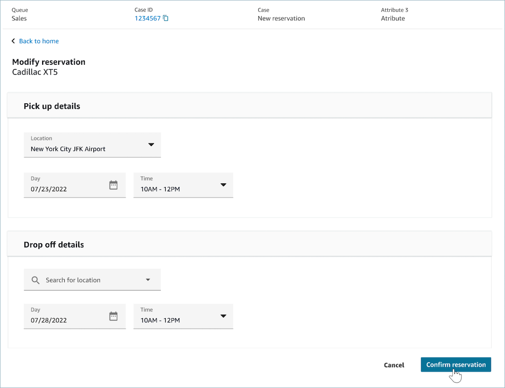
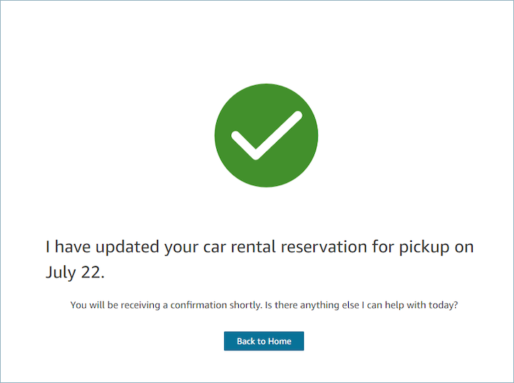
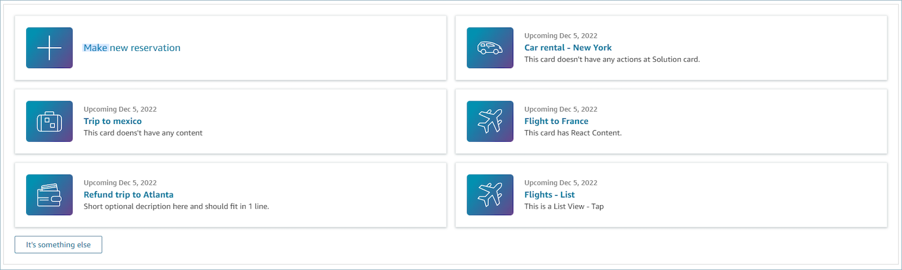
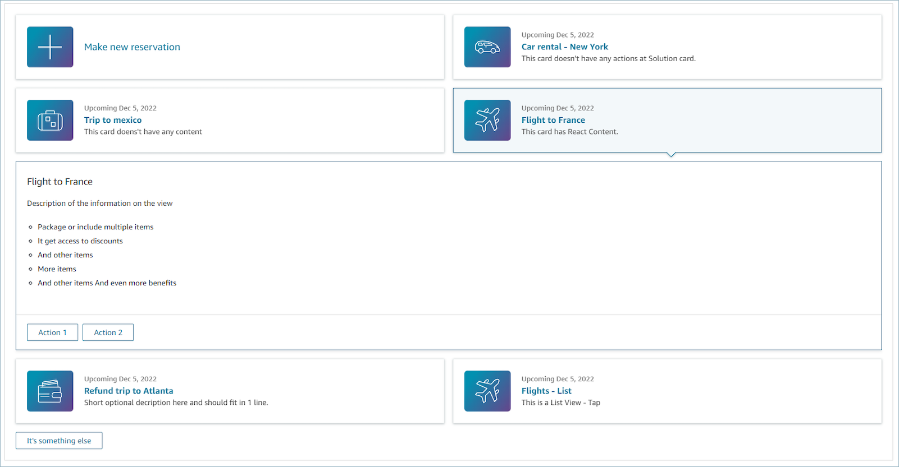

# Set up AWS managed

views for an agent's workspace in Amazon Connect

Amazon Connect includes a set of views that you can add your agent's
workspace. See the following for details on how to configure the different AWS managed views.

Detail view
The **Detail view** is for displaying information to
the agent and providing them with a list of actions that they can take.
A common use case of the **Detail view** is to surface
a screen-pop to the agent at the start of a call.

- Actions in this view can be used to let an agent continue to
  the next step in a step-by-step guide or the actions can be used
  to invoke entirely new workflows.
- **Sections** is the only required component.
  It is where you can configure the body of the page you want to
  show to your agent.
- Optional components such as the **AttributeBar** are supported by this view.

Interactive [documentation](https://d3irlmavjxd3d8.cloudfront.net/?path=/docs/aws-managed-views-detail--with-all "https://d3irlmavjxd3d8.cloudfront.net/?path=/docs/aws-managed-views-detail--with-all") for **Detail view**

The following image shows an example of a **Detail
view**. It has a page heading, description, and four
examples.


**Sections**

- Content can be a static string, a TemplateString or a
  key-value pair. It can be a single data point or a list. For
  more information, see [TemplateString](https://d3irlmavjxd3d8.cloudfront.net/?path=/docs/aws-managed-views-common-configuration--page#templatestring "https://d3irlmavjxd3d8.cloudfront.net/?path=/docs/aws-managed-views-common-configuration--page#templatestring") or [AtrributeSection](https://d3irlmavjxd3d8.cloudfront.net/?path=/docs/aws-managed-views-common-configuration--page#attribute-section "https://d3irlmavjxd3d8.cloudfront.net/?path=/docs/aws-managed-views-common-configuration--page#attribute-section").

**AttributeBar (Optional)**

- Optional, if provided will display the Attribute bar at the
  top of the view.
- Is a list of objects with required properties,
  **Label**, **Value**, and
  optional properties **LinkType**,
  **ResourceId**,
  **Copyable** and **Url**.
  For more information see, [Attribute](https://d3irlmavjxd3d8.cloudfront.net/?path=/docs/aws-managed-views-common-configuration--page#attribute "https://d3irlmavjxd3d8.cloudfront.net/?path=/docs/aws-managed-views-common-configuration--page#attribute").
  - **LinkType** can be external or
    connect application such as case.
    - When it is _external_, a
      user can navigate to a new browser page, which is
      configured with **Url**.
    - When it is _case_, a user
      can navigate to a new case detail on the Agent
      workspace, which configured with
      ResourceId.

  - **Copyable** allows users to copy the
    ResourceId by choosing it with your input device.

**Back (Optional)**

- Optional, but required if no actions are included. if provided
  will display the back navigation link.
- Is an object with a _Label_ which will
  control what is displayed in the link text.

**Heading (Optional)**

- Optional, if provided will display Text as the title.

**Description (Optional)**

- Optional, if provided will display description text under the
  title.

**Actions (Optional)**

- Optional. If provided, will display a list of action at the
  bottom of the page.

**Input example**

```

{
  "AttributeBar": [
    {"Label": "Example", "Value": "Attribute"},
    { "Label": "Example 2", "Value": "Attribute 3", "LinkType": "case", "ResourceId": "123456", "Copyable": true }
  ],
  "Back": {
    "Label": "Back"
  },
  "Heading": "Hello world",
  "Description": "This view is showing off the wonders of a detail page",
  "Sections": [{
    "TemplateString": "This is an intro paragraph"
  }, "abc"],
  "Actions": ["Do thing!", "Update thing 2!"],
}

```

**Output example**

```

{
    Action: "ActionSelected",
    ViewResultData: {
        actionName: "Action 2"
    }
}

```

List view
The **List view** is for displaying information as a
list of items with titles and descriptions. Items may also act as links
with actions attached. It also optionally supports the standard back
navigation and persistent context header.

Interactive [documentation](https://d3irlmavjxd3d8.cloudfront.net/?path=/docs/aws-managed-views-list--with-all "https://d3irlmavjxd3d8.cloudfront.net/?path=/docs/aws-managed-views-list--with-all") for **List view**

The following image shows an example of a List view. It has one column
with three items in it.



**Items**

- Required, will display these items as a list.
- Each item may have a Heading, Description, Icon, and
  Id.
  - All properties are optional.
  - When Id is defined, the output will include the value
    as part of output.

**AttributeBar (Optional)**

- Optional, if provided will display the Attribute bar at the
  top of the view.
- Is a list of objects with required properties,
  **Label**, **Value**, and
  optional properties **LinkType**,
  **ResourceId**,
  **Copyable** and **Url**.
  For more information see, [Attribute](https://d3irlmavjxd3d8.cloudfront.net/?path=/docs/aws-managed-views-common-configuration--page#attribute "https://d3irlmavjxd3d8.cloudfront.net/?path=/docs/aws-managed-views-common-configuration--page#attribute").
  - **LinkType** can be external or
    connect application such as case.
    - When it is _external_, a
      user can navigate to a new browser page, which is
      configured with **Url**.
    - When it is _case_, a user
      can navigate to a new case detail on the Agent
      workspace, which configured with
      ResourceId.

  - **Copyable** allows users to copy the
    ResourceId by choosing it with your input device.

**Back (Optional)**

- Optional, but required if no actions are included. if provided
  will display the back navigation link.
- Is an object with a _Label_ which will
  control what is displayed in the link text.

**Heading (Optional)**

- Optional, if provided will display Text as the title.

**SubHeading (Optional)**

- Optional, if provided will display Text as the title of
  list.

**Input data example**

```

                            {
    "AttributeBar": [
        { "Label": "Example", "Value": "Attribute" },
        { "Label": "Example 2", "Value": "Attribute 2" },
    { "Label": "Example 2", "Value": "Attribute 3", "LinkType": "external", "Url": "https://www.amzon.com" }
    ],
    "Back": {
        "Label": "Back"
    },
    "Heading": "José may be contacting about...",
    "SubHeading": "Optional List Title",
    "Items": [
        {
            "Heading": "List item with link",
            "Description": "Optional description here with no characters limit. We can just wrap the text.",
            "Icon": "School",
            "Id": "Select_Car"
        },
        {
            "Heading": "List item not a link",
            "Icon": "School",
            "Description": "Optional description here with no characters limit."
        },
        {
            "Heading": "List item not a link and no image",
            "Description": "Optional description here with no characters limit."
       },
        {
            "Heading": "List item no image and with link",
            "Description": "Optional description here with no characters limit."
        }
    ]
}

```

**Output data example**

```

{
    Action: "ActionSelected",
    ViewResultData: {
        actionName: "Select_Car"
    }
}

```

Form view
The **Form view** allows you to provide your agents
with input fields to gather required data and submit data to backend
systems. This view consists of multiple _Sections_
with a predefined _Section_ style with a header. The
body consists of various input fields arranged in a column or a grid
layout format.

Interactive [documentation](https://d3irlmavjxd3d8.cloudfront.net/?path=/docs/aws-managed-views-form--with-all "https://d3irlmavjxd3d8.cloudfront.net/?path=/docs/aws-managed-views-form--with-all") for **Form view**

The following image shows an example of a Form view for a car rental
reservation. It has location and date fields on it.



**Sections**

- Location in the **Form view** where input
  fields and display fields are located.
- **SectionProps**
  - **Heading**
    - Heading of the section

  - **Type**
    - Type of section
    - FormSection (forms handling user's input) or
      DataSection (displaying a list of label and
      value)

  - **Items**
    - List of data based on the type. When
      `Type` is `DataSection`, the
      data should be attributes. If the
      `Type` is `FormSection`, the
      data should be form components.

  - **isEditable**
    - Show edit button at the header when it is
      provided when the section type is
      `DataSection`.
    - Boolean

**Wizard (Optional)**

- Display **ProgressTracker** at the left side
  of the view.
- Each item may have a Heading, Description, and
  Optional.
  - Heading is required

**Back (Optional)**

- Is an object or string with a Label which will control what is
  displayed in the link text.

**Next (Optional)**

- This action is used when the step is not the last step in
  steps.
- Is an object (FormActionProps) or string. For more
  information, see [FormActionProps](https://d3irlmavjxd3d8.cloudfront.net/?path=/docs/aws-managed-views-common-configuration--page#actionProps "https://d3irlmavjxd3d8.cloudfront.net/?path=/docs/aws-managed-views-common-configuration--page#actionProps").

**Cancel (Optional)**

- This action is used when the step is not the first
  step.
- Is an object (FormActionProps) or string. For more
  information, see [FormActionProps](https://d3irlmavjxd3d8.cloudfront.net/?path=/docs/aws-managed-views-common-configuration--page#actionProps "https://d3irlmavjxd3d8.cloudfront.net/?path=/docs/aws-managed-views-common-configuration--page#actionProps").

**Previous (Optional)**

- This action is used when the step is not the first
  step.
- Is an object (FormActionProps) or string. For more
  information, see [FormActionProps](https://d3irlmavjxd3d8.cloudfront.net/?path=/docs/aws-managed-views-common-configuration--page#actionProps "https://d3irlmavjxd3d8.cloudfront.net/?path=/docs/aws-managed-views-common-configuration--page#actionProps").

**Edit (Optional)**

- This action is shown when the section type is
  `DataSection`.
- Is an object (FormActionProps) or string. For more
  information, see [FormActionProps](https://d3irlmavjxd3d8.cloudfront.net/?path=/docs/aws-managed-views-common-configuration--page#actionProps "https://d3irlmavjxd3d8.cloudfront.net/?path=/docs/aws-managed-views-common-configuration--page#actionProps").

**AttributeBar (Optional)**

- Optional, if provided will display the Attribute bar at the
  top of the view.
- Is a list of objects with required properties,
  **Label**, **Value**, and
  optional properties **LinkType**,
  **ResourceId**,
  **Copyable** and **Url**.
  For more information see, [Attribute](https://d3irlmavjxd3d8.cloudfront.net/?path=/docs/aws-managed-views-common-configuration--page#attribute "https://d3irlmavjxd3d8.cloudfront.net/?path=/docs/aws-managed-views-common-configuration--page#attribute").
  - **LinkType** can be external or
    connect application such as case.
    - When it is _external_, a
      user can navigate to a new browser page, which is
      configured with **Url**.
    - When it is _case_, a user
      can navigate to a new case detail on the Agent
      workspace, which configured with
      ResourceId.

  - **Copyable** allows users to copy the
    ResourceId by choosing it with your input device.

**Heading (Optional)**

- String that displays as the page title.

**SubHeading (Optional)**

- Secondary message for the page.

**ErrorText (Optional)**

- Optional, shows server-side error messages.
- ErrorProps; String

**Input data example**

```

                            {
    "AttributeBar": [{
            "Label": "Queue",
            "Value": "Sales"
        },
        {
            "Label": "Case ID",
            "Value": "1234567"
        },
        {
            "Label": "Case",
            "Value": "New reservation"
        },
        {
            "Label": "Attribute  3",
            "Value": "Attribute"
        }
    ],
    "Back": {
        "Label": "Back Home"
    },
    "Next": {
        "Label": "Confirm Reservation",
        "Details": {
            "endpoint": "awesomecustomer.com/submit",
        }
    },
    "Cancel": {
        "Label": "Cancel"
    },
    "Heading": "Modify Reservation",
    "SubHeading": "Cadillac XT5",
    "ErrorText": {
        "Header": "Modify reservation failed",
        "Content": "Internal Server Error, please try again"
    },
    "Sections": [{
        "_id": "pickup",
        "Type": "FormSection",
        "Heading": "Pickup Details",
        "Items": [{
            "LayoutConfiguration": {
                "Grid": [{
                    "colspan": {
                        "default": "12",
                        "xs": "6"
                    }
                }]
            },
            "Items": [{
                "Type": "FormInput",
                "Fluid": true,
                "InputType": "text",
                "Label": "Location",
                "Name": "pickup-location",
                "DefaultValue": "Seattle"
            }]
        }, {
            "LayoutConfiguration": {
                "Grid": [{
                    "colspan": {
                        "default": "6",
                        "xs": "4"
                    }
                }, {
                    "colspan": {
                        "default": "6",
                        "xs": "4"
                    }
                }]
            },
            "Items": [{
                "Label": "Day",
                "Type": "DatePicker",
                "Fluid": true,
                "DefaultValue": "2022-10-10",
                "Name": "pickup-day"
            }, {
                "Label": "Time",
                "Type": "TimeInput",
                "Fluid": true,
                "DefaultValue": "13:00",
                "Name": "pickup-time"
            }]
        }]
    }, {
        "_id": "dropoff",
        "Heading": "Drop off details",
        "Type": "FormSection",
        "Items": [{
            "LayoutConfiguration": {
                "Grid": [{
                    "colspan": {
                        "default": "12",
                        "xs": "6"
                    }
                }]
            },
            "Items": [{
                "Label": "Location",
                "Type": "FormInput",
                "Fluid": true,
                "DefaultValue": "Lynnwood",
                "Name": "dropoff-location"
            }]
        }, {
            "LayoutConfiguration": {
                "Grid": [{
                    "colspan": {
                        "default": "6",
                        "xs": "4"
                    }
                }, {
                    "colspan": {
                        "default": "6",
                        "xs": "4"
                    }
                }]
            },
            "Items": [{
                "Label": "Day",
                "Type": "DatePicker",
                "Fluid": true,
                "DefaultValue": "2022-10-15",
                "Name": "dropoff-day"
            }, {
                "Label": "Time",
                "Type": "TimeInput",
                "Fluid": true,
                "DefaultValue": "01:00",
                "Name": "dropoff-time"
            }]
        }]
    }]
}

```

**Output data example**

```

{
    Action: "Submit",
    ViewResultData: {
        FormData: {
            "dropoff-day": "2022-10-15",
            "dropoff-location": "Lynnwood",
            "dropoff-time": "01:00",
            "pickup-day": "2022-10-10",
            "pickup-location": "Seattle",
            "pickup-time": "13:00"
        },
       StepName:"Pickup and drop off"
    }
}

```

Confirmation view
The **Confirmation view** is a page to show users
after a form has been submitted or an action has been completed. In this
pre-built template you can provide a summary of what has happened, any
next steps, and prompts. The **Confirmation view**
supports a persistent attribute bar, an icon/image, headline, and
sub-headline, along with a back to home navigation button.

Interactive [documentation](https://d3irlmavjxd3d8.cloudfront.net/?path=/docs/aws-managed-views-confirmation--with-all "https://d3irlmavjxd3d8.cloudfront.net/?path=/docs/aws-managed-views-confirmation--with-all") for **Confirmation
view**

The following image shows an example of a confirmation.



**Next**

- Required.
- Action button for next
  - Label - string label for the navigation button.

**AttributeBar (Optional)**

- Optional, if provided will display the Attribute bar at the
  top of the view.
- Is a list of objects with required properties,
  **Label**, **Value**, and
  optional properties **LinkType**,
  **ResourceId**,
  **Copyable** and **Url**.
  For more information see, [Attribute](https://d3irlmavjxd3d8.cloudfront.net/?path=/docs/aws-managed-views-common-configuration--page#attribute "https://d3irlmavjxd3d8.cloudfront.net/?path=/docs/aws-managed-views-common-configuration--page#attribute").
  - **LinkType** can be external or
    connect application such as case.
    - When it is _external_, a
      user can navigate to a new browser page, which is
      configured with **Url**.
    - When it is _case_, a user
      can navigate to a new case detail on the Agent
      workspace, which configured with
      ResourceId.

  - **Copyable** allows users to copy the
    ResourceId by choosing it with your input device.

**Heading (Optional)**

- String that displays as the page title.

**SubHeading (Optional)**

- Secondary message for the page.

**Graphic (Optional)**

- Displays an image
- Object with the following key:
  - Include - boolean, if this is true then the graphic
    will be included in the page.

**Input Data Example**

```

 {
  "AttributeBar": [
    { "Label": "Attribute1", "Value": "Value1" },
    { "Label": "Attribute2", "Value": "Value2" },
    { "Label": "Attribute3", "Value": "Amazon", "LinkType": "external", "Url": "https://www.amzon.com" }
  ],
  "Next": {
    "Label": "Go Home"
  },
  "Graphic": {
    "Include": true
  },
  "Heading": "I have updated your car rental reservation for pickup on July 22.",
  "SubHeading": "You will be receiving a confirmation shortly. Is there anything else I can help with today?",
}

```

**Output Data Example**

```

{
    "Action": "Next",
    "ViewResultData": {
        "Label": "Go Home"
    }
}

```

Cards view
The **Cards view** allows you to guide your agent by
presenting them with a list of topics to choose from as soon as they
accept the contact.

Interactive [documentation](https://d3irlmavjxd3d8.cloudfront.net/?path=/docs/aws-managed-views-cards--with-all "https://d3irlmavjxd3d8.cloudfront.net/?path=/docs/aws-managed-views-cards--with-all") for **Cards view**

_Present cards to your agents._ The following image
shows an example of six cards that are presented to the agent: one to
make a new reservation, and the others to review reservations for
upcoming trips.



_When agents choose a card, more info is revealed._
The following image shows an open card that displays details for a
reservation.



**Sections**

- It is list of objects with Summary and Detail. It must be
  provided to create Card and Detail.
- Consists of Summary and Detail. For more information see
  [Summary and Detail](https://d3irlmavjxd3d8.cloudfront.net/?path=/docs/aws-managed-views-cards--with-all "https://d3irlmavjxd3d8.cloudfront.net/?path=/docs/aws-managed-views-cards--with-all").

**AttributeBar (Optional)**

- Optional, if provided will display the Attribute bar at the
  top of the view.
- Is a list of objects with required properties,
  **Label**, **Value**, and
  optional properties **LinkType**,
  **ResourceId**,
  **Copyable** and **Url**.
  For more information, see [Attribute](https://d3irlmavjxd3d8.cloudfront.net/?path=/docs/aws-managed-views-common-configuration--page#attribute "https://d3irlmavjxd3d8.cloudfront.net/?path=/docs/aws-managed-views-common-configuration--page#attribute").
  - **LinkType** can be external or
    connect application such as case.
    - When it is _external_, a
      user can navigate to a new browser page, which is
      configured with **Url**.
    - When it is _case_, a user
      can navigate to a new case detail on the Agent
      workspace, which configured with
      ResourceId.

  - **Copyable** allows users to copy the
    ResourceId by choosing it with your input device.

**Heading (Optional)**

- String that displays as the page title

**Back (Optional)**

- It is an object or string with a Label which will control what
  is displayed in the link text. For more information, see [ActionProps](https://d3irlmavjxd3d8.cloudfront.net/?path=/docs/aws-managed-views-common-configuration--page#actionProps "https://d3irlmavjxd3d8.cloudfront.net/?path=/docs/aws-managed-views-common-configuration--page#actionProps").

**NoMatchFound (Optional)**

- It is a string that displays for a button that is below Cards.
  For more information see [ActionProps](https://d3irlmavjxd3d8.cloudfront.net/?path=/docs/aws-managed-views-common-configuration--page#actionProps "https://d3irlmavjxd3d8.cloudfront.net/?path=/docs/aws-managed-views-common-configuration--page#actionProps").

**Input Data Example**

```

{
    "AttributeBar": [{
            "Label": "Queue",
            "Value": "Sales"
        },
        {
            "Label": "Case ID",
            "Value": "1234567"
        },
        {
            "Label": "Case",
            "Value": "New reservation"
        },
        {
            "Label": "Attribute  3",
            "Value": "Attribute"
        }
    ],
    "Back": {
        "Label": "Back"
    },
    "Heading": "Customer may be contacting about...",
    "Cards": [{
              "Summary": {
                "Id": "lost_luggage",
                "Icon": "plus",
                "Heading": "Lost luggage claim"
              },
              "Detail": {
                "Heading": "Lost luggage claim",
                "Description": "Use this flow for customers that have lost their luggage and need to fill a claim in order to get reimbursement. This workflow usually takes 5-8 minutes",
                "Sections": {
                  "TemplateString": "<TextContent>Steps:<ol><li>Customer provides incident information</li><li>Customer provides receipts and agrees with amount</li><li>Customer receives reimbursement</li></ol></TextContent>"
                },
                "Actions": [
                  "Start a new claim",
                  "Something else"
                ]
              }
            },
            {
              "Summary": {
                "Id": "car_rental",
                "Icon": "Car Side View",
                "Heading": "Car rental - New York",
                "Status": "Upcoming Sept 17, 2022"
              },
              "Detail": {
                "Heading": "Car rental - New York",
                "Sections": {
                  "TemplateString": "<p>There is no additional information</p>"
                }
              }
            },
            {
              "Summary": {
                "Id": "trip_reservation",
                "Icon": "Suitcase",
                "Heading": "Trip to Mexico",
                "Status": "Upcoming Aug 15, 2022",
                "Description": "Flying from New York to Cancun, Mexico"
              },
              "Detail": {
                "Heading": "Trip to Mexico",
                "Sections": {
                  "TemplateString": "<p>There is no additional information</p>"
                }
              }
            },
            {
              "Summary": {
                "Id": "fligh_reservation",
                "Icon": "Airplane",
                "Heading": "Flight to France",
                "Status": "Upcoming Dec 5, 2022",
                "Description": "Flying from Miami to Paris, France"
              },
              "Detail": {
                "Heading": "Flight to France",
                "Sections": {
                  "TemplateString": "<p>There is no additional information</p>"
                }
              }
            },
            {
              "Summary": {
                "Id": "flight_refund",
                "Icon": "Wallet Closed",
                "Heading": "Refund flight to Atlanta",
                "Status": "Refunded July 10, 2022"
              },
              "Detail": {
                "Heading": "Refund trip to Atlanta",
                "Sections": {
                  "TemplateString": "<p>There is no additional information</p>"
                }
              }
            },
            {
              "Summary": {
                "Id": "book_experience",
                "Icon": "Hot Air Balloon",
                "Heading": "Book an experience",
                "Description": "Top experience for european travellers"
              },
              "Detail": {
                "Heading": "Book an experience",
                "Sections": {
                  "TemplateString": "<p>There is no additional information</p>"
                }
              }
            }],
    "NoMatchFound": {
        "Label": "Can't find match?"
    }

}

```

**Output Data Example**

```

{
    Action: "ActionSelected",
    ViewResultData: {
        actionName: "Update the trip"
    }
}

```
