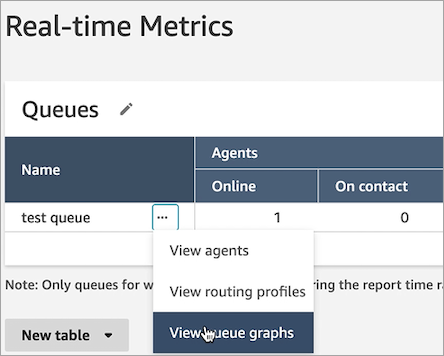
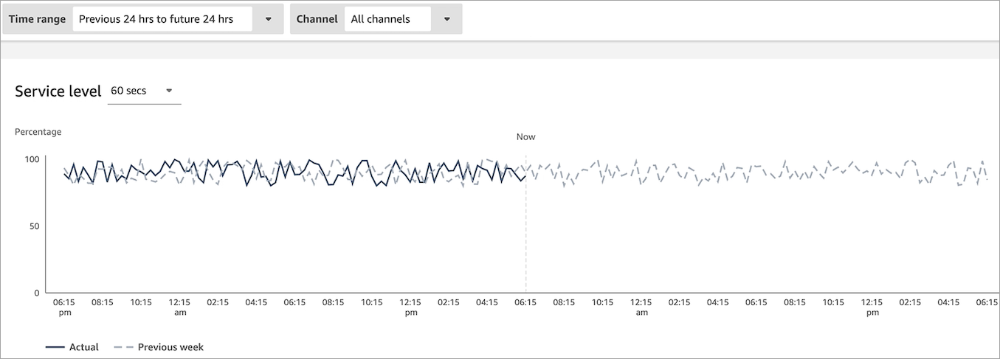

# Visualize historical queue data in

Amazon Connect

You can visualize historical queue data using time series graphs to help identify
patterns, trends, and outliers such as Service Level, Contacts Queued, and Average
Handle Time.

###### To view queue data

1. On the **Real-time Metrics** page, display the Queues
   table.
2. Select **View queue graphs** from the dropdown menu. The
   following image shows the dropdown menu for a queue named **test
   queue**.

 3. After you select **View queue graphs**, you are directed
to the queue visualization dashboard. 4. The Queue dashboard automatically refreshes every 15 minutes. You
can:

    * Configure a time range of up to 24 hours.
    * Select the channel of your choice.
    * Customize the service level thresholds.

The following image shows an example Queue dashboard. It displays a graph
of service level data for the queue. **Time range** is set
to **Previous 24 hours to future 24 hours**.
**Channel** is set to **All
channels**. **Service level** is set to
**60 seconds**.

