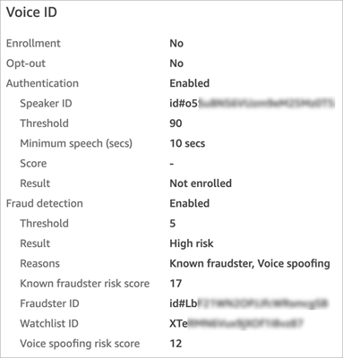

# Search for and review results of Voice ID

authentication

###### Note

End of support notice: On May 20, 2026, AWS will end support for Amazon Connect
Voice ID. After May 20, 2026, you will no longer be able to access Voice ID on the
Amazon Connect console, access Voice ID features on the Amazon Connect admin website or Contact Control Panel, or access Voice ID
resources. For more information, visit [Amazon Connect
Voice ID end of support](amazonconnect-voiceid-end-of-support.md "amazonconnect-voiceid-end-of-support.md").

Use the [Contact search](contact-search.md "contact-search.md") page to search for and
review the results of enrollment status, voice authentication, and detection of fraudsters in a watchlist.
With the required [security profile
permissions](contact-search.md#required-permissions-search-contacts "contact-search.md#required-permissions-search-contacts") (**Analytics and Optimization** -
**Voice ID - attributes and search - View**), you can search for
Voice ID results using the following filters:

- **Speaker actions**: Use this filter to search for contacts
  where the caller was enrolled into Voice ID or chose to opt-out of Voice ID
  altogether.
- **Authentication result**: Use this filter to search for
  contacts where Voice ID authentication returned the following results:

      + Authenticated
      + Not authenticated
      + Opted out
      + Inconclusive
      + Not enrolled

  For example, if you want to search for all contacts where the authentication
  status was returned as **Not authenticated** or **Opted
  out**, select both these options and choose
  **Apply**.

- **Fraud detection result**: Use this filter to search for
  contacts where Voice ID fraud analysis returned the following results:
  - High risk for fraud
  - Low risk for fraud
  - Inconclusive

- **Fraud detection reason**: Use this filter to search for
  contacts where specific fraud risk mechanisms were detected:
  - Known fraudster: the caller’s voice matches a fraudster from the
    fraudster watchlist you have created.
  - Voice spoofing: the caller is modifying their voice or is using speech
    synthesis to spoof the agent.

## Voice ID results in a contact record

After you search for a contact, you can choose an ID to view their contact record.
The following image shows an example of the fields in the Voice ID section of the
contact record:

