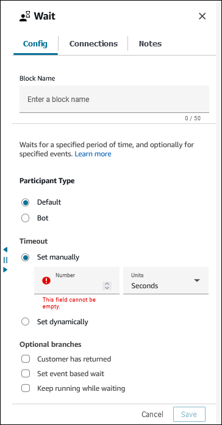
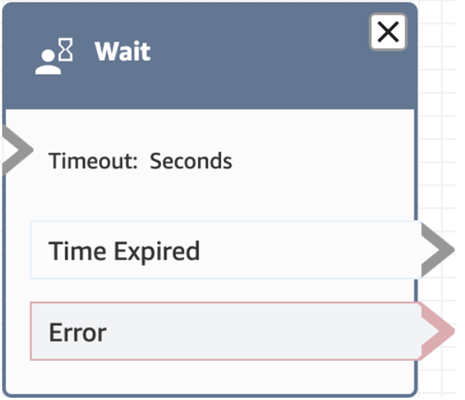
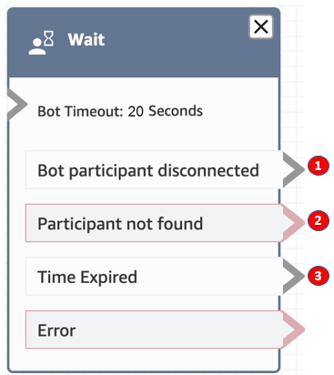

# Flow block in Amazon Connect: Wait

This topic defines the flow block for pausing the flow for the specified amount of
time.

## Description

This block pauses the flow for the specified wait time or for the specified event.

For example, if a contact stops responding to a chat, the block pauses the contact
flow for the specified wait time (**Timeout** time), then branches
accordingly, such as to disconnect.

## Supported channels

The following table lists how this block routes a contact who is using the
specified channel.

| Channel | Supported?                                                                                                                                                                                                                                      |
| ------- | ----------------------------------------------------------------------------------------------------------------------------------------------------------------------------------------------------------------------------------------------- |
| Voice   | Yes • but only in Inbound flow when the **Keep running while waiting\* • option, or the **Set event-based wait\* • option is selected (see the image below).                                                                  |
| Chat    | Yes                                                                                                                                                                                                                                             |
| Task    | Yes • It always branches to **Time Expired\* • or **Error**. It never branches to **Bot participant disconnected* • or **Participant not found**. The \*\*Participant Type* • setting does not affect this behavior. |
| Email   | Yes                                                                                                                                                                                                                                             |

## Flow types

You can use this block in the following [flow
types](create-contact-flow.md#contact-flow-types "create-contact-flow.md#contact-flow-types"):

- Inbound flow
- Customer Queue flow

## Properties

The following image shows the **Config** tab of the
**Wait** block. It is configured pause the flow for 5
hours.

It has the following properties:

- **Participant Type**: Runs the **Wait**
  block for the specified participant type.
  - **Default** - A customer contact.
  - **Bot** - A custom participant, such as a
    third-party bot. For more information about using this option, see
    [Customize chat flow experiences in Amazon Connect by
    integrating custom participants](chat-customize-flow.md "chat-customize-flow.md").

- **Timeout**: Run this branch if the customer hasn't sent
  a message after a specified amount of time. Maximum is 7 days.
  - Manually set timeout: You can provide the
    **Number** and
    **Units**.
  - Dynamically set timeout: The unit of measurement is in
    seconds.

- **Customer return**: Route the contact down this branch
  when the customer returns and sends a message. With this branch you can
  route the customer to the previous (same) agent, previous (same) queue, or
  override and set a new working queue or agent. This optional branch is
  available only when **Participant Type** =
  **Default**.
- **Set Event based Wait**: Specify a Lambda to wait for its
  completion and route the contact down the Lambda Return branch when the
  execution of specified Lambda is completed. This optional branch is available
  only when **Participant Type** =
  **Default**.
- **Keep running while waiting**: Temporarily route the
  contact down the **Continue** branch while waiting on the
  block. This optional branch is available only when **Participant
  Type** = **Default**.

## Configuration tips

- You can configure the **Wait** block to wait for a Lambda
  that is invoked using the [AWS Lambda
  function](invoke-lambda-function-block.md "invoke-lambda-function-block.md") block in
  **Asynchronous** execution mode. To do this, select the
  **Set Event based Wait** option and provide the
  RequestId of the Lambda invocation. For more information, see [Load Lambda Result](invoke-lambda-function-block.md#properties-load-lamdba "invoke-lambda-function-block.md#properties-load-lamdba").

###### Note

If the wrong Invocation ID is provided to the
**Wait** block, it continues to wait until the
**Set timeout**.

- You cannot have nested **Wait** blocks, such as a **Wait** block inside the
  **Continue** branch of another **Wait** block.

For example, you can't have the first **Wait** block configured with
**Continue** and Lambda-returned branches to send messages with a specific delay
(configured on the second Wait block in the Continue branch) while waiting
for their asynchronous Lambda invocation to return. This
configuration results in the following error on the second **Wait** block:

    + **Unsupported Action In Wait Action's
     Continue Branch**

- You can configure the **Wait** block to run other blocks.
  For example, you may want to play an audio while waiting for a Lambda
  execution to complete. To do this, add a [Play prompt](play.md "play.md") block to the **Continue**
  branch.
- You can add multiple **Wait** blocks to your
  flows. For example:
  - If the customer comes back in 5 minutes, connect them to the same
    agent. This is because that agent has all of the context.
  - If the customer doesn't come back after 5 minutes, send a text
    saying "We missed you."
  - If the customer comes back in 12 hours, connect to a flow that
    puts them in a priority queue. However, it doesn't route them to the
    same agent.

## Configured block

The following image shows an example of what this block looks like when it is
configured with **Participant Type** =
**Default**. It has the following branches: **Time
Expired** and **Error**.

The following image shows an example of what this block looks like when it is
configured with **Participant Type** = **Bot**. It
has the following branches: **Bot participant disconnected**,
**Participant not found**, **Time Expired**,
and **Error**.

1. **Bot participant disconnected**: The custom participant,
   such as a third-party bot, has successfully disconnected to the contact.
2. **Participant not found**: No custom participant was
   found to be associated to the contact.
3. **Time Expired**: The timeout specified has lapsed before
   the custom participant disconnected.

## Sample flows

Amazon Connect includes a set of sample flows. For instructions that explain how to access the sample flows in the flow designer, see
[Sample flows in Amazon Connect](contact-flow-samples.md "contact-flow-samples.md"). Following are topics
that describe the sample flows which include this block.

- [Sample disconnect flow in Amazon Connect](sample-disconnect.md "sample-disconnect.md")

## Scenarios

See these topics for scenarios that use this block:

- [Example chat scenario](web-and-mobile-chat.md#example-chat-scenario "web-and-mobile-chat.md#example-chat-scenario")
