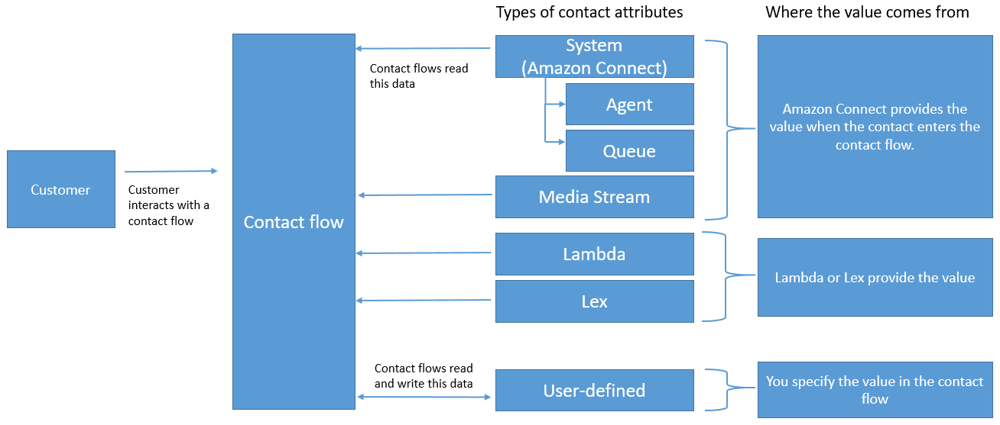
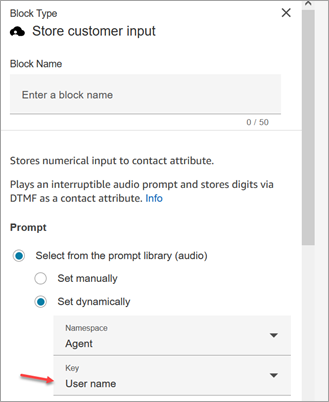

# How contact attributes work in Amazon Connect

Amazon Connect treats each interaction with a customer as a **contact**. The
interaction can be a phone call (voice), a chat, or an automated interaction with an Amazon Lex
bot.

Each contact can have some data that is specific to a particular interaction. This data
can be accessed as a contact attribute. For example:

- The name of the customer
- The name of the agent
- The channel used for the contact, such as phone or chat
  A contact attribute represents this data as a key-value pair. You might think of it as a
  field name together with the data entered into that field.

For example, here are a couple of key-value pairs for the customer name:

| Key       | Value |
| --------- | ----- |
| firstname | Jane  |
| lastname  | Doe   |

The advantage of contact attributes is that they enable you to store temporary information
about the contact so you can use it in the flow.

For example, in your welcome messages, you can say their name or thank them for being a
member. To do this, you need a way of retrieving data about that specific customer and using
it in a flow.

## Common use cases

Here are some common use cases for where contact attributes are used:

- Use the customer phone number to schedule a queued
  callback.
- Identify which agent is interacting with a customer so that
  a post call survey can be associated with a contact.
- Identify the number of contacts in a queue to decide if the
  contact should be routed to a different queue.
- Get the corresponding media streaming ARN to store in a
  database.
- Use the customer phone number to identify the status of a
  customer (for example, are they a member), or the status of their order (shipped,
  delayed, etc.) to route them to the appropriate queue.
- Based on a customer interaction with a bot, identify the slot (for
  example, the type of flowers to order) to be used in a flow.

## Types of contact attributes

To make it faster for you to find and choose the attributes you want to use, attributes
are grouped into **types**. For each flow block, we only surface those
types of attributes that work with it.

Another way to think about types of contact attributes is to categorize them based on
where the value comes from. The values for contact attributes have the following sources:

- Amazon Connect provides the value, such as the agent's name, during the contact interaction.
  This is known as providing the value at runtime.
- An external process, such as Amazon Lex or AWS Lambda, provides the value.
- [User-defined](connect-attrib-list.md#user-defined-attributes "connect-attrib-list.md#user-defined-attributes").

      + Contact attributes: In the flow, you can specify the value for an attribute
       under User defined namespace.
      + Contact segment attributes: In the flow, you can specify value for a attribute
       under Segment attributes namespace. You must also predefine the attribute first
       before assigning it as a contact segment attribute. For instructions, see [Use contact segment attributes](use-contact-segment-attributes.md "use-contact-segment-attributes.md").

  [Flow attributes](connect-attrib-list.md#flow-attributes "connect-attrib-list.md#flow-attributes") are similar to user-defined
  attributes. However, unlike user-defined attributes, flow attributes are restricted to
  the flow in which they are configured.

The following illustration lists the types of available contact attributes, and maps
them to the three sources for the values: Amazon Connect, external process such as Amazon Lex, and
user-defined.

## Contact attributes in the contact record

In contact records, contact attributes are shared across all contacts with the same
InitialContactId.

For example, while carrying out transfers, a contact attribute updated in the transfer
flow updates the attribute's value in the contact attributes of both contact records (that
is, the Inbound and Transfer contact attributes).

## Contact segment attributes in the contact

record

In contact records, the values of a contact segment attribute are specific to the
individual contactID. The values are not shared across all contacts with the same
InitialContactId.

For example, while carrying out transfers, a contact segment attribute that is updated
in the transfer flow updates the attribute's value on the new contact record (that is, it
updates the Transfer contact segment attributes).

## "$" is a special character

Amazon Connect treats the "$" character as a special character. You can't use it in a key when
setting an attribute.

For example, let's say you're creating an interact block with text-to-speech. You set
an attribute like this:

`{"$one":"please read this text"}`

When Amazon Connect reads this text, it reads "dollar sign one" to the contact instead of "please
read this text." Also, if you were to include $ in a key and try to reference the value
later using Amazon Connect, it wouldn't retrieve the value.

Amazon Connect does log and pass the full key:value pair `({"_$one":"please read this
 text"})` to integrations such as Lambda.

## What happens if an attribute doesn't exist

Be sure to implement logic to handle if the attribute doesn't exist and the contact is
routed down the error branch.

Let's say you add an attribute to the Store customer input block. The
**Namespace** is **Agent** and the
**Key** is **User name**, as shown in the following
example.

If the flow runs and the agent user name is not available, then the contact is routed
down the error branch.
