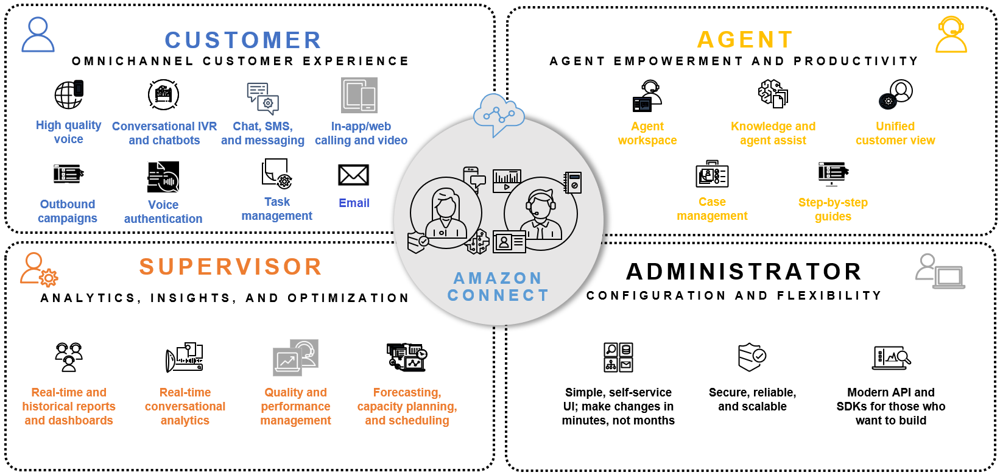

# What is Amazon Connect?

Amazon Connect is an AI-powered application that provides one seamless experience for your contact
center customers and users. It's comprised of a full suite of features across communication
channels.

Using an intuitive web application—the Amazon Connect admin website—you can [set up a contact center](amazon-connect-get-started.md "amazon-connect-get-started.md") in a few steps, add
agents who are located anywhere, and start engaging with your customers. You can innovate
and make changes in minutes, not months. No coding required.

If you're using Amazon Connect, you're likely one of these users:

- **Customers** reach out to your contact center
  because they are having trouble with some issue they can't resolve for themselves,
  or resolve easily. They want the ability to contact your contact center using any
  method they choose.
- **Agents** are responsible for helping customers
  solve general problems, and come to a quick resolution whenever possible. They spend
  most of their time interacting with customers, whether through voice, chat, SMS, or
  other channels, and then documenting the interaction.
- **Contact center managers and supervisors** spend
  most of their day monitoring their team's metrics and readjusting their
  configuration to be optimal for their business. They onboard most new agents, and
  provide coaching to help their team members grow.
- **Administrators** handle the entire Amazon Connect
  configuration. They provision phone numbers and integrate Amazon Connect with other products.
  Along with contact center managers, they define queues and routing profiles,
  implement flows, and create rules to set up alerts and notifications.
  Get more information in the [Amazon Connect feature overview](connect-feature-overview.md "connect-feature-overview.md").

## How to get started

If you are a first-time user of Amazon Connect, we recommend that you do the following:

- Check out the [Getting Started with Amazon Connect](https://catalog.workshops.aws/amazon-connect-getting-started/en-US "https://catalog.workshops.aws/amazon-connect-getting-started/en-US") for an introduction to Amazon Connect with a
  series of hands-on labs.
- Explore Amazon Connect with our [tutorials](tutorials.md "tutorials.md").
- Read the [architectural
  guidance](architecture-guidance.md "architecture-guidance.md").
- [Set up your contact center in Amazon Connect](amazon-connect-contact-centers.md "amazon-connect-contact-centers.md").

## Pricing

With Amazon Connect, you pay only for what you use. For more information, see [Amazon Connect pricing](https://aws.amazon.com/connect/pricing/ "https://aws.amazon.com/connect/pricing/").
