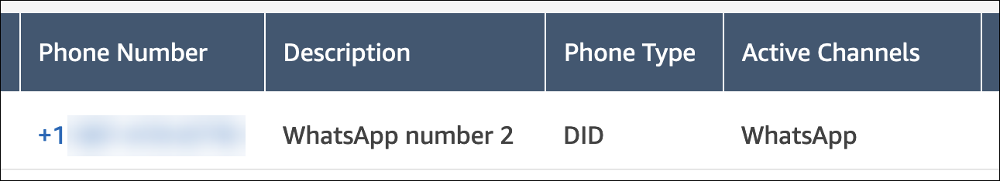

# Set up WhatsApp Business messaging

The topics in this section explain how to set up and test WhatsApp Business messaging for
Amazon Connect. You use [AWS End User Messaging Social](../../../social-messaging/latest/userguide/what-is-service.md "../../../social-messaging/latest/userguide/what-is-service.md") to link a WhatsApp Business Account and phone number to an Amazon Connect instance, then
import the linked phone number into Amazon Connect. Customers can then use WhatsApp to send messages to
your call center.

You can also use Amazon Lex to automate responses to customer questions, which saves agents time
and effort. For more information, see [Getting started with Amazon Lex](../../../lexv2/latest/dg/getting-started.md "../../../lexv2/latest/dg/getting-started.md") in the
_Amazon Lex Developer Guide_.

###### Contents

- [Prerequisites](#whatsapp-prerequisites "#whatsapp-prerequisites")
- [Step 1: Enable Amazon Connect as the event
  destination](#enable-connect-destination "#enable-connect-destination")
- [Step 2: Configure an inbound contact flow on your phone
  number](#inbound-contact-flow "#inbound-contact-flow")
- [Step 3: Send and receive test messages](#send-receive-test-messages "#send-receive-test-messages")
- [Next steps: Prepare to go live](#whatsapp-next-steps "#whatsapp-next-steps")
- [Troubleshoot common problems](#whatsapp-troubleshooting "#whatsapp-troubleshooting")
- [WhatsApp Business messaging capabilities and
  limitations with Amazon Connect](whatsapp-messaging-capabilities.md "whatsapp-messaging-capabilities.md")

## Prerequisites

Before you can integrate WhatsApp with Amazon Connect, you must have the following items:

- A WhatsApp Business Account.
- A WhatsApp phone number. The number must be able to receive a voice call or an SMS text
  message in order to complete Meta's phone number verification process for WhatsApp Business
  messaging. You can use an Amazon Connect voice number or an AWS End User Messaging SMS number for the WhatsApp phone
  number. You can also use a phone number that you own outside of AWS.

When using an Amazon Connect voice number or AWS End User Messaging SMS number, we recommend claiming a new number
that isn’t used with live voice or SMS traffic to avoid potential disruption of service.

You can use the AWS End User Messaging Social console at [https://console.aws.amazon.com/social-messaging/](https://console.aws.amazon.com/social-messaging/ "https://console.aws.amazon.com/social-messaging/") to create the WhatsApp Business
Account and phone number. For more information, see [Signing
up for WhatsApp](../../../social-messaging/latest/userguide/getting-started.md#getting-started-embedded "../../../social-messaging/latest/userguide/getting-started.md#getting-started-embedded") in the _AWS End User Messaging Social User Guide_.

###### Important

WhatsApp has an automated business verification process that can take up to 2 weeks to
complete. We recommend you begin this process early. WhatsApp can disable WhatsApp Business
Accounts if the WhatsApp Business policy is violated or the business identity can't be verified.

Also, we strongly recommend reviewing [Best practices for
AWS End User Messaging Social](../../../social-messaging/latest/userguide/best-practices.md "../../../social-messaging/latest/userguide/best-practices.md") and [WhatsApp Best Practices](https://business.whatsapp.com/policy#best_practices "https://business.whatsapp.com/policy#best_practices") before creating and linking WhatsApp resources.

After you create the account and phone number, complete the steps in the following sections
in the order listed.

## Step 1: Enable Amazon Connect as the event

destination

The following steps explain how to use AWS End User Messaging Social to enable Amazon Connect as the event destination
for your linked WhatsApp Business Account. This enables the system to import your WhatsApp phone
number.

You can use the [AWS End
User Messaging Social console](https://console.aws.amazon.com/social-messaging/ "https://console.aws.amazon.com/social-messaging/") or the AWS CLI to complete this task. To use the AWS CLI, see
[ImportPhoneNumber](../APIReference/API_ImportPhoneNumber.md "../APIReference/API_ImportPhoneNumber.md") in the _Amazon Connect API Reference_, and
[PutWhatsAppBusinessAccountEventDestinations](../../../social-messaging/latest/APIReference/API_PutWhatsAppBusinessAccountEventDestinations.md "../../../social-messaging/latest/APIReference/API_PutWhatsAppBusinessAccountEventDestinations.md") in the _AWS End
User Messaging Social API Reference_.

The following steps explain how to use the console.

###### To use the console

1. Sign in to the AWS End User Messaging Social console at [https://console.aws.amazon.com/social-messaging/](https://console.aws.amazon.com/social-messaging/ "https://console.aws.amazon.com/social-messaging/").
2. In the navigation pane, choose **WhatsApp Business accounts**, then
   choose the desired account.
3. On the **Event destination** tab, choose **Edit
   destination**.
4. For **Destination type**, choose **Amazon Connect**.
5. For **Connect instance**, choose your Amazon Connect instance from the dropdown
   list.
6. For **Role ARN**, choose an IAM role that grants permission to deliver
   messages and events, and to import phone numbers. For example IAM policies, see [Add a message and event destination to AWS End User Messaging Social](../../../social-messaging/latest/userguide/managing-event-destinations-add.md#managing-event-destinations-amazon-connect-policies "../../../social-messaging/latest/userguide/managing-event-destinations-add.md#managing-event-destinations-amazon-connect-policies") in the _AWS End User Messaging Social
   User Guide_.
7. Choose **Save changes**.

This starts the process of importing your phone number to Amazon Connect.

After the operation finishes, the number appears in the Amazon Connect admin website.

###### To view the number

    * In the navigation pane, choose **Channels**, then **Phone
     numbers**.

    The **Active Channels** column displays **WhatsApp**
     for all WhatsApp numbers.

    

## Step 2: Configure an inbound contact flow on your phone

number

You can create an inbound contact flow for use with your WhatsApp phone number, or you can
reuse an existing flow. If you reuse a flow, you can add a `CheckContactAttribute`
block and enable branching for the flow. The block enables you to send WhatsApp contacts to a
specific queue, or take another action.

For more information about building your contact flow, including interactive messages and
rich link previews, see [WhatsApp Business messaging capabilities and
limitations with Amazon Connect](whatsapp-messaging-capabilities.md "whatsapp-messaging-capabilities.md") later in this section.

The following sets of steps explain how to configure an inbound contact flow and add a
`CheckContactAttribute` block to the flow.

###### To configure a flow

1. Start the Amazon Connect console at [https://console.aws.amazon.com/connect/](https://console.aws.amazon.com/connect/ "https://console.aws.amazon.com/connect/")
2. In the navigation pane, choose **Channels**, then **Phone
   numbers**.
3. Choose the WhatsApp number, then choose **Edit**.
4. Under **Flow/IVR**, choose the flow you updated.

 5. Choose **Save**.

###### To add the CheckContactAttribute block

1. Follow steps 1–4 [in the previous
   section](#enable-connect-destination "#enable-connect-destination").
2. Open the **Properties** page for the flow.
3. In the **Attribute to check** section, set **Namespace**
   to **Segment attributes**, and **key** to
   **Subtype**. For more information about segment attributes, see [SegmentAttributes](ctr-data-model.md#segmentattributes "ctr-data-model.md#segmentattributes"), later in this guide.
4. In the **Conditions to check** section, set
   **condition** to **Equals** and **value**
   to **connect:WhatsApp**.
5. Choose **Save**.

## Step 3: Send and receive test messages

In this step, you use the Contact Control Panel (CCP) and a mobile phone to send and receive
WhatsApp test messages.

###### To test the integration

1. In your CCP, set your status to **Available**.
2. Using WhatsApp on your mobile phone, start a conversation by entering the phone number you
   added previously.

The following image shows a message with **Options**, and the resulting
list of options.

## Next steps: Prepare to go live

After you test your integration, we recommend adding the following features and capabilities
to your WhatsApp messaging channel.

### Add Amazon Connect features

The links in the following list take you to information about Amazon Connect features that you can
add to your customer and agent experiences.

- Learn more about the [WhatsApp Business messaging capabilities and
  limitations with Amazon Connect](whatsapp-messaging-capabilities.md "whatsapp-messaging-capabilities.md").
- [Enable customers to resume chat conversations in
  Amazon Connect](chat-persistence.md "chat-persistence.md") – Customers can resume previous conversations with
  the context, metadata, and transcripts carried forward. They don't need to repeat themselves
  when they return to a chat, and agents have access to the entire conversation history.
- [Create quick responses for use with chat and email
  contacts in Amazon Connect](create-quick-responses.md "create-quick-responses.md") – Provide agents with pre-written responses to
  common customer inquiries that they can use while they chat with customers. Quick responses
  make it faster for agents to respond to customers.

### Add entry points

The links in the following list take you to information about adding different types of
customer entry points.

- Entry points: [5 ways to direct leads and customers to business messaging conversations](https://business.whatsapp.com/blog/messaging-app-entry-points "https://business.whatsapp.com/blog/messaging-app-entry-points") (WhatsApp
  blog post)
- QR codes: [Manage your WhatsApp Business Platform QR code](https://business.facebook.com/business/help/890732351439459 "https://business.facebook.com/business/help/890732351439459") (Meta help article)
- Click-to-WhatsApp ads: [Create
  Ads that Click to WhatsApp in Ads Manager](https://business.facebook.com/business/help/447934475640650?id=371525583593535 "https://business.facebook.com/business/help/447934475640650?id=371525583593535") (Meta help article)

### Add a display name to your phone number

To add a verified display name that customers see, [About WhatsApp Business
display name](https://business.facebook.com/business/help/338047025165344 "https://business.facebook.com/business/help/338047025165344") in the Meta help.

### Scale traffic

After you onboard live traffic to your WhatsApp integration, we recommend monitoring the
following quotas.

###### Amazon Connect quotas

For more information about default quotas, and about raising them, see [Amazon Connect service quotas](amazon-connect-service-limits.md "amazon-connect-service-limits.md").

- [Concurrent active chats per instance](amazon-connect-service-limits.md#concurrent-active-chats "amazon-connect-service-limits.md#concurrent-active-chats")
  quota. For information about monitoring this quota, see [Monitoring your Amazon Connect instance using CloudWatch](monitoring-cloudwatch.md "monitoring-cloudwatch.md"),
- [StartChatContact](../APIReference/API_StartChatContact.md "../APIReference/API_StartChatContact.md") throttling quota.
- [SendChatIntegrationEvent](../APIReference/API_SendChatIntegrationEvent.md "../APIReference/API_SendChatIntegrationEvent.md") throttling quota.
- `SendIntegrationEvent` throttling quota. A permission only API used by
  AWS End User Messaging Social to publish inbound WhatsApp events.

###### End User Messaging Social quotas

AWS End User Messaging Social enforces rate limits on a number of messaging APIs. Monitor the following
APIs to see if you need to change one or more quotas. The links take you to the
_AWS End User Messaging Social API Reference_.

- [SendWhatsAppMessage](../../../social-messaging/latest/APIReference/API_SendWhatsAppMessage.md "../../../social-messaging/latest/APIReference/API_SendWhatsAppMessage.md")
- [PostWhatsAppMessageMedia](../../../social-messaging/latest/APIReference/API_PostWhatsAppMessageMedia.md "../../../social-messaging/latest/APIReference/API_PostWhatsAppMessageMedia.md")
- [GetWhatsAppMessageMedia](../../../social-messaging/latest/APIReference/API_GetWhatsAppMessageMedia.md "../../../social-messaging/latest/APIReference/API_GetWhatsAppMessageMedia.md")

For more information about increasing AWS End User Messaging Social quotas, see the following topics in the
_AWS End User Messaging Social User Guide_:

- [Quotas
  for AWS End User Messaging Social](../../../social-messaging/latest/userguide/quotas.md "../../../social-messaging/latest/userguide/quotas.md")
- [Increase messaging
  conversation limits in WhatsApp](../../../social-messaging/latest/userguide/increase-message-limit.md "../../../social-messaging/latest/userguide/increase-message-limit.md")
- [Increase message
  throughput in WhatsApp](../../../social-messaging/latest/userguide/increase-message-throughput.md "../../../social-messaging/latest/userguide/increase-message-throughput.md")

## Troubleshoot common problems

Use the following information to troubleshoot common problems with a WhatsApp
integration.

###### Contents

- [Unable to see imported phone numbers in your Amazon Connect
  instance](#no-imported-number "#no-imported-number")
- [Inbound messages from customers are not
  delivered](#whatsapp-messages-not-delivered "#whatsapp-messages-not-delivered")

### Unable to see imported phone numbers in your Amazon Connect

instance

If your imported number fails to appear in the Amazon Connect admin website, follow these
steps:

- Ensure that the event destination IAM role has the necessary permissions. For more
  information, see [Step 1: Enable Amazon Connect as the event
  destination](#enable-connect-destination "#enable-connect-destination").
- See if your _Phone numbers per instance_ quota needs to be raised. For
  more information, see [Amazon Connect service quotas](amazon-connect-service-limits.md "amazon-connect-service-limits.md").
- To reassign a linked WhatsApp Business Account to a different Amazon Connect instance, you must
  first release the imported phone numbers from the original Amazon Connect instance. After the phone
  numbers are released, you can update the event destination on your linked WhatsApp Business
  Account to another Amazon Connect instance.

###### Important

Do not release numbers that handle live customer traffic. Instead, [claim new phone numbers](claim-and-manage-phonenumbers.md "claim-and-manage-phonenumbers.md").

- To help determine the cause of the import issue, search your CloudTrail logs for
  `ImportPhoneNumber` events and check for error details. If the
  `ImportPhoneNumber` call succeeds, you can call `DescribePhoneNumber`
  for other error details.

If you made a fix, you must import the phone numbers again. To do this, repeat [Step 1: Enable Amazon Connect as the event
destination](#enable-connect-destination "#enable-connect-destination").

### Inbound messages from customers are not

delivered

If WhatsApp inbound message delivery stops, search your AWS CloudTrail logs for
`SendIntegrationEvent` and `SendChatIntegrationEvent` for error
details.

You can also check these common scenarios:

- Ensure that your linked WhatsApp Business Account in AWS End User Messaging Social has an Amazon Connect event
  destination enabled.
- Ensure your event destination IAM role has the necessary permissions. For more
  information, see [Step 1: Enable Amazon Connect as the event
  destination](#enable-connect-destination "#enable-connect-destination") earlier in this section. You
  have a misconfigured role if CloudTrail throws `AccessDeniedException` errors from the
  `SendIntegrationEvent` API.
- Ensure that your WhatsApp phone number imported successfully to your Amazon Connect instance, and
  that the number has an associated inbound contact flow. For more information, see [Step 2: Configure an inbound contact flow on your phone
  number](#inbound-contact-flow "#inbound-contact-flow").
- Inbound messages were dropped because they are not yet supported. For more information,
  see [WhatsApp Business messaging capabilities and
  limitations with Amazon Connect](whatsapp-messaging-capabilities.md "whatsapp-messaging-capabilities.md").
