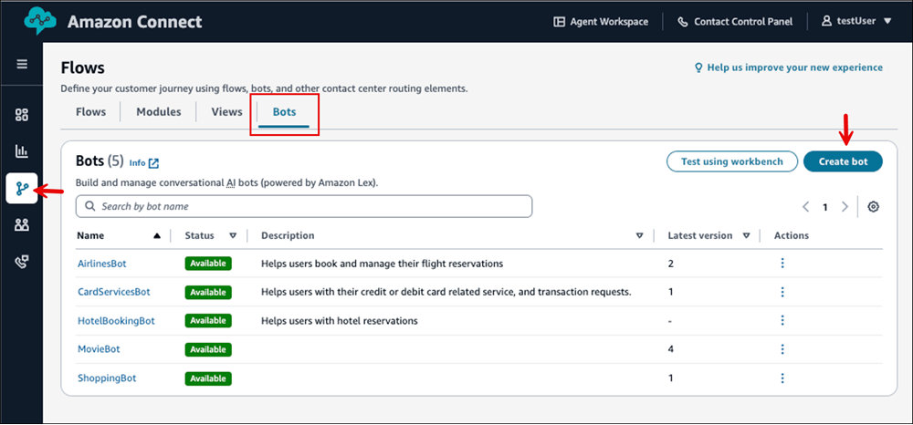
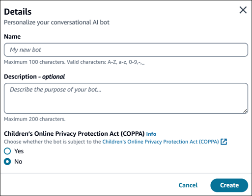
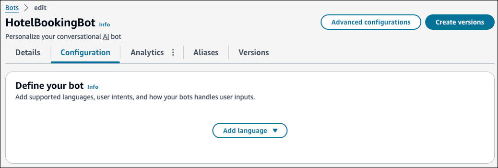
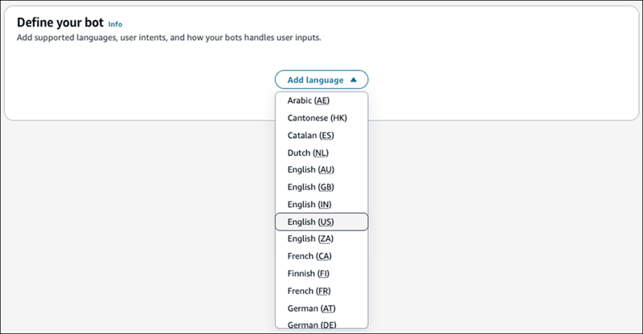
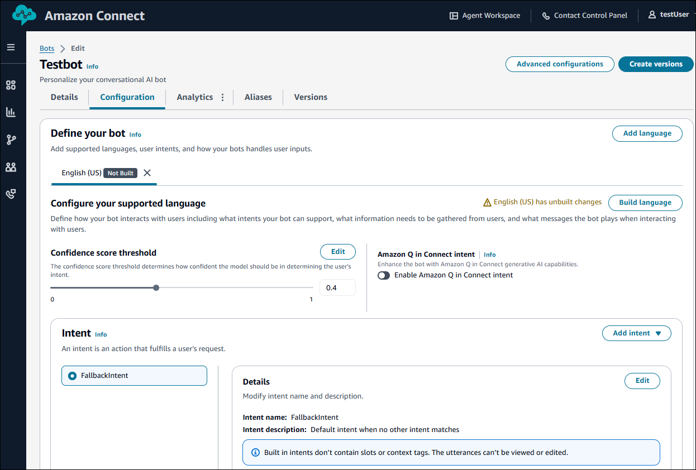
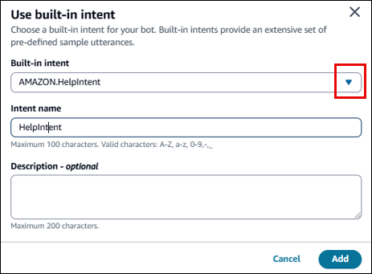

# Create a bot by using the Amazon Connect admin website

You can build complete Lex bots in the Amazon Connect admin website without ever leaving the Amazon Connect interface.
There is no charge for building or editing bots in Amazon Connect. Instead, you are billed by
Amazon Lex for usage. For pricing information, see the [Amazon Lex pricing](https://aws.amazon.com/lex/pricing/ "https://aws.amazon.com/lex/pricing/") page.

###### To create a bot

1. Log in to the Amazon Connect admin website at https://`instance name`.my.connect.aws/. Use an Admin account or an account that has **Channels
   and Flows** - **Bots** -
   **Create** permission in its security profile.
2. In the left navigation menu, choose **Routing**,
   **Flows**.
3. On the **Flows** page, choose **Bots**,
   **Create bot**.

 4. In the **Details** dialog box, provide the following
information:

    * **Bot name**: Enter a unique name for the bot.
    * **Bot description**: - (Optional) Provide additional
     information about the purpose of the bot.
    * **Child Online Privacy Protection Act (COPPA)**:
     Choose whether the bot is subject to the Child Online Privacy Protection
     Act.

The following image shows the **Details** dialog box and
these options.

 5. Choose **Create**. After the bot is successfully created, you
are directed to the bot configuration page. The following image shows an example
page for a newly created bot named **HotelBookingBot**.

 6. On the bot configuration page, choose **Add language**.
Choose the primary language for your bot and your preferred way to create this
language.

 7. After you choose your language, you are directed to the **Define your
bot** section. An example section is shown in the following image.
This section is where you'll add intents.

## Add intents to your bot

In the **Define your bot** section, you add intents. Intents are
the goals that your users want to accomplish, such as ordering flowers or booking a
hotel.

Your bot must have at least one intent. There are two types of intents:

- Custom intents: Create intents that represent the actions or requests your
  bot should handle. This topic explains how to create custom intents.
- Build-in intents: By default, all bots contain a single built-in intent,
  the fallback intent. This intent is used when the bot does not recognize any
  other intent. For example, if a user says "I want to order flowers" to a
  hotel booking intent, the fallback intent is triggered. The following image
  shows an example of a built-in intent.

###### To create a custom intent

1. Choose **Add intent**, and then choose **Add
   empty intent**.
2. In the **Add intent** dialog box, enter a name for your
   intent and a description that's meaningful to you. Choose
   **Add**.
3. Enter the following information to configure your intent:
   - Add sample **Utterances**: Choose
     **Add** and then provide phrases or questions
     that users might use to express that intent. Choose
     **Save**.
   - Configure **Slots**: Choose
     **Add** and then define the slots, or
     parameters, required to fulfill the intent. Each slot has a type
     that defines the values that can be entered in the slot. Choose
     **Add** to add the slot. When you're done
     adding slots, choose **Save**.
   - Create **Prompts**: Choose
     **Edit** and then you can enter prompts that
     the bot will use to ask for information or clarify user inputs.
     Choose **Save** when finished.
     - **Initial response message**: The initial
       message sent to the user after the intent is invoked. You
       can provide responses, initialize values, and define the
       next step that the bot takes to respond to the user at the
       beginning of the intent.
     - **Confirmation prompt and responses**:
       These are used to confirm or decline fulfillment of the
       intent. The confirmation prompt asks the user to review slot
       values. For example, "I've booked a hotel room for Friday.
       Is this correct?" The declination response is sent to the
       user when they decline the confirmation.
     - **Closing response message**: This is the
       response sent to the user after the intent is fulfilled and
       all other messages are played. For example, "Thank you for
       booking a hotel room."

For more information about intents for Amazon Lex V2 bots intents and advanced
configurations, see [Adding intents](../../../lexv2/latest/dg/add-intents.md "../../../lexv2/latest/dg/add-intents.md") in the
_Amazon Lex V2 Developer Guide_.
