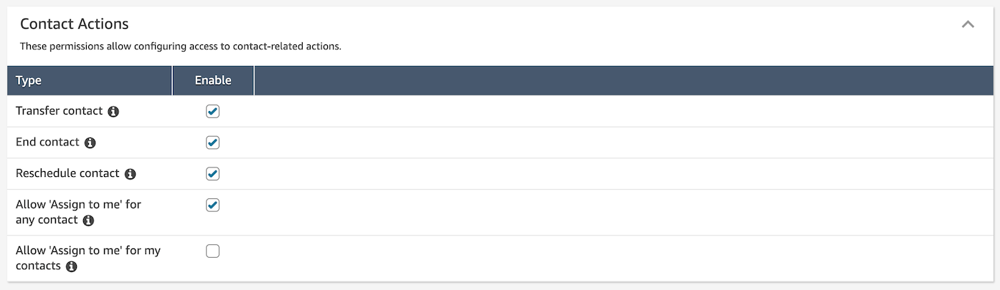
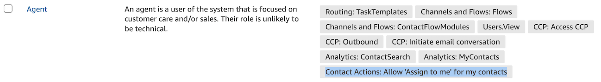
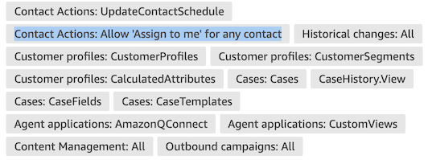
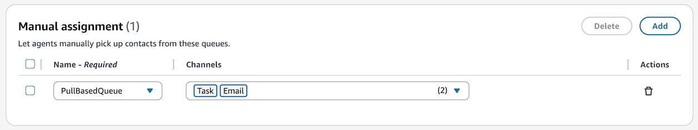
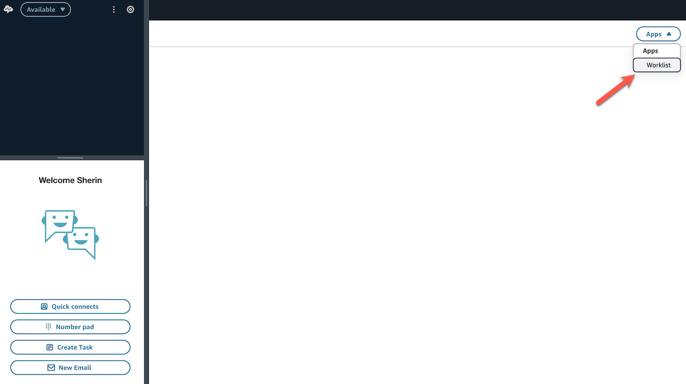
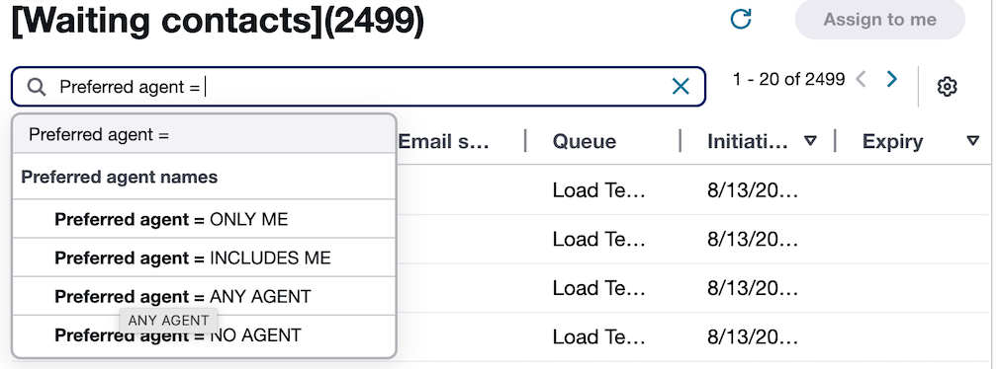
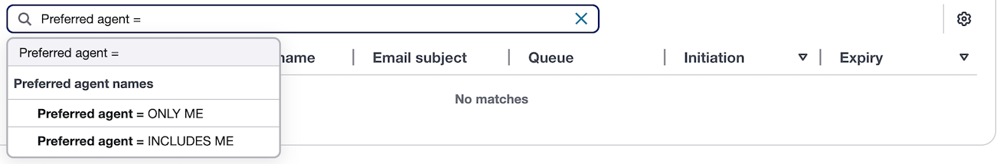

# Access the Worklist app in the Amazon Connect agent

workspace

The Worklist app enables agents with the required permissions and routing profile
settings to manually prioritize and assign queued work to themselves. The following
steps explain how to provide your users access to the Worklist app in their
workspaces.

###### Note

An agent can only access the Worklist App in the Agent Workspace if they have
a Security Profile with the appropriate permissions described below.

1. Update the security profiles by selecting one of these permissions:
   - **Allow 'Assign to me' for any
     contact** permission - Enables agents to view contacts
     under any of these conditions:
     - Current Agent is the only Preferred Agent on the
       Contact.
     - Current Agent is one of the Preferred Agents on the
       Contact.
     - Any Agent or set of Agents are Preferred Agents on the
       Contact.
     - Contact with no Preferred Agents.

   - **Allow 'Assign to me' for my
     contact** permission - Enables agents to view contacts
     under these conditions:
     - Current Agent is the only Preferred Agent on the
       Contact.
     - Current Agent is one of the Preferred Agents on the
       Contact.

Once these permissions are assigned, they will be reflected on the
**Security Profile Page**.

 2. Update the routing profile settings to specify queue / channels for manual
assignment in the new section.

 3. Once the security profile and routing profile settings are updated, the
agent will see the Worklist app in their workspace:

## Available filter options

The available filter options depend on the agent's permissions:

- An Agent with **Allow 'Assign to me' for any
  contact** can view these filter options:

- An Agent with **Allow 'Assign to me' for my
  contact** can view these filter options:

