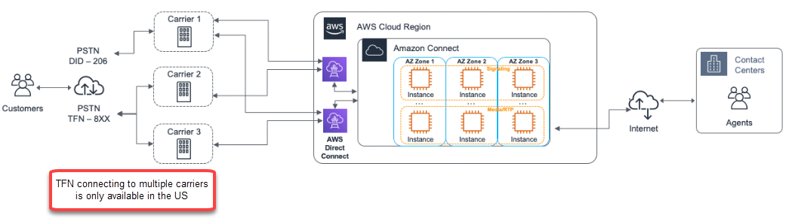
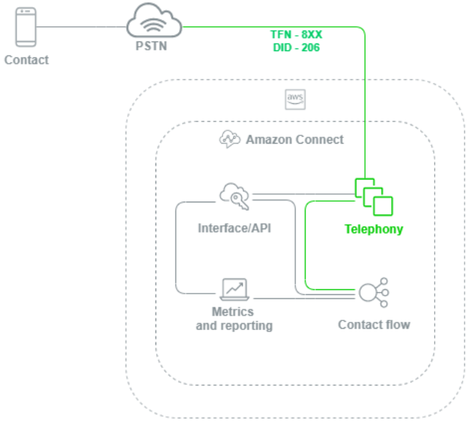
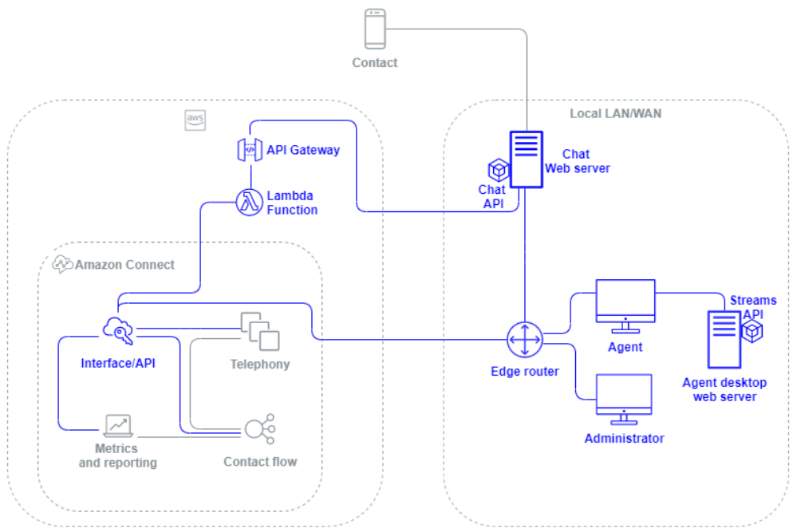
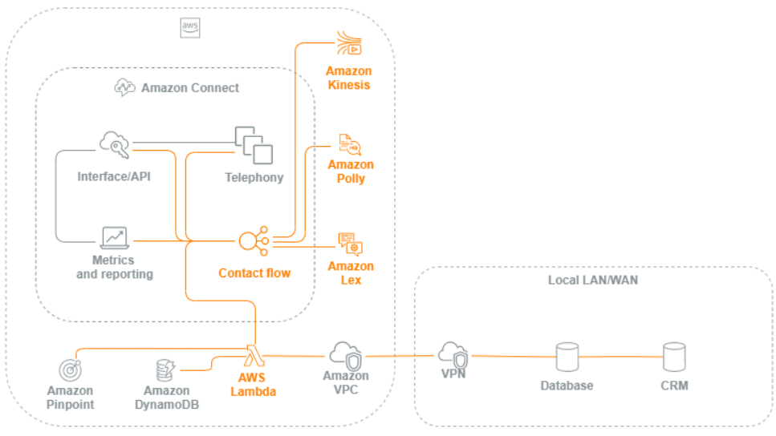
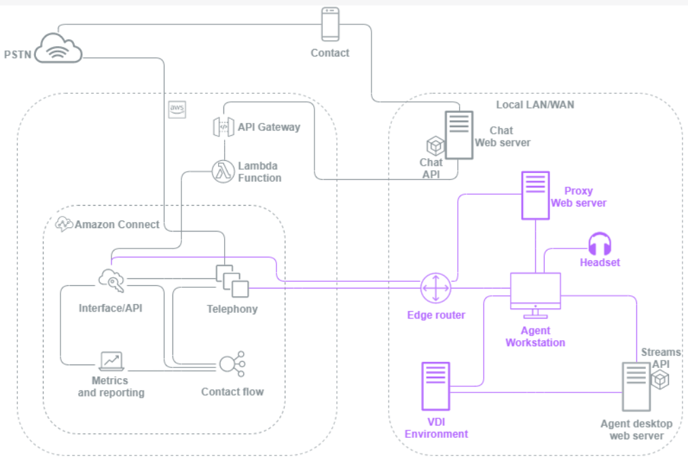
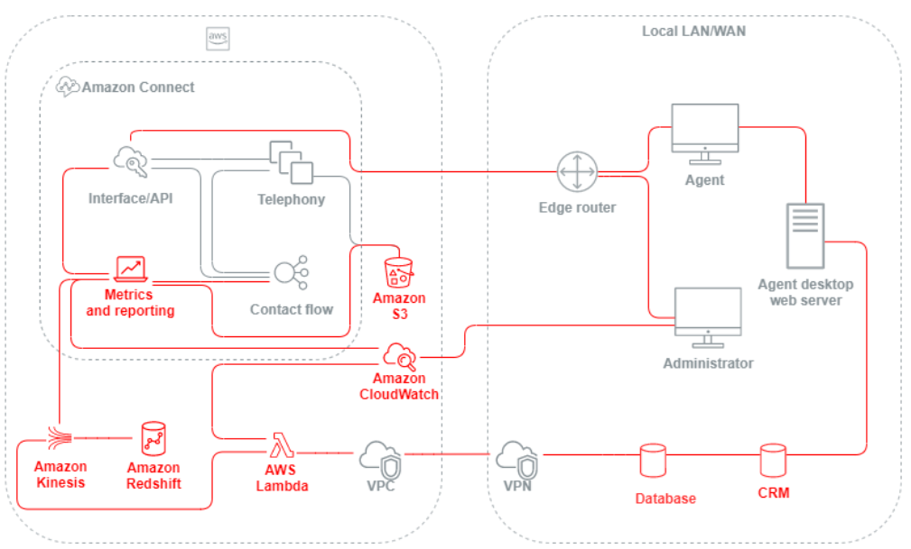

# Connect Customer workload layers

You can separate Connect Customer workloads into the following layers: telephony, Connect Customer
interface/API, flows/IVR, agent workstation, and metric and reporting.

## Telephony

###### Important

TFN connecting to multiple carriers is only available in the US.

Connect Customer is integrated with multiple telephony providers with redundant dedicated
network paths to three or more Availability Zones in every Region where the service
is offered today. Capacity, platform resiliency, and scaling are handled as part of
the managed service, allowing you to efficiently ramp from 10 to 10,000+ agents
without worrying about the management or configuration of underlying platform and
telephony infrastructure. Workloads are load balanced across a fleet of telephony
media servers, allowing new updates and features to be delivered to you with no
downtime required for maintenance or upgrades. If a particular component, data
center, or an entire Availability Zone experiences failure, the affected endpoint is
taken out of rotation, allowing you to continue to provide a consistent quality
experience for your customers.

When a voice call is placed to a Connect Customer instance, the telephony layer is
responsible for controlling the endpoint that your customer calls into through their
carrier, across the PSTN and into Connect Customer. This layer represents the audio path
established between Connect Customer and the customer. Through the Connect Customer interface layer, you
can configure things like outbound caller ID, assign flow/IVRs to phone numbers,
enable live media streaming, enable call recording, and the ability to claim phone
numbers without any prior traditional telephony knowledge or experience.
Additionally, when migrating workloads to Connect Customer, you have the option to port your
existing phone numbers by opening a support case in your AWS Management Console.
You can also forward your existing phone numbers to numbers that you’ve claimed in
your Connect Customer instance until you are fully migrated.

## Connect Customer Interface/API

The Connect Customer interface layer is the access point that your agents and contact center
supervisors and administrators will use to access Connect Customer components like reporting
and metrics, user configuration, call recordings, and the Contact Control Panel
(CCP). This is also the layer responsible for:

- Single Sign-On (SSO) integration user authentication
- Custom desktop applications created using the [Connect Customer
  Streams](https://github.com/aws/amazon-connect-streams "https://github.com/aws/amazon-connect-streams") API that may provide additional functionality and/or
  integrate with existing Customer Relationship Management (CRM) systems
  including the [Connect Customer Salesforce CTI
  Adapter](salesforce-integration.md "salesforce-integration.md").
- Connect Customer contact-facing chat interface
- Chat web server hosting the Connect Customer Chat API
- Any Amazon API Gateway endpoints and corresponding AWS Lambda functions necessary to
  route chat contacts to Connect Customer.

Anything your agents, managers, supervisors, or contacts use to access, configure,
or manage Connect Customer components from a web browser or API is considered the Connect Customer
interface layer.

### Flow / IVR

The Flow/IVR layer is the primary architectural vehicle for Connect Customer and serves
as the point of entry and first line of communication with customers reaching
out to your contact center. After a customer contacts your Connect Customer instance, a
flow controls the interaction between Connect Customer, the contact, and the agent,
allowing you to:

- Dynamically invoke AWS Lambda functions to make API calls.
- Send real-time IVR and voice data to third-party endpoints through
  Amazon Kinesis.
- Access resources inside your VPC and behind your VPN.
- Call other AWS services like Amazon Pinpoint to send SMS messages from the
  IVR.
- Perform data dips to database like Amazon DynamoDB to service your
  contacts.
- Call Amazon Lex directly from the flow to invoke a
  Lex
  bot for Natural Language Understanding (NLU) and
  Automatic Speech Recognition (ASR).
- Play dynamic and natural Text-to-Speech through Amazon Polly, and use SSML
  and Neural Text-to-Speech (NTTS) to achieve the most natural and
  human-like text-to-speech voices possible.

Flows enable you to dynamically prompt contacts, collect and store contact
attributes, and route appropriately. You can assign a flow to multiple phone
numbers, and manage and configure it through Connect Customer.

## Agent workstation

The agent workstation layer is not managed by AWS. It consists of any physical
equipment and third-party technologies, services, and endpoints that help your
agent’s voice, data, and access the Connect Customer interface layer. Components in the agent
workstation layer include:

- The Contact Control Panel (CCP) agent hardware
- Network path
- Agent headset or handset
- VDI environment
- Operating system and web browser
- Endpoint security
- All networking components and infrastructure
- Internet Service Provider (ISP) or Direct Connect dedicated network path to
  AWS.
- All other aspects of your agent’s operating environment including power,
  facilities, security, and ambient noise.

## Metric and reporting

The metric and reporting layer includes the components responsible for delivering,
consuming, monitoring, alerting, or processing real-time and historical metrics for
your agents, contacts, and contact center. This includes all native and third-party
components responsible for facilitating the processing, transmission, storage,
retrieval, and visualization of real-time or historical contact center metrics,
activity audit, and monitoring data. For example:

- Call recordings and scheduled reports stored in Amazon Simple Storage Service (Amazon S3).
- Contact records that you can export to AWS database services like Amazon Redshift
  or your own on-premises data warehouse with Amazon Kinesis.
- Real-time dashboards you create with Amazon OpenSearch Service and Kibana.
- Amazon CloudWatch metrics generated that you can use to set alarms based on static
  thresholds, set up Amazon SNS notifications to alert to your administrators and
  supervisors, or launch AWS Lambda functions in response to the event.

