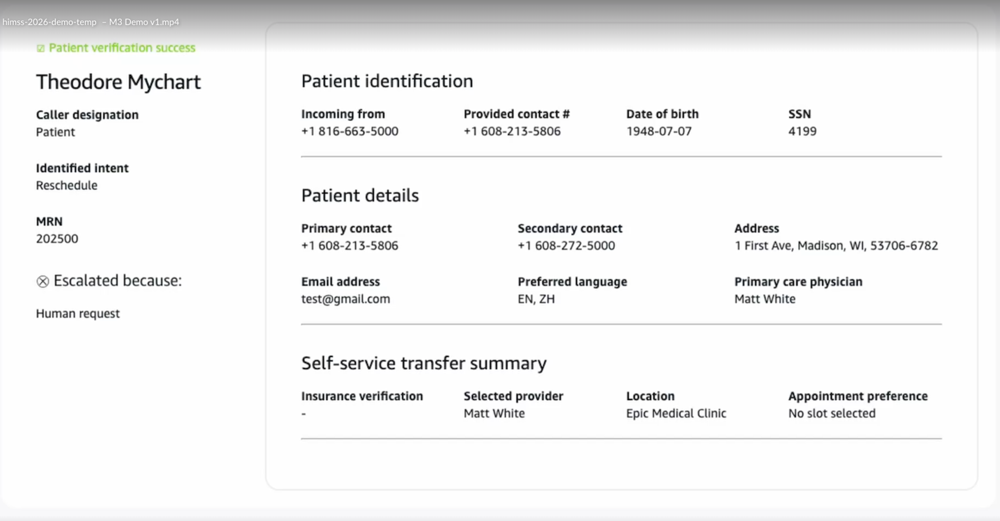

# Patient profile

The patient profile is a unified view displayed in the Amazon Connect Agent Workspace that provides human agents with complete context when they are connected with a caller. Whether the call is transferred after successful patient verification or escalated during appointment management, this profile reduces the need for patients to repeat information and reduces cognitive burden on contact center staff.

###### Topics

- [Patient information displayed](#pp-patient-info "#pp-patient-info")
- [Appointment intent and details](#pp-appointment-intent "#pp-appointment-intent")
- [Verification status](#pp-verification-status "#pp-verification-status")
- [Escalation information](#pp-escalation-info "#pp-escalation-info")
- [Self-service summary](#pp-self-service-summary "#pp-self-service-summary")
- [Error scenarios](#pp-error-scenarios "#pp-error-scenarios")

## Patient information displayed

The patient profile displays the following demographic and clinical information:

- Full name, date of birth, and medical record number (MRN)
- Contact information, including phone number and address
- Primary care provider and care team

## Appointment intent and details

When a call involves appointment management, the profile displays:

- Appointment type, date, time, and location
- Provider name and department
- Scheduling intent captured during the AI interaction

## Verification status

The profile shows the outcome of the identity verification process:

- Verification outcome: verified, partially verified, or failed
- Factors that were successfully verified
- Number of verification attempts

## Escalation information

When a call is escalated from an AI agent, the profile includes:

- Reason for escalation, such as a safety concern, complex request, patient frustration, or verification failure
- Escalation timestamp and originating flow

## Self-service summary

The profile provides a summary of actions completed by the AI agent before the escalation:

- Actions completed or attempted during the self-service interaction
- Appointment changes made or confirmed
- Insurance verification outcome, if applicable

## Error scenarios

When patient verification was incomplete or failed, the patient profile displays all information collected from the caller during the verification attempt. This ensures that human agents can see which verification factors were already provided and which ones failed or were missing, eliminating the need to ask patients to repeat information they have already shared.
