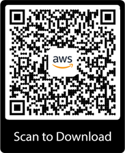

# Getting started with the AWS Console Mobile Application

Use this tutorial to get started with the Console Mobile Application.
You’ll learn about required IAM permissions, how to authenticate through the app, and how to view your AWS resources through the app.

## Prerequisites

Before you begin, be sure that you’ve completed the steps in [Setting up for the AWS Console Mobile Application](setting-up.md "setting-up.md").

To log in to the Console Mobile Application, we recommend using either your user credentials or a federated role, rather than a root account. When you create an AWS account, you begin with one sign-in identity that has complete access to all AWS services and resources in the account.
This identity is called the AWS account root user and is accessed by signing in with the email address and password that you used to create the account. We strongly recommend that you don’t use the root user for your everyday tasks.
Safeguard your root user credentials and use them to perform the tasks that only the root user can perform. For the complete list of tasks that require you to sign in as the root user, see [Tasks that require root user credentials](../../../accounts/latest/reference/root-user-tasks.md "../../../accounts/latest/reference/root-user-tasks.md") in the _AWS Account Management Reference Guide_.

To sign in as a user, you need to use either the account number or the account alias, which can be found at the top of the Management Console sign-in screen.

To sign in with a federated role, you need the federation link from your administrator.

If you use AWS Multi-factor Authentication (MFA), we recommend using either a hardware key fob MFA device, a hardware display card MFA device,
or a virtual MFA device for the greatest level of account protection. For a list of MFA devices that you can use, see [Multi-factor Authentication](http://aws.amazon.com/iam/details/mfa/ "http://aws.amazon.com/iam/details/mfa/").

The Console Mobile Application does not currently support using U2F security keys for MFA. For more information,
see [Supported configurations for using U2F security keys](../../../IAM/latest/UserGuide/id_credentials_mfa_u2f_supported_configurations.md "../../../IAM/latest/UserGuide/id_credentials_mfa_u2f_supported_configurations.md") in the _IAM User Guide_.

You can set up biometric authentication on supported iOS and Android devices running the Console Mobile Application version 2.0 and newer.

## Step 1: Verify your permissions

To use the Console Mobile Application, you need the same permissions you use to access the AWS Management Console on your desktop.
This means you need some basic AWS permissions, in addition to permissions for the AWS services you want to access from the Console Mobile Application.

###### Note

To use AWS Billing and Cost Management in the Console Mobile Application, you need to have permissions for the AWS Cost Explorer API, rather than for the AWS Billing and Cost Management console.

The following example shows a JSON policy that allows the user to use the AWS Cost Explorer API:

```
 {
    "Version":"2012-10-17",
    "Statement": [
        {
            "Effect": "Allow",
            "Action": [
                "ce:*"
            ],
            "Resource": [
                "*"
            ]
        }
    ]
}
```

## Step 2: Sign in

**To sign in as a first time Root or IAM user**

1. In the Console Mobile Application, select **Use an AWS identity**.
2. Enter your AWS identity information.
3. (Optional) Enable biometric authentication.

###### Note

If you have a virtual MFA device or a hardware authenticator enabled for MFA, you will be prompted to enter your MFA code or use your hardware authenticator to verify your identity. 4. Choose **Sign in**. 5. (Optional) Save your password using your password manager. 6. View your home screen.

**To sign in for the first time as an IAM Identity Center user**

1. Sign in using a QR code:
   1. On your desktop device, navigate to the AWS access portal.
   2. Open the right sidepanel by choosing **More ways to access AWS**.
   3. Use your mobile device to scan the **Access the console in the mobile app** QR code.

   ###### Note

   If you use an Android device, we recommend using a third-party QR code scanner app or Google Lens to scan the **Access the console in the mobile app** QR code.

2. (Optional) Or sign in using a URL:
   1. In the Console Mobile Application, select **Use a sign in URL**.
   2. Enter your organization’s sign in URL. This directs you to your organization’s federated sign in page.

   ###### Note

   If your organization uses IAM Identity Center, when an administrator creates a user in IAM Identity Center on your behalf an email invitation to join IAM Identity Center containing a one-time password and AWS access portal URL is typically sent to you.

3. Enter your organizational credentials (for example, a user name and password).
4. Choose **Sign in**.
5. If you are asked for a verification code, check your email for it. Then enter or paste the code in the sign-in screen.

###### Note

If you have a virtual MFA device or a hardware authenticator enabled for MFA, you will be prompted to enter your MFA code or use your hardware authenticator to verify your identity. 6. (Optional) Save your password using your password manager. We recommend doing this step. 7. Select an AWS account and role to assume. 8. View your home screen.

**To sign in as a first time Federated user**

1. In the Console Mobile Application, select **Use a sign in URL**.
2. Enter your organization’s sign in URL. This directs you to your organization’s federated sign in page.

###### Note

If your organization uses a federated or third-party identity provider like Windows Active Directory, Okta, or Salesforce Identity, contact your administrator to get your sign in URL. 3. Enter your organizational credentials (for example, a user name and password). 4. Choose **Sign in**. 5. If you are asked for a verification code, check your email for it. Then enter or paste the code in the sign-in screen.

###### Note

If you have a virtual MFA device or a hardware authenticator enabled for MFA, you will be prompted to enter your MFA code or use your hardware authenticator to verify your identity. 6. (Optional) Save your password using your password manager. We recommend doing this step. 7. Select an AWS account and role to assume. 8. View your home screen.

**To sign in as a returning Root, IAM, or Federated user**

AWS identities previously used to sign in are listed on the **Identities** screen of the Console Mobile Application. If your AWS identity credentials are saved in your mobile device’s password manager, you can auto-fill your credentials for faster sign in. If you have a virtual MFA device or a hardware authenticator enabled for MFA, you will be prompted to enter your MFA code or use your hardware authenticator to verify your identity before signing in.

## Step 3: View your home screen

From the home screen, you can view information about CloudWatch alarms, AWS Health, Cost Management, and Recently Visited Services.

### View and modify CloudWatch alarms

In the CloudWatch widget you can see the status of your alarms. To see more information about your alarms, you can choose the red number of those in alarm or with insufficient data.
This shows you a list of those alarms, which you can search or filter.

You can filter your alarms by choosing **Filter**, then choosing one of the following options:

- In alarm
- OK
- Insufficient data

To view more information about an alarm, choose the alarm you want to view. The alarm detail screen will appear. You can see more information about the alarm status, threshold, and more.

To modify an alarm threshold, choose **Modify**.

### View CloudWatch custom dashboards

**To view your CloudWatch custom dashboards**

1. In the CloudWatch widget on your home screen, choose **View dashboards**. You can then view a list of all of the CloudWatch custom dashboards your AWS identity has access to.
2. Select the CloudWatch custom dashboard that you want to view.
3. (Optional) Adjust the date or timespan to change the viewable data.

### View AWS Health details

On the home screen, under **AWS Health**, you can see your open issues past 7 days, your scheduled changes, and other notifications past 7 days. Choose any of these numbers to view more information about these events.
To view all of your events, choose **View all**. You can browse and search your event log.

### View Cost Management details

To view your Cost Management details, from the home screen, under **Cost Management**, choose your month-to-date costs or **View details**. You can explore your month-to-date costs and more.

### View Recently Visited AWS Service details

On your home screen, under **Recently Visited**, you can view a swipeable list of your ten most recently visited AWS services that are supported in the application. These services are listed from most recently visited to least recently visited. Your recently visited AWS services are synchronized between your mobile and web experiences so you can view your recently visted services across platforms.

## (Optional) Step 4: Enable push notifications

If you want to receive push notifications about AWS services and resources of interest on your mobile device, enable push notifications.
For more information, see [Push notifications](managing-notifications.md "managing-notifications.md").

## (Optional) Step 5: Access Amazon Q

If you want to receive in-app answers to your AWS service questions, access Amazon Q. You can access the generative Artificial Intelligence (AI) from the Amazon Q tab at the bottom of your screen if you have the necessary permissions. For more information, see [What is Amazon Q Developer?](../../../amazonq/latest/qdeveloper-ug/what-is.md "../../../amazonq/latest/qdeveloper-ug/what-is.md") and [AmazonQFullAccess](../../../amazonq/latest/qdeveloper-ug/managed-policy.md#amazonq-policy-fullaccess "../../../amazonq/latest/qdeveloper-ug/managed-policy.md#amazonq-policy-fullaccess") in the the _Amazon Q User Guide_.

###### Note

For Apple users, Amazon Q is supported on iOS 16 and higher.

## Step 6: View information about other AWS services

At the bottom of the screen, choose the **Services** tab. You will see a list of all of AWS services that are supported in the application.

If any of your services are in alarm, you will see the number of alarms in red.

Choose any service to view more information about that service.

For a list of supported services, see [Supported AWS Regions and services](supported-services-regions.md "supported-services-regions.md").

## Step 7: Access AWS CloudShell

The CloudShell tab is at the bottom of the screen. If you choose **CloudShell** and it’s available in the AWS Region you’ve selected, a full screen modal appears and the CloudShell terminal loads for use. You can exit CloudShell at any time by choosing **X**. If you choose **CloudShell** and it isn’t available in your selected Region, a dialog appears informing you that CloudShell isn’t supported in your currently selected Region. It also lists what Regions CloudShell is available in, should you choose to switch to a supported Region.

For more information about CloudShell Region availability, see [AWS Cloudshell endpoints and quotas](../../../general/latest/gr/cloudshell.md "../../../general/latest/gr/cloudshell.md") in the _CloudShell Reference Guide_.

You can download the Console Mobile Application from the [iOS App Store](https://apps.apple.com/us/app/aws-console/id580990573 "https://apps.apple.com/us/app/aws-console/id580990573"), [Google Play](https://play.google.com/store/apps/details?id=com.amazon.aws.console.mobile "https://play.google.com/store/apps/details?id=com.amazon.aws.console.mobile"), [Amazon Appstore](https://www.amazon.com/AWS-Mobile-LLC-Console/dp/B00ATSN730 "https://www.amazon.com/AWS-Mobile-LLC-Console/dp/B00ATSN730"), or by scanning the following QR code:


