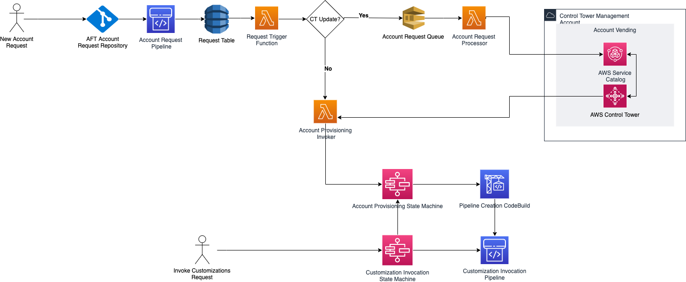

# AFT Architecture

## Order of operations

You run AFT operations in the AFT management account. For a full account
provisioning workflow, the order of stages from left to right in the diagram are as
follows:

1. Account requests are created and submitted to the pipeline. You can
   create and submit more than one account request at a time. Account Factory
   processes requests in a first-in-first-out order. For more information, see
   [Submit multiple account requests](aft-multiple-account-requests.md "aft-multiple-account-requests.md").
2. Each account is provisioned. This stage runs in the AWS Control Tower
   management account.
3. Global customizations run in the pipelines that are created for each
   vended account.
4. If customizations are specified in the initial account provisioning
   requests, the customizations run only on targeted accounts. If you have an
   account that's already provisioned, you must initiate further customizations
   manually in the account's pipeline.

**AWS Control Tower Account Factory for Terraform – account
provisioning workflow**

**Figure 1: AWS Control Tower Account Factory for
Terraform**
