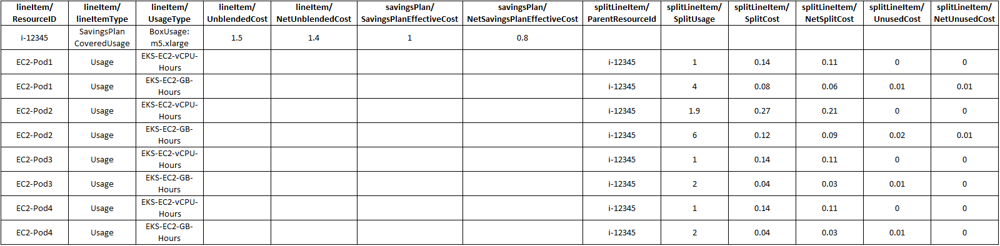
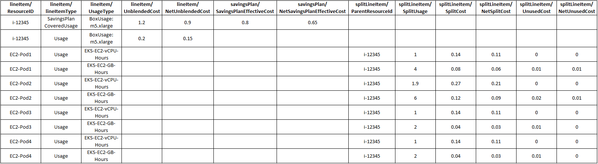

# Example of split cost

allocation data

The purpose of the following example is to show you how split cost allocation data
is calculated by computing the cost of individual Amazon ECS services, tasks in Amazon ECS
clusters, and Kubernetes namespace and pods in Amazon EKS clusters. The rates used
throughout the example are for illustrative purposes only.

###### Note

The example demonstrates Kubernetes namespace and pods running in Amazon EKS clusters. We can then
apply the same cost model to Amazon ECS service and tasks running in a Amazon ECS
cluster.

You have the following usage in a single hour:

- Single instance (m5.xlarge) shared cluster with two namespaces and four
  pods, running for the duration of a full hour.
- Instance configuration is 4 vCPU and 16 GB of memory.
- Amortized cost of the instance is $1/hr.
  Split cost allocation data uses relative unit weights for CPU and memory based on
  a 9:1 ratio. This is derived from per vCPU per hour and per GB per hour prices in
  [AWS Fargate](https://aws.amazon.com/fargate/pricing/ "https://aws.amazon.com/fargate/pricing/").

## Step 1: Compute the unit cost for CPU and

memory

`Unit-cost-per-resource = Hourly-instance-cost/((Memory-weight *
 Memory-available) + (CPU-weight * CPU-available))`

= $1/( (1 \* 16GB) + (9 \* 4vCPU)) = $0.02

`Cost-per-vCPU-hour = CPU-weight * Unit-cost-per-resource`

= 9 \* $0.02 = $0.17

`Cost-per-GB-hour = Memory-weight * Unit-cost-per-resource`

= 1 \* $0.02 = $0.02

| Instance  | Instance type | vCPU-available         | Memory-available  | Amortized-cost-per-hour  | Cost-per-vCPU-hour  | Cost-per-GB-hour |
| --------- | ------------- | ---------------------- | ----------------- | ------------------------ | ------------------- | ---------------- | ------------------------------------------------------------------------------------------------------------------------------------------------------------------------------------------------------------------------------------------------------------------------------------------------------------------------------------------------------------------------------------------------------------------------------------------------------------------------------------------------------------------------------------------------------------------------------------------------------------------------------------------------------------------------------------------------------------------------------------------------------------------------------------------------------------------------------------------------------------------------------------------------------------------------------------------------------------------------------------------------------------------------------------------------------------------------------------------------------------------------------------------------------------------------- | ---------------------------------------------------------------------------------------------------------------------------------------------------------------------------------------------------------------------------------------------------------------------------------------------------------------------------------------------------------------------------------------------------------------------------------------------------------------------------------------------------------------------------------------------------------------------------------------------------------------------------------------------------------------------------------------------------------------------------------------------------------------------------------------------------------------------------------------------------------------------------------------------------------------------------------------------------------------------------------- | ----- | ----- | ----------------------------------------------------------------------------------------------------------------------------------------------------------------------------------------------------------------------------------------------------------------------------------------------------------------------------------------------------------------------------------------------------------------------------------------------------------------------------------------------------------------------------------------------------------------------------------------------------------------------------------------------------------------------------------------------------------------------------------------------------------------------------------------------------------------------------------------------------------------------------------------------------------------------------------------------------------------------------- | ----- | ---------------------------------------------------------------------------------------------------------------------------------------------------------------------------------------------------------------------------------------------------------------------------------------------------------------------------------------------------------------------------------------------------------------------------------------------------------------------------------------------------------------------------------------------------------------------------------------------------------------------------------------------------------------------------------------------------------------------------------------------------------------------------------------------------------------------------------------------------------------------------------- |
| Instance1 | m5.xlarge     | 4                      | 16                | $1                       | $0.17               | $0.02            | ## Step 2: Compute the allocated capacity and instance unused capacity  • Allocated capacity: The memory and vCPU allocated to the Kubernetes pod from the parent EC2 instance, defined as the maximum of used and reserved capacity. ###### Note If memory or vCPU usage data is unavailable, reservation data will be used instead. For more information, see [Amazon ECS usage reports](../../../AmazonECS/latest/developerguide/usage-reports.md "../../../AmazonECS/latest/developerguide/usage-reports.md"), or [Amazon EKS cost monitoring](../../../eks/latest/userguide/cost-monitoring.md "../../../eks/latest/userguide/cost-monitoring.md").  • Instance unused capacity: The unused capacity of vCPU and memory. `Pod1-Allocated-vCPU = Max (1 vCPU, 0.1 vCPU)` = 1 vCPU `Pod1-Allocated-memory = Max (4 GB, 3 GB)` = 4 GB `Instance-Unused-vCPU = Max (CPU-available - SUM(Allocated-vCPU), 0)` = Max (4 – 4.9, 0) = 0 `Instance-Unused-memory = Max (Memory-available - SUM(Allocated-memory), 0)` = Max (16 – 14, 0) = 2 GB In this example, the instance has CPU over subscription, attributed to Pod2 that used more vCPU than what was reserved. |
| Pod name  | Namespace     | Reserved-vCPU          | Used-vCPU         | Allocated-vCPU           | Reserved-memory     | Used-memory      | Allocated-memory                                                                                                                                                                                                                                                                                                                                                                                                                                                                                                                                                                                                                                                                                                                                                                                                                                                                                                                                                                                                                                                                                                                                                          |
| ---       | ---           | ---                    | ---               | ---                      | ---                 | ---              | ---                                                                                                                                                                                                                                                                                                                                                                                                                                                                                                                                                                                                                                                                                                                                                                                                                                                                                                                                                                                                                                                                                                                                                                       |
| Pod1      | Namespace1    | 1                      | 0.1               | 1                        | 4                   | 3                | 4                                                                                                                                                                                                                                                                                                                                                                                                                                                                                                                                                                                                                                                                                                                                                                                                                                                                                                                                                                                                                                                                                                                                                                         |
| Pod2      | Namespace2    | 1                      | 1.9               | 1.9                      | 4                   | 6                | 6                                                                                                                                                                                                                                                                                                                                                                                                                                                                                                                                                                                                                                                                                                                                                                                                                                                                                                                                                                                                                                                                                                                                                                         |
| Pod3      | Namespace1    | 1                      | 0.5               | 1                        | 2                   | 2                | 2                                                                                                                                                                                                                                                                                                                                                                                                                                                                                                                                                                                                                                                                                                                                                                                                                                                                                                                                                                                                                                                                                                                                                                         |
| Pod4      | Namespace2    | 1                      | 0.5               | 1                        | 2                   | 2                | 2                                                                                                                                                                                                                                                                                                                                                                                                                                                                                                                                                                                                                                                                                                                                                                                                                                                                                                                                                                                                                                                                                                                                                                         |
| Unused    | Unused        |                        |                   | 0                        |                     |                  | 2                                                                                                                                                                                                                                                                                                                                                                                                                                                                                                                                                                                                                                                                                                                                                                                                                                                                                                                                                                                                                                                                                                                                                                         |
|           |               |                        |                   | 4.9                      |                     |                  | 16                                                                                                                                                                                                                                                                                                                                                                                                                                                                                                                                                                                                                                                                                                                                                                                                                                                                                                                                                                                                                                                                                                                                                                        | ## Step 3: Compute the split usage ratios  • Split usage ratio: The percentage of CPU or memory used by the Kubernetes pod compared to the overall CPU or memory available on the EC2 instance.  • Unused ratio: The percentage of CPU or memory used by the Kubernetes pod compared to the overall CPU or memory used on the EC2 instance (that is, not factoring in the unused CPU or memory on the instance). `Pod1-vCPU-split-usage-ratio = Allocated-vCPU / Total-vCPU` = 1 vCPU / 4.9vCPU = 0.204 `Pod1-Memory-split-usage-ratio = Allocated-GB / Total-GB` = 4 GB/ 16GB = 0.250 `Pod1-vCPU-unused-ratio = Pod1-vCPU-split-usage-ratio / (Total-CPU-split-usage-ratio – Instance-unused-CPU)` (set to 0 if Instance-unused-CPU is 0) = 0 (since Instance-unused-CPU is 0) `Pod1-Memory-unused-ratio = Pod1-Memory-split-usage-ratio / (Total-Memory-split-usage-ratio – Instance-unused-memory)` (set to 0 if Instance-unused-memory is 0) = 0.250 / (1-0.125) = 0.286 |
| Pod name  | Namespace     | vCPU-split-usage-ratio | vCPU-unused-ratio | Memory-split-usage-ratio | Memory-unused-ratio |                  | ---                                                                                                                                                                                                                                                                                                                                                                                                                                                                                                                                                                                                                                                                                                                                                                                                                                                                                                                                                                                                                                                                                                                                                                       | ---                                                                                                                                                                                                                                                                                                                                                                                                                                                                                                                                                                                                                                                                                                                                                                                                                                                                                                                                                                                | ---   | ---   | ---                                                                                                                                                                                                                                                                                                                                                                                                                                                                                                                                                                                                                                                                                                                                                                                                                                                                                                                                                                           | ---   |
| Pod1      | Namespace1    | 0.204                  | 0                 | 0.250                    | 0.286               |                  | Pod2                                                                                                                                                                                                                                                                                                                                                                                                                                                                                                                                                                                                                                                                                                                                                                                                                                                                                                                                                                                                                                                                                                                                                                      | Namespace2                                                                                                                                                                                                                                                                                                                                                                                                                                                                                                                                                                                                                                                                                                                                                                                                                                                                                                                                                                         | 0.388 | 0     | 0.375                                                                                                                                                                                                                                                                                                                                                                                                                                                                                                                                                                                                                                                                                                                                                                                                                                                                                                                                                                         | 0.429 |
| Pod3      | Namespace1    | 0.204                  | 0                 | 0.125                    | 0.143               |                  | Pod4                                                                                                                                                                                                                                                                                                                                                                                                                                                                                                                                                                                                                                                                                                                                                                                                                                                                                                                                                                                                                                                                                                                                                                      | Namespace2                                                                                                                                                                                                                                                                                                                                                                                                                                                                                                                                                                                                                                                                                                                                                                                                                                                                                                                                                                         | 0.204 | 0     | 0.125                                                                                                                                                                                                                                                                                                                                                                                                                                                                                                                                                                                                                                                                                                                                                                                                                                                                                                                                                                         | 0.143 |
| Unused    | Unused        | 0                      |                   | 0.125                    |                     |                  |                                                                                                                                                                                                                                                                                                                                                                                                                                                                                                                                                                                                                                                                                                                                                                                                                                                                                                                                                                                                                                                                                                                                                                           |                                                                                                                                                                                                                                                                                                                                                                                                                                                                                                                                                                                                                                                                                                                                                                                                                                                                                                                                                                                    | 1     |       | 1                                                                                                                                                                                                                                                                                                                                                                                                                                                                                                                                                                                                                                                                                                                                                                                                                                                                                                                                                                             |       | ## Step 4: Compute the split cost and unused costs  • Split cost: The pay per use cost allocation of the EC2 instance cost based on allocated CPU and memory usage by the Kubernetes pod.  • Unused instance cost: The cost of unused CPU or memory resources on the instance. `Pod1-Split-cost = (Pod1-vCPU-split-usage-ratio * vCPU-available * Cost-per-vCPU-hour) + (Pod1-Memory-split-usage-ratio * Memory-available * Cost-per-GB-hour)` = (0.204 \* 4 vCPU \* $0.17) + (0.25 \* 16GB \* $0.02) = $0.22 `Pod1-Unused-cost = (Pod1-vCPU-unused-ratio * Instance-vCPU-unused-ratio * vCPU-available * Cost-per-VCPU-hour) + (Pod1-Memory-unused-ratio * Instance-Memory-unused ratio * Memory-available  • Cost-per-GB-hour)` = (0 \* 0 \* 4 \* $0.17) + (0.286 \* 0.125 \* 16 \* $0.02) = $0.01 `Pod1-Total-split-cost = Pod1-Split-cost + Pod1-Unused-cost` = $0.23 |
| Pod name  | Namespace     | Split-cost             | Unused-cost       | Total-split-cost         |                     | ---              | ---                                                                                                                                                                                                                                                                                                                                                                                                                                                                                                                                                                                                                                                                                                                                                                                                                                                                                                                                                                                                                                                                                                                                                                       | ---                                                                                                                                                                                                                                                                                                                                                                                                                                                                                                                                                                                                                                                                                                                                                                                                                                                                                                                                                                                | ---   | ---   |
| Pod1      | Namespace1    | $0.22                  | $0.01             | $0.23                    |                     | Pod2             | Namespace2                                                                                                                                                                                                                                                                                                                                                                                                                                                                                                                                                                                                                                                                                                                                                                                                                                                                                                                                                                                                                                                                                                                                                                | $0.38                                                                                                                                                                                                                                                                                                                                                                                                                                                                                                                                                                                                                                                                                                                                                                                                                                                                                                                                                                              | $0.02 | $0.40 |
| Pod3      | Namespace1    | $0.18                  | $0.01             | $0.19                    |                     | Pod4             | Namespace2                                                                                                                                                                                                                                                                                                                                                                                                                                                                                                                                                                                                                                                                                                                                                                                                                                                                                                                                                                                                                                                                                                                                                                | $0.18                                                                                                                                                                                                                                                                                                                                                                                                                                                                                                                                                                                                                                                                                                                                                                                                                                                                                                                                                                              | $0.01 | $0.19 |
| Unused    | Unused        | $0.04                  |                   |                          |                     |                  |                                                                                                                                                                                                                                                                                                                                                                                                                                                                                                                                                                                                                                                                                                                                                                                                                                                                                                                                                                                                                                                                                                                                                                           | $1                                                                                                                                                                                                                                                                                                                                                                                                                                                                                                                                                                                                                                                                                                                                                                                                                                                                                                                                                                                 | $0.04 | $1    | The cost of the service is the sum of the cost of pods associated with each namespace. Total cost of Namespace1 = $0.23 + $0.19 = $0.42 Total cost of Namespace2 = $0.40 + $0.19 = $0.59 ## Sample AWS CUR If you have a Savings Plans covering the entire usage for the EC2 instance in the billing period, amortized costs are computed using savingsPlan/SavingsPlanEffectiveCost.  If you have a Savings Plans covering partial usage for the EC2 instance in the billing period and the rest of the EC2 instance usage is billed at On-Demand rates, EC2 instance amortized costs are computed using savingsPlan/SavingsPlanEffectiveCost (for SavingsPlanCoveredUsage) + lineItem/UnblendedCost (for On-Demand usage).  |
