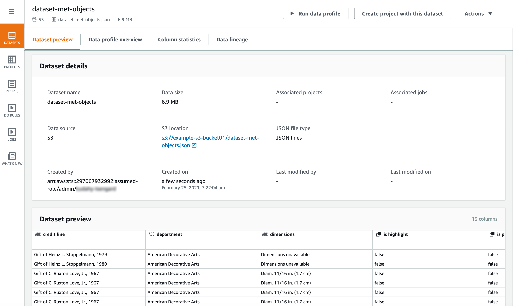
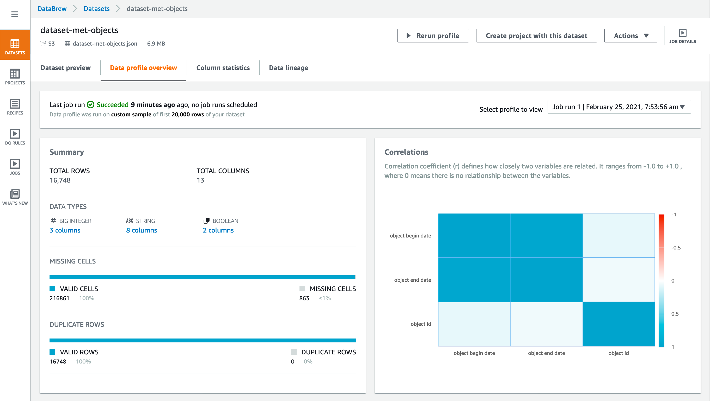
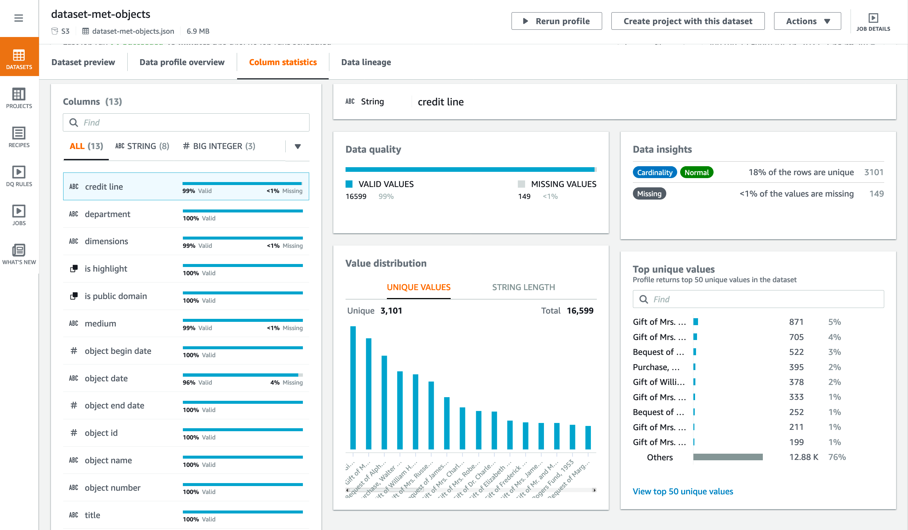
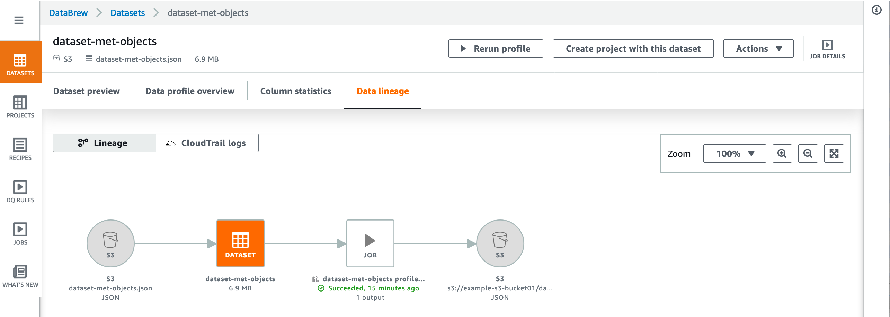

# Using datasets in AWS Glue DataBrew

To view a list of your datasets in the DataBrew console, choose **DATASET** at left. In the datasets page, you can view detailed information
for each dataset by clicking its name or choosing **Actions**,
**Edit** from its context menu.

To create a new dataset, you choose **DATASET**,
**Connect new dataset**. Different data sources have different
connection parameters, and you enter these so that DataBrew can connect. When you save your
connection and choose **Create dataset**, DataBrew connects to your data
and begins loading data. For more information, see [Connecting to your data](datasets.md "datasets.md").

The dataset page has the following elements to help you explore your data.

**Dataset preview** – On this tab, you can find connection
information for the dataset and an overview of the overall structure of the dataset, as
shown following.

**Data profile overview** – On this tab, you can find a
graphical data profile of statistics and volumetrics for your dataset, as shown
following.

###### Note

To create a data profile, run a DataBrew profile job on your dataset. For information
about how to do this, see [Step 5: Create a data profile](getting-started.md "getting-started.md").

**Column statistics** – On this tab, you can find detailed
statistics about each column in your dataset, as shown following.

**Data lineage** – This tab shows a graphical
representation of how your dataset was created and how it's used in DataBrew, as shown
following.

###### Topics

- [Deleting a dataset](datasets.md "datasets.md")
