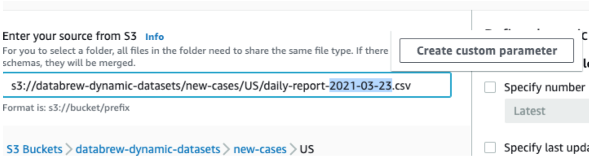
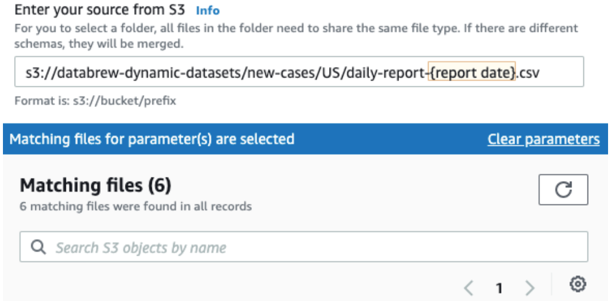
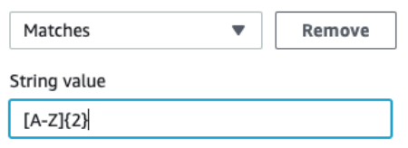
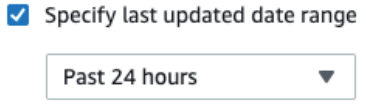
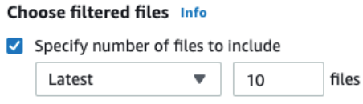

# Connecting data in multiple files in Amazon S3

With the DataBrew console, you can navigate Amazon S3 buckets and folders and choose a file
for your dataset. However, a dataset doesn't need to be limited to one file.

Suppose that you have an S3 bucket named `my-databrew-bucket` that contains
a folder named `databrew-input`. In that folder, suppose that you have a
number of JSON files, all with the same file format and `.json` file
extension. On the console, you can specify a source URL of
`s3://my-databrew-bucket/databrew-input/`. On the DataBrew console, you can
then choose this folder. Your dataset consists of all the JSON files in that
folder.

DataBrew can process all of the files in an S3 folder, but only if the following
conditions are true:

- All of the files in the folder have the same format.
- All of the files in the folder have the same file extension.
  For more information on supported file formats and extensions, see
  [DataBrew input formats](supported-data-file-sources.md#datasets.databrew-input-formats "supported-data-file-sources.md#datasets.databrew-input-formats").

## Schemas when using multiple files as a dataset

When using multiple files as a DataBrew dataset, the schemas have to be the same across all the files. Otherwise, the Project Workspace automatically tries to choose one of the schemas from the multiple files and tries to conform the rest of the dataset files to that schema. This behavior results in the view that is shown during Project Workspace to be irregular, and as a result, the job output will also be irregular.

If your files must have different schemas, you need to create multiple datasets and profile them separately.

## Using parameterized paths

for Amazon S3

In some cases, you might want to create a dataset with files that follow a certain
naming convention, or a dataset that can span multiple Amazon S3 folders. Or you might
want to reuse the same dataset for identically structured data that is periodically
generated in an S3 location with a path that depends on certain parameters. An
example is a path named for the date of data production.

DataBrew supports this approach with parameterized S3 paths. A
_parameterized path_ is an Amazon S3 URL containing regular
expressions or custom path parameters, or both.

### Defining a dataset with an S3 path using

regular expressions

Regular expressions in the path can be useful to match several files from one
or more folders and at the same time filter out unrelated files in those
folders.

Here is a couple of examples:

- Define a dataset including all JSON files from a folder whose name
  begins with `invoice`.
- Define a dataset including all files in folders with `2020`
  in their names.

You can implement this type of approach by using regular expressions in a
dataset S3 path. These regular expressions can replace any substring in the
key of the S3 URL (but not the bucket name).

As an example of a key in an S3 URL, see the following. Here,
`my-bucket` is the bucket name, US East (Ohio) is the AWS
Region, and `puppy.png` is the key name.

`https://my-bucket.s3.us-west-2.amazonaws.com/puppy.png`

In a parameterized S3 path, any characters between two angle brackets
(`<` and `>`) are treated as regular expressions. Two
examples are the following:

- `s3://my-databrew-bucket/databrew-input/invoice<.*>/data.json`
  matches all files named `data.json`, within all of the
  subfolders of `databrew-input` whose names begin with
  `invoice`.
- `s3://my-databrew-bucket/databrew-input/<.*>2020<.*>/`
  matches all files in folders with `2020` in their
  names.

In these examples, `.*` matches zero or more characters.

###### Note

You can only use regular expressions in the key part of the S3 path—the part that goes
after the bucket name. Thus,
`s3://my-databrew-bucket/<.*>-input/` is valid, but
`s3://my-<.*>-bucket/<.*>-input/`
isn't.

We recommend that you test your regular expressions to ensure that they match
only the S3 URLs that you want, and not ones that you don't want.

Here are some other examples of regular expressions:

- `<\d{2}>` matches a string that consists of exactly two consecutive digits,
  for example `07` or `03`, but not
  `1a2`.
- `<[a-z]+.*>` matches a string that begins with one or more lowercase Latin
  letters and has zero or more other characters after it. An example is
  `a3`, `abc/def`, or `a-z`, but not
  `A2`.
- `<[^/]+>` matches a string that contains any characters except for a slash
  (**/**). In an S3 URL, slashes are used
  for separating folders in the path.
- `<.*=.*>` matches a string that contains an equals sign (=), for example
  `month=02`, `abc/day=2`, or `=10`,
  but not `test`.
- `<\d.*\d>` matches a string that begins and ends with a digit and can have
  any other characters in between the digits, for example
  `1abc2`, `01-02-03`, or
  `2020/Jul/21`, but not `123a`.

### Defining a dataset

with an S3 path using custom parameters

Defining a parameterized dataset using custom parameters offers advantages over
using regular expressions when you might want to provide parameters for an S3
location:

- You can achieve the same results as with a regular expression, without needing to know the
  syntax for regular expressions. You can define parameters using familiar terms
  like "starts with" and "contains."
- When you define a dynamic dataset using parameters in the path, you can include a time range
  in your definition, such as "past month" or "past 24 hours." That
  way, your dataset definition will be used later with new incoming
  data.

Here are some examples of when you might want to use dynamic datasets:

- To connect multiple files that are partitioned by _last updated_
  date or other meaningful attributes into a single dataset. You can then capture these partition
  attributes as additional columns in a dataset.
- To restrict files in a dataset to S3 locations that satisfy certain conditions. For example,
  suppose that your S3 path contains date-based folders like
  `folder/2021/04/01/`. In this case, you can parameterize
  the date and restrict it to a certain range like "between Mar 01
  2021 and Apr 01 2021" or "Past week."

To define a path using parameters, define the parameters and add them to your
path using the following format:

`s3://my-databrew-bucket/some-folder/{parameter1}/file-{parameter2}.json`

###### Note

As with regular expressions in an S3 path, you can only use parameters in
the key part of the path—the part that goes after the bucket
name.

Two fields are required in a parameter definition, name and type. The type can
be **String**, **Number**, or **Date**. Parameters of
type **Date** must have a definition of the date
format so that DataBrew can correctly interpret and compare date values.
Optionally, you can define matching conditions for a parameter. You can also
choose to add matching values of a parameter as a column to your dataset when
it's being loaded by a DataBrew job or interactive session.

#### Example

Let's consider an example of defining a dynamic dataset using parameters
in the DataBrew console. In this example, assume that the input data is
regularly written into an S3 bucket using locations like these:

- `s3://databrew-dynamic-datasets/new-cases/UR/daily-report-2021-03-30.csv`
- `s3://databrew-dynamic-datasets/new-cases/UR/daily-report-2021-03-31.csv`
- `s3://databrew-dynamic-datasets/new-cases/US/daily-report-2021-03-30.csv`
- `s3://databrew-dynamic-datasets/new-cases/US/daily-report-2021-03-31.csv`

There are two dynamic parts here: a country code, like US, and a date in the
file name like 2021-03-30. Here, you can apply the same cleanup recipe for
all files. Let's say that you want to perform your cleanup job daily.
Following is how you can define a parameterized path for this scenario:

1. Navigate to a specific file.
2. Then select a varying part, like a date,
   and replace it with a parameter. In this case, replace a date.

 3. Open the context (right-click) menu for
**Create custom parameter** and set properties
for it:

    * Name: report date
    * Type: Date
    * Date format: yyyy-MM-dd (selected from the predefined formats)
    * Conditions (Time range): Past 24 hours
    * Add as column: true (checked)

Keep other fields at their default values. 4. Choose **Create**.

After you do, you see the updated path, as in the following screenshot.

Now you can do the same for the country code and parameterize it as follows:

- Name: country code
- Type: String
- Add as column: true (checked)

You don't have to specify conditions if all values are relevant. In the
`new-cases` folder, for example, we only have subfolders with
country codes, so there's no need for conditions. If you had other
folders to exclude, you might use the following condition.

This approach limits the subfolders of new cases to contain two capital Latin
characters.

After this parameterization, you have only matching files in our dataset and
can choose **Create Dataset**.

###### Note

When you use relative time ranges in conditions, the time ranges are evaluated when the
dataset is loaded. This is true whether they are predefined time ranges
like "Past 24 hours” or custom time ranges like "5 days
ago". This evaluation approach applies whether the dataset is
loaded during an interactive session initialization or during a job
start.

After you choose **Create Dataset**, your dynamic
dataset is ready to use. As an example, you might use it first to create a
project and define a cleanup recipe using an interactive DataBrew session. Then
you might create a job that is scheduled to run daily. This job might apply
the cleanup recipe to the dataset files that meet the conditions of your
parameters at the time when the job starts.

### Supported conditions for dynamic datasets

You can use conditions for filtering matching S3 files using parameters or the
last modified date attribute.

Following, you can find lists of supported conditions for each parameter
type.

| Conditions used with String parameters | Name in DataBrew SDK | SDK synonyms        | Name in DataBrew console                                                                              | Description |
| -------------------------------------- | -------------------- | ------------------- | ----------------------------------------------------------------------------------------------------- | ----------- |
| is                                     | eq, ==               | Is exactly          | The value of the parameter is the same as the value that was provided in the condition.            |
| is not                                 | not eq, !=           | Is not              | The value of the parameter isn't the same as the value that was provided in the condition.         |
| contains                               |                      | Contains            | The string value of the parameter contains the value that was provided in the condition.           |
| not contains                           |                      | Does not contain    | The string value of the parameter doesn't contain the value that was provided in the condition.    |
| starts_with                            |                      | Starts with         | The string value of the parameter starts with the value that was provided in the condition.        |
| not starts_with                        |                      | Does not start with | The string value of the parameter doesn't start with the value that was provided in the condition. |
| ends_with                              |                      | Ends with           | The string value of the parameter ends with the value that was provided in the condition.          |
| not ends_with                          |                      | Does not end with   | The string value of the parameter doesn't end with the value that was provided in the condition.   |
| matches                                |                      | Matches             | The value of the parameter matches the regular expression provided in the condition.               |
| not matches                            |                      | Does not match      | The value of the parameter doesn't match the regular expression provided in the condition.         |

###### Note

All conditions for String parameters use case-sensitive comparison. If you aren't sure
about the case used in an S3 path, you can use the "matches"
condition with a regular expression value that starts with
`(?i)`. Doing this results in a case-insensitive comparison.

For example, suppose that you want your string parameter to start with
`abc`, but `Abc` or `ABC` are also
possible. In this case, you can use the "matches" condition with
`(?i)^abc` as the condition value.

| Conditions used with Number parameters | Name in DataBrew SDK | SDK synonyms             | Name in DataBrew console                                                                                        | Description |
| -------------------------------------- | -------------------- | ------------------------ | --------------------------------------------------------------------------------------------------------------- | ----------- |
| is                                     | eq, ==               | Is exactly               | The value of the parameter is the same as the value that was provided in the condition.                      |
| is not                                 | not eq, !=           | Is not                   | The value of the parameter isn't the same as the value that was provided in the condition.                   |
| less_than                              | lt, <                | Less than                | The numeric value of the parameter is less than the value that was provided in the condition.                |
| less_than_equal                        | lte, <=              | Less than or equal to    | The numeric value of the parameter is less than or equal to the value that was provided in the condition.    |
| greater_than                           | gt, >                | Greater than             | The numeric value of the parameter is greater than the value that was provided in the condition.             |
| greater_than_equal                     | gte, >=              | Greater than or equal to | The numeric value of the parameter is greater than or equal to the value that was provided in the condition. |

| Conditions used with Date parameters | Name in DataBrew SDK | Name in DataBrew console                                                           | Condition value format (SDK)                                                                                                                                                                                                                                                                                    | Description |
| ------------------------------------ | -------------------- | ---------------------------------------------------------------------------------- | --------------------------------------------------------------------------------------------------------------------------------------------------------------------------------------------------------------------------------------------------------------------------------------------------------------- | ----------- |
| after                                | Start                | ISO 8601 date format like `2021-03-30T01:00:00Z` or `2021-03-30T01:00-07:00` | The value of the date parameter is after the date provided in the condition.                                                                                                                                                                                                                                 |
| before                               | End                  | ISO 8601 date format like `2021-03-30T01:00:00Z` or `2021-03-30T01:00-07:00` | The value of the date parameter is before the date provided in the condition.                                                                                                                                                                                                                                |
| relative_after                       | Start (relative)     | Positive or negative number of time units, like `-48h` or `+7d`.                | The value of the date parameter is after the relative date provided in the condition. Relative dates are evaluated when the dataset is loaded, either when an interactive session is initialized or when an associated job is started. This is the moment that is called "now" in the examples.  |
| relative_before                      | End (relative)       | Positive or negative number of time units, like `-48h` or `+7d`.                | The value of the date parameter is before the relative date provided in the condition. Relative dates are evaluated when the dataset is loaded, either when an interactive session is initialized or when an associated job is started. This is the moment that is called "now" in the examples. |

If you use the SDK, provide relative dates in the following format:
`±{number_of_time_units}{time_unit}`. You can use these time
units:

- -1h (1 hour ago)
- +2d (2 days from now)
- -120m (120 minutes ago)
- 5000s (5,000 seconds from now)
- -3w (3 weeks ago)
- +4M (4 months from now)
- -1y (1 year ago)

Relative dates are evaluated when the dataset is loaded, either when an
interactive session is initialized or when an associated job is started. This is
the moment that is called "now" in the examples preceding.

### Configuring settings for

dynamic datasets

Besides providing a parameterized S3 path, you can configure other settings
for datasets with multiple files. These settings are filtering S3 files by their
last modified date and limiting the number of files.

Similar to setting a date parameter in a path, you can define a time range
when matching files were updated and include only those files into your dataset.
You can define these ranges using either absolute dates like "March 30,
2021" or relative ranges like "Past 24 hours".

To limit the number of matching files, select a number of files that is
greater than 0 and whether you want the latest or the oldest matching
files.

