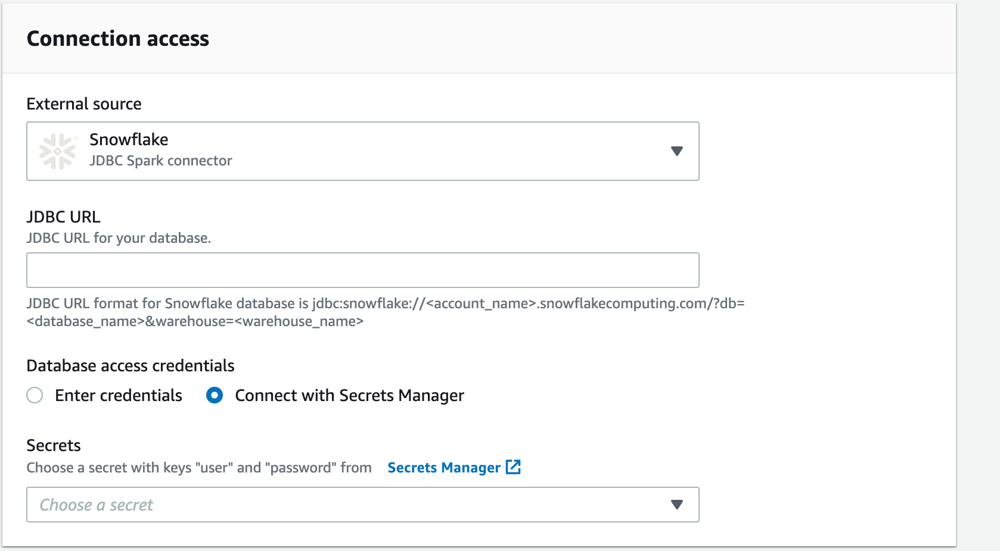

# Using drivers with AWS Glue DataBrew

A _database driver_ is a file or URL that
implements a database connection protocol, for example Java Database Connectivity
(JDBC). The driver functions as an adaptor or a translator between a specific
database management system (DBMS) and another system.

In this case, it allows AWS Glue DataBrew to connect to your data. Then you can access a
database object, like a table or view, from a supported data source. The data source
that you're using might be called a database, a data warehouse, or something
else. However, for the purpose of this documentation we refer to all data providers
as data sources or connections.

To use a JDBC driver or jar file, download the file or files you need and put them
in an S3 bucket. The IAM role that you use to access the data needs to have read
permissions for both the driver files.

###### Note

With AWS Glue 4.0, connecting to Snowflake as a data source is supported natively. You don't need to
provide custom `jar` files. In AWS Glue DataBrew, choose Snowflake as the External source connection and
provide the URL of your Snowflake instance. The URL will use a hostname in the form
`https://account_identifier.snowflakecomputing.com`.

Provide the data access credentials,
Snowflake database name, and Snowflake schema name. Additionally, if your Snowflake user does not have a
default warehouse set, you will need to provide a warehouse name.

Snowflake connections use an AWS Secrets Manager secret to provide credential information.
Your project and job roles in must have permission to read this secret.

###### To use drivers with DataBrew

1. Find out which version of your data source you're on, using the
   method provided by the product.
2. Find the latest version of connectors and driver required. You can locate this
   information on the data providers website.
3. Download the required version of the JDBC files. These are normally stored
   as Java ARchives (.JAR) files.
4. Either upload the drivers from the console to your S3 bucket or provide
   the S3 path to your .JAR files.
5. Enter the basic connection details, for example class, instance, and so on.
6. Enter any additional configuration information that your data source
   needs, for example virtual private cloud (VPC) information.
