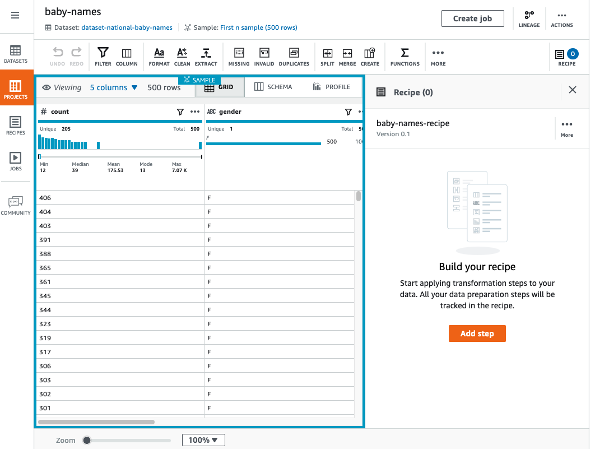
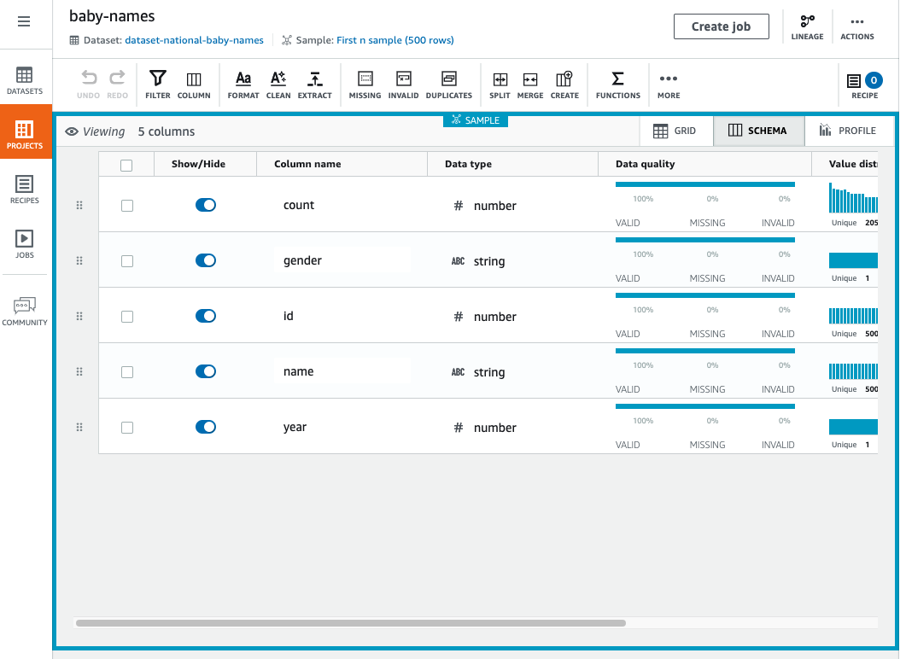
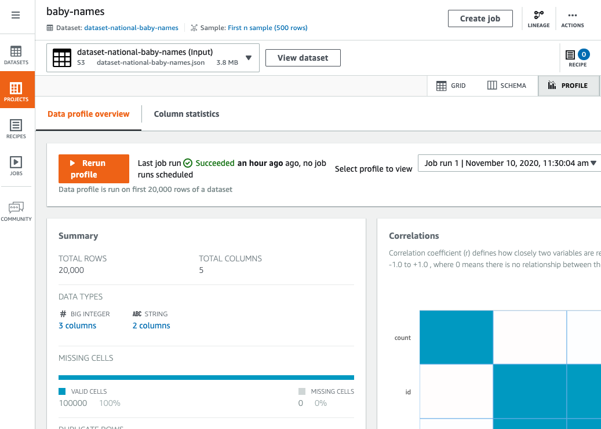
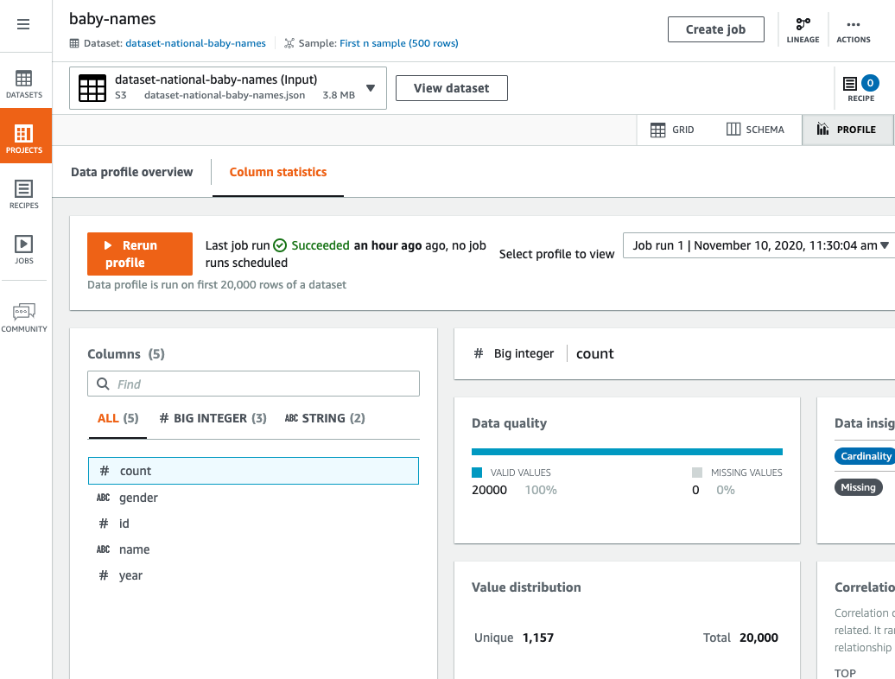

# Overview of a DataBrew project session

In a DataBrew project session, you work within an interactive workspace.

The left pane shows the current view of your data. The right pane shows the project's
transformation recipe, which is currently empty.

In the upper-right corner of the data grid, there are three tabs: `GRID`,
`SCHEMA`, and `PROFILE`. Choosing one of these tabs displays a
corresponding view in the workspace; thees views are described next.

## Grid view

Grid view is the default view, where the sample is shown in tabular format. Use
the following procedure for a short walkthrough of grid view.

###### To take a walkthrough of grid view

1. Start by viewing the entire space:
   1. Scroll left and right to see all of the columns.
   2. Scroll up and down to see all of the data values.
   3. Use the zoom control at the bottom of the workspace to adjust the
      magnification level of the grid.

2. At upper-right, view how many of the sample's columns are shown and
   the current number of rows in the sample.

To change which columns are shown, choose the **N columns** link
(where **N** is the number of columns currently displayed). Choose
the columns that you want, and choose **Show selected columns**. 3. Now you can start experimenting with DataBrew transformations. Try the
following:

    1. From the transformation toolbar, choose **Choose
     Format**, **Change to uppercase**.
    2. For **Source column**, choose a column that
     contains character data.
    3. Leave the other settings at their defaults.
    4. To see what the transformed data will look like, choose
     **Preview changes**. Then, to add this
     transformation to your recipe, choose
     **Apply**.Whenever you apply a data transformation, DataBrew adds it to the working

copy of your recipe. This appears at the right side of your workspace. 4. Try the following:

    1. From the transformation toolbar, choose **Create**,
     **Based on a function**.
    2. For **Select a function**, choose
     `SQUARE ROOT`.
    3. For **Source column**, choose a column that
     contains numeric data.
    4. Leave the other settings at their defaults,.
    5. Choose **Preview changes** to see what the transformed
     data looks like. Then, to add this transformation to your recipe,
     choose **Apply**.

5. Collapse the recipe pane at upper right by choosing **RECIPE**.
   To expand the recipe pane, choose **RECIPE** again.

### Publishing a new

version of your recipe

As you continue applying transformations, the number of steps in the recipe
increases. At any time, you can publish a new version of your recipe. _Publishing_ a recipe makes it available elsewhere in
DataBrew. By doing this, you can run a recipe job to transform your entire dataset,
as opposed to transforming only the project data sample.

Publishing recipes also encourages an incremental, iterative approach to
recipe development: You can publish new versions of your recipe as you go, so
you can fall back to a "last known good" recipe version if needed.

###### To publish a new version of a recipe

- In the recipe pane, choose
  **Publish**. Enter a description for this version of the
  recipe, and choose **Publish**.

## Schema view

If you choose the **SCHEMA** tab, the view changes, as shown in
the screenshot following.

In schema view, you can see statistics about the data values in each
column.

In the far left column, next to **Show/Hide**, choose any of the
data columns. The **Column details** pane appears at right. This
pane shows a summary of statistics for the column values.

You can rename a column by entering a new name for **Column
name**.

You can rearrange the column order by dragging and dropping the columns.

## Profile view

If you choose the **PROFILE** tab, you can see detailed
volumetric information about your project.
Before doing so, you run a DataBrew job to create the profile.

###### To take a walkthrough of profile view

1. Choose **Create job**, and enter a name for your job.
2. For **Job output**, choose **CSV** for
   the file type.
3. Find or create an Amazon S3 bucket and folder in your AWS account where you
   want the job output from DataBrew to be written:
   - If you already have this Amazon S3 bucket and
     folder, choose **Browse** and locate them. Make
     sure that you have write permissions for both.
   - If you don't have this Amazon S3 bucket and folder, create them:
     1. Open the Amazon S3 console at
        [https://console.aws.amazon.com/s3/](https://console.aws.amazon.com/s3/ "https://console.aws.amazon.com/s3/").
     2. If you don't have an Amazon S3 bucket, choose **Create
        bucket**. For **Bucket name**,
        enter a unique name for your new bucket. Choose **Create bucket**.
     3. From the list of buckets, choose the one that you want to use.
     4. Choose **Create folder**. For **Folder
        name**, enter `databrew-output`, and choose
        **Create folder**.

4. For **Access permissions**, choose an IAM
   role that allows DataBrew to write to your Amazon S3 output location.

For an S3 location owned by your AWS account, you can choose the
`AwsGlueDataBrewDataAccessRole` service-managed role. Doing this
allows DataBrew to access S3 resources that you own. 5. Leave the other settings at their defaults, and choose **Create and run job**. 6. After the job runs to completion, the workspace displays a
graphical summary of the data profile.

The **Data profile** overview tab shows a high-level
summary of your data's characteristics, as shown in the screenshot
following.

The **Column statistics** tab shows a
column-by-column breakdown of the data values:

