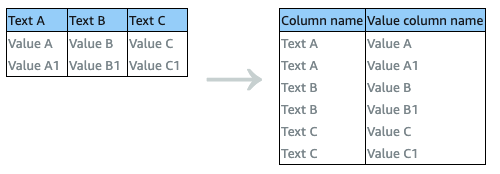

# UNPIVOT

Converts all the column values in a selected row into individual rows with
values.



###### Parameters

- `sourceColumns` — A JSON-encoded string representing a list
  of one or more columns to be unpivoted.
- `unpivotColumn` — The value column for the unpivot
  operation.
- `valueColumn` — The column to hold unpivoted values.

###### Example

```
{
    "Action": {
        "Operation": "UNPIVOT",
        "Parameters": {
            "sourceColumns": "[\"idealpoint_estimate\"]",
            "unpivotColumn": "unpivoted_idealpoint_estimate",
            "valueColumn": "unpivoted_column_values"
        }
    }
}
```
