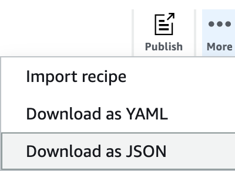

# Creating and using AWS Glue DataBrew recipes

In DataBrew, a _recipe_ is a set of data transformation steps. You can
apply these steps to a sample of your data, or apply that same recipe to a dataset.

The easiest way to develop a recipe is to create a DataBrew project, where you can work
interactively with a sample of your data—for more information, see [Creating and using AWS Glue DataBrew projects](projects.md "projects.md"). As part of the project creation workflow,
a new (empty) recipe is created and attached to the project. You can then start building
your recipe by adding data transformations.

###### Note

You can include up to 100 data transformations in a single DataBrew recipe.

As you proceed with developing your recipe, you can save your work by
_publishing_ the recipe. DataBrew maintains a list of published versions
for your recipe. You can use any published version in a recipe job, to run the recipe (in a
recipe job) to transform your dataset. You can also download a copy of the recipe steps, so
that you can reuse the recipe in other projects or other dataset transformations.

You can also develop DataBrew recipes programmatically, using the AWS Command Line Interface (AWS CLI) or one of
the AWS SDKs. In the DataBrew API, transformations are known as _recipe
actions_.

###### Note

In an interactive DataBrew project session, each data transformation that you apply
results in a call to the DataBrew API. These API calls occur automatically, without you
having to know the behind-the-scenes details.

Even if you're not a programmer, it's helpful to understand the structure of a recipe and
how DataBrew organizes the recipe actions.

###### Topics

- [Publishing a new recipe version](#recipes.publishing "#recipes.publishing")
- [Defining a recipe structure](#recipes.structure "#recipes.structure")

## Publishing a new recipe version

You publish new versions of a recipe in an interactive DataBrew project session.

###### To publish a new recipe version

1. In the recipe pane, choose **Publish**.
2. Enter a description for this version of the recipe, and choose **Publish**.

You can view all your published recipes, and their versions, by choosing
**PROJECTS** from the navigation pane.

## Defining a recipe structure

When you first create a project using the DataBrew console, you define a recipe to be
associated with that project. If you don't have an existing recipe, the console creates
one for you.

As you work with your project in the console, you use the transformation toolbar to apply actions to the sample data from your dataset. The console shows the recipe steps, and the order of those steps, as you continue building the recipe. You can iterate and refine the recipe until you are satisfied with the steps.

In [Getting started with AWS Glue DataBrew](getting-started.md "getting-started.md"), you build a recipe to transform a dataset of famous chess games. You can download a copy of the recipe steps, by choosing **Download as JSON** or **Download as YAML** as shown in the following screenshot.



The downloaded JSON file contains recipe actions corresponding to the transformations that you added to your recipe.

A new recipe doesn't have any steps. You can represent a new recipe as an empty JSON
list, as shown following.

```
[ ]
```

Following is an example of such a file, for `chess-project-recipe`. The JSON list contains several objects that describe the recipe steps. Each object in the JSON list is enclosed in curly braces (`{ }`).
The JSON lines are delimited by commas.

```
[
    {
        "Action": {
            "Operation": "REMOVE_VALUES",
            "Parameters": {
                "sourceColumn": "black_rating"
            }
        },
        "ConditionExpressions": [
            {
                "Condition": "LESS_THAN",
                "Value": "1800",
                "TargetColumn": "black_rating"
            }
        ]
    },
    {
        "Action": {
            "Operation": "REMOVE_VALUES",
            "Parameters": {
                "sourceColumn": "white_rating"
            }
        },
        "ConditionExpressions": [
            {
                "Condition": "LESS_THAN",
                "Value": "1800",
                "TargetColumn": "white_rating"
            }
        ]
    },
    {
        "Action": {
            "Operation": "GROUP_BY",
            "Parameters": {
                "groupByAggFunctionOptions": "[{\"sourceColumnName\":\"winner\",\"targetColumnName\":\"winner_count\",\"targetColumnDataType\":\"int\",\"functionName\":\"COUNT\"}]",
                "sourceColumns": "[\"winner\",\"victory_status\"]",
                "useNewDataFrame": "true"
            }
        }
    },
    {
        "Action": {
            "Operation": "REMOVE_VALUES",
            "Parameters": {
                "sourceColumn": "winner"
            }
        },
        "ConditionExpressions": [
            {
                "Condition": "IS",
                "Value": "[\"draw\"]",
                "TargetColumn": "winner"
            }
        ]
    },
    {
        "Action": {
            "Operation": "REPLACE_TEXT",
            "Parameters": {
                "pattern": "mate",
                "sourceColumn": "victory_status",
                "value": "checkmate"
            }
        }
    },
    {
        "Action": {
            "Operation": "REPLACE_TEXT",
            "Parameters": {
                "pattern": "resign",
                "sourceColumn": "victory_status",
                "value": "other player resigned"
            }
        }
    },
    {
        "Action": {
            "Operation": "REPLACE_TEXT",
            "Parameters": {
                "pattern": "outoftime",
                "sourceColumn": "victory_status",
                "value": "ran out of time"
            }
        }
    }
]
```

It's easier to see each that each action is an individual line if we only add new
lines for new actions, as shown following.

```
[
 { "Action": { "Operation": "REMOVE_VALUES", "Parameters": { "sourceColumn": "black_rating" } }, "ConditionExpressions": [ { "Condition": "LESS_THAN", "Value": "1800", "TargetColumn": "black_rating" } ] },
 { "Action": { "Operation": "REMOVE_VALUES", "Parameters": { "sourceColumn": "white_rating" } }, "ConditionExpressions": [ { "Condition": "LESS_THAN", "Value": "1800", "TargetColumn": "white_rating" } ] },
 { "Action": { "Operation": "GROUP_BY", "Parameters": { "groupByAggFunctionOptions": "[{\"sourceColumnName\":\"winner\",\"targetColumnName\":\"winner_count\",\"targetColumnDataType\":\"int\",\"functionName\":\"COUNT\"}]", "sourceColumns": "[\"winner\",\"victory_status\"]", "useNewDataFrame": "true" } } },
 { "Action": { "Operation": "REMOVE_VALUES", "Parameters": { "sourceColumn": "winner" } }, "ConditionExpressions": [ { "Condition": "IS", "Value": "[\"draw\"]", "TargetColumn": "winner" } ] },
 { "Action": { "Operation": "REPLACE_TEXT", "Parameters": { "pattern": "mate", "sourceColumn": "victory_status", "value": "checkmate" } } },
 { "Action": { "Operation": "REPLACE_TEXT", "Parameters": { "pattern": "resign", "sourceColumn": "victory_status", "value": "other player resigned" } } },
 { "Action": { "Operation": "REPLACE_TEXT", "Parameters": { "pattern": "outoftime", "sourceColumn": "victory_status", "value": "ran out of time" } } }
]
```

The actions are performed sequentially, in the same order as in the file:

- `REMOVE_VALUES` – To filter out all of the games where a
  player's rating is less than 1,800, the minimum rating required to be a Class A
  chess player. There are two occurrences of this action—one to remove
  players on the black side who aren't at least Class A players, and another to
  remove players on the white side who aren't at this level.
- `GROUP_BY` – To summarize the data. In this case, GROUP_BY
  sorts the rows into groups based on the values of `winner`
  (`black` and `white`). Each of those groups is then
  broken down further, sorting the rows into subgroups based on the values of
  `victory_status` (`mate`, `resign`,
  `outoftime`, and `draw`). Finally, the number of
  occurrences for each subgroup is counted. The resulting summary then replaces
  the original data sample.
- `REMOVE_VALUES` – To delete the results of games that ended
  with `draw`.
- `REPLACE_TEXT` – To modify the values for
  `victory_status`. There are three occurrences of this action—one
  each for `mate`, `resign`, and
  `oufoftime`.

In an interactive DataBrew project session, each `RecipeAction` corresponds to
a data transformation that you apply to a data sample.

DataBrew provides over 200 recipe actions. For more information, see [Recipe step and function reference](recipe-actions-reference.md "recipe-actions-reference.md").

### Using conditions

You can use _conditions_ to narrow the scope of a recipe
action. Conditions are used in transformations that filter the data—for example,
removing unwanted rows based on a particular column value.

Let's take a closer look at a recipe actions from
`chess-project-recipe`.

```
  {
    "Action": {
      "Operation": "REMOVE_VALUES",
      "Parameters": {
        "sourceColumn": "black_rating"
      }
    },
    "ConditionExpressions": [
      {
        "Condition": "LESS_THAN",
        "Value": "1800",
        "TargetColumn": "black_rating"
      }
    ]
  }
```

This transformation reads the values in the `black_rating` column. The
`ConditionExpressions` list determines the filtering criteria: Any
row that has a `black_rating` value of less than 1,800 is removed from
the dataset.

A follow-up transformation in the recipe does the same thing, for
`white_rating`. In this way, the data is limited to games where each
player (black or white) is rated at Class A or above.

Here's another example of a condition, applied to a column of character
data.

```
  {
    "Action": {
      "Operation": "REMOVE_VALUES",
      "Parameters": {
        "sourceColumn": "winner"
      }
    },
    "ConditionExpressions": [
      {
        "Condition": "IS",
        "Value": "[\"draw\"]",
        "TargetColumn": "winner"
      }
    ]
  }
```

This transformation reads the values in the `winner` column, looking
for the value `draw` and removing those rows. In this way, the data is
limited to only those games where there was a clear winner.

DataBrew supports the following conditions:

- `IS` – The value in the column is the same as the value
  that was provided in the condition.
- `IS_NOT` – The value in the column isn't the same
  as the value that was provided in the condition.
- `IS_BETWEEN` – The value in the column is between the
  `GREATER_THAN_EQUAL` and `LESS_THAN_EQUAL` parameters.
- `CONTAINS` – The string value in the column contains the
  value that was provided in the condition.
- `NOT_CONTAINS` – The value in the column does not contain the
  character string that was provided in the condition.
- `STARTS_WITH` – The value in the column starts with the
  character string that was provided in the condition.
- `NOT_STARTS_WITH` – The value in the column doesn't
  start with the character string that was provided in the condition.
- `ENDS_WITH` – The value in the column ends with the
  character string that was provided in the condition.
- `NOT_ENDS_WITH` – The value in the column doesn't end
  with the character string that was provided in the condition.
- `LESS_THAN` – The value in the column is less than the
  value that was provided in the condition.
- `LESS_THAN_EQUAL` – The value in the column is less than
  or equal to the value that was provided in the condition.
- `GREATER_THAN` – The value in the column is greater than
  value that was provided in the condition.
- `GREATER_THAN_EQUAL` – The value in the column is
  greater than or equal to the value that was provided in the
  condition.
- `IS_INVALID` – The value in the column has an incorrect
  data type.
- `IS_MISSING` – There is no value in the column.
