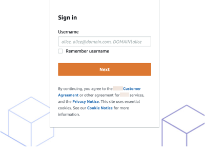
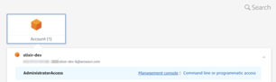

# Setting up AWS IAM Identity Center (IAM Identity Center)

Using AWS IAM Identity Center (IAM Identity Center), your users can sign in to DataBrew with a simple URL, without
signing in to the AWS Management Console and without needing an AWS account.

###### To set up IAM Identity Center

1. Open the [AWS Organizations console](https://console.aws.amazon.com/organizations/v2/home "https://console.aws.amazon.com/organizations/v2/home"), and
   create an organization if you don't already have one. All features are enabled
   by default for this organization.

For more information, see
[AWS IAM Identity Center Prerequisites](../../../singlesignon/latest/userguide/prereqs.md "../../../singlesignon/latest/userguide/prereqs.md") and
[Creating
and managing an organization](../../../organizations/latest/userguide/orgs_manage_org.md "../../../organizations/latest/userguide/orgs_manage_org.md"). 2. Open the [AWS IAM Identity Center console](https://console.aws.amazon.com/singlesignon "https://console.aws.amazon.com/singlesignon") 3. Choose your identity source.

By default, you get an IAM Identity Center store for quick and easy user management.
Optionally, you can connect an external identity provider instead, or connect an
AWS Managed Microsoft AD directory with your on-premises Active Directory. In this guide, we
use the default IAM Identity Center store.

For more information, see
[Choose
your identity source](../../../singlesignon/latest/userguide/step2.md "../../../singlesignon/latest/userguide/step2.md") in the _AWS IAM Identity Center User Guide_. 4. Create a permission set for DataBrew access:

    1. In the IAM Identity Center navigation pane, choose **AWS accounts**, and then choose
     **Permission sets**.
    2. On the **Create permission set** page, choose **Create a custom
     permission set**.
    3. For **Relay state**, enter
     `https://console.aws.amazon.com/databrew/home?region=us-east-1#landing`.

    Entering this enables your users to go directly to DataBrew.
    4. Choose **Attach AWS managed policies**, search for DataBrew, and choose
     **AwsGlueDataBrewFullAccessPolicy**. Choosing this
     gives your users all the permissions that they need for DataBrew. You
     can find more details in [Adding an IAM policy for a console user](setting-up-iam-policy-for-databrew-console-access.md "setting-up-iam-policy-for-databrew-console-access.md").
    5. (Optional) Choose **Create a custom permissions
     policy** and customize the permissions for your
     users.

5. In the IAM Identity Center navigation pane, choose **Groups**,
   and choose **Create group**. Enter the group name
   and choose **Create**.
6. Add a user to IAM Identity Center store:
   1. In the IAM Identity Center navigation pane, choose **Users**.
   2. On the **Add user** screen, enter the required information and choose
      **Send an email to the user with password setup
      instructions**. The user should get an email about the next
      setup steps.
   3. Choose **Next: Groups**, choose the group that you want, and choose
      **Add user**.

   Users should receive an email inviting them to use SSO. In this email,
   they need to choose **Accept invitation** and set the
   password. They can also find the portal URL in the email. They can use
   this URL to access DataBrew.

7. Assign each user to an account:
   1. Open the [IAM Identity Center console](https://console.aws.amazon.com/singlesignon "https://console.aws.amazon.com/singlesignon"), and in
      the navigation pane, choose **AWS accounts**.
   2. Choose **AWS organization** and choose an AWS account.
   3. On the **Assign Users** screen, choose the **Groups** tab
      and choose the group that you want.
   4. Choose **Next: Permission sets**.
   5. Choose the permission set for DataBrew, and choose **Finish**.

## Login steps for an IAM Identity Center-enabled user

1. Sign into AWS using an IAM Identity Center-enabled account.

 2. Click on **AWS Account** identity

 3. Click **Management console** for one-click re-direction to the DataBrew console.
