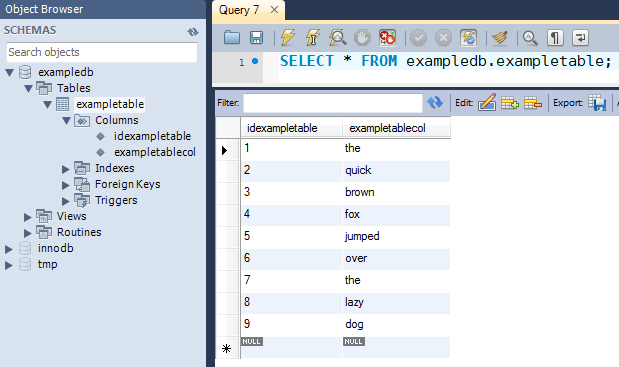

AWS Data Pipeline is no longer available to new customers. Existing customers of AWS Data Pipeline can continue to use the service as normal. [Learn more](https://aws.amazon.com/blogs/big-data/migrate-workloads-from-aws-data-pipeline/ "https://aws.amazon.com/blogs/big-data/migrate-workloads-from-aws-data-pipeline/")

# Before You Begin

Be sure you've completed the following steps.

- Complete the tasks in [Setting up for AWS Data Pipeline](dp-get-setup.md "dp-get-setup.md").
- (Optional) Set up a VPC for the instance and a security group for the VPC.
- Create an Amazon S3 bucket as a data output.

For more information, see [Create a
Bucket](../../../AmazonS3/latest/userguide/CreatingABucket.md "../../../AmazonS3/latest/userguide/CreatingABucket.md") in _Amazon Simple Storage Service User Guide_.

- Create and launch a MySQL database instance as your data source.

For more information, see [Launch a DB Instance](../../../AmazonRDS/latest/GettingStartedGuide/LaunchDBInstance.md "../../../AmazonRDS/latest/GettingStartedGuide/LaunchDBInstance.md") in the _Amazon RDS Getting Started Guide_.
After you have an Amazon RDS instance, see [Create a
Table](https://dev.mysql.com/doc/refman/8.0/en/creating-tables.html "https://dev.mysql.com/doc/refman/8.0/en/creating-tables.html") in the MySQL documentation.

###### Note

Make a note of the user name and the password you used for creating the
MySQL instance. After you've launched your MySQL database instance, make a
note of the instance's endpoint. You'll need this information later.

- Connect to your MySQL database instance, create a table, and then add test
  data values to the newly created table.

For illustration purposes, we created this tutorial using a MySQL table with
the following configuration and sample data. The following screen shot is from
MySQL Workbench 5.2 CE:

For more information, see [Create a
Table](https://dev.mysql.com/doc/refman/8.0/en/creating-tables.html "https://dev.mysql.com/doc/refman/8.0/en/creating-tables.html") in the MySQL documentation and the [MySQL Workbench product
page](http://www.mysql.com/products/workbench/ "http://www.mysql.com/products/workbench/").

- Create a topic for sending email notification and make a note of the
  topic Amazon Resource Name (ARN). For more information, see [Create a Topic](../../../sns/latest/gsg/CreateTopic.md "../../../sns/latest/gsg/CreateTopic.md") in
  _Amazon Simple Notification Service Getting Started Guide_.
- (Optional) This tutorial uses the default IAM role policies created by AWS Data Pipeline.
  If you would rather create and configure your IAM role policy and trust relationships,
  follow the instructions described in [IAM Roles for AWS Data Pipeline](dp-iam-roles.md "dp-iam-roles.md").
