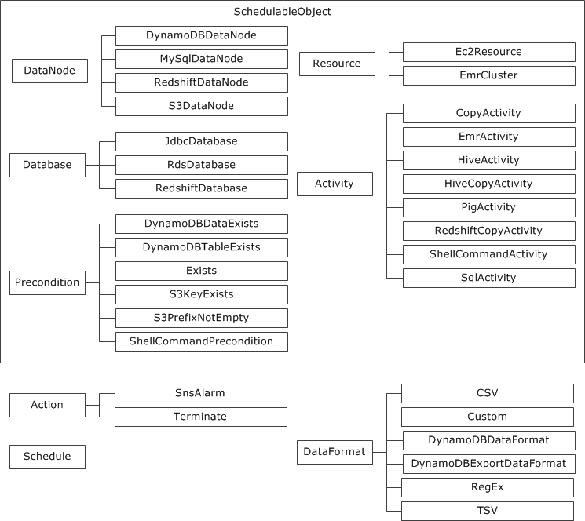

AWS Data Pipeline is no longer available to new customers. Existing customers of AWS Data Pipeline can continue to use the service as normal. [Learn more](https://aws.amazon.com/blogs/big-data/migrate-workloads-from-aws-data-pipeline/ "https://aws.amazon.com/blogs/big-data/migrate-workloads-from-aws-data-pipeline/")

# Pipeline Object Reference

You can use the following pipeline objects and components in your pipeline
definition.

###### Contents

- [Data Nodes](dp-object-datanodes.md "dp-object-datanodes.md")
- [Activities](dp-object-activities.md "dp-object-activities.md")
- [Resources](dp-object-resources.md "dp-object-resources.md")
- [Preconditions](dp-object-preconditions.md "dp-object-preconditions.md")
- [Databases](dp-object-databases.md "dp-object-databases.md")
- [Data Formats](dp-object-dataformats.md "dp-object-dataformats.md")
- [Actions](dp-object-actions.md "dp-object-actions.md")
- [Schedule](dp-object-schedule.md "dp-object-schedule.md")
- [Utilities](dp-object-utilities.md "dp-object-utilities.md")

###### Note

For an example application that uses the AWS Data Pipeline Java SDK, see [Data Pipeline DynamoDB Export Java Sample](https://github.com/awslabs/data-pipeline-samples/tree/master/samples/DynamoDBExportJava "https://github.com/awslabs/data-pipeline-samples/tree/master/samples/DynamoDBExportJava") on GitHub.

The following is the object hierarchy for AWS Data Pipeline.

