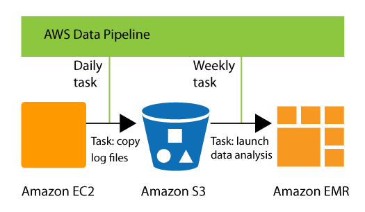

AWS Data Pipeline is no longer available to new customers. Existing customers of AWS Data Pipeline can continue to use the service as normal. [Learn more](https://aws.amazon.com/blogs/big-data/migrate-workloads-from-aws-data-pipeline/ "https://aws.amazon.com/blogs/big-data/migrate-workloads-from-aws-data-pipeline/")

# What is AWS Data Pipeline?

###### Note

AWS Data Pipeline service is in maintenance mode and no new features or region expansions are planned. To learn more and to find out how to migrate your existing workloads, see [Migrating workloads from AWS Data Pipeline](migration.md "migration.md").

AWS Data Pipeline is a web service that you can use to automate the movement and transformation of
data. With AWS Data Pipeline, you can define data-driven workflows, so that tasks can be dependent on
the successful completion of previous tasks. You define the parameters of your data
transformations and AWS Data Pipeline enforces the logic that you've set up.

The following components of AWS Data Pipeline work together to manage your data:

- A _pipeline definition_ specifies the business logic of your
  data management. For more information, see [Pipeline definition file syntax](dp-writing-pipeline-definition.md "dp-writing-pipeline-definition.md").
- A _pipeline_ schedules and runs tasks by creating Amazon EC2
  instances to perform the defined work activities. You upload your pipeline
  definition to the pipeline, and then activate the pipeline. You can edit the
  pipeline definition for a running pipeline and activate the pipeline again for it to
  take effect. You can deactivate the pipeline, modify a data source, and then
  activate the pipeline again. When you are finished with your pipeline, you can
  delete it.
- _Task Runner_ polls for tasks and then performs those tasks.
  For example, Task Runner could copy log files to Amazon S3 and launch Amazon EMR clusters.
  Task Runner is installed and runs automatically on resources created by your
  pipeline definitions. You can write a custom task runner application, or you can use
  the Task Runner application that is provided by AWS Data Pipeline. For more information,
  see [Task Runners](dp-how-remote-taskrunner-client.md "dp-how-remote-taskrunner-client.md").
  For example, you can use AWS Data Pipeline to archive your web server's logs to Amazon Simple Storage Service (Amazon S3)
  each day and then run a weekly Amazon EMR (Amazon EMR) cluster over those logs to generate traffic
  reports. AWS Data Pipeline schedules the daily tasks to copy data and the weekly task to launch the
  Amazon EMR cluster. AWS Data Pipeline also ensures that Amazon EMR waits for the final day's data to be uploaded
  to Amazon S3 before it begins its analysis, even if there is an unforeseen delay in uploading the
  logs.

###### Contents

- [Migrating workloads from AWS Data Pipeline](migration.md "migration.md")
- [Related services](datapipeline-related-services.md "datapipeline-related-services.md")
- [Accessing AWS Data Pipeline](#accessing-datapipeline "#accessing-datapipeline")
- [Pricing](#datapipeline-pricing "#datapipeline-pricing")
- [Supported Instance Types for Pipeline Work
  Activities](dp-supported-instance-types.md "dp-supported-instance-types.md")

## Accessing AWS Data Pipeline

You can create, access, and manage your pipelines using any of the following
interfaces:

- **AWS Management Console**— Provides a web interface that you can
  use to access AWS Data Pipeline.
- **AWS Command Line Interface (AWS CLI)** — Provides commands for a broad
  set of AWS services, including AWS Data Pipeline, and is supported on Windows, macOS, and
  Linux. For more information about installing the AWS CLI, see [AWS Command Line Interface](https://aws.amazon.com/cli/ "https://aws.amazon.com/cli/"). For a list of commands
  for AWS Data Pipeline, see [datapipeline](../../../cli/latest/reference/datapipeline/index.md "../../../cli/latest/reference/datapipeline/index.md").
- **AWS SDKs** — Provides language-specific APIs and
  takes care of many of the connection details, such as calculating signatures,
  handling request retries, and error handling. For more information, see [AWS SDKs](http://aws.amazon.com/tools/#SDKs "http://aws.amazon.com/tools/#SDKs").
- **Query API**— Provides low-level APIs that you call
  using HTTPS requests. Using the Query API is the most direct way to access
  AWS Data Pipeline, but it requires that your application handle low-level details such as
  generating the hash to sign the request, and error handling. For more
  information, see the _[AWS Data Pipeline API Reference](../APIReference.md "../APIReference.md")_.

## Pricing

With Amazon Web Services, you pay only for what you use. For AWS Data Pipeline, you pay for your pipeline
based on how often your activities and preconditions are scheduled to run and where they
run. For more information, see [AWS Data Pipeline Pricing](https://aws.amazon.com/datapipeline/pricing/ "https://aws.amazon.com/datapipeline/pricing/").

If your AWS account is less than 12 months old, you are eligible to use the free tier.
The free tier includes three low-frequency preconditions and five low-frequency
activities per month at no charge. For more information, see [AWS Free Tier](https://aws.amazon.com/free/ "https://aws.amazon.com/free/").
