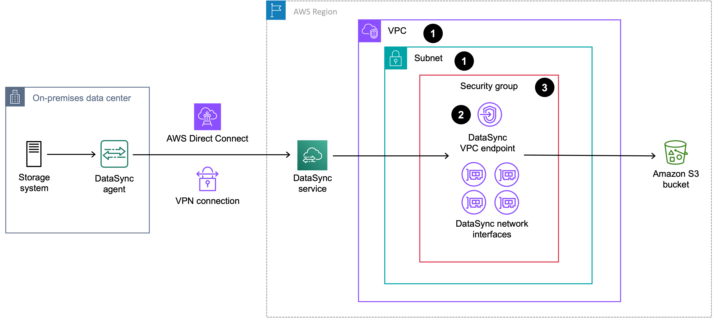

# Choosing a service endpoint for your AWS DataSync

agent

A [service
endpoint](../../../general/latest/gr/rande.md#datasync-region "../../../general/latest/gr/rande.md#datasync-region") is how your AWS DataSync [agent communicates with the DataSync
service](networking-datasync.md#2-network-between-agent-service "networking-datasync.md#2-network-between-agent-service"). DataSync supports the following types of service endpoints:

- **Public service endpoint** – Data is sent
  over the public internet.
- **Federal Information Processing Standard (FIPS) service
  endpoint** – Data is sent over the public internet by using
  processes that comply with FIPS.
- **Virtual private cloud (VPC) service endpoint**
  – Data is sent through your VPC instead of over the public internet,
  increasing the security of your transferred data.
- **FIPS VPC service endpoint**
  – Data is sent through your VPC using processes that comply with FIPS.
  You need a service endpoint to [activate your
  agent](activate-agent.md "activate-agent.md"). When choosing a service endpoint, remember the following:

- An agent can only use one type of endpoint. If you need to transfer data using
  different endpoint types, create an agent for each type.
- How you [connect your storage
  network to AWS](networking-datasync.md#connecting-options-to-amazon "networking-datasync.md#connecting-options-to-amazon") determines what service endpoints you can
  use.

## Choosing a public service

endpoint

If you use a public service endpoint, all communication between your DataSync agent
and the DataSync service occurs over the public internet.

1. Determine the DataSync [public service endpoint](../../../general/latest/gr/datasync.md "../../../general/latest/gr/datasync.md")
   that you want to use.
2. [Configure your network](datasync-network.md#using-public-endpoints "datasync-network.md#using-public-endpoints") to
   allow the traffic required for using DataSync public service endpoints.

**Next step: [Activating your AWS DataSync agent](activate-agent.md "activate-agent.md")**

## Choosing a FIPS service

endpoint

DataSync provides some service endpoints that comply with FIPS. For more information,
see [FIPS endpoints](../../../general/latest/gr/rande.md#FIPS-endpoints "../../../general/latest/gr/rande.md#FIPS-endpoints") in the _AWS General Reference_.

1. Determine the DataSync [FIPS service endpoint](../../../general/latest/gr/datasync.md "../../../general/latest/gr/datasync.md") that
   you want to use.
2. [Configure your network](datasync-network.md#using-public-endpoints "datasync-network.md#using-public-endpoints") to
   allow the traffic required for using DataSync FIPS service endpoints.

**Next step: [Activating your AWS DataSync agent](activate-agent.md "activate-agent.md")**

## Choosing a VPC service endpoint

If you use a VPC service endpoint, your data isn't transferred across the public internet.
DataSync instead transfers data through a VPC that's based on the Amazon VPC service.

###### Contents

- [How DataSync agents work with VPC service
  endpoints](choose-service-endpoint.md#working-with-endpoints "choose-service-endpoint.md#working-with-endpoints")
- [DataSync limitations with VPCs](choose-service-endpoint.md#datasync-in-vpc-limitations "choose-service-endpoint.md#datasync-in-vpc-limitations")
- [Creating a VPC service endpoint for
  DataSync](choose-service-endpoint.md#create-agent-steps-vpc "choose-service-endpoint.md#create-agent-steps-vpc")

### How DataSync agents work with VPC service

endpoints

VPC service endpoints are provided by AWS PrivateLink. These types of endpoints let you
privately connect supported AWS services to your VPC. When you use a VPC service
endpoint with DataSync, all communication between your DataSync agent and the DataSync service
remains in your VPC.

The VPC service endpoint (along with the [network interfaces](required-network-interfaces.md "required-network-interfaces.md") DataSync creates for data transfer traffic) uses private IP
addresses that are only accessible from inside your VPC. For more information, see [Connecting your network for AWS DataSync
transfers](networking-datasync.md "networking-datasync.md").

### DataSync limitations with VPCs

- VPCs that you use with DataSync must have default tenancy. VPCs with dedicated tenancy
  aren't supported.
- DataSync doesn't support [shared VPCs](../../../vpc/latest/userguide/vpc-sharing.md "../../../vpc/latest/userguide/vpc-sharing.md").

### Creating a VPC service endpoint for

DataSync

You create a VPC service endpoint for DataSync in a VPC that you manage. Your service
endpoint, VPC, and DataSync agent must belong to the same AWS account.

The following diagram shows an example of DataSync using a VPC service endpoint for
transferring from an on-premises storage system to an Amazon S3 bucket. The numbered callouts
correspond to the steps to create a VPC service endpoint.

###### To create a VPC service endpoint for DataSync

1. [Create](../../../vpc/latest/userguide/create-vpc.md "../../../vpc/latest/userguide/create-vpc.md")
   or determine a VPC and subnet where you want to create your VPC service
   endpoint.

If you're transferring to or from storage that's outside AWS, the VPC should
extend to that storage environment (for example, your storage environment might
be a data center where your on-premises NFS file server is located). You can do
this by using routing rules over [Direct Connect](direct-connect-architecture.md "direct-connect-architecture.md") or VPN. 2. Create a DataSync VPC service endpoint by doing the following:

    1. Open the Amazon VPC console at [https://console.aws.amazon.com/vpc/](https://console.aws.amazon.com/vpc/ "https://console.aws.amazon.com/vpc/").
    2. In the left navigation pane, choose **Endpoints**,
     then choose **Create endpoint**.
    3. For **Service category**, choose
     **AWS services**.
    4. For **Services**, search for
     `datasync` and choose the endpoint for the AWS Region that you're in (for example,
     `com.amazonaws.us-east-1.datasync` or `com.amazonaws.us-east-1.datasync-fips`).
    5. For **VPC**, choose the VPC where you want to create
     the VPC service endpoint.
    6. Expand **Additional settings** and clear the
     **Enable Private DNS Name** check box to disable
     this setting.

    We recommend disabling this setting in case you have
     agents in the same VPC that need to use a public service endpoint. An
     agent can't reach a [public
     service endpoint](datasync-network.md#using-public-endpoints "datasync-network.md#using-public-endpoints") over the network when this setting is
     enabled.
    7. For **Subnet**, choose the subnet where you want to
     create the VPC service endpoint. Take note of the subnet ARN (you need
     this when activating your agent).
    8. Choose **Create endpoint**. Take note of the endpoint
     ID (you need this when activating your agent).

3. In your VPC, configure a [security group](../../../vpc/latest/userguide/vpc-security-groups.md "../../../vpc/latest/userguide/vpc-security-groups.md")
   that allows the traffic required for using DataSync [VPC service endpoints](datasync-network.md#using-vpc-endpoint "datasync-network.md#using-vpc-endpoint"). Take note of the
   security group ARN (you need this when activating your agent).

The security group must allow your agent to connect with the private IP
addresses of the VPC service endpoint and your [network interfaces](required-network-interfaces.md "required-network-interfaces.md") (which get
created when you create your task).

**Next step: [Activating your AWS DataSync agent](activate-agent.md "activate-agent.md")**
