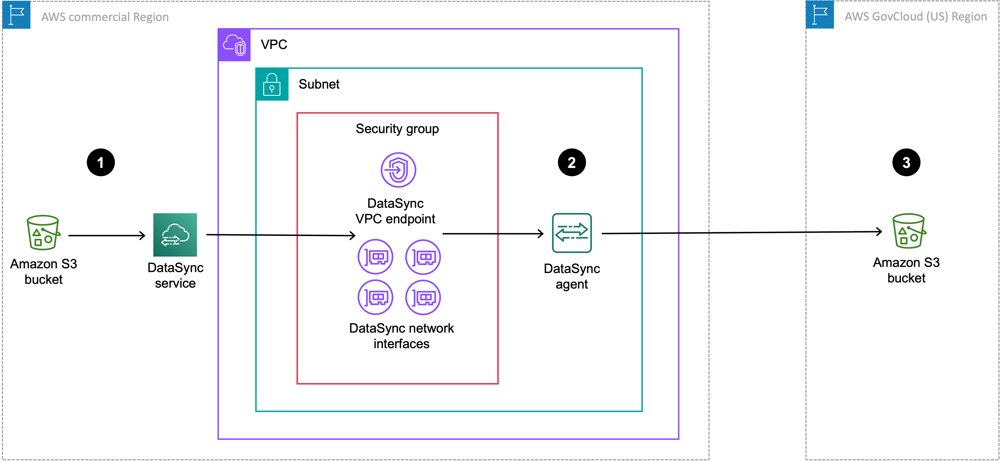
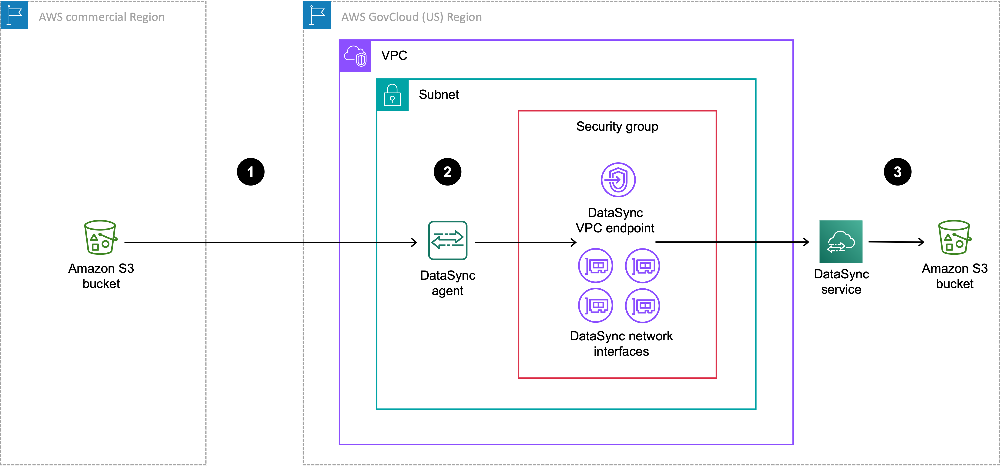

# Configuring AWS DataSync transfers with Amazon S3

To transfer data to or from your Amazon S3 bucket, you create an AWS DataSync transfer
_location_. DataSync can use this location as a source
or destination for transferring data.

## Providing DataSync access to S3

buckets

DataSync needs access to the S3 bucket that you're transferring to or from. To do
this, you must create an AWS Identity and Access Management (IAM) role that DataSync assumes with the
permissions required to access the bucket. You then specify this role when [creating your Amazon S3 location for
DataSync](#create-s3-location-how-to "#create-s3-location-how-to").

###### Contents

- [Required
  permissions](create-s3-location.md#create-s3-location-required-permissions "create-s3-location.md#create-s3-location-required-permissions")
- [Creating an IAM role for DataSync to
  access your Amazon S3 location](create-s3-location.md#create-role-manually "create-s3-location.md#create-role-manually")
- [Accessing S3 buckets using
  server-side encryption](create-s3-location.md#create-s3-location-encryption "create-s3-location.md#create-s3-location-encryption")
- [Accessing restricted S3 buckets](create-s3-location.md#denying-s3-access "create-s3-location.md#denying-s3-access")
- [Accessing S3 buckets with
  restricted VPC access](create-s3-location.md#create-s3-location-restricted-vpc "create-s3-location.md#create-s3-location-restricted-vpc")

### Required

permissions

The permissions that your IAM role needs can depend on whether bucket is a
DataSync source or destination location. Amazon S3 on Outposts requires a different
set of permissions.

Amazon S3 (source location)

```
{
    "Version": "2012-10-17",
    "Statement": [
        {
            "Action": [
                "s3:GetBucketLocation",
                "s3:ListBucket",
                "s3:ListBucketMultipartUploads"
            ],
            "Effect": "Allow",
            "Resource": "arn:aws:s3:::`amzn-s3-demo-bucket`"
        },
        {
            "Action": [
                "s3:GetObject",
                "s3:GetObjectTagging",
                "s3:GetObjectVersion",
                "s3:GetObjectVersionTagging",
                "s3:ListMultipartUploadParts"
              ],
            "Effect": "Allow",
            "Resource": "arn:aws:s3:::`amzn-s3-demo-bucket`/*"
        }
    ]
}
```

Amazon S3 (destination location)

```
{
 "Version": "2012-10-17",
 "Statement": [
     {
         "Action": [
             "s3:GetBucketLocation",
             "s3:ListBucket",
             "s3:ListBucketMultipartUploads"
         ],
         "Effect": "Allow",
         "Resource": "arn:aws:s3:::amzn-s3-demo-bucket",
         "Condition": {
             "StringEquals": {
                 "aws:ResourceAccount": "123456789012"
             }
         }
     },
     {
         "Action": [
             "s3:AbortMultipartUpload",
             "s3:DeleteObject",
             "s3:GetObject",
             "s3:GetObjectTagging",
             "s3:GetObjectVersion",
             "s3:GetObjectVersionTagging",
             "s3:ListMultipartUploadParts",
             "s3:PutObject",
             "s3:PutObjectTagging"
           ],
         "Effect": "Allow",
         "Resource": "arn:aws:s3:::amzn-s3-demo-bucket/*",
         "Condition": {
             "StringEquals": {
                 "aws:ResourceAccount": "123456789012"
             }
         }
     }
 ]
}
```

Amazon S3 on Outposts

```
`{
 "Version":"2012-10-17",
 "Statement": [
 {
 "Action": [
 "s3-outposts:ListBucket",
 "s3-outposts:ListBucketMultipartUploads"
 ],
 "Effect": "Allow",
 "Resource": [
 "arn:aws:s3-outposts:`us-east-1`:`123456789012`:outpost/`outpost-id`/bucket/`amzn-s3-demo-bucket`",
 "arn:aws:s3-outposts:`us-east-1`:`123456789012`:outpost/`outpost-id`/accesspoint/`bucket-access-point-name`"
 ]
 },
 {
 "Action": [
 "s3-outposts:AbortMultipartUpload",
 "s3-outposts:DeleteObject",
 "s3-outposts:GetObject",
 "s3-outposts:GetObjectTagging",
 "s3-outposts:GetObjectVersion",
 "s3-outposts:GetObjectVersionTagging",
 "s3-outposts:ListMultipartUploadParts",
 "s3-outposts:PutObject",
 "s3-outposts:PutObjectTagging"
 ],
 "Effect": "Allow",
 "Resource": [
 "arn:aws:s3-outposts:`us-east-1`:`123456789012`:outpost/`outpost-id`/bucket/`amzn-s3-demo-bucket`/*",
 "arn:aws:s3-outposts:`us-east-1`:`123456789012`:outpost/`outpost-id`/accesspoint/`bucket-access-point-name`/*"
 ]
 },
 {
 "Action": "s3-outposts:GetAccessPoint",
 "Effect": "Allow",
 "Resource": "arn:aws:s3-outposts:`us-east-1`:`123456789012`:outpost/`outpost-id`/accesspoint/`bucket-access-point-name`"
 }
 ]
}`

```

### Creating an IAM role for DataSync to

access your Amazon S3 location

When [creating your Amazon S3
location](#create-s3-location-how-to "#create-s3-location-how-to") in the console, DataSync can automatically create and assume an
IAM role that normally has the right permissions to access your S3
bucket.

In some situations, you might need to create this role manually (for example,
accessing buckets with extra layers of security or transferring to or from a
bucket in a different AWS accounts).

1.  Open the IAM console at
    [https://console.aws.amazon.com/iam/](https://console.aws.amazon.com/iam/ "https://console.aws.amazon.com/iam/").
2.  In the left navigation pane, under **Access
    management**, choose **Roles**,
    and then choose **Create role**.
3.  On the **Select trusted entity** page, for
    **Trusted entity type**, choose
    **AWS service**.
4.  For **Use case**, choose
    **DataSync** in the dropdown list and select
    **DataSync**. Choose
    **Next**.
5.  On the **Add permissions** page, choose
    **Next**. Give your role a name and choose
    **Create role**.
6.  On the **Roles** page, search for the role
    that you just created and choose its name.
7.  On the role's details page, choose the
    **Permissions** tab. Choose **Add
    permissions** then **Create inline
    policy**.
8.  Choose the **JSON** tab and [add the
    permissions required](#create-s3-location-required-permissions "#create-s3-location-required-permissions") to access your bucket into the
    policy editor.
9.  Choose **Next**. Give your policy a name and
    choose **Create policy**.
10. (Recommended) To prevent the [cross-service confused deputy problem](cross-service-confused-deputy-prevention.md "cross-service-confused-deputy-prevention.md"), do the
    following:

        1. On the role's details page, choose the **Trust
         relationships** tab. Choose **Edit
         trust policy**.
        2. Update the trust policy by using the following
         example, which includes the `aws:SourceArn`
         and `aws:SourceAccount` global condition
         context keys:


        JSON


        ```
        `{
         "Version":"2012-10-17",
         "Statement": [
         {
         "Effect": "Allow",
         "Principal": {
         "Service": "datasync.amazonaws.com"
         },
         "Action": "sts:AssumeRole",
         "Condition": {
         "StringEquals": {
         "aws:SourceAccount": "`444455556666`"
         },
         "ArnLike": {
         "aws:SourceArn": "arn:aws:datasync:`us-east-1`:`444455556666`:*"
         }
         }
         }
         ]
        }`

        ```
        3. Choose **Update policy**.

    You can specify this role when creating your Amazon S3 location.

### Accessing S3 buckets using

server-side encryption

DataSync can transfer data to or from [S3 buckets that
use server-side encryption](../../../AmazonS3/latest/userguide/serv-side-encryption.md "../../../AmazonS3/latest/userguide/serv-side-encryption.md"). The type of encryption key a bucket uses
can determine if you need a custom policy allowing DataSync to access the
bucket.

When using DataSync with S3 buckets that use server-side encryption, remember the
following:

- If your S3 bucket is encrypted with an AWS
  managed key – DataSync can access the bucket's objects
  by default if all your resources are in the same AWS account.
- If your S3 bucket is encrypted with a customer
  managed AWS Key Management Service (AWS KMS) key (SSE-KMS) – The [key's
  policy](../../../kms/latest/developerguide/key-policy-modifying.md "../../../kms/latest/developerguide/key-policy-modifying.md") must include the IAM role that DataSync uses to access
  the bucket.
- If your S3 bucket is encrypted with a customer
  managed SSE-KMS key and in a different AWS account
  – DataSync needs permission to access the bucket in the other
  AWS account. You can set up this up by doing the following:
  - In the IAM role that DataSync uses, you must specify the
    cross-account bucket's SSE-KMS key by using the key's fully
    qualified Amazon Resource Name (ARN). This is the same key ARN
    that you use to configure the bucket's [default encryption](../../../AmazonS3/latest/userguide/default-bucket-encryption.md "../../../AmazonS3/latest/userguide/default-bucket-encryption.md"). You can't specify a key ID,
    alias name, or alias ARN in this situation.

  Here's an example key ARN:

  `arn:aws:kms:us-west-2:111122223333:key/1234abcd-12ab-34cd-56ef-1234567890ab`

  For more information on specifying KMS keys in IAM policy
  statements, see the _[AWS Key Management Service Developer Guide](../../../kms/latest/developerguide/cmks-in-iam-policies.md "../../../kms/latest/developerguide/cmks-in-iam-policies.md")_.
  - In the SSE-KMS key policy, [specify the IAM role used by DataSync](../../../kms/latest/developerguide/key-policy-modifying-external-accounts.md "../../../kms/latest/developerguide/key-policy-modifying-external-accounts.md").

- If your S3 bucket is encrypted with a customer
  managed AWS KMS key (DSSE-KMS) for dual-layer server-side
  encryption – The [key's
  policy](../../../kms/latest/developerguide/key-policy-modifying.md "../../../kms/latest/developerguide/key-policy-modifying.md") must include the IAM role that DataSync uses to access
  the bucket. (Keep in mind that DSSE-KMS doesn't support [S3 Bucket Keys](../../../AmazonS3/latest/userguide/bucket-key.md "../../../AmazonS3/latest/userguide/bucket-key.md"), which can reduce AWS KMS request
  costs.)
- If your S3 bucket is encrypted with a
  customer-provided encryption key (SSE-C) – DataSync
  can't access this bucket.

The following example is a [key policy](../../../kms/latest/developerguide/key-policies.md "../../../kms/latest/developerguide/key-policies.md")
for a customer-managed SSE-KMS key. The policy is associated with an S3
bucket that uses server-side encryption.

If you want to use this example, replace the following values with
your own:

- `account-id` – Your
  AWS account.
- `admin-role-name` – The name
  of the IAM role that can administer the key.
- `datasync-role-name` – The
  name of the IAM role that allows DataSync to use the key when
  accessing the bucket.

JSON

```
`{
 "Id": "key-consolepolicy-3",
 "Version":"2012-10-17",
 "Statement": [
 {
 "Sid": "Enable IAM Permissions",
 "Effect": "Allow",
 "Principal": {
 "AWS": "arn:aws:iam::`111122223333`:root"
 },
 "Action": "kms:*",
 "Resource": "*"
 },
 {
 "Sid": "Allow access for Key Administrators",
 "Effect": "Allow",
 "Principal": {
 "AWS": "arn:aws:iam::`111122223333`:role/`admin-role-name`"
 },
 "Action": [
 "kms:Create*",
 "kms:Describe*",
 "kms:Enable*",
 "kms:List*",
 "kms:Put*",
 "kms:Update*",
 "kms:Revoke*",
 "kms:Disable*",
 "kms:Get*",
 "kms:Delete*",
 "kms:TagResource",
 "kms:UntagResource",
 "kms:ScheduleKeyDeletion",
 "kms:CancelKeyDeletion"
 ],
 "Resource": "*"
 },
 {
 "Sid": "Allow use of the key",
 "Effect": "Allow",
 "Principal": {
 "AWS": "arn:aws:iam::`111122223333`:role/`datasync-role-name`"
 },
 "Action": [
 "kms:Encrypt",
 "kms:Decrypt",
 "kms:ReEncrypt*",
 "kms:GenerateDataKey*"
 ],
 "Resource": "*"
 }
 ]
}`

```

### Accessing restricted S3 buckets

If you need to transfer to or from an S3 bucket that typically denies all
access, you can edit the bucket policy so that DataSync can access the bucket only
for your transfer.

1. Copy the following S3 bucket policy.

JSON

```
`{
 "Version":"2012-10-17",
 "Statement": [{
 "Sid": "Deny-access-to-bucket",
 "Effect": "Deny",
 "Principal": "*",
 "Action": "s3:*",
 "Resource": [
 "arn:aws:s3:::`amzn-s3-demo-bucket`",
 "arn:aws:s3:::`amzn-s3-demo-bucket`/*"
 ],
 "Condition": {
 "StringNotLike": {
 "aws:userid": [
 "`datasync-iam-role-id`:*",
 "`your-iam-role-id`"
 ]
 }
 }
 }]
}`

```

2. In the policy, replace the following values:
   - `amzn-s3-demo-bucket`
     – Specify the name of the restricted S3
     bucket.
   - `datasync-iam-role-id`
     – Specify the ID of the [IAM role that
     DataSync uses](#create-s3-location-access "#create-s3-location-access") to access the bucket.

   Run the following AWS CLI command to get the IAM role
   ID:

   `aws iam get-role --role-name
 `datasync-iam-role-name``

   In the output, look for the `RoleId`
   value:

   `"RoleId": "ANPAJ2UCCR6DPCEXAMPLE"`
   - `your-iam-role-id`
     – Specify the ID of the IAM role that you use
     to create your DataSync location for the bucket.

   Run the following command to get the IAM role
   ID:

   `aws iam get-role --role-name
 `your-iam-role-name``

   In the output, look for the `RoleId`
   value:

   `"RoleId": "AIDACKCEVSQ6C2EXAMPLE"`

3. [Add
   this policy](../../../AmazonS3/latest/userguide/add-bucket-policy.md "../../../AmazonS3/latest/userguide/add-bucket-policy.md") to your S3 bucket policy.
4. When you're done using DataSync with the restricted bucket,
   remove the conditions for both IAM roles from the bucket
   policy.

### Accessing S3 buckets with

restricted VPC access

An Amazon S3 bucket that [limits access to specific virtual private cloud (VPC) endpoints or
VPCs](../../../AmazonS3/latest/userguide/example-bucket-policies-vpc-endpoint.md "../../../AmazonS3/latest/userguide/example-bucket-policies-vpc-endpoint.md") will deny DataSync from transferring to or from that bucket. To
enable transfers in these situations, you can update the bucket's policy to
include the IAM role that you [specify with your DataSync location](#create-s3-location-how-to "#create-s3-location-how-to").

Option 1: Allowing access based on DataSync location role
ARN
In the S3 bucket policy, you can specify the Amazon Resource Name
(ARN) of your DataSync location IAM role.

The following example is an S3 bucket policy that denies access
from all but two VPCs (`vpc-1234567890abcdef0` and
`vpc-abcdef01234567890`). However, the policy also
includes the [ArnNotLikeIfExists](../../../IAM/latest/UserGuide/reference_policies_elements_condition_operators.md "../../../IAM/latest/UserGuide/reference_policies_elements_condition_operators.md") condition and [aws:PrincipalArn](../../../IAM/latest/UserGuide/reference_policies_condition-keys.md#condition-keys-principalarn "../../../IAM/latest/UserGuide/reference_policies_condition-keys.md#condition-keys-principalarn") condition key, which allow the ARN of
a DataSync location role to access the bucket.

```
`{
 "Version":"2012-10-17",
 "Statement": [
 {
 "Sid": "Access-to-specific-VPCs-only",
 "Effect": "Deny",
 "Principal": "*",
 "Action": "s3:*",
 "Resource": "arn:aws:s3:::`amzn-s3-demo-bucket`/*",
 "Condition": {
 "StringNotEqualsIfExists": {
 "aws:SourceVpc": [
 "vpc-`1234567890abcdef0`",
 "vpc-`abcdef01234567890`"
 ]
 },
 "ArnNotLikeIfExists": {
 "aws:PrincipalArn": [
 "arn:aws:iam::`111122223333`:role/`datasync-location-role-name`"
 ]
 }
 }
 }
 ]
}`

```

Option 2: Allowing access based on DataSync location role
tag
In the S3 bucket policy, you can specify a tag attached to your
DataSync location IAM role.

The following example is an S3 bucket policy that denies access
from all but two VPCs (`vpc-1234567890abcdef0` and
`vpc-abcdef01234567890`). However, the policy also
includes the [StringNotEqualsIfExists](../../../IAM/latest/UserGuide/reference_policies_elements_condition_operators.md "../../../IAM/latest/UserGuide/reference_policies_elements_condition_operators.md") condition
and [aws:PrincipalTag](../../../IAM/latest/UserGuide/reference_policies_condition-keys.md#condition-keys-principaltag "../../../IAM/latest/UserGuide/reference_policies_condition-keys.md#condition-keys-principaltag") condition key,
which allow a principal with the tag key
`exclude-from-vpc-restriction` and value
`true`. You can try a similar approach in your bucket
policy by specifying a tag attached to your DataSync location
role.

```
`{
 "Version":"2012-10-17",
 "Statement": [
 {
 "Sid": "Access-to-specific-VPCs-only",
 "Effect": "Deny",
 "Principal": "*",
 "Action": "s3:*",
 "Resource": "arn:aws:s3:::`amzn-s3-demo-bucket`/*",
 "Condition": {
 "StringNotEqualsIfExists": {
 "aws:SourceVpc": [
 "vpc-`1234567890abcdef0`",
 "vpc-`abcdef01234567890`"
 ],
 "aws:PrincipalTag/`exclude-from-vpc-restriction`": "`true`"
 }
 }
 }
 ]
}`

```

## Storage class considerations with Amazon S3

transfers

When Amazon S3 is your destination location, DataSync can transfer your data directly into
a specific [Amazon S3 storage
class](https://aws.amazon.com/s3/storage-classes/ "https://aws.amazon.com/s3/storage-classes/").

Some storage classes have behaviors that can affect your Amazon S3 storage costs. When
using storage classes that can incur additional charges for overwriting, deleting,
or retrieving objects, changes to object data or metadata result in such charges.
For more information, see [Amazon S3
pricing](https://aws.amazon.com/s3/pricing/ "https://aws.amazon.com/s3/pricing/").

###### Important

New objects transferred to your Amazon S3 destination location are stored using the
storage class that you specify when [creating your location](#create-s3-location-how-to "#create-s3-location-how-to").

By default, DataSync preserves the storage class of existing objects in your
destination location unless you configure your task to [transfer all data](configure-metadata.md#task-option-transfer-mode "configure-metadata.md#task-option-transfer-mode"). In those
situations, the storage class that you specify when creating your location is
used for all objects.

| Amazon S3 storage class                                                                                                         | Considerations                                                                                                                                                                                                                                                                                                                                                                                                                                                                                                                                                                                                                                                                                                                                                                                                                                                                                                                                                                                                                                                                                                                                                                                                                                                                                                                                                                                                                                   |
| ------------------------------------------------------------------------------------------------------------------------------- | ------------------------------------------------------------------------------------------------------------------------------------------------------------------------------------------------------------------------------------------------------------------------------------------------------------------------------------------------------------------------------------------------------------------------------------------------------------------------------------------------------------------------------------------------------------------------------------------------------------------------------------------------------------------------------------------------------------------------------------------------------------------------------------------------------------------------------------------------------------------------------------------------------------------------------------------------------------------------------------------------------------------------------------------------------------------------------------------------------------------------------------------------------------------------------------------------------------------------------------------------------------------------------------------------------------------------------------------------------------------------------------------------------------------------------------------------ | ---------------------------------------------------------------------------------------------------------------------------------------------------------------------------------------------------------------------------------------------------------------------------------------------------------------------------------------------------------------------------------------------------------------------------------------------------------------------------------------------------------------------------------------------------------------------------------------------------------------------------------------------------------------------------------------------------------------------------------------------------------------------------------------------------------------------------------------------------------------------------------------------------------------------------------------------------------------------------------------------------------------------------------------------------------------------------------------------------------------------------------------------------------------------------------------------------------------------------------------------------------------------------------------------------------------------------------------------------------------------------------------------------------------------------------------------------------------------------------------------------------------------------------------------------------------------------------------------------------------------------------------------------------------------------------------------------------------------------------------------------------------------------------------------------------------------------------------------------------------------------------------------------------------------------------------------------------------------------------------------------------------------------------------------------------------------------------------------------------------------------------------------------------------------------------------------------------------------------------------------------------------------------------------------------------------------------------------------------------------------------------------------------------------------------------------------------------------------------------------------------------------------------------------------------------------------------------------------------------------------------------------------------------------------------------------------------------------------------------------------------------------------------------------------------------------------------------------------------------------------------------------------------------------------------------------------------------------------------------------------------------------------------------------------------------------------------------------------------------------------------------------------------------------------------------------------------------------------------------------------------------------------------------------------------------------------------------------------------------------------------------------------------------------------------------------------------------------------------------------------------------------------------------------------------------------------------------------------------------------------------------------------------------------------------------------------------------------------------------------------------------------------------------------------------------------------------------------------------------------------------------------------------------------------------------------------------------------------------------------------------------------------------------------------------------------------------------------------------------------------------------------------------------------------------------------------------------------------------------------------------------------------------------------------------------------------------------------------------------------------------------------------------------------------------------------------------------------------------------------------------------------------------------------------------------------------------------------------------------------------------------------------------------------------------------------------------------------------------------------------------------------------------------------------------------------------------------------------------------------------------------------------------------------------------------------------------------------------------------------------------------------------------------------------------------------------------------------------------------------------------------------------------------------------------------------------------------------------------------------------------------------------------------------------------------------------------------------------------------------------------------------------------------------------------------------------------------------------------------------------------------------------------------------------------------------------------------------------------------------------------------------------------------------------------------------------------------------------------------------------------------------------------------------------------------------------------------------------------------------------------------------------------------------------------------------------------------------------------------------------------------------------------------------------------------------------------------------------------------------------------------------------------------------------------------------------------------------------------------------------------------------------------------------------------------------------------------------------------------------------------------------------------------------------------------------------------------------------------------------------------------------------------------------------------------------------------------------------------------------------------------------------------------------------------------------------------------------------------------------------------------------------------------------------------------------------------------------------------------------------------------------------------------------------------------------------------------------------------------------------------------------------------------------------------------------------------------------------------------------------------------------------------------------------------------------------------------------------------------------------------------------------------------------------------------------------------------------------------------------------------------------------------------------------------------------------------------------------------------------------------------------------------------------------------------------------------------------------------------------------------------------------------------------------------------------------------------------------------------------------------------------------------------------------------------------------------------------------------------------------------------------------------------------------------------------------------------------------------------------------------------------------------------------------------------------------------------------------------------------------------------------------------------------------------------------------------------------------------------------------------------------------------------------------------------------------------------------------------------------------------------------------------------------------------------------------------------------------------------------------------------------------------------------------------------------------------------------------------------------------------------------------------------------------------------------------------------------------------------------------------------------------------------------------------------------------------------------------------------------------------------------------------------------------------------------------------------------------------------------------------------------------------------------------------------------------------------------------------------------------------------------------------------------------------------------------------------------------------------------------------------------------------------------------------------------------------------------------------------------------------------------------------------------------------------------------------------------------------------------------------------------------------------------------------------------------------------------------------------------------------------------------------------------------------------------------------------------------------------------------------------------------------------------------------------------------------------------------------------------------------------------------------------------------------------------------------------------------------------------------------------------------------------------------------------------------------------------------------------------------------------------------------------------------------------------------------------------------------------------------------------------------------------------------------------------------------------------------------------------------------------------------------------------------------------------------------------------------------------------------------------------------------------------------------------------------------------------------------------------------------------------------------------------------------------------------------------------------------------------------------------------------------------------------------------------------------------------------------------------------------------------------------------------------------------------------------------------------------------------------------------------------------------------------------------------------------------------------------------------------------------------------------------------------------------------------------------------------------------------------------------------------------------------------------------------------------------------------------------------------------------------------------------------------------------------------------------------------------------------------------------------------------------------------------------------------------------------------------------------------------------------------------------------------------------------------------------------------------------------------------------------------------------------------------------------------------------------------------------------------------------------------------------------------------------------------------------------------------------------------------------------------------------------------------------------------------------------------------------------------------------------------------------------------------------------------------------------------------------------------------------------------------------------------------------------------------------------------------------------------------------------------------------------------------------------------------------------------------------------------------------------------------------------------------------------------------------------------------------------------------------------------------------------------------------------------------------------------------------------------------------------------------------------------------------------------------------------------------------------------------------------------------------------------------------------------------------------------------------------------------------------------------------------------------------------------------------------------------------------------------------------------------------------------------------------------------------------------------------------------------------------------------------------------------------------------------------------------------------------------------------------------------------------------------------------------------------------------------------------------------------------------------------------------------------------------------------------------------------------------------------------------------------------------------------------------------------------------------------------------------------------------------------------------------------------------------------------------------------------------------------------------------------------------------------------------------------------------------------------------------------------------------------------------------------------------------------------------------------------------------------------------------------------------------------------------------------------------------------------------------------------------------------------------------------------------------------------------------------------------------------------------------------------------------------------------------------------------------------------------------------------------------------------------------------------------------------------------------------------------------------------------------------------------------------------------------------------------------------------------------------------------------------------------------------------------------------------------------------------------------------------------------------------------------------------------------------------------------------------------------------------------------------------------------------------------------------------------------------------------------------------------------------------------------------------------------------------------------------------------------------------------------------------------------------------------------------------------------------------------------------------------------------------------------------------------------------------------------------------------------------------------------------------------------------------------------------------------------------------------------------------------------------------------------------------------------------------------------------------------------------------------------------------------------------------------------------------------------------------------------------------------------------------------------------------------------------------------------------------------------------------------------------------------------------------------------------------------------------------------------------------------------------------------------------------------------------------------------------------------------------------------------------------------------------------------------------------------------------------------------------------------------------------------------------------------------------------------------------------------------------------------------------------------------------------------------------------------------------------------------------------------------------------------------------------------------------------------------------------------------------------------------------------------------------------------------------------------------------------------------------------------------------------------------------------------------------------------------------------------------------------------------------------------------------------------------------------------------------------------------------------------------------------------------------------------------------------------------------------------------------------------------------------------------------------------------------------------------------------------------------------------------------------------------------------------------------------------------------------------------------------------------------------------------------------------------------------------------------------------------------------------------------------------------------------------------------------------------------------------------------------------------------------------------------------------------------------------------------------------------------------------------------------------------------------------------------------------------------------------------------------------------------------------------------------------- |
| S3 Standard                                                                                                                     | Choose S3 Standard to store your frequently accessed files redundantly in multiple Availability Zones that are geographically separated. This is the default if you don't specify a storage class.                                                                                                                                                                                                                                                                                                                                                                                                                                                                                                                                                                                                                                                                                                                                                                                                                                                                                                                                                                                                                                                                                                                                                                                                                                               |
| S3 Intelligent-Tiering                                                                                                          | Choose S3 Intelligent-Tiering to optimize storage costs by automatically moving data to the most cost-effective storage access tier. You pay a monthly charge per object stored in the S3 Intelligent-Tiering storage class. This Amazon S3 charge includes monitoring data access patterns and moving objects between tiers.                                                                                                                                                                                                                                                                                                                                                                                                                                                                                                                                                                                                                                                                                                                                                                                                                                                                                                                                                                                                                                                                                                                    |
| S3 Standard-IA                                                                                                                  | Choose S3 Standard-IA to store your infrequently accessed objects redundantly in multiple Availability Zones that are geographically separated. Objects stored in the S3 Standard-IA storage class can incur additional charges for overwriting, deleting, or retrieving. Consider how often these objects change, how long you plan to keep these objects, and how often you need to access them. Changes to object data or metadata are equivalent to deleting an object and creating a new one to replace it. This results in additional charges for objects stored in the S3 Standard-IA storage class. Objects less than 128 KB are smaller than the minimum capacity charge per object in the S3 Standard-IA storage class. These objects are stored in the S3 Standard storage class.                                                                                                                                                                                                                                                                                                                                                                                                                                                                                                                                                                                                                                                     |
| S3 One Zone-IA                                                                                                                  | Choose S3 One Zone-IA to store your infrequently accessed objects in a single Availability Zone. Objects stored in the S3 One Zone-IA storage class can incur additional charges for overwriting, deleting, or retrieving. Consider how often these objects change, how long you plan to keep these objects, and how often you need to access them. Changes to object data or metadata are equivalent to deleting an object and creating a new one to replace it. This results in additional charges for objects stored in the S3 One Zone-IA storage class. Objects less than 128 KB are smaller than the minimum capacity charge per object in the S3 One Zone-IA storage class. These objects are stored in the S3 Standard storage class.                                                                                                                                                                                                                                                                                                                                                                                                                                                                                                                                                                                                                                                                                                    |
| S3 Glacier Instant Retrieval                                                                                                    | Choose S3 Glacier Instant Retrieval to archive objects that are rarely accessed but require retrieval in milliseconds. Data stored in the S3 Glacier Instant Retrieval storage class offers cost savings compared to the S3 Standard-IA storage class with the same latency and throughput performance. S3 Glacier Instant Retrieval has higher data access costs than S3 Standard-IA, though. Objects stored in S3 Glacier Instant Retrieval can incur additional charges for overwriting, deleting, or retrieving. Consider how often these objects change, how long you plan to keep these objects, and how often you need to access them. Changes to object data or metadata are equivalent to deleting an object and creating a new one to replace it. This results in additional charges for objects stored in the S3 Glacier Instant Retrieval storage class. Objects less than 128 KB are smaller than the minimum capacity charge per object in the S3 Glacier Instant Retrieval storage class. These objects are stored in the S3 Standard storage class.                                                                                                                                                                                                                                                                                                                                                                              |
| S3 Glacier Flexible Retrieval                                                                                                   | Choose S3 Glacier Flexible Retrieval for more active archives.Objects stored in S3 Glacier Flexible Retrieval can incur additional charges for overwriting, deleting, or retrieving. Consider how often these objects change, how long you plan to keep these objects, and how often you need to access them. Changes to object data or metadata are equivalent to deleting an object and creating a new one to replace it. This results in additional charges for objects stored in the S3 Glacier Flexible Retrieval storage class.The S3 Glacier Flexible Retrieval storage class requires 40 KB of additional metadata for each archived object. DataSync puts objects that are less than 40 KB in the S3 Standard storage class. You must restore objects archived in this storage class before DataSync can read them. For information, see [Working with archived objects](../../../AmazonS3/latest/userguide/archived-objects.md "../../../AmazonS3/latest/userguide/archived-objects.md") in the _Amazon S3 User Guide_.When using S3 Glacier Flexible Retrieval, choose the **Verify only the data transferred** task option to compare data and metadata checksums at the end of the transfer. You can't use the **Verify all data in the destination** option for this storage class because it requires retrieving all existing objects from the destination.                                                                       |
| S3 Glacier Deep Archive                                                                                                         | Choose S3 Glacier Deep Archive to archive your objects for long-term data retention and digital preservation where data is accessed once or twice a year. Objects stored in S3 Glacier Deep Archive can incur additional charges for overwriting, deleting, or retrieving. Consider how often these objects change, how long you plan to keep these objects, and how often you need to access them. Changes to object data or metadata are equivalent to deleting an object and creating a new one to replace it. This results in additional charges for objects stored in the S3 Glacier Deep Archive storage class. The S3 Glacier Deep Archive storage class requires 40 KB of additional metadata for each archived object. DataSync puts objects that are less than 40 KB in the S3 Standard storage class. You must restore objects archived in this storage class before DataSync can read them. For information, see [Working with archived objects](../../../AmazonS3/latest/userguide/archived-objects.md "../../../AmazonS3/latest/userguide/archived-objects.md") in the _Amazon S3 User Guide_. When using S3 Glacier Deep Archive, choose the **Verify only the data transferred** task option to compare data and metadata checksums at the end of the transfer. You can't use the **Verify all data in the destination** option for this storage class because it requires retrieving all existing objects from the destination. |
| S3 Outposts                                                                                                                     | The storage class for Amazon S3 on Outposts.                                                                                                                                                                                                                                                                                                                                                                                                                                                                                                                                                                                                                                                                                                                                                                                                                                                                                                                                                                                                                                                                                                                                                                                                                                                                                                                                                                                                     | ## Evaluating S3 request costs when using DataSync With Amazon S3 locations, you incur costs related to S3 API requests made by DataSync. This section can help you understand how DataSync uses these requests and how they might affect your [Amazon S3 costs](https://aws.amazon.com/s3/pricing/ "https://aws.amazon.com/s3/pricing/"). ###### Topics <br>• [S3 requests made by DataSync](#create-s3-location-s3-requests-made "#create-s3-location-s3-requests-made") <br>• [Cost considerations](#create-s3-location-s3-requests-cost "#create-s3-location-s3-requests-cost") ### S3 requests made by DataSync The following table describes the S3 requests that DataSync can make when you’re copying data to or from an Amazon S3 location.                                                                                                                                                                                                                                                                                                                                                                                                                                                                                                                                                                                                                                                                                                                                                                                                                                                                                                                                                                                                                                                                                                                                                                                                                                                                                                                                                                                                                                                                                                                                                                                                                                                                                                                                                                                                                                                                                                                                                                                                                                                                                                                                                                                                                                                                                                                                                                                                                                                                                                                                                                                                                                                                                                                                                                                                                                                                                                                                                                                                                                                                                                                                                                                                                                                                                                                                                                                                                                                                                                                                                                                                                                                                                                                                                                                                                                                                                                                                                                                                                                                                                                                                                                                                                                                                                                                                                                                                                                                                                                                                                                                                                                                                                                                                                                                                                                                                                                                                                                                                                                                                                                                                                                                                                                                                                                                                                                                                                                                                                                                                                                                                                                                                                                                                                                                                                                                                                                                                                                                                                                                                                                                                                                                                                                                                                                                                                                                                                                                                                                                                                                                                                                                                                                                                                                                                                                                                                                                                                                                                                                                                                                                                                                                                                                                                                                                                                                                                                                                                                                                                                                                                                                                                                                                                                                                                                                                                                                                                                                                                                                                                                                                                                                                                                                                                                                                                                                                                                                                                                                                                                                                                                                                                                                                                                                                                                                                                                                                                                                                                                                                                                                                                                                                                                                                                                                                                                                                                                                                                                                                                                                                                                                                                                                                                                                                                                                                                                                                                                                                                                                                                                                                                                                                                                                                                                                                                                                                                                                                                                                                                                                                                                                                                                                                                                                                                                                                                                                                                                                                                                                                                                                                                                                                                                                                                                                                                                                                                                                                                                                                                                                                                                                                                                                                                                                                                                                                                                                                                                                                                                                                                                                                                                                                                                                                                                                                                                                                                                                                                                                                                                                                                                                                                                                                                                                                                                                                                                                                                                                                                                                                                                                                                                                                                                                                                                                                                                                                                                                                                                                                                                                                                                                                                                                                                                                                                                                                                                                                                                                                                                                                                                                                                                                                                                                                                                                                                                                                                                                                                                                                                                                                                                                                                                                                                                                                                                                                                                                                                                                                                                                                                                                                                                                                                                                                                                                                                                                                                                                                                                                                                                                                                                                                                                                                                                                                                                                                                                                                                                                                                                                                                                                                                                                                                                                                                                                                                                                                                                                                                                                                                                                                                                                                                                                                                                                                                                                                                                                                                                                                                                                                                                                                                                                                                                                                                                                                   |
| S3 request                                                                                                                      | How DataSync uses it                                                                                                                                                                                                                                                                                                                                                                                                                                                                                                                                                                                                                                                                                                                                                                                                                                                                                                                                                                                                                                                                                                                                                                                                                                                                                                                                                                                                                             |
| ---                                                                                                                             | ---                                                                                                                                                                                                                                                                                                                                                                                                                                                                                                                                                                                                                                                                                                                                                                                                                                                                                                                                                                                                                                                                                                                                                                                                                                                                                                                                                                                                                                              |
| [ListObjectV2](../../../AmazonS3/latest/API/API_ListObjectsV2.md "../../../AmazonS3/latest/API/API_ListObjectsV2.md")           | DataSync makes at least one `LIST` request for every object ending in a forward slash (`/`) to list the objects that start with that prefix. This request is called during a task’s [preparing](run-task.md#understand-task-execution-statuses "run-task.md#understand-task-execution-statuses") phase.                                                                                                                                                                                                                                                                                                                                                                                                                                                                                                                                                                                                                                                                                                                                                                                                                                                                                                                                                                                                                                                                                                                                          |
| [HeadObject](../../../AmazonS3/latest/API/API_HeadObject.md "../../../AmazonS3/latest/API/API_HeadObject.md")                   | DataSync makes `HEAD` requests to retrieve object metadata during a task’s [preparing](run-task.md#understand-task-execution-statuses "run-task.md#understand-task-execution-statuses") and [verifying](run-task.md#understand-task-execution-statuses "run-task.md#understand-task-execution-statuses") phases. There can be multiple `HEAD` requests per object depending on how you want DataSync to [verify the integrity of the data it transfers](configure-data-verification-options.md "configure-data-verification-options.md").                                                                                                                                                                                                                                                                                                                                                                                                                                                                                                                                                                                                                                                                                                                                                                                                                                                                                                        |
| [GetObject](../../../AmazonS3/latest/API/API_GetObject.md "../../../AmazonS3/latest/API/API_GetObject.md")                      | DataSync makes `GET` requests to read data from an object during a task’s [transferring](run-task.md#understand-task-execution-statuses "run-task.md#understand-task-execution-statuses") phase. There can be multiple `GET` requests for large objects.                                                                                                                                                                                                                                                                                                                                                                                                                                                                                                                                                                                                                                                                                                                                                                                                                                                                                                                                                                                                                                                                                                                                                                                         |
| [GetObjectTagging](../../../AmazonS3/latest/API/API_GetObjectTagging.md "../../../AmazonS3/latest/API/API_GetObjectTagging.md") | If you configure your task to [copy object tags](configure-metadata.md "configure-metadata.md"), DataSync makes these `GET` requests to check for object tags during the task's [preparing](run-task.md#understand-task-execution-statuses "run-task.md#understand-task-execution-statuses") and [transferring](run-task.md#understand-task-execution-statuses "run-task.md#understand-task-execution-statuses") phases.                                                                                                                                                                                                                                                                                                                                                                                                                                                                                                                                                                                                                                                                                                                                                                                                                                                                                                                                                                                                                         |
| [PutObject](../../../AmazonS3/latest/API/API_PutObject.md "../../../AmazonS3/latest/API/API_PutObject.md")                      | DataSync makes `PUT` requests to create objects and prefixes in a destination S3 bucket during a task’s [transferring](run-task.md#understand-task-execution-statuses "run-task.md#understand-task-execution-statuses") phase. Since DataSync uses the [Amazon S3 multipart upload feature](../../../AmazonS3/latest/userguide/mpuoverview.md "../../../AmazonS3/latest/userguide/mpuoverview.md"), there can be multiple `PUT` requests for large objects. To help minimize storage costs, we recommend using a lifecycle configuration to stop incomplete multipart uploads.                                                                                                                                                                                                                                                                                                                                                                                                                                                                                                                                                                                                                                                                                                                                                                                                                                                                   |
| [PutObjectTagging](../../../AmazonS3/latest/API/API_PutObjectTagging.md "../../../AmazonS3/latest/API/API_PutObjectTagging.md") | If your source objects have tags and you configure your task to [copy object tags](configure-metadata.md "configure-metadata.md"), DataSync makes these `PUT` requests when [transferring](run-task.md#understand-task-execution-statuses "run-task.md#understand-task-execution-statuses") those tags.                                                                                                                                                                                                                                                                                                                                                                                                                                                                                                                                                                                                                                                                                                                                                                                                                                                                                                                                                                                                                                                                                                                                          |
| [CopyObject](../../../AmazonS3/latest/API/API_CopyObject.md "../../../AmazonS3/latest/API/API_CopyObject.md")                   | DataSync makes a `COPY` request to create a copy of an object only if that object’s metadata changes. This can happen if you originally copied data to the S3 bucket using another service or tool that didn’t carry over its metadata.                                                                                                                                                                                                                                                                                                                                                                                                                                                                                                                                                                                                                                                                                                                                                                                                                                                                                                                                                                                                                                                                                                                                                                                                          | ### Cost considerations DataSync makes S3 requests on S3 buckets every time you run your task. This can lead to charges adding up in certain situations. For example: <br>• You’re frequently transferring objects to or from an S3 bucket. <br>• You may not be transferring much data, but your S3 bucket has lots of objects in it. You can still see high charges in this scenario because DataSync makes S3 requests on each of the bucket's objects. <br>• You're transferring between S3 buckets, so DataSync is making S3 requests on the source and destination. To help minimize S3 request costs related to DataSync, consider the following: ###### Topics <br>• [What S3 storage classes am I using?](#create-s3-location-s3-requests-storage-classes "#create-s3-location-s3-requests-storage-classes") <br>• [How often do I need to transfer my data?](#create-s3-location-s3-requests-recurring-transfers "#create-s3-location-s3-requests-recurring-transfers") #### What S3 storage classes am I using? S3 request charges can vary based on the Amazon S3 storage class your objects are using, particularly for classes that archive objects (such as S3 Glacier Instant Retrieval, S3 Glacier Flexible Retrieval, and S3 Glacier Deep Archive). Here are some scenarios in which storage classes can affect your S3 request charges when using DataSync: <br>• Each time you run a task, DataSync makes `HEAD` requests to retrieve object metadata. These requests result in charges even if you aren’t moving any objects. How much these requests affect your bill depends on the storage class your objects are using along with the number of objects that DataSync scans. <br>• If you moved objects into the S3 Glacier Instant Retrieval storage class (either directly or through a bucket lifecycle configuration), requests on objects in this class are more expensive than objects in other storage classes. <br>• If you configure your DataSync task to [verify that your source and destination locations are fully synchronized](configure-data-verification-options.md "configure-data-verification-options.md"), there will be `GET` requests for each object in all storage classes (except S3 Glacier Flexible Retrieval and S3 Glacier Deep Archive). <br>• In addition to `GET` requests, you incur data retrieval costs for objects in the S3 Standard-IA, S3 One Zone-IA, or S3 Glacier Instant Retrieval storage class. For more information, see [Amazon S3 pricing](https://aws.amazon.com/s3/pricing/ "https://aws.amazon.com/s3/pricing/"). #### How often do I need to transfer my data? If you need to move data on a recurring basis, think about a [schedule](task-scheduling.md "task-scheduling.md") that doesn't run more tasks than you need. You may also consider limiting the scope of your transfers. For example, you can configure DataSync to focus on objects in certain prefixes or [filter what data gets transferred](filtering.md "filtering.md"). These options can help reduce the number of S3 requests made each time you run your DataSync task. ## Object considerations with Amazon S3 transfers <br>• If you're transferring from an S3 bucket, use [S3 Storage Lens](../../../AmazonS3/latest/userguide/storage_lens_basics_metrics_recommendations.md "../../../AmazonS3/latest/userguide/storage_lens_basics_metrics_recommendations.md") to determine how many objects you're moving. <br>• When transferring between S3 buckets, we recommend using [Enhanced task mode](choosing-task-mode.md "choosing-task-mode.md") because you aren't subject to DataSync task [quotas](datasync-limits.md "datasync-limits.md"). <br>• DataSync might not transfer an object with nonstandard characters in its name. For more information, see the [object key naming guidelines](../../../AmazonS3/latest/userguide/object-keys.md#object-key-guidelines "../../../AmazonS3/latest/userguide/object-keys.md#object-key-guidelines") in the _Amazon S3 User Guide_. <br>• When using DataSync with an S3 bucket that uses [versioning](../../../AmazonS3/latest/userguide/Versioning.md "../../../AmazonS3/latest/userguide/Versioning.md"), remember the following: + When transferring to an S3 bucket, DataSync creates a new version of an object if that object is modified at the source. This results in additional charges. + An object has different version IDs in the source and destination buckets. + Only the most recent version of each object is transferred from the source bucket. Earlier versions are not copied to the destination. <br>• After initially transferring data from an S3 bucket to a file system (for example, NFS or Amazon FSx), subsequent runs of the same DataSync task won't include objects that have been modified but are the same size they were during the first transfer. ## Creating your transfer location for an Amazon S3 general purpose bucket To create a location for your transfer, you need an existing S3 general purpose bucket. If you don't have one, see the [_Amazon S3 User Guide_](../../../AmazonS3/latest/userguide/GetStartedWithS3.md "../../../AmazonS3/latest/userguide/GetStartedWithS3.md"). ###### Important Before you create your location, make sure that you read the following sections: <br>• [Storage class considerations with Amazon S3 transfers](#using-storage-classes "#using-storage-classes") <br>• [Evaluating S3 request costs when using DataSync](#create-s3-location-s3-requests "#create-s3-location-s3-requests") 1. Open the AWS DataSync console at [https://console.aws.amazon.com/datasync/](https://console.aws.amazon.com/datasync/ "https://console.aws.amazon.com/datasync/"). 2. In the left navigation pane, expand **Data transfer**, then choose **Locations** and **Create location**. 3. For **Location type**, choose **Amazon S3**, and then choose **General purpose bucket**. 4. For **S3 URI**, enter or choose the bucket and prefix that you want to use for your location. ###### Warning DataSync can't transfer objects with a prefix that begins with a slash (`/`) or includes `//`, `/./`, or `/../` patterns. For example: <br>• ``/`photos` <br>• `photos`//`2006/January` <br>• `photos`/./`2006/February` <br>• `photos`/../`2006/March` 5. For **S3 storage class when used as a destination**, choose a storage class that you want your objects to use when Amazon S3 is a transfer destination. For more information, see [Storage class considerations with Amazon S3 transfers](#using-storage-classes "#using-storage-classes"). 6. For **IAM role**, do one of the following: <br>• Choose **Autogenerate** for DataSync to automatically create an IAM role with the permissions required to access the S3 bucket. If DataSync previously created an IAM role for this S3 bucket, that role is chosen by default. <br>• Choose a custom IAM role that you created. For more information, see [Creating an IAM role for DataSync to access your Amazon S3 location](#create-role-manually "#create-role-manually"). 7. (Optional) Choose **Add new tag** to tag your Amazon S3 location. Tags can help you manage, filter, and search for your resources. We recommend creating a name tag for your location. 8. Choose **Create location**. 1. Copy the following `create-location-s3` command: ``` aws datasync create-location-s3 \ --s3-bucket-arn 'arn:aws:s3:::amzn-s3-demo-bucket' \ --s3-storage-class '`your-S3-storage-class`' \ --s3-config 'BucketAccessRoleArn=arn:aws:iam::`account-id:`role/`role-allowing-datasync-operations`' \ --subdirectory /`your-prefix-name` ``` 2. For `--s3-bucket-arn`, specify the ARN of the S3 bucket that you want to use as a location. 3. For `--s3-storage-class`, specify a storage class that you want your objects to use when Amazon S3 is a transfer destination. 4. For `--s3-config`, specify the ARN of the IAM role that DataSync needs to access your bucket. For more information, see [Creating an IAM role for DataSync to access your Amazon S3 location](#create-role-manually "#create-role-manually"). 5. For `--subdirectory`, specify a prefix in the S3 bucket that DataSync reads from or writes to (depending on whether the bucket is a source or destination location). ###### Warning DataSync can't transfer objects with a prefix that begins with a slash (`/`) or includes `//`, `/./`, or `/../` patterns. For example: <br>• ``/`photos` <br>• `photos`//`2006/January` <br>• `photos`/./`2006/February` <br>• `photos`/../`2006/March` 6. Run the `create-location-s3` command. If the command is successful, you get a response that shows you the ARN of the location that you created. For example: `{ "LocationArn": "arn:aws:datasync:us-east-1:111222333444:location/loc-0b3017fc4ba4a2d8d" }` You can use this location as a source or destination for your DataSync task. ## Creating your transfer location for an S3 on Outposts bucket To create a location for your transfer, you need an existing Amazon S3 on Outposts bucket. If you don't have one, see the [_Amazon S3 on Outposts User Guide_](../../../AmazonS3/latest/s3-outposts/S3onOutposts.md "../../../AmazonS3/latest/s3-outposts/S3onOutposts.md"). You also need a DataSync agent. For more information, see [Deploying your agent on AWS Outposts](deploy-agents.md#outposts-agent "deploy-agents.md#outposts-agent"). When transferring from an S3 on Outposts bucket prefix that contains a large dataset (such as hundreds of thousands or millions of objects), your DataSync task might time out. To avoid this, consider using a [DataSync manifest](transferring-with-manifest.md "transferring-with-manifest.md"), which lets you specify the exact objects that you need to transfer. 1. Open the AWS DataSync console at [https://console.aws.amazon.com/datasync/](https://console.aws.amazon.com/datasync/ "https://console.aws.amazon.com/datasync/"). 2. In the left navigation pane, expand **Data transfer**, then choose **Locations** and **Create location**. 3. For **Location type**, choose **Amazon S3**, and then choose **Outposts bucket**. 4. For **S3 bucket**, choose an Amazon S3 access point that can access your S3 on Outposts bucket. For more information, see the [_Amazon S3 User Guide_](../../../AmazonS3/latest/userguide/access-points.md "../../../AmazonS3/latest/userguide/access-points.md"). 5. For **S3 storage class when used as a destination**, choose a storage class that you want your objects to use when Amazon S3 is a transfer destination. For more information, see [Storage class considerations with Amazon S3 transfers](#using-storage-classes "#using-storage-classes"). DataSync by default uses the S3 Outposts storage class for Amazon S3 on Outposts. 6. For **Agents**, specify the Amazon Resource Name (ARN) of the DataSync agent on your Outpost. 7. For **Folder**, enter a prefix in the S3 bucket that DataSync reads from or writes to (depending on whether the bucket is a source or destination location). ###### Warning DataSync can't transfer objects with a prefix that begins with a slash (`/`) or includes `//`, `/./`, or `/../` patterns. For example: <br>• ``/`photos` <br>• `photos`//`2006/January` <br>• `photos`/./`2006/February` <br>• `photos`/../`2006/March` 8. For **IAM role**, do one of the following: <br>• Choose **Autogenerate** for DataSync to automatically create an IAM role with the permissions required to access the S3 bucket. If DataSync previously created an IAM role for this S3 bucket, that role is chosen by default. <br>• Choose a custom IAM role that you created. For more information, see [Creating an IAM role for DataSync to access your Amazon S3 location](#create-role-manually "#create-role-manually"). 9. (Optional) Choose **Add new tag** to tag your Amazon S3 location. Tags can help you manage, filter, and search for your resources. We recommend creating a name tag for your location. 10. Choose **Create location**. 1. Copy the following `create-location-s3` command: ``` aws datasync create-location-s3 \ --s3-bucket-arn '`bucket-access-point`' \ --s3-storage-class '`your-S3-storage-class`' \ --s3-config 'BucketAccessRoleArn=arn:aws:iam::`account-id:`role/`role-allowing-datasync-operations`' \ --subdirectory /`your-folder` \ --agent-arns 'arn:aws:datasync:`your-region`:`account-id:`:agent/agent-`agent-id`' ``` 2. For `--s3-bucket-arn`, specify the ARN an Amazon S3 access point that can access your S3 on Outposts bucket. For more information, see the [*Amazon S3 User Guide*](../../../AmazonS3/latest/userguide/access-points.md "../../../AmazonS3/latest/userguide/access-points.md"). 3. For `--s3-storage-class`, specify a storage class that you want your objects to use when Amazon S3 is a transfer destination. For more information, see [Storage class considerations with Amazon S3 transfers](#using-storage-classes "#using-storage-classes"). DataSync by default uses the S3 Outposts storage class for S3 on Outposts. 4. For `--s3-config`, specify the ARN of the IAM role that DataSync needs to access your bucket. For more information, see [Creating an IAM role for DataSync to access your Amazon S3 location](#create-role-manually "#create-role-manually"). 5. For `--subdirectory`, specify a prefix in the S3 bucket that DataSync reads from or writes to (depending on whether the bucket is a source or destination location). ###### Warning DataSync can't transfer objects with a prefix that begins with a slash (`/`) or includes `//`, `/./`, or `/../` patterns. For example: <br>• ``/`photos` <br>• `photos`//`2006/January` <br>• `photos`/./`2006/February` <br>• `photos`/../`2006/March` 6. For `--agent-arns`, specify the ARN of the DataSync agent on your Outpost. 7. Run the `create-location-s3` command. If the command is successful, you get a response that shows you the ARN of the location that you created. For example: `{ "LocationArn": "arn:aws:datasync:us-east-1:111222333444:location/loc-0b3017fc4ba4a2d8d" }` You can use this location as a source or destination for your DataSync task. ## Amazon S3 transfers across AWS accounts With DataSync, you can move data to or from S3 buckets in [different AWS accounts](working-with-locations.md#working-with-locations-across-accounts "working-with-locations.md#working-with-locations-across-accounts"). For more information, see the following tutorials: <br>• [Transferring data from on-premises storage to Amazon S3 across AWS accounts](s3-cross-account-transfer.md "s3-cross-account-transfer.md") <br>• [Transferring data from Amazon S3 to Amazon S3 across AWS accounts](tutorial_s3-s3-cross-account-transfer.md "tutorial_s3-s3-cross-account-transfer.md") ## Amazon S3 transfers between commercial and AWS GovCloud (US) Regions By default, DataSync doesn't transfer between S3 buckets in commercial and AWS GovCloud (US) Regions. You can still set up this kind of transfer, though, by creating an object storage location for one of the S3 buckets in your transfer. You can perform this type of transfer with or without an agent. If you use an agent, your task must be configured for **Basic** mode. To transfer without an agent, you must use **Enhanced** mode. **Before you begin**: Make sure that you understand the cost implications of transferring between Regions. For more information, see [AWS DataSync Pricing](https://aws.amazon.com/datasync/pricing/ "https://aws.amazon.com/datasync/pricing/"). ###### Contents <br>• [Providing DataSync access to your object storage location's bucket](create-s3-location.md#create-s3-location-govcloud-iam "create-s3-location.md#create-s3-location-govcloud-iam") <br>• [Creating your DataSync agent (optional)](create-s3-location.md#create-s3-location-govcloud-create-agent "create-s3-location.md#create-s3-location-govcloud-create-agent") <br>• [Creating an object storage location for your S3 bucket](create-s3-location.md#create-s3-location-govcloud-how-to "create-s3-location.md#create-s3-location-govcloud-how-to") ### Providing DataSync access to your object storage location's bucket When creating the object storage location for this transfer, you must provide DataSync the credentials of an IAM user with permission to access the location's S3 bucket. For more information, see [Required permissions](#create-s3-location-required-permissions "#create-s3-location-required-permissions"). ###### Warning IAM users have long-term credentials, which presents a security risk. To help mitigate this risk, we recommend that you provide these users with only the permissions they require to perform the task and that you remove these users when they are no longer needed. ### Creating your DataSync agent (optional) If you want to run your transfer using **Basic** mode, then you will need to use an agent. Because you're transferring between a commercial and AWS GovCloud (US) Region, you deploy your DataSync agent as an Amazon EC2 instance in one of the Regions. We recommend that your agent use a VPC service endpoint to avoid data transfer charges out to the public internet. For more information, see [Amazon EC2 Data Transfer pricing](https://aws.amazon.com/ec2/pricing/on-demand/#Data_Transfer "https://aws.amazon.com/ec2/pricing/on-demand/#Data_Transfer"). Choose one of the following scenarios that describe how to create an agent based on the Region where you plan to run your DataSync task. The following diagram shows a transfer where your DataSync task and agent are in the commercial Region.  |
| Reference                                                                                                                       | Description                                                                                                                                                                                                                                                                                                                                                                                                                                                                                                                                                                                                                                                                                                                                                                                                                                                                                                                                                                                                                                                                                                                                                                                                                                                                                                                                                                                                                                      |
| ---                                                                                                                             | ---                                                                                                                                                                                                                                                                                                                                                                                                                                                                                                                                                                                                                                                                                                                                                                                                                                                                                                                                                                                                                                                                                                                                                                                                                                                                                                                                                                                                                                              |
| 1                                                                                                                               | In the commercial Region where you're running a DataSync task, data transfers from the source S3 bucket. The source bucket is configured as an [Amazon S3 location](#create-s3-location-how-to "#create-s3-location-how-to") in the commercial Region.                                                                                                                                                                                                                                                                                                                                                                                                                                                                                                                                                                                                                                                                                                                                                                                                                                                                                                                                                                                                                                                                                                                                                                                           |
| 2                                                                                                                               | Data transfers through the DataSync agent, which is in the same VPC and subnet where the VPC service endpoint and [network interfaces](required-network-interfaces.md "required-network-interfaces.md") are located.                                                                                                                                                                                                                                                                                                                                                                                                                                                                                                                                                                                                                                                                                                                                                                                                                                                                                                                                                                                                                                                                                                                                                                                                                             |
| 3                                                                                                                               | Data transfers to the destination S3 bucket in the AWS GovCloud (US) Region. The destination bucket is configured as an [object storage location](#create-s3-location-govcloud-how-to "#create-s3-location-govcloud-how-to") in the commercial Region.                                                                                                                                                                                                                                                                                                                                                                                                                                                                                                                                                                                                                                                                                                                                                                                                                                                                                                                                                                                                                                                                                                                                                                                           | You can use this same setup to transfer the opposite direction, too, from the AWS GovCloud (US) Region to the commercial Region. ###### To create your DataSync agent 1. [Deploy an Amazon EC2 agent](deploy-agents.md#ec2-deploy-agent-how-to "deploy-agents.md#ec2-deploy-agent-how-to") in your commercial Region. 2. Configure your agent to use a [VPC service endpoint](choose-service-endpoint.md#datasync-in-vpc "choose-service-endpoint.md#datasync-in-vpc"). 3. [Activate your agent](activate-agent.md "activate-agent.md"). The following diagram shows a transfer where your DataSync task and agent are in the AWS GovCloud (US) Region.                                                                                                                                                                                                                                                                                                                                                                                                                                                                                                                                                                                                                                                                                                                                                                                                                                                                                                                                                                                                                                                                                                                                                                                                                                                                                                                                                                                                                                                                                                                                                                                                                                                                                                                                                                                                                                                                                                                                                                                                                                                                                                                                                                                                                                                                                                                                                                                                                                                                                                                                                                                                                                                                                                                                                                                                                                                                                                                                                                                                                                                                                                                                                                                                                                                                                                                                                                                                                                                                                                                                                                                                                                                                                                                                                                                                                                                                                                                                                                                                                                                                                                                                                                                                                                                                                                                                                                                                                                                                                                                                                                                                                                                                                                                                                                                                                                                                                                                                                                                                                                                                                                                                                                                                                                                                                                                                                                                                                                                                                                                                                                                                                                                                                                                                                                                                                                                                                                                                                                                                                                                                                                                                                                                                                                                                                                                                                                                                                                                                                                                                                                                                                                                                                                                                                                                                                                                                                                                                                                                                                                                                                                                                                                                                                                                                                                                                                                                                                                                                                                                                                                                                                                                                                                                                                                                                                                                                                                                                                                                                                                                                                                                                                                                                                                                                                                                                                                                                                                                                                                                                                                                                                                                                                                                                                                                                                                                                                                                                                                                                                                                                                                                                                                                                                                                                                                                                                                                                                                                                                                                                                                                                                                                                                                                                                                                                                                                                                                                                                                                                                                                                                                                                                                                                                                                                                                                                                                                                                                                                                                                                                                                                                                                                                                                                                                                                                                                                                                                                                                                                                                                                                                                                                                                                                                                                                                                                                                                                                                                                                                                                                                                                                                                                                                                                                                                                                                                                                                                                                                                                                                                                                                                                                                                                                                                                                                                                                                                                                                                                                                                                                                                                                                                                                                                                                                                                                                                                                                                                                                                                                                                                                                                                                                                                                                                                                                                                                                                                                                                                                                                                                                                                                                                                                                                                                                                                                                                                                                                                                                                                                                                                                                                                                                                                                                                                                                                                                                                                                                                                                                                                                                                                                                                                                                                                                                                                                                                                                                                                                                                                                                                                                                                                                                                                                                                                                                                                                                                                                                                                                                                                                                                                                                                                                                                                                                                                                                                                                                                                                                                                                                                                                                                                                                                                                                                                                                                                                                                                                                                                                                                                                                                                                                                                                                                                                                                                                                                                                                                                                                                                                                                                                                                                                                                                                                   |
| Reference                                                                                                                       | Description                                                                                                                                                                                                                                                                                                                                                                                                                                                                                                                                                                                                                                                                                                                                                                                                                                                                                                                                                                                                                                                                                                                                                                                                                                                                                                                                                                                                                                      |
| ---                                                                                                                             | ---                                                                                                                                                                                                                                                                                                                                                                                                                                                                                                                                                                                                                                                                                                                                                                                                                                                                                                                                                                                                                                                                                                                                                                                                                                                                                                                                                                                                                                              |
| 1                                                                                                                               | Data transfers from the source S3 bucket in the commercial Region to the AWS GovCloud (US) Region where you're running a DataSync task. The source bucket is configured as an [object storage location](#create-s3-location-govcloud-how-to "#create-s3-location-govcloud-how-to") in the AWS GovCloud (US) Region.                                                                                                                                                                                                                                                                                                                                                                                                                                                                                                                                                                                                                                                                                                                                                                                                                                                                                                                                                                                                                                                                                                                              |
| 2                                                                                                                               | In the AWS GovCloud (US) Region, data transfers through the DataSync agent in the same VPC and subnet where the VPC service endpoint and [network interfaces](required-network-interfaces.md "required-network-interfaces.md") are located.                                                                                                                                                                                                                                                                                                                                                                                                                                                                                                                                                                                                                                                                                                                                                                                                                                                                                                                                                                                                                                                                                                                                                                                                      |
| 3                                                                                                                               | Data transfers to the destination S3 bucket in the AWS GovCloud (US) Region. The destination bucket is configured as an [Amazon S3 location](#create-s3-location-how-to "#create-s3-location-how-to") in the AWS GovCloud (US) Region.                                                                                                                                                                                                                                                                                                                                                                                                                                                                                                                                                                                                                                                                                                                                                                                                                                                                                                                                                                                                                                                                                                                                                                                                           | You can use this same setup to transfer the opposite direction, too, from the AWS GovCloud (US) Region to the commercial Region. ###### To create your DataSync agent 1. [Deploy an Amazon EC2 agent](deploy-agents.md#ec2-deploy-agent-how-to "deploy-agents.md#ec2-deploy-agent-how-to") in your AWS GovCloud (US) Region. 2. Configure your agent to use a [VPC service endpoint](choose-service-endpoint.md#datasync-in-vpc "choose-service-endpoint.md#datasync-in-vpc"). 3. [Activate your agent](activate-agent.md "activate-agent.md"). If your dataset is highly compressible, you might see reduced costs by instead creating your agent in a commercial Region while running a task in an AWS GovCloud (US) Region. There's more setup than normal for creating this agent, including preparing the agent for use in a commercial Region. For information about creating an agent for this setup, see the [Move data in and out of AWS GovCloud (US) with AWS DataSync](https://aws.amazon.com/blogs/publicsector/move-data-in-out-aws-govcloud-datasync/ "https://aws.amazon.com/blogs/publicsector/move-data-in-out-aws-govcloud-datasync/") blog. ### Creating an object storage location for your S3 bucket You need an object storage location for the S3 bucket that's in the Region where you aren't running your DataSync task. 1. Open the AWS DataSync console at [https://console.aws.amazon.com/datasync/](https://console.aws.amazon.com/datasync/ "https://console.aws.amazon.com/datasync/"). 2. Make sure that you're in the same Region where you plan to run your task. 3. In the left navigation pane, expand **Data transfer**, then choose **Locations** and **Create location**. 4. For **Location type**, choose **Object storage**. 5. For **Agents**, choose the DataSync agent that you created for this transfer. 6. For **Server**, enter an Amazon S3 endpoint for your bucket by using one of the following formats: <br>• **Commercial Region bucket:** `s3.`your-region`.amazonaws.com` <br>• **AWS GovCloud (US) Region bucket**: `s3.`your-gov-region`.amazonaws.com` For a list of Amazon S3 endpoints, see the _[AWS General Reference](../../../general/latest/gr/s3.md "../../../general/latest/gr/s3.md")_. 7. For **Bucket** name, enter the name of the S3 bucket. 8. For **Folder**, enter a prefix in the S3 bucket that DataSync reads from or writes to (depending on whether the bucket is a source or destination location). ###### Warning DataSync can't transfer objects with a prefix that begins with a slash (`/`) or includes `//`, `/./`, or `/../` patterns. For example: <br>• ``/`photos` <br>• `photos`//`2006/January` <br>• `photos`/./`2006/February` <br>• `photos`/../`2006/March` 9. Select **Requires credentials** and do the following: <br>• For **Access key**, enter the access key for an [IAM user](#create-s3-location-govcloud-iam "#create-s3-location-govcloud-iam") that can access the bucket. <br>• For **Secret key**, enter the same IAM user’s secret key. 10. (Optional) Choose **Add tag** to tag your location. Tags can help you manage, filter, and search for your resources. We recommend creating a name tag for your location. 11. Choose **Create location**. 1. Copy the following `create-location-object-storage` command: ``` aws datasync create-location-object-storage \ --server-hostname `s3-endpoint` \ --bucket-name `amzn-s3-demo-bucket` \ --agent-arns arn:aws:datasync:`your-region`:`123456789012`:agent/agent-`01234567890deadfb` ``` 2. For the `--server-hostname` parameter, specify an Amazon S3 endpoint for your bucket by using one of the following formats: <br>• **Commercial Region bucket:** `s3.`your-region`.amazonaws.com` <br>• **AWS GovCloud (US) Region bucket**: `s3.`your-gov-region`.amazonaws.com` For the Region in the endpoint, make sure that you specify the same Region where you plan to run your task. For a list of Amazon S3 endpoints, see the *[AWS General Reference](../../../general/latest/gr/s3.md "../../../general/latest/gr/s3.md")*. 3. For the `--bucket-name` parameter, specify the name of the S3 bucket. 4. For the `--agent-arns` parameter, specify the DataSync agent that you created for this transfer. 5. For the `--access-key` parameter, specify the access key for an [IAM user](#create-s3-location-govcloud-iam "#create-s3-location-govcloud-iam") that can access the bucket. 6. For the `--secret-key` parameter, enter the same IAM user's secret key. 7. (Optional) For the `--subdirectory` parameter, specify a prefix in the S3 bucket that DataSync reads from or writes to (depending on whether the bucket is a source or destination location). ###### Warning DataSync can't transfer objects with a prefix that begins with a slash (`/`) or includes `//`, `/./`, or `/../` patterns. For example: <br>• ``/`photos` <br>• `photos`//`2006/January` <br>• `photos`/./`2006/February` <br>• `photos`/../`2006/March` 8. (Optional) For the `--tags` parameter, specify key-value pairs that represent tags for the location resource. Tags can help you manage, filter, and search for your resources. We recommend creating a name tag for your location. 9. Run the `create-location-object-storage` command. You get a response that shows you the location ARN that you just created. `{ "LocationArn": "arn:aws:datasync:us-east-1:123456789012:location/loc-01234567890abcdef" }` You can use this location as a source or destination for your DataSync task. For the other S3 bucket in this transfer, [create an Amazon S3 location](#create-s3-location-how-to "#create-s3-location-how-to"). ## Next steps Some possible next steps include: 1. If needed, create your other location. For more information, see [Where can I transfer my data with AWS DataSync?](working-with-locations.md "working-with-locations.md") 2. [Configure DataSync task settings](task-options.md "task-options.md"), such as what files to transfer, how to handle metadata, among other options. 3. [Set a schedule](task-scheduling.md "task-scheduling.md") for your DataSync task. 4. [Configure monitoring](monitoring-overview.md "monitoring-overview.md") for your DataSync task. 5. [Start](run-task.md "run-task.md") your task.                                                                                                                                                                                                                                                                                                                                                                                                                                                                                                                                                                                                                                                                                                                                                                                                                                                                                                                                                                                                                                                                                                                                                                                                                                                                                                                                                                                                                                                                                                                                                                                                                                                                                                                                                                                                                                                                                                                                                                                                                                                                                                                                                                                                                                                                                                                                                                                                                                                                                                                                                                                                                                                                                                                                                                                                                                                                                                                                                                                                                                                                                                                                                                                                                                                                                                                                                                                                                                                                                                                                                                                                                                                                                                                                                                                                                                                                                                                                                                                                                                                                                                                                                                                                                                                                                                                                                                                                                                                                                                                                                                                                                                                                                                                                                                                                                                                                                                                                                                                                                                                                                                                                                                                                                                                                                                                                                                                                                                                                                                                                                                                                                                                                                                                                                                                                                                                                                                                                                                                                                                                                                                                                                                                                                                                                                                                                                                                                                                                                                                                                                                                                                                                                                                                                                                                                                                                                                                                                                                                                                                                                                                                                                                                                                                                                                                                                                                                                                                                                                                                                                                                                                                                                                                                                                                                                                                                                                                                                                                                                                                                                                                                                                                                                                                                                                                                                                                                                                                                                                                                                                                                                                                                                                                                                                                                                                                                                                                                                                                                                                                                                                                                                                                                                                                                                                                                                                                                                                                                                                                                                                                                                                                                                                                                                                                                                                                                                                                                                                                                                                                                                                                                                                                                                                                                                                                                                                                                                                                                                                                                                                                                                                                                                                                                                                                                                                                                                                                                                                                                                                                                                                                                                                                                                                                                                                                                                                                                                                                                                                                                                                                                                                                                                                                                               |
