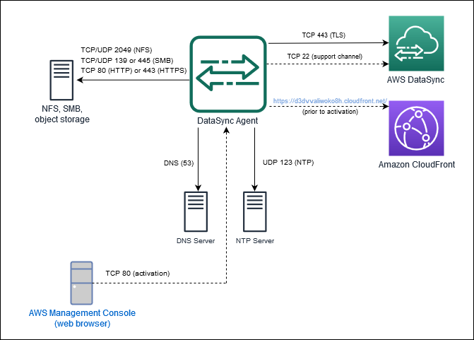
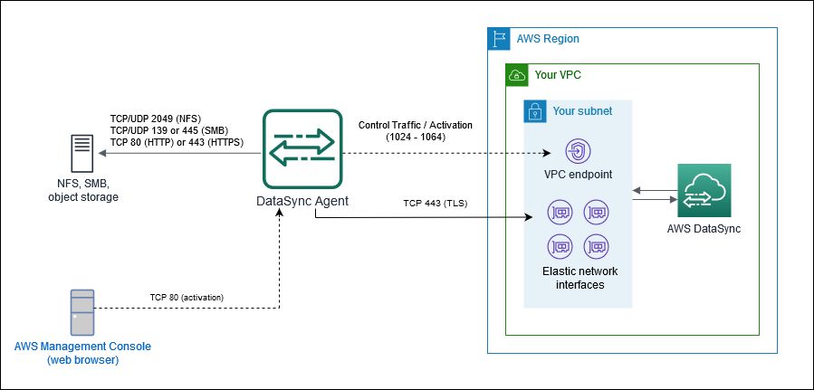

# AWS DataSync network requirements

Configuring your network is an important step in setting up AWS DataSync. Your network
configuration depends on several factors, such as what kind of storage systems you're
working with. It's also based on what kind of DataSync service endpoint that you plan to
use.

## IPv6 support

DataSync has dual-stack support for compatibility with both IPv4 and IPv6 networks. IPv6 support is available in all AWS Regions where the service is offered.
DataSync supports using IPv6 addresses with the following data sources:

- Elastic File System (EFS)
- Network File System (NFS)
- Server Message Block (SMB)
- Object storage

### IPv6-compatible agents for on-premises storage

In order to use DataSync in an IPv6 network environment, you need to use IPv6-compatible agents. These agents support both IPv4 and IPv6
connectivity, adapting to various network environments.

- For IPv6-only networks – no configuration changes required.
- For IPv4-only networks – no configuration changes required.
- For dual-stack (both IPv4 and IPv6) networks – let the agent select the protocol
  or manually configure it based on your preference.

#### Considerations for dual-stack networks

You can customize your agent's behavior through the local console in the following ways:

- Disable IPv6 so the agent cannot use IPv6 to reach local filesystems or the DataSync service.
- Set the agent's IP version to use for data transfers:
  - Set to IPv6 so that the agent will only use IPv6 for data transfers.
  - Set IPv4 so that the agent will only use IPv4 for data transfers.
  - Set to Auto (restores the default) so that the agent will automatically choose the protocol version
    (IPv4 or IPv6) for data transfers.

For more information about managing agent IP version settings, see [Performing maintenance on your agent](local-console-vm.md "local-console-vm.md").

###### Important

Agents built from images downloaded before July 16, 2025 do not support IPv6.

## Network requirements for on-premises, self-managed, other cloud, and edge storage

The following network requirements can apply to on-premises, self-managed, other
cloud, and edge storage systems. These are typically storage systems that you manage
or might be managed by another cloud provider.

###### Note

Depending on your network, you might need to allow traffic on ports other than
what's listed here for your DataSync agent to connect with your storage.

| From             | To                                                                                                                                                                                                                                                                                                               | Protocol                                                                                                                                                                                | Port                                                                                                                                                                                                     | How it's used by DataSync                                                                                                                                                                                                                                                                                                                                                                                                                                                                        |
| ---------------- | ---------------------------------------------------------------------------------------------------------------------------------------------------------------------------------------------------------------------------------------------------------------------------------------------------------------- | --------------------------------------------------------------------------------------------------------------------------------------------------------------------------------------- | -------------------------------------------------------------------------------------------------------------------------------------------------------------------------------------------------------- | ------------------------------------------------------------------------------------------------------------------------------------------------------------------------------------------------------------------------------------------------------------------------------------------------------------------------------------------------------------------------------------------------------------------------------------------------------------------------------------------------ | -------------------------------------------------------------------------------------------------------------------------------------------------------------------------------------------------------------------------------------------------------------------------------------------------------------------------------------------------------------------------------------------------------------------------------------------------------------------------------------------------------------------------------- | ----------------------------------------------------------------------------------------------------------------------------------------------------------------------------------------------------------------------------------------------------------------------------------------------------------------------------------------------------------------------------------------------------------------------------------------------------------------------------------------------------------------------------------------------------------------------------------------------------------------------------------------------------------------------------------------------------------------------------------------------- | ------------------------------------------------------------------------------------------------------------------------------------------------------------------------------------------------------------------------------------------------------------------------------------------------------------------------------------------------------------------------------------------------------------------------------------------------------------------------ | --------------------------------------------------------------------------------------------------------------------------------------------------------------------------------------------------------------------------------------------------------------------------------------------------- | -------------------- | --------------------------------------------------------------------------------------------------------------------------- |
| DataSync agent   | NFS file server                                                                                                                                                                                                                                                                                                  | TCP                                                                                                                                                                                     | 2049 (for NFS versions 4.1 and 4.0) 111 and 2049 (for NFS version 3.x)                                                                                                                                   | Mounts the NFS file server. DataSync supports NFS versions 3.x, 4.0, and 4.1.                                                                                                                                                                                                                                                                                                                                                                                                                    |
| DataSync agent   | SMB file server                                                                                                                                                                                                                                                                                                  | TCP                                                                                                                                                                                     | 139 or 445                                                                                                                                                                                               | Mounts the SMB file server. DataSync supports SMB versions 1.0 and later. For security reasons, we recommend using SMB version 3.0.2 or later. Earlier versions, such as SMB 1.0, contain known security vulnerabilities that attackers can exploit to compromise your data.                                                                                                                                                                                                                     |
| DataSync agent   | Object storage                                                                                                                                                                                                                                                                                                   | TCP                                                                                                                                                                                     | 443 (HTTPS) or 80 (HTTP) NoteDepending on your object storage, you might need to allow traffic on nonstandard HTTPS and HTTP ports (such as 8443 or 8080).                                               | Accesses your Amazon S3-compatible object storage on-premises or in other clouds.                                                                                                                                                                                                                                                                                                                                                                                                                |
| DataSync agent   | Hadoop cluster                                                                                                                                                                                                                                                                                                   | TCP                                                                                                                                                                                     | NameNode port (default is 8020) In most clusters, you can find this port number in the `core-site.xml` file under the `fs.default` or `fs.default.name` property (depending on the Hadoop distribution). | Accesses the NameNodes in your Hadoop cluster. Specify the port used when creating an HDFS location.                                                                                                                                                                                                                                                                                                                                                                                             |
| DataSync agent   | Hadoop cluster                                                                                                                                                                                                                                                                                                   | TCP                                                                                                                                                                                     | DataNode port (default is 50010) In most clusters, you can find this port number in the `hdfs-site.xml` file under the `dfs.datanode.address` property.                                                  | Accesses the DataNodes in your Hadoop cluster. The DataSync agent automatically determines the port to use.                                                                                                                                                                                                                                                                                                                                                                                      |
| DataSync agent   | Hadoop Key Management Server (KMS)                                                                                                                                                                                                                                                                               | TCP                                                                                                                                                                                     | KMS port (default is 9600)                                                                                                                                                                               | Accesses the KMS for your Hadoop cluster.                                                                                                                                                                                                                                                                                                                                                                                                                                                        |
| DataSync agent   | Kerberos Key Distribution Center (KDC) server                                                                                                                                                                                                                                                                    | TCP                                                                                                                                                                                     | KDC port (default is 88)                                                                                                                                                                                 | Authenticates with the Kerberos realm. This port is used only with HDFS and SMB locations that use Kerberos authentication.                                                                                                                                                                                                                                                                                                                                                                      |
| DataSync agent   | Storage system's management interface                                                                                                                                                                                                                                                                            | TCP                                                                                                                                                                                     | Depends on your network                                                                                                                                                                                  | Connects to your storage system.                                                                                                                                                                                                                                                                                                                                                                                                                                                                 | ## Network requirements for AWS storage services The network ports required for DataSync to connect to an AWS storage service during a transfer vary.                                                                                                                                                                                                                                                                                                                                                                            |
| From             | To                                                                                                                                                                                                                                                                                                               | Protocol                                                                                                                                                                                | Port                                                                                                                                                                                                     |                                                                                                                                                                                                                                                                                                                                                                                                                                                                                                  | ---                                                                                                                                                                                                                                                                                                                                                                                                                                                                                                                              | ---                                                                                                                                                                                                                                                                                                                                                                                                                                                                                                                                                                                                                                                                                                                                             | ---                                                                                                                                                                                                                                                                                                                                                                                                                                                                      | ---                                                                                                                                                                                                                                                                                                 |
| DataSync service | Amazon EFS                                                                                                                                                                                                                                                                                                       | TCP                                                                                                                                                                                     | 2049                                                                                                                                                                                                     |                                                                                                                                                                                                                                                                                                                                                                                                                                                                                                  | DataSync service                                                                                                                                                                                                                                                                                                                                                                                                                                                                                                                 | FSx for Windows File Server                                                                                                                                                                                                                                                                                                                                                                                                                                                                                                                                                                                                                                                                                                                     | See [file system access control for FSx for Windows File Server](../../../fsx/latest/WindowsGuide/limit-access-security-groups.md "../../../fsx/latest/WindowsGuide/limit-access-security-groups.md").                                                                                                                                                                                                                                                                   |
| DataSync service | FSx for Lustre                                                                                                                                                                                                                                                                                                   | See [file system access control for FSx for Lustre](../../../fsx/latest/LustreGuide/limit-access-security-groups.md "../../../fsx/latest/LustreGuide/limit-access-security-groups.md"). |                                                                                                                                                                                                          | DataSync service                                                                                                                                                                                                                                                                                                                                                                                                                                                                                 | FSx for OpenZFS                                                                                                                                                                                                                                                                                                                                                                                                                                                                                                                  | See [file system access control for FSx for OpenZFS](../../../fsx/latest/OpenZFSGuide/limit-access-security-groups.md "../../../fsx/latest/OpenZFSGuide/limit-access-security-groups.md").                                                                                                                                                                                                                                                                                                                                                                                                                                                                                                                                                      |
| DataSync service | FSx for ONTAP                                                                                                                                                                                                                                                                                                    | TCP                                                                                                                                                                                     | 111, 635, and 2049 (NFS) 445 (SMB)                                                                                                                                                                       |                                                                                                                                                                                                                                                                                                                                                                                                                                                                                                  | DataSync service                                                                                                                                                                                                                                                                                                                                                                                                                                                                                                                 | Amazon S3                                                                                                                                                                                                                                                                                                                                                                                                                                                                                                                                                                                                                                                                                                                                       | N/A (DataSync connects to S3 buckets on your behalf)                                                                                                                                                                                                                                                                                                                                                                                                                     | ## Network requirements for public or FIPS service endpoints Your DataSync agent requires the following network access when using public or FIPS service endpoints. If you use a firewall or router to filter or limit network traffic, configure your firewall or router to allow these endpoints. |
| From             | To                                                                                                                                                                                                                                                                                                               | Protocol                                                                                                                                                                                | Port                                                                                                                                                                                                     | How it's used                                                                                                                                                                                                                                                                                                                                                                                                                                                                                    | Endpoints accessed                                                                                                                                                                                                                                                                                                                                                                                                                                                                                                               |
| ---              | ---                                                                                                                                                                                                                                                                                                              | ---                                                                                                                                                                                     | ---                                                                                                                                                                                                      | ---                                                                                                                                                                                                                                                                                                                                                                                                                                                                                              | ---                                                                                                                                                                                                                                                                                                                                                                                                                                                                                                                              |
| Your web browser | DataSync agent                                                                                                                                                                                                                                                                                                   | TCP                                                                                                                                                                                     | 80 (HTTP)                                                                                                                                                                                                | Allows your browser to obtain the DataSync agent's activation key. Once activated, DataSync closes the agent's port 80. Your agent doesn't require port 80 to be publicly accessible. The required level of access to port 80 depends on your network configuration. NoteYou can get the activation key without a connection between your browser and agent. For more information, see [Getting an activation key](activate-agent.md#get-activation-key "activate-agent.md#get-activation-key"). | N/A                                                                                                                                                                                                                                                                                                                                                                                                                                                                                                                              |
| DataSync agent   | Amazon CloudFront                                                                                                                                                                                                                                                                                                | TCP                                                                                                                                                                                     | 443 (HTTPS)                                                                                                                                                                                              | Helps bootstrap your DataSync agent prior to activation.                                                                                                                                                                                                                                                                                                                                                                                                                                         | **AWS Regions**:  • `d3dvvaliwoko8h.cloudfront.net` **AWS GovCloud (US) Regions**:  • `s3.us-gov-west-1.amazonaws.com/fmrsendpoints-endpointsbucket-go4p5gpna6sk`                                                                                                                                                                                                                                                                                                                                                          |
| DataSync agent   | AWS                                                                                                                                                                                                                                                                                                              | TCP                                                                                                                                                                                     | 443 (HTTPS)                                                                                                                                                                                              | Activates your DataSync agent and associates it with your AWS account. You can block the public endpoint after activation.                                                                                                                                                                                                                                                                                                                                                                       | The `activation-region` is the AWS Region where you activate your DataSync agent.**Public endpoint activation**:  • `activation.datasync.`activation-region`.amazonaws.com` **FIPS endpoint activation**:  • `activation.datasync-fips.`activation-region`.amazonaws.com`                                                                                                                                                                                                                                                  |
| DataSync agent   | AWS                                                                                                                                                                                                                                                                                                              | TCP                                                                                                                                                                                     | 443 (HTTPS)                                                                                                                                                                                              | Allows communication between the DataSync agent and DataSync service endpoint. For information, see [Choosing a service endpoint for your AWS DataSync agent](choose-service-endpoint.md "choose-service-endpoint.md").                                                                                                                                                                                                                                                                          | The `activation-region` is the AWS Region where you activate your DataSync agent. Depending on what you're using DataSync for, you might not need to allow access to every endpoint listed here. **DataSync control plane endpoints**:  • **Public endpoint**: `cp.datasync.`activation-region`.amazonaws.com`  • **FIPS endpoint**: `cp.datasync-fips.`activation-region`.amazonaws.com` **DataSync data plane endpoint** (for transfer tasks only):  • ``your-task-id`.datasync-dp.`activation-region`.amazonaws.com` |
| Your client      | AWS                                                                                                                                                                                                                                                                                                              | TCP                                                                                                                                                                                     | 443 (HTTPS)                                                                                                                                                                                              | Allows you to make DataSync API requests.                                                                                                                                                                                                                                                                                                                                                                                                                                                        | The `activation-region` is the AWS Region where you activate your DataSync agent. **Public endpoint**:  • `datasync.`activation-region`.amazonaws.com` **FIPS endpoint**:  • `datasync-fips.`activation-region`.amazonaws.com`                                                                                                                                                                                                                                                                                             |
| DataSync agent   | AWS                                                                                                                                                                                                                                                                                                              | TCP                                                                                                                                                                                     | 443 (HTTPS)                                                                                                                                                                                              | Allows the DataSync agent to get updates from AWS. For more information, see [Managing your AWS DataSync agent](managing-agent.md "managing-agent.md").                                                                                                                                                                                                                                                                                                                                          | The `activation-region` is the AWS Region where you activate your DataSync agent.  • `amazonlinux.default.amazonaws.com`  • `cdn.amazonlinux.com`  • `amazonlinux-2-repos-`activation-region`.s3.dualstack.`activation-region`.amazonaws.com`  • `amazonlinux-2-repos-`activation-region`.s3.`activation-region`.amazonaws.com`  • `*.s3.`activation-region`.amazonaws.com`  • `*.s3.dualstack.`activation-region`.amazonaws.com`                                                                              |
| DataSync agent   | Domain Name Service (DNS) server                                                                                                                                                                                                                                                                                 | TCP/UDP                                                                                                                                                                                 | 53 (DNS)                                                                                                                                                                                                 | Allows communication between the DataSync agent and DNS server.                                                                                                                                                                                                                                                                                                                                                                                                                                  | N/A                                                                                                                                                                                                                                                                                                                                                                                                                                                                                                                              |
| DataSync agent   | AWS                                                                                                                                                                                                                                                                                                              | TCP                                                                                                                                                                                     | 22 (Support channel)                                                                                                                                                                                     | Allows AWS Support to access your DataSync agent to help you troubleshoot issues. You don't need this port open for normal operation.                                                                                                                                                                                                                                                                                                                                                            | **AWS Support channel:**  • `54.201.223.107`                                                                                                                                                                                                                                                                                                                                                                                                                                                                                  |
| DataSync agent   | Network Time Protocol (NTP) server                                                                                                                                                                                                                                                                               | UDP                                                                                                                                                                                     | 123 (NTP)                                                                                                                                                                                                | Allows local systems to synchronize the VM time to the host time.                                                                                                                                                                                                                                                                                                                                                                                                                                | **NTP:**  • `0.amazon.pool.ntp.org`  • `1.amazon.pool.ntp.org`  • `2.amazon.pool.ntp.org`  • `3.amazon.pool.ntp.org` NoteTo change the default NTP configuration of your VM agent to use a different NTP server using the local console, see [View and manage agent system time server configuration](local-console-vm.md#time-management "local-console-vm.md#time-management").                                                                                                                                    | The following diagram shows the ports required by DataSync when using public or FIPS service endpoints.  ## Network requirements for VPC or FIPS VPC service endpoints A virtual private cloud (VPC) endpoint provides a private connection between your agent and AWS that doesn't cross the internet or use public IP addresses. This also helps prevent packets from entering or exiting the network. For more information, see [Choosing a VPC service endpoint](choose-service-endpoint.md#datasync-in-vpc "choose-service-endpoint.md#datasync-in-vpc"). DataSync requires the following ports for your agent to use a VPC service endpoint. |
| From             | To                                                                                                                                                                                                                                                                                                               | Protocol                                                                                                                                                                                | Port                                                                                                                                                                                                     | How it's used                                                                                                                                                                                                                                                                                                                                                                                                                                                                                    |                                                                                                                                                                                                                                                                                                                                                                                                                                                                                                                                  | ---                                                                                                                                                                                                                                                                                                                                                                                                                                                                                                                                                                                                                                                                                                                                             | ---                                                                                                                                                                                                                                                                                                                                                                                                                                                                      | ---                                                                                                                                                                                                                                                                                                 | ---                  | ---                                                                                                                         |
| Your web browser | Your DataSync agent                                                                                                                                                                                                                                                                                              | TCP                                                                                                                                                                                     | 80 (HTTP)                                                                                                                                                                                                | Allows your browser to obtain the agent activation key. Once activated, DataSync closes the agent's port 80. Your agent doesn't require port 80 to be publicly accessible. The required level of access to port 80 depends on your network configuration. NoteYou can get the activation key without a connection between your browser and agent. For more information, see [Getting an activation key](activate-agent.md#get-activation-key "activate-agent.md#get-activation-key").            |                                                                                                                                                                                                                                                                                                                                                                                                                                                                                                                                  | DataSync agent                                                                                                                                                                                                                                                                                                                                                                                                                                                                                                                                                                                                                                                                                                                                  | Your DataSync VPC service endpoint To find the endpoint's IP address, open the [Amazon VPC console](https://console.aws.amazon.com/vpc/ "https://console.aws.amazon.com/vpc/"), choose **Endpoints**, and select your DataSync VPC service endpoint. On the **Subnets** tab, locate the IP address for your [VPC service endpoint's subnet](choose-service-endpoint.md#datasync-in-vpc "choose-service-endpoint.md#datasync-in-vpc"). This is the endpoint's IP address. | TCP                                                                                                                                                                                                                                                                                                 | 1024-1064            | For [control plane traffic](networking-datasync.md#datasync-traffic-flows "networking-datasync.md#datasync-traffic-flows"). |
| DataSync agent   | Your DataSync task's [network interfaces](required-network-interfaces.md "required-network-interfaces.md") To find the IP addresses of these interfaces, see [Viewing your network interfaces](required-network-interfaces.md#view-network-interfaces "required-network-interfaces.md#view-network-interfaces"). | TCP                                                                                                                                                                                     | 443 (HTTPS)                                                                                                                                                                                              | For [data plane traffic](networking-datasync.md#datasync-traffic-flows "networking-datasync.md#datasync-traffic-flows").                                                                                                                                                                                                                                                                                                                                                                         |                                                                                                                                                                                                                                                                                                                                                                                                                                                                                                                                  | DataSync agent                                                                                                                                                                                                                                                                                                                                                                                                                                                                                                                                                                                                                                                                                                                                  | Your DataSync VPC service endpoint                                                                                                                                                                                                                                                                                                                                                                                                                                       | TCP                                                                                                                                                                                                                                                                                                 | 22 (Support channel) | To allow AWS Support to access your DataSync agent for troubleshooting. You don't need this port open for normal operation. |

| The following diagram shows the ports required by DataSync when using VPC service endpoints. 
