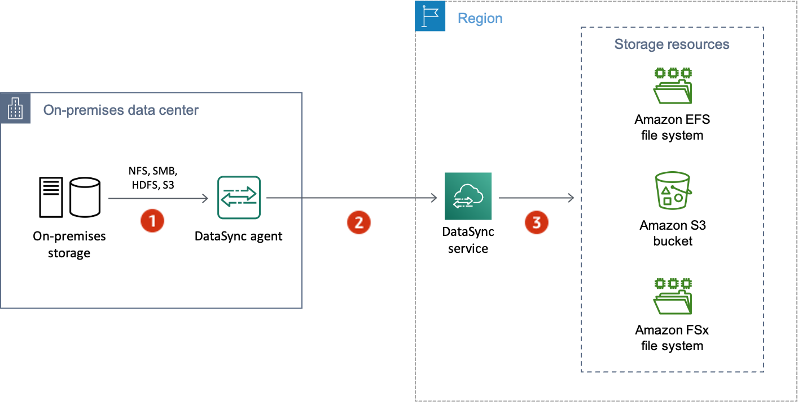

# AWS DataSync encryption in transit

Your storage data (including metadata) is encrypted in transit, but how it's encrypted
throughout the transfer depends on your source and destination locations.

When connecting with a location, DataSync uses the most secure options provided by that
location's data access protocol. For example, when connecting with a file system using
Server Message Block (SMB), DataSync uses the security features provided by SMB.

## Network connections

in a transfer

DataSync requires three network connections to copy data: a connection to read data
from a source location, another to transfer data between locations, and one more to
write data to a destination location.

The following diagram is an example of the network connections that DataSync uses to
transfer data from an on-premises storage system to an AWS storage service. To
understand where the connections happen and how data is protected as it transfers
through each connection, use the accompanying table.

| Reference | Network connection                       | Description                                                                                                                                                                                                                                                                                                                                                                                            |
| --------- | ---------------------------------------- | ------------------------------------------------------------------------------------------------------------------------------------------------------------------------------------------------------------------------------------------------------------------------------------------------------------------------------------------------------------------------------------------------------ | ------------------------------------------------------------------------------------------------------------------------------------------------------------------------------------------------------------------------------------------------------------------------------------------------------------------------------------------------------------------------------------------------------------------------------------------------------------------------------------------------------------------------------------------------------------------------------------------------------------------------------------------------------------------------------------------------------------------------------------------------------------------------------------------------------------------------------------------------------------------------------------------------------------------------------------------------------------------------------------------------------------------------------------------------------------------------------------------------------------------------------------------------------------------------------------------------------------------------------------------------------------------------------------------------------------------------------------------------------------------------------------------------------------------------------------------------------------------------------------------------------------------------------------------------------------------------------------------------------------------------------------------------------------------------------------------------------------------------------------------------------------------------------------------------------------------------------------------------------------------------------------------------------------------------------------------------------------------------------------------------------------------------------------------------------------------------------------------------------------------------------------------------------------------------------- |
| 1         | Reading data from the source location    | DataSync connects by using the storage system's protocol for accessing data (for example, SMB or the Amazon S3 API). For this connection, data is protected by using the security features of the storage system unless DataSync doesn't support those features. For example, DataSync currently doesn't support Kerberos authentication with NFS file servers or when using TDE encryption with HDFS. |
| 2         | Transferring data between locations      | For this connection, DataSync encrypts all network traffic with mutual Transport Layer Security (mTLS) 1.3.                                                                                                                                                                                                                                                                                            |
| 3         | Writing data to the destination location | As with the source location, DataSync connects by using the storage system's protocol for accessing data. Data is again protected by using the security features of the storage system unless DataSync doesn't support those features.                                                                                                                                                                 | Learn how your data is encrypted in transit when DataSync connects to the following AWS storage services:  • [Amazon EFS](../../../efs/latest/ug/encryption-in-transit.md "../../../efs/latest/ug/encryption-in-transit.md")  • [Amazon FSx for Windows File Server](../../../fsx/latest/WindowsGuide/encryption-in-transit.md "../../../fsx/latest/WindowsGuide/encryption-in-transit.md")  • [Amazon FSx for Lustre](../../../fsx/latest/LustreGuide/encryption-in-transit-fsxl.md "../../../fsx/latest/LustreGuide/encryption-in-transit-fsxl.md")  • [Amazon FSx for OpenZFS](../../../fsx/latest/OpenZFSGuide/encryption-transit.md "../../../fsx/latest/OpenZFSGuide/encryption-transit.md")  • [Amazon FSx for NetApp ONTAP](../../../fsx/latest/ONTAPGuide/encryption-in-transit.md "../../../fsx/latest/ONTAPGuide/encryption-in-transit.md")  • [Amazon S3](../../../AmazonS3/latest/userguide/UsingEncryption.md "../../../AmazonS3/latest/userguide/UsingEncryption.md") ## TLS ciphers When transferring data between locations, DataSync uses different TLS ciphers. The TLS cipher depends on the type of service endpoint that your agent uses to communicate with DataSync. (For more information, see [Choosing a service endpoint for your AWS DataSync agent](choose-service-endpoint.md "choose-service-endpoint.md").) ###### Contents  • [Public or VPC endpoints](encryption-in-transit.md#tls-ciphers-in-transit-non-fips "encryption-in-transit.md#tls-ciphers-in-transit-non-fips")  • [FIPS endpoints](encryption-in-transit.md#tls-ciphers-in-transit-fips "encryption-in-transit.md#tls-ciphers-in-transit-fips") ### Public or VPC endpoints For public and virtual private cloud (VPC) service endpoints, DataSync uses one of the following TLS ciphers:  • TLS_ECDHE_RSA_WITH_AES_256_GCM_SHA384 (ecdh_x25519)  • TLS_ECDHE_RSA_WITH_CHACHA20_POLY1305_SHA256 (ecdh_x25519)  • TLS_ECDHE_RSA_WITH_AES_128_GCM_SHA256 (ecdh_x25519) ### FIPS endpoints For Federal Information Processing Standard (FIPS) service endpoints, DataSync uses the following TLS cipher:  • TLS_AES_128_GCM_SHA256 (secp256r1) |
