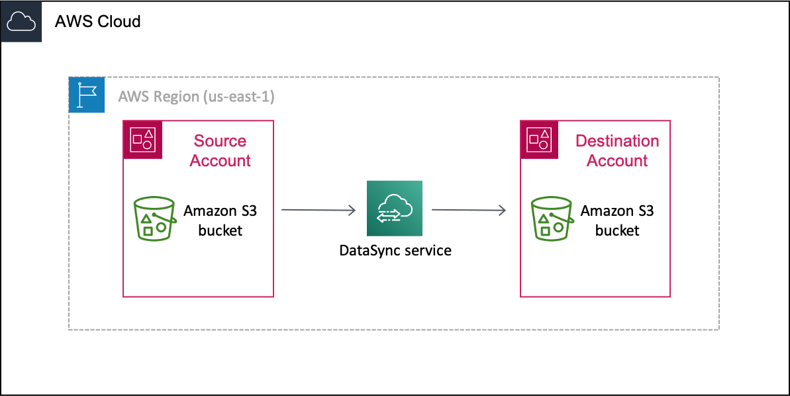
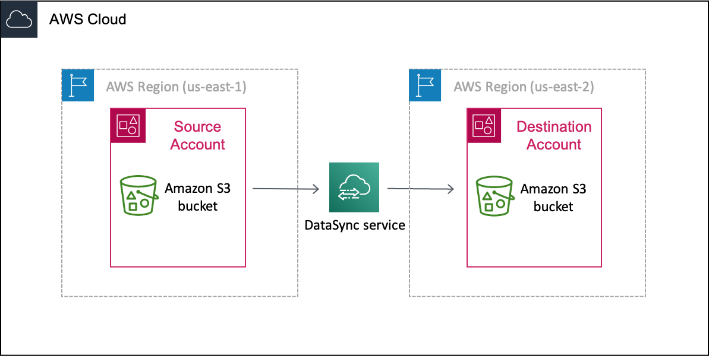

# Tutorial: Transferring data between

Amazon S3 buckets across AWS accounts

With AWS DataSync, you can transfer data between Amazon S3 buckets that belong to different
AWS accounts.

###### Important

Transferring data across AWS accounts using the methods in this tutorial works only
with Amazon S3. Additionally, this tutorial can help you transfer data between S3 buckets
that are also in different AWS Regions.

## Overview

It's not uncommon to transfer data between AWS accounts, especially if you have
separate teams managing your organization's resources. Here's what a cross-account
transfer using DataSync can look like:

- **Source account**: The AWS account for
  managing the S3 bucket that you need to transfer data from.
- **Destination account**: The AWS account for
  managing the S3 bucket that you need to transfer data to.

Transfers across accounts
The following diagram illustrates a scenario where you transfer data from
an S3 bucket to another S3 bucket that's in a different
AWS account.



Transfers across accounts and Regions
The following diagram illustrates a scenario where you transfer data from
an S3 bucket to another S3 bucket that's in a different AWS account and
Region.



## Prerequisite:

Required source account permissions

For your source AWS account, there are two sets of permissions to consider with this
kind of cross-account transfer:

- _User permissions_ that allow a user to work with DataSync
  (this might be you or your storage administrator). These permissions let you
  create DataSync locations and tasks.
- _DataSync service permissions_ that allow DataSync to transfer
  data to your destination account bucket.

In your source account, add at least the following permissions to an IAM
role for creating your DataSync locations and task. For information on how to add
permissions to a role, see [creating](../../../IAM/latest/UserGuide/id_roles_create.md "../../../IAM/latest/UserGuide/id_roles_create.md") or [modifying](../../../IAM/latest/UserGuide/id_roles_manage_modify.md "../../../IAM/latest/UserGuide/id_roles_manage_modify.md") an IAM role.

JSON

```
`{
 "Version":"2012-10-17",
 "Statement": [
 {
 "Sid": "SourceUserRolePermissions",
 "Effect": "Allow",
 "Action": [
 "datasync:CreateLocationS3",
 "datasync:CreateTask",
 "datasync:DescribeLocation*",
 "datasync:DescribeTaskExecution",
 "datasync:ListLocations",
 "datasync:ListTaskExecutions",
 "datasync:DescribeTask",
 "datasync:CancelTaskExecution",
 "datasync:ListTasks",
 "datasync:StartTaskExecution",
 "s3:GetBucketLocation",
 "s3:ListAllMyBuckets"
 ],
 "Resource": "*"
 },
 {
 "Sid": "IAMPermissions",
 "Effect": "Allow",
 "Action": [
 "iam:CreateRole",
 "iam:ListRoles",
 "iam:CreatePolicy"
 ],
 "Resource": "arn:aws:iam::111122223333:role/DataSync-*"
 },
 {
 "Sid": "IAMAttachRolePermissions",
 "Effect": "Allow",
 "Action": [
 "iam:AttachRolePolicy"
 ],
 "Resource": "arn:aws:iam::111122223333:role/DataSync-*",
 "Condition": {
 "ArnLike": {
 "iam:PolicyARN": [
 "arn:aws:iam::111122223333:policy/DataSync-*",
 "arn:aws:iam::aws:policy/AmazonS3ReadOnlyAccess",
 "arn:aws:iam::aws:policy/service-role/AWSDataSyncFullAccess"
 ]
 }
 }
 },
 {
 "Effect": "Allow",
 "Action": [
 "iam:PassRole"
 ],
 "Resource": "*",
 "Condition": {
 "StringEquals": {
 "iam:PassedToService": [
 "datasync.amazonaws.com"
 ]
 }
 }
 }
 ]
}`

```

###### Tip

To set up your _user permissions_, consider using [AWSDataSyncFullAccess](security-iam-awsmanpol.md#security-iam-awsmanpol-awsdatasyncfullaccess "security-iam-awsmanpol.md#security-iam-awsmanpol-awsdatasyncfullaccess"). This is an AWS managed policy that
provides a user full access to DataSync and minimal access to its
dependencies.

The DataSync service needs the following permissions in your source account to
transfer data to your destination account bucket.

Later in this tutorial, you add these permissions when [creating an
IAM role](#s3-s3-cross-account-create-iam-role-source-account "#s3-s3-cross-account-create-iam-role-source-account") for DataSync. You also specify this role
(`source-datasync-role`) in your
[destination bucket policy](#s3-s3-cross-account-update-s3-policy-destination-account "#s3-s3-cross-account-update-s3-policy-destination-account") and when [creating your DataSync
destination location](#s3-s3-cross-account-create-locations "#s3-s3-cross-account-create-locations").

JSON

```
`{
 "Version":"2012-10-17",
 "Statement": [
 {
 "Action": [
 "s3:GetBucketLocation",
 "s3:ListBucket",
 "s3:ListBucketMultipartUploads"
 ],
 "Effect": "Allow",
 "Resource": "arn:aws:s3:::`amzn-s3-demo-destination-bucket`"
 },
 {
 "Action": [
 "s3:AbortMultipartUpload",
 "s3:DeleteObject",
 "s3:GetObject",
 "s3:ListMultipartUploadParts",
 "s3:PutObject",
 "s3:GetObjectTagging",
 "s3:PutObjectTagging"
 ],
 "Effect": "Allow",
 "Resource": "arn:aws:s3:::`amzn-s3-demo-destination-bucket`/*"
 }
 ]
}`

```

## Prerequisite:

Required destination account permissions

In your destination account, your _user permissions_ must allow you
to update your destination bucket's policy and disable its access control lists (ACLs).
For more information on these specific permissions, see the [_[Amazon S3 User Guide](../../../AmazonS3/latest/userguide.md "../../../AmazonS3/latest/userguide.md")_](../../../AmazonS3/latest/userguide/Welcome.md "../../../AmazonS3/latest/userguide/Welcome.md").

## Step 1: In your

source account, create a DataSync IAM role for destination bucket access

In your source AWS account, you need an IAM role that gives DataSync the permissions
to transfer data to your destination account bucket.

Since you're transferring across accounts, you must create the role manually. (DataSync
can create this role for you in the console when transferring in the same
account.)

Create an IAM role with DataSync as the trusted entity.

1. Log in to the AWS Management Console with your source account.
2. Open the IAM console at
   [https://console.aws.amazon.com/iam/](https://console.aws.amazon.com/iam/ "https://console.aws.amazon.com/iam/").
3. In the left navigation pane, under **Access
   management**, choose **Roles**, and then choose
   **Create role**.
4. On the **Select trusted entity** page, for
   **Trusted entity type**, choose
   **AWS service**.
5. For **Use case**, choose **DataSync**
   in the dropdown list and select **DataSync**. Choose
   **Next**.
6. On the **Add permissions** page, choose
   **Next**.
7. Give your role a name and choose **Create
   role**.
   For more information, see [Creating a role for an AWS service (console)](../../../IAM/latest/UserGuide/id_roles_create_for-service.md#roles-creatingrole-service-console "../../../IAM/latest/UserGuide/id_roles_create_for-service.md#roles-creatingrole-service-console") in the
   _IAM User Guide_.

The IAM role that you just created needs the permissions that allow DataSync to
transfer data to the S3 bucket in your destination account.

1. On the **Roles** page of the IAM console, search
   for the role that you just created and choose its name.
2. On the role's details page, choose the
   **Permissions** tab. Choose **Add
   permissions** then **Create inline
   policy**.
3. Choose the **JSON** tab and do the following:
   1. Paste the following JSON into the policy editor:

   ###### Note

   The value for `aws:ResourceAccount` should be
   the account ID that owns the Amazon S3 bucket specified in the
   policy.

   JSON

   ```
   `{
    "Version":"2012-10-17",
    "Statement": [
    {
    "Action": [
    "s3:GetBucketLocation",
    "s3:ListBucket",
    "s3:ListBucketMultipartUploads"
    ],
    "Effect": "Allow",
    "Resource": "arn:aws:s3:::amzn-s3-demo-destination-bucket",
    "Condition": {
    "StringEquals": {
    "aws:ResourceAccount": "123456789012"
    }
    }
    },
    {
    "Action": [
    "s3:AbortMultipartUpload",
    "s3:DeleteObject",
    "s3:GetObject",
    "s3:GetObjectTagging",
    "s3:GetObjectVersion",
    "s3:GetObjectVersionTagging",
    "s3:ListMultipartUploadParts",
    "s3:PutObject",
    "s3:PutObjectTagging"
    ],
    "Effect": "Allow",
    "Resource": "arn:aws:s3:::amzn-s3-demo-destination-bucket/*",
    "Condition": {
    "StringEquals": {
    "aws:ResourceAccount": "123456789012"
    }
    }
    }
    ]
   }`

   ```

   2. Replace each instance of
      `amzn-s3-demo-destination-bucket`
      with the name of the S3 bucket in your destination
      account.

4. Choose **Next**. Give your policy a name and choose
   **Create policy**.

## Step 2: In

your destination account, update your S3 bucket policy

In your destination account, modify the destination S3 bucket policy to include the
[DataSync IAM
role](#s3-s3-cross-account-create-iam-role-source-account "#s3-s3-cross-account-create-iam-role-source-account") that you created in your source account.

**Before you begin**: Make sure that you have the [required permissions
for your destination account](#s3-s3-cross-account-required-permissions-dest-account "#s3-s3-cross-account-required-permissions-dest-account").

1. In the AWS Management Console, switch to your destination account.
2. Open the Amazon S3 console at
   [https://console.aws.amazon.com/s3/](https://console.aws.amazon.com/s3/ "https://console.aws.amazon.com/s3/").
3. In the left navigation pane, choose **Buckets**.
4. In the **Buckets** list, choose the S3 bucket that
   you're transferring data to.
5. On the bucket's detail page, choose the
   **Permissions** tab.
6. Under **Bucket policy**, choose
   **Edit** and do the following to modify your S3
   bucket policy:
   1. Update what's in the editor to include the following policy
      statements:

   JSON

   ```
   `{
    "Version":"2012-10-17",
    "Statement": [
    {
    "Sid": "DataSyncCreateS3LocationAndTaskAccess",
    "Effect": "Allow",
    "Principal": {
    "AWS": "arn:aws:iam::`111122223333`:role/`source-datasync-role`"
    },
    "Action": [
    "s3:GetBucketLocation",
    "s3:ListBucket",
    "s3:ListBucketMultipartUploads",
    "s3:AbortMultipartUpload",
    "s3:DeleteObject",
    "s3:GetObject",
    "s3:ListMultipartUploadParts",
    "s3:PutObject",
    "s3:GetObjectTagging",
    "s3:PutObjectTagging"
    ],
    "Resource": [
    "arn:aws:s3:::`amzn-s3-demo-destination-bucket`",
    "arn:aws:s3:::`amzn-s3-demo-destination-bucket`/*"
    ]
    }
    ]
   }`

   ```

   2. Replace each instance of
      `source-account`
      with the AWS account ID for your source account.
   3. Replace
      `source-datasync-role`
      with the [IAM role that you created for DataSync in your source
      account](#s3-s3-cross-account-create-iam-role-source-account "#s3-s3-cross-account-create-iam-role-source-account").
   4. Replace each instance of
      `amzn-s3-demo-destination-bucket`
      with the name of the S3 bucket in your destination
      account.

7. Choose **Save changes**.

## Step 3: In your

destination account, disable ACLs for your S3 bucket

It's important that all the data that you transfer to the S3 bucket belongs to your
destination account. To ensure that this account owns the data, disable the bucket's
access control lists (ACLs). For more information, see [Controlling ownership of
objects and disabling ACLs for your bucket](../../../AmazonS3/latest/userguide/about-object-ownership.md "../../../AmazonS3/latest/userguide/about-object-ownership.md") in the
_Amazon S3 User Guide_.

**Before you begin**: Make sure that you have the [required permissions
for your destination account](#s3-s3-cross-account-required-permissions-dest-account "#s3-s3-cross-account-required-permissions-dest-account").

1. While still logged in to the S3 console with your destination account,
   choose the S3 bucket that you're transferring data to.
2. On the bucket's detail page, choose the
   **Permissions** tab.
3. Under **Object Ownership**, choose
   **Edit**.
4. If it isn't already selected, choose the **ACLs disabled
   (recommended)** option.
5. Choose **Save changes**.

## Step 4: In your source account,

create your DataSync locations

In your source account, create the DataSync locations for your source and destination S3
buckets.

**Before you begin**: Make sure that you have the [required
permissions for your source account](#s3-s3-cross-account-required-permissions-source-account "#s3-s3-cross-account-required-permissions-source-account").

- In your source account, create a [location](create-s3-location.md#create-s3-location-how-to "create-s3-location.md#create-s3-location-how-to") for the S3
  bucket that you're transferring data from.
  While still in your source account, create a location for the S3 bucket that
  you're transferring data to.

Since you can't create cross-account locations by using the DataSync console
interface, these instructions require that you run a
`create-location-s3` command to create your destination location.
We recommend running the command by using AWS CloudShell, a browser-based,
pre-authenticated shell that you launch directly from the console. CloudShell
allows you to run AWS CLI commands like `create-location-s3` without
downloading or installing command line tools.

###### Note

To complete the following steps by using a command line tool other than
CloudShell, make sure that your [AWS CLI profile](../../../cli/latest/userguide/cli-configure-role.md "../../../cli/latest/userguide/cli-configure-role.md")
uses the same IAM role that includes the [required user permissions](#s3-s3-cross-account-required-permissions-source-account "#s3-s3-cross-account-required-permissions-source-account") to use DataSync in your source
account.

###### To create a DataSync destination location by using CloudShell

1. While still in your source account, do one of the following to launch
   CloudShell from the console:
   - Choose the CloudShell icon on the console navigation bar.
     It's located to the right of the search box.
   - Use the search box on the console navigation bar to search for
     **CloudShell** and then choose the
     **CloudShell** option.

2. Copy the following `create-location-s3` command:

```
aws datasync create-location-s3 \
  --s3-bucket-arn arn:aws:s3:::`amzn-s3-demo-destination-bucket` \
  --region `amzn-s3-demo-destination-bucket-region` \
  --s3-config '{
    "BucketAccessRoleArn":"arn:aws:iam::`source-account-id`:role/`source-datasync-role`"
  }'
```

3. Replace
   `amzn-s3-demo-destination-bucket`
   with the name of the S3 bucket in your destination account.
4. If your destination bucket is in a different Region than your source
   bucket, replace
   `amzn-s3-demo-destination-bucket-region`
   with the Region where the destination bucket resides (for example,
   `us-east-2`). Remove this
   option if your buckets are in the same Region.
5. Replace `source-account-id` with
   the source AWS account ID.
6. Replace `source-datasync-role`
   with the [DataSync
   IAM role](#s3-s3-cross-account-create-iam-role-source-account "#s3-s3-cross-account-create-iam-role-source-account") that you created in your source account.
7. Run the command in CloudShell.

If the command returns a DataSync location ARN similar to this, you
successfully created the location:

```
{
  "LocationArn": "arn:aws:datasync:us-east-2:123456789012:location/loc-abcdef01234567890"
}
```

8. In the left navigation pane, expand **Data
   transfer**, then choose **Locations**.
9. If you created the location in a different Region, choose that Region
   in the navigation pane.
   From your source account, you can see the S3 location that you just created
   for your destination account bucket.

## Step 5: In your source

account, create and start your DataSync task

Before starting a DataSync task to transfer your data, let's recap what you've done so
far:

- In your source account, you created an IAM role that allows DataSync to
  transfer data to the S3 bucket in your destination account.
- In your destination account, you configured your S3 bucket so that DataSync can
  transfer data to it.
- In your source account, you created the DataSync source and destination locations
  for your transfer.

1. While still using the DataSync console in your source account, expand
   **Data transfer** in the left navigation pane, then
   choose **Tasks** and **Create
   task**.
2. If the bucket in your destination account is in a different Region
   than the bucket in your source account, choose the destination bucket's
   Region in the top navigation pane.

###### Important

To avoid a network connection error, you must create your DataSync
task in the same Region as the destination location. 3. On the **Configure source location** page, do the
following:

    1. Select **Choose an existing
     location**.
    2. (For transfers across Regions) In the
     **Region** dropdown, choose the Region
     where the source bucket resides.
    3. For **Existing locations**, choose the source
     location for the S3 bucket that you're transferring data from,
     then choose **Next**.

4. On the **Configure destination location** page, do
   the following:
   1. Select **Choose an existing
      location**.
   2. For **Existing locations**, choose the
      destination location for the S3 bucket that you're transferring
      data to, then choose **Next**.

5. On the **Configure settings** page, choose a
   **Task mode**.

###### Tip

We recommend using **Enhanced** mode. For more
information, see [Choosing a task mode for your data transfer](choosing-task-mode.md "choosing-task-mode.md"). 6. Give the task a name and configure additional settings, such as
specifying an Amazon CloudWatch log group. Choose
**Next**. 7. On the **Review** page, review your settings and
choose **Create task**. 8. On the task's details page, choose **Start**, and
then choose one of the following:

    * To run the task without modification, choose **Start
     with defaults**.
    * To modify the task before running it, choose **Start
     with overriding options**.

When your task finishes, check the S3 bucket in your destination account. You
should see the data that moved from your source account bucket.

## Troubleshooting

Refer to the following information if you run into issues trying to complete your
cross-account transfer.

**Connection errors**

When transferring between S3 buckets in different AWS accounts and Regions with Basic mode tasks, you might get a network connection error when starting your DataSync task. To resolve this, use an Enhanced mode task. Alternatively, create a Basic mode task in the same Region as your destination location and try running that task.

## Related: Cross-account

transfers with S3 buckets using server-side encryption

If you're trying to do this transfer with S3 buckets using server-side encryption, see
the [AWS Storage Blog](https://aws.amazon.com/blogs/storage/transfer-customer-managed-sse-kms-encrypted-objects-across-aws-accounts-and-regions-using-aws-datasync/ "https://aws.amazon.com/blogs/storage/transfer-customer-managed-sse-kms-encrypted-objects-across-aws-accounts-and-regions-using-aws-datasync/") for instructions.
