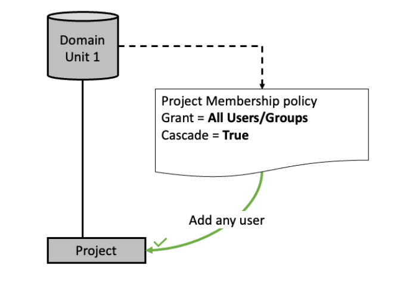
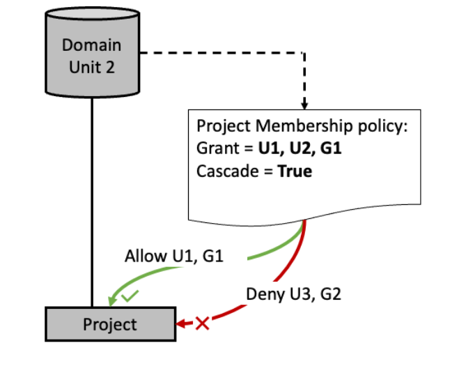
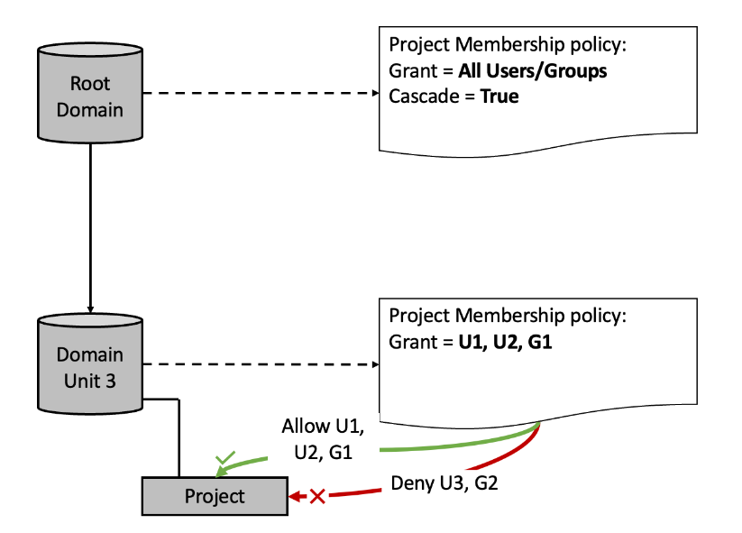
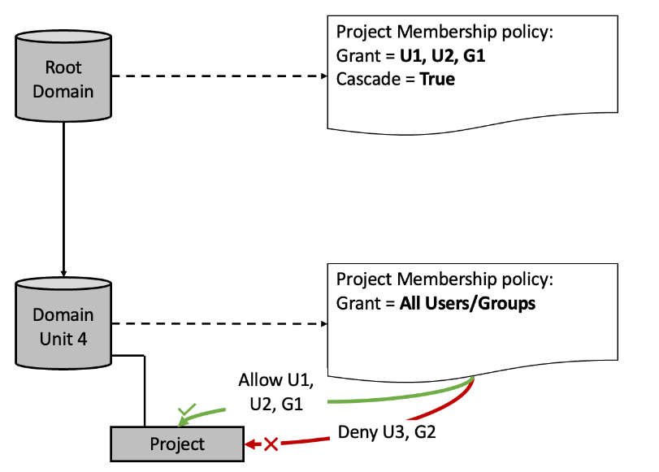
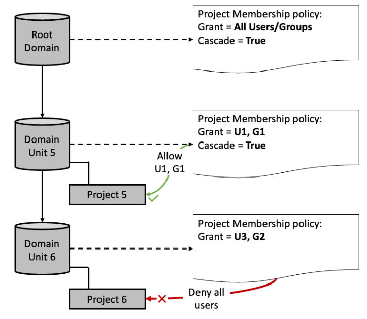
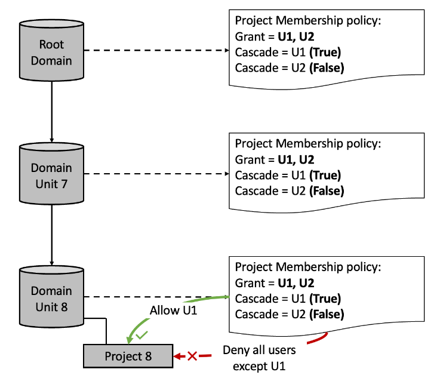
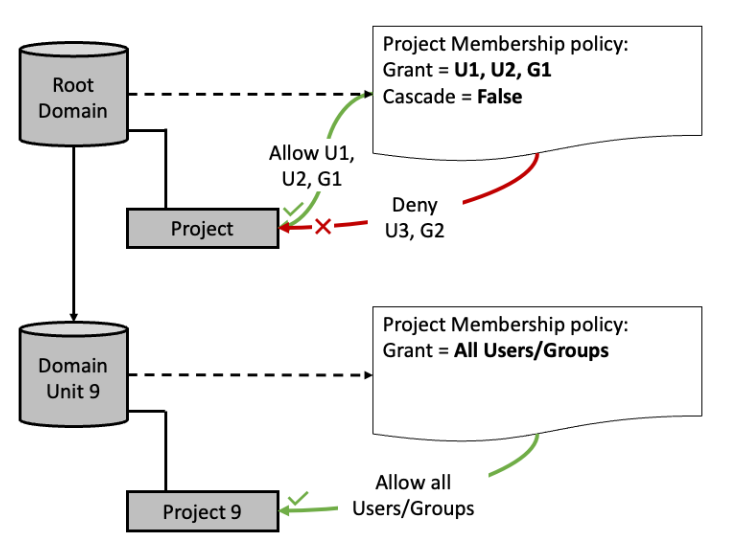

# Project membership policy in the hierarchy

of domain units in Amazon DataZone

The project membership policy defines the individuals or groups that are eligible
to be added as members to projects within a domain unit. This topic describes
scenarios of the impact of the policy in relation to an individual domain unit and
domain units in a hierarchal structure.

It's important to note several concepts that are used in this topic:

- Membership pool - the principals (users or groups) that are granted access
  through the project membership policy are considered part of the project
  membership pool. For instance, if the policy for domain unit DU1 is granted
  to users U1 and U2, as well as the Single Sign-On (SSO) group G1, the
  project membership pool for DU1 would consist of {U1, U2, G1}.
- Cascade - the ability to pass the grant down to all child domain units
  connected through the domain unit hierarchy.
- Grant - the permission for a user or group to perform an action.
  **Scenario 1** - any user or group can be added to
  the project under Domain Unit 1 as the membership pool consists of {All
  Users/Groups}.

**Scenario 2** - Users {U1, G1} can be added to the
project under Domain Unit 2 since they are part of the membership pool under Domain
Unit 2. Users {U3, G2} cannot be added to any project as they are not part of the
membership pool.

**Scenario 3** - Intersection of membership pools:
when there are membership pools at different domain unit hierarchy levels, only the
users and groups that are in all of the membership pools can be added to the
project.

- The intersection of users across both membership pools is {U1, U2,
  G1}.
- Users {U1, U2, G1} can be added to the project under Domain Unit 3.
- Users {U3, G2} cannot be added to the project under Domain Unit 3 even
  with All Users and All Groups being in the membership pool at the Root
  Domain unit level.
  **Scenario 4** - Intersection of membership pools:
  when there are membership pools at different domain unit hierarchy levels, only the
  users and groups that are in all of the membership pools can be added to the
  project.

- The intersection of users across both membership pools is {U1, U2,
  G1}.
- The membership pool at Domain Unit 4 is {All Users / Groups} but the
  membership pool cannot expand beyond the membership pool at the Root Domain
  {U1, U2, G1}.
- Users {U3, G2} cannot be added to the project under Domain Unit 4 even
  with All Users and All Groups being in the membership pool at Domain Unit

4.  **Scenario 5** - Users {U1, G1} can be added to
    Project 5 as they part of the intersection of membership pools between Root Domain
    and Domain Unit 5. No user/group can be added to Project 6 as the intersection of
    the three membership pools is empty.

**Scenario 6** - The intersection across all three
membership pools means only user {U1} can be added to Project 8. Intersection pools
at for Domain Unit 8 are {U1}, {U1}, {U1, U2} - with only {U1} being common across
the three.

**Scenario 7** - Users {U1, U2, G1} can be added to
the project of the Root Domain as they part of the membership pool from the Root
Domain. Any user or group can be added to the project under Domain Unit 9 as the
membership pool consists of {All Users/Groups} because cascade is set to false in
the Root Domain above it.

