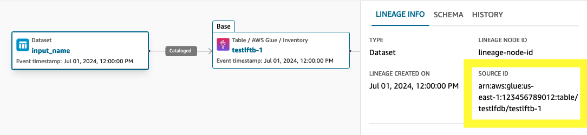
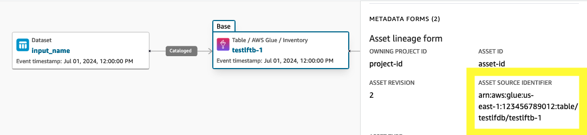

# Troubleshooting Amazon DataZone

If you encounter access-denied issues or similar difficulties when working with Amazon DataZone
consult the topics in this section.

## Troubleshooting AWS Lake

Formation permissions for Amazon DataZone

This section contains troubleshooting instructions for issues that you might encounter
when you [Configure Lake Formation
permissions for Amazon DataZone](lake-formation-permissions-for-datazone.md "lake-formation-permissions-for-datazone.md").

| Error message in the Data Portal                                                                                               | Resolution                                                                                                                                                                                                                                                                                                                                                                                                                                                                                                                                                                                                                                                                                                                                                                                                                                                                                                                                                                                                                                                                                                                                                                                                                                                                                                                                                                                                                                                                                                                                                                                                                                                                                                                                                                                                                                                                                                                                    |
| ------------------------------------------------------------------------------------------------------------------------------ | --------------------------------------------------------------------------------------------------------------------------------------------------------------------------------------------------------------------------------------------------------------------------------------------------------------------------------------------------------------------------------------------------------------------------------------------------------------------------------------------------------------------------------------------------------------------------------------------------------------------------------------------------------------------------------------------------------------------------------------------------------------------------------------------------------------------------------------------------------------------------------------------------------------------------------------------------------------------------------------------------------------------------------------------------------------------------------------------------------------------------------------------------------------------------------------------------------------------------------------------------------------------------------------------------------------------------------------------------------------------------------------------------------------------------------------------------------------------------------------------------------------------------------------------------------------------------------------------------------------------------------------------------------------------------------------------------------------------------------------------------------------------------------------------------------------------------------------------------------------------------------------------------------------------------------------------- |
| Unable to assume the Data Access Role.                                                                                         | This error is displayed when Amazon DataZone is unable to assume the<br>**AmazonDataZoneGlueDataAccessRole\*<br>• that you<br>used to enable the **DefaultDataLakeBlueprint*<br>• in<br>your account. To fix the issue, go to the AWS IAM console in the<br>account where your data asset exists and make sure that the<br>\*\*AmazonDataZoneGlueDataAccessRole*<br>• has the<br>right trust relationship with the Amazon DataZone service principal. For<br>more information, see [AmazonDataZoneGlueAccess-<region>-<domainId>](glue-manage-access-role.md "glue-manage-access-role.md")                                                                                                                                                                                                                                                                                                                                                                                                                                                                                                                                                                                                                                                                                                                                                                                                                                                                                                                                                                                                                                                                                                                                                                                                                                                                                                                                                    |
| The Data Access Role does not have the necessary permissions to<br>read the metadata of the asset you are trying to subscribe. | This error is displayed when Amazon DataZone successfully assumes the<br>**AmazonDataZoneGlueDataAccessRole\*<br>• role, but<br>the role does not have the necessary permissions. To fix the issue,<br>go to the AWS IAM console in the account where your data asset<br>exists and make sure that the role has the<br>**AmazonDataZoneGlueManageAccessRolePolicy\*\*<br>attached it. For more information, see [AmazonDataZoneGlueAccess-<region>-<domainId>](glue-manage-access-role.md "glue-manage-access-role.md").                                                                                                                                                                                                                                                                                                                                                                                                                                                                                                                                                                                                                                                                                                                                                                                                                                                                                                                                                                                                                                                                                                                                                                                                                                                                                                                                                                                                                      |
| Asset is a resource link. Amazon DataZone does not support<br>subscriptions to resource links.                                 | This error is displayed when the asset you are trying to publish<br>to Amazon DataZone is a resource link to an AWS Glue table.                                                                                                                                                                                                                                                                                                                                                                                                                                                                                                                                                                                                                                                                                                                                                                                                                                                                                                                                                                                                                                                                                                                                                                                                                                                                                                                                                                                                                                                                                                                                                                                                                                                                                                                                                                                                               |
| Asset is not managed by AWS Lake Formation.                                                                                    | This error indicates that the AWS Lake Formation permissions are<br>not enforced on the asset that you want to publish. This can happen<br>in the following cases.<br>• The Amazon S3 location of the asset is not registered in<br>AWS Lake Formation. To fix the issue, log into your AWS<br>Lake Formation console in the account where the table exists<br>and register the Amazon S3 location either in AWS Lake<br>Formation mode or Hybrid mode. For more information, see<br>[Registering an Amazon S3 location](../../../lake-formation/latest/dg/register-location.md "../../../lake-formation/latest/dg/register-location.md"). There are<br>several scenarios that require further modifications. These<br>include encrypted AmazonS3 buckets or a cross-account S3<br>bucket and an AWS Glue Catalog setup. In such cases,<br>modifications in KMS and/or S3 settings may be necessary.<br>For more information, see [Registering an encrypted Amazon S3 location](../../../lake-formation/latest/dg/register-encrypted.md "../../../lake-formation/latest/dg/register-encrypted.md").<br>• The Amazon S3 location is registered in AWS Lake<br>Formation mode but **IAMAllowedPrincipal**<br>is added to the table's permissions. To fix the issue, you<br>can either remove the<br>\*_IAMAllowedPrincipal_<br>• from the<br>table's permissions or register the S3 location in Hybrid<br>mode. For more information, see [About upgrading to the Lake Formation permissions<br>model](About upgrading to the Lake Formation permissions model.md "About upgrading to the Lake Formation permissions model.md"). If your S3 location is encrypted or the<br>S3 location is in a different accout than than your AWS<br>Glue table, follow the instructions in [Registering an encrypted Amazon S3 location](../../../lake-formation/latest/dg/register-encrypted.md "../../../lake-formation/latest/dg/register-encrypted.md"). |
| Data Access role does not have necessary Lake Formation<br>permissions to grant access to this asset.                          | This error indicates that the<br>**AmazonDataZoneGlueDataAccessRole\*<br>• that you<br>are using to enable the<br>**DefaultDataLakeBlueprint*<br>• in your account<br>does not have the necessary permissions for Amazon DataZone to manage<br>permissions on the published asset. You can resolve the issue by<br>either adding the<br>\*\*AmazonDataZoneGlueDataAccessRole*<br>• as the<br>AWS Lake Formation administrator or by granting the following<br>permissions to the<br>\*_AmazonDataZoneGlueDataAccessRole_<br>• on the<br>asset that you want to publish.<br>• Describe and Describe grantable permissions on the<br>database where the asset exist<br>• Describe, Select, Describe Grantable, Select Grantable<br>permissions on the all the assets in the database the acecss<br>to which you wanto Amazon DataZone to manage on your<br>behalf.                                                                                                                                                                                                                                                                                                                                                                                                                                                                                                                                                                                                                                                                                                                                                                                                                                                                                                                                                                                                                                                                              |

## Troubleshooting Amazon DataZone lineage asset linking with upstream datasets

This section contains troubleshooting instructions for issues that you might encounter with Amazon DataZone lineage. For some of the AWS Glue and Amazon Redshift-related open lineage run events, you may see that asset lineage is not linked to an upstream dataset. This topic explains the scenarios and a few approaches to mitigate issues. For more information on lineage, see [Data lineage in Amazon DataZone](datazone-data-lineage.md "datazone-data-lineage.md").

### SourceIdentifier on lineage node

The `sourceIdentifier` attribute in a lineage node represents the events happening on a dataset. For more information, see [Key attributes in lineage nodes](datazone-data-lineage.md#datazone-data-lineage-key-attributes "datazone-data-lineage.md#datazone-data-lineage-key-attributes").

The lineage node represents all the events that happen on the corresponding dataset or job. The lineage node contains a "sourceIdentifier" attribute which contains the identifier of the corresponding dataset/job. As we support open-lineage events, the `sourceIdentifier` value is by default populated as the combination of "namespace" and "name" for a dataset, job and job runs.

For AWS resources such as AWS Glue and Amazon Redshift, the `sourceIdentifier` would be the AWS Glue table ARN and the Redshift table ARNs from which Amazon DataZone will construct the run-event and other details as follows:

###### Note

In AWS, the ARN contains information such as the accountId, region, database, and table for every resource.

- OpenLineage event for these datasets contain database and table name.
- Region is captured in the "environment-properties" facet of a run. If it's not present, the system uses the region from the caller credentials.
- AccountId is taken from the caller credentials.

###### SourceIdentifier on the assets within DataZone

`AssetCommonDetailForm` has an attribute called "sourceIdentifier" which represents the identifier of the dataset which the asset represents. For asset lineage nodes to be linked with an upstream dataset, the attribute needs to be populated with the value matching with the dataset node’s `sourceIdentifier`. If the assets are imported by datasource, the workflow populates `sourceIdentifier` as the AWS Glue table ARN / Redshift table ARN automatically while other assets (including custom assets) created via the `CreateAsset` API should have that value populated by the caller.

### How does Amazon DataZone construct the sourceIdentifier from the OpenLineage Event?

For AWS Glue and Redshift assets, the `sourceIdentifier` is constructed from Glue and Redshift ARNs. Here's how Amazon DataZone constructs it:

#### AWS Glue ARN

The goal is to construct an OpenLineage Event where the output lineage node's `sourceIdentifier` is:

```
arn:aws:glue:us-east-1:123456789012:table/testlfdb/testlftb-1
```

To determine if a run is using data from AWS Glue, look for the presence of certain keywords in the `environment-properties` facet. Specifically, if any of these designated fields are present, the system assumes the `RunEvent` originates from AWS Glue.

- GLUE_VERSION
- GLUE_COMMAND_CRITERIA
- GLUE_PYTHON_VERSION

```
"run": {
   "runId":"4e3da9e8-6228-4679-b0a2-fa916119fthr",
   "facets":{
      "environment-properties":{
         "_producer":"https://github.com/OpenLineage/OpenLineage/tree/1.9.1/integration/spark",
         "_schemaURL":"https://openlineage.io/spec/2-0-2/OpenLineage.json#/$defs/RunFacet",
         "environment-properties":{
            "GLUE_VERSION":"3.0",
            "GLUE_COMMAND_CRITERIA":"glueetl",
            "GLUE_PYTHON_VERSION":"3"
         }
      }
   }
```

For an AWS Glue run, you can use the name from the `symlinks` facet to get the database and table name, which can be used to construct the ARN.

Need to make sure the name is `databaseName.tableName`:

```
"symlinks": {
   "_producer":"https://github.com/OpenLineage/OpenLineage/tree/1.9.1/integration/spark",
   "_schemaURL":"https://openlineage.io/spec/facets/1-0-0/SymlinksDatasetFacet.json#/$defs/SymlinksDatasetFacet",
   "identifiers":[
      {
         "namespace":"s3://object-path",
         "name":"testlfdb.testlftb-1",
         "type":"TABLE"
      }
   ]
}
```

Sample COMPLETE Event:

```
{
   "eventTime":"2024-07-01T12:00:00.000000Z",
   "producer":"https://github.com/OpenLineage/OpenLineage/tree/1.9.1/integration/glue",
   "schemaURL":"https://openlineage.io/spec/2-0-2/OpenLineage.json#/$defs/RunEvent",
   "eventType":"COMPLETE",
   "run": {
      "runId":"4e3da9e8-6228-4679-b0a2-fa916119fthr",
      "facets":{
         "environment-properties":{
            "_producer":"https://github.com/OpenLineage/OpenLineage/tree/1.9.1/integration/spark",
            "_schemaURL":"https://openlineage.io/spec/2-0-2/OpenLineage.json#/$defs/RunFacet",
            "environment-properties":{
               "GLUE_VERSION":"3.0",
               "GLUE_COMMAND_CRITERIA":"glueetl",
               "GLUE_PYTHON_VERSION":"3"
            }
         }
      }
   },
   "job":{
      "namespace":"namespace",
      "name":"job_name",
      "facets":{
         "jobType":{
            "_producer":"https://github.com/OpenLineage/OpenLineage/tree/1.9.1/integration/glue",
            "_schemaURL":"https://openlineage.io/spec/facets/2-0-2/JobTypeJobFacet.json#/$defs/JobTypeJobFacet",
            "processingType":"BATCH",
            "integration":"glue",
            "jobType":"JOB"
         }
      }
   },
   "inputs":[
      {
         "namespace":"namespace",
         "name":"input_name"
      }
   ],
   "outputs":[
      {
         "namespace":"namespace.output",
         "name":"output_name",
         "facets":{
            "symlinks":{
               "_producer":"https://github.com/OpenLineage/OpenLineage/tree/1.9.1/integration/spark",
               "_schemaURL":"https://openlineage.io/spec/facets/1-0-0/SymlinksDatasetFacet.json#/$defs/SymlinksDatasetFacet",
               "identifiers":[
                  {
                     "namespace":"s3://object-path",
                     "name":"testlfdb.testlftb-1",
                     "type":"TABLE"
                  }
               ]
            }
         }
      }
   ]
}
```

Based on the `OpenLineage` event submitted, the `sourceIdentifier` of the output lineage node will be:

```
arn:aws:glue:us-east-1:123456789012:table/testlfdb/testlftb-1
```

The output lineage node will be connected to an asset's lineage node where the asset's `sourceIdentifier` is:

```
arn:aws:glue:us-east-1:123456789012:table/testlfdb/testlftb-1
```





#### Amazon Redshift ARN

The goal is to construct an OpenLineage Event where the output lineage node's `sourceIdentifier` is:

```
arn:aws:redshift:us-east-1:123456789012:table/workgroup-20240715/tpcds_data/public/dws_tpcds_7
```

The system determines whether an input or output is stored in Redshift based on the namespace. Specifically, if the namespace starts with redshift:// or contains the strings `redshift-serverless.amazonaws.com` or `redshift.amazonaws.com`, it is a Redshift resource.

```
"outputs": [
    {
        "namespace":"redshift://workgroup-20240715.123456789012.us-east-1.redshift.amazonaws.com:5439",
        "name":"tpcds_data.public.dws_tpcds_7"
    }
]
```

Note that the namespace needs to be in the following format:

```
provider://{cluster_identifier}.{region_name}:{port}
```

For `redshift-serverless`:

```
"outputs": [
    {
        "namespace":"redshift://workgroup-20240715.123456789012.us-east-1.redshift-serverless.amazonaws.com:5439",
        "name":"tpcds_data.public.dws_tpcds_7"
    }
]
```

Results in the following `sourceIdentifier`

```
arn:aws:*redshift-serverless*:us-east-1:123456789012:table/workgroup-20240715/tpcds_data/public/dws_tpcds_7
```

Based on the OpenLineage event submitted, the `sourceIdentifier` to be mapped to a downstream (that is, an output of the event) lineage node is:

```
arn:aws:redshift-serverless:us-e:us-east-1:123456789012:table/workgroup-20240715/tpcds_data/public/dws_tpcds_7
```

This is the mapping that helps you visualize the lineage of an asset in the catalog.

### Alternate approach

When none of the above conditions are met, the system uses the **namespace**/**name** to construct the `sourceIdentifier`:

```
"inputs": [
  {
     "namespace":"arn:aws:redshift:us-east-1:123456789012:table",
     "name":"workgroup-20240715/tpcds_data/public/dws_tpcds_7"
  }
],
"outputs": [
  {
     "namespace":"arn:aws:glue:us-east-1:123456789012:table",
     "name":"testlfdb/testlftb-1"
  }
]
```

### Troubleshooting a lack of upstream for the asset lineage node

If you don’t see the upstream of the asset lineage node, you can do the following to troubleshoot why it's not linked with the dataset:

1. Invoke `GetAsset` while providing the `domainId` and `assetId`:

```
aws datazone get-asset --domain-identifier <domain-id> --identifier <asset-id>
```

The response appears as follows:

```
{
    .....
    "formsOutput": [
        .....
        {
            "content": "{\"sourceIdentifier\":\"arn:aws:glue:eu-west-1:123456789012:table/testlfdb/testlftb-1\"}",
            "formName": "AssetCommonDetailsForm",
            "typeName": "amazon.datazone.AssetCommonDetailsFormType",
            "typeRevision": "6"
        },
        .....
    ],
    "id": "<asset-id>",
    ....
}
```

2. Invoke `GetLineageNode` to get the `sourceIdentifier` of the dataset lineage node. As there is no way to get the lineage node for the corresponding dataset node directly, you can start with `GetLineageNode` on the job run:

```
aws datazone get-lineage-node --domain-identifier <domain-id> --identifier <job_namespace>.<job_name>/<run_id>

if you are using the getting started scripts, job name and run ID are printed in the console
and namespace is "default". Otherwise you can get these values from run event content.
```

The sample response looks like the following:

```
{
    .....
    "downstreamNodes": [
        {
            "eventTimestamp": "2024-07-24T18:08:55+08:00",
            "id": "afymge5k4v0euf"
        }
    ],
    "formsOutput": [
        <some forms corresponding to run and job>
    ],
    "id": "<system generated node-id for run>",
    "sourceIdentifier": "default.redshift.create/2f41298b-1ee7-3302-a14b-09addffa7580",
    "typeName": "amazon.datazone.JobRunLineageNodeType",
    ....
    "upstreamNodes": [
        {
            "eventTimestamp": "2024-07-24T18:08:55+08:00",
            "id": "6wf2z27c8hghev"
        },
        {
            "eventTimestamp": "2024-07-24T18:08:55+08:00",
            "id": "4tjbcsnre6banb"
        }
    ]
}
```

3. Invoke `GetLineageNode` again by passing in the the downstream/upstream node identifier (which you think should be linked to the asset node) as these correspond to the dataset:

Sample command using the above example response:

```
aws datazone get-lineage-node --domain-identifier <domain-id> --identifier afymge5k4v0euf
```

This returns the lineage node details corresponding to the dataset: afymge5k4v0euf

```
{
    .....
    "domainId": "dzd_cklzc5s2jcr7on",
    "downstreamNodes": [],
    "eventTimestamp": "2024-07-24T18:08:55+08:00",
    "formsOutput": [
        .....
    ],
    "id": "afymge5k4v0euf",
    "sourceIdentifier": "arn:aws:redshift:us-east-1:123456789012:table/workgroup-20240715/tpcds_data/public/dws_tpcds_7",
    "typeName": "amazon.datazone.DatasetLineageNodeType",
    "typeRevision": "1",
    ....
    "upstreamNodes": [
        ...
    ]
}
```

4. Compare the `sourceIdentifier` of this dataset node and the response from `GetAsset`. If they are not linked, these will not match, and therefore will not be visible in the lineage UI.

###### Non-matching scenarios and mitigations

The following are commonly known scenarios where these will not match and the possible mitigations:

**Root cause**: The tables are present in different account than that of the Amazon DataZone domain account.

**Mitigation**: You can invoke the `PostLineageEvent` operation from an associated account. As the `accountId` to construct the ARN is picked from the caller credentials, you can assume the role from the account containing the tables when running the getting started script or invoking `PostLineageEvent`. Doing so will help in constructing the ARNs correctly and linking with the asset nodes.

**Root cause**: The ARN for Redshift table/views contains Redshift/Redshift-serverless based on the namespace and name attributes of the corresponding dataset information in the OpenLineage run event.

**Mitigation**: As there is no deterministic way to know if the given name belongs to cluster or workgroup, we use the following heuristic:

- If the "name" corresponding to the dataset contains "`redshift-serverless.amazonaws.com`", we use redshift-serverless as part of the ARN, otherwise default to "redshift".
- The above means aliases on workgroup names will not work.

**Root cause**: Upstream datasets are not linked properly for custom assets.

**Mitigation**: Make sure to populate the `sourceIdentifier` on the asset by invoking `CreateAsset`/`CreateAssetRevision` that matches with the `sourceIdentifier` of the dataset node (which would be <namespace>/<name> for custom nodes).
