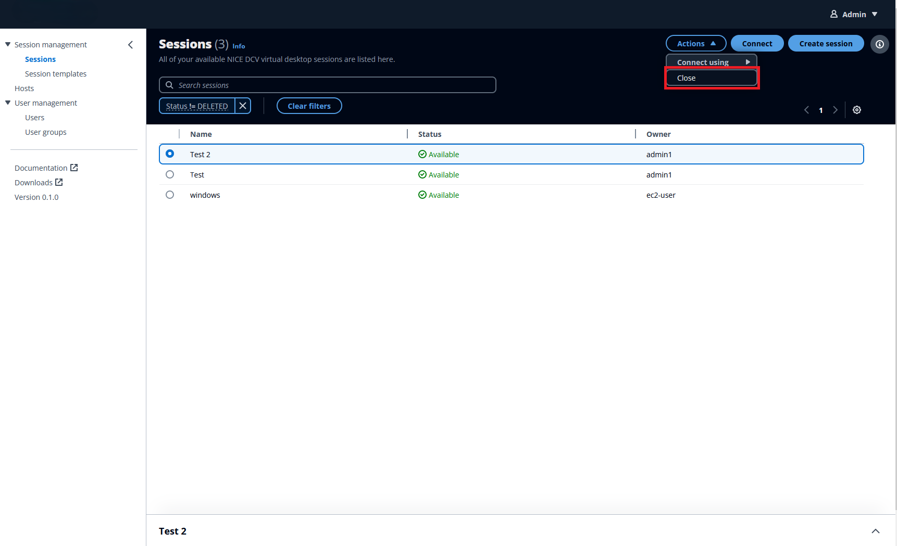

# Closing a session

After you’re completely done with your work, you can **Close** a session and release the underlying resource back to the host
server.

###### Note

Closing a session can't be undone. All locally saved work will be lost.
Closing a session doesn't shut down the underlying host server.

1. Go to the **Sessions** page.
2. Select the session that you want to close.
3. Click the **Actions** button in the session
   window.
4. Select **Close** from the menu.

 5. Select **Close** from the window that appears.
