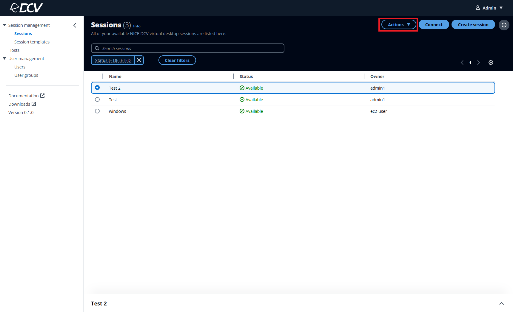

# Connecting to a session

You can connect to a session after it has been created. You can connect to a session from either the DCV web client, or a native Windows or macOS client application.

1. Select the **Actions** button in the session window that
   you want to view.

 2. Select **Connect using** from the menu. 3. Choose from one of the following options:

    * **Web browser**— Connects to your session
     using a web browser.
    * **Windows client**— Connects to your
     session using the Windows client with the Amazon DCV app. If you don't
     have the appropriate local Amazon DCV Viewer application downloaded, you
     will be directed to the [Amazon DCV download site](http://download.amazondcv.com "http://download.amazondcv.com") where you can download the latest
     viewer.
    * **macOS client**— Connects to your session
     using the macOS client with the Amazon DCV app. If you don't have the
     appropriate local Amazon DCV Viewer application downloaded, you will be
     directed to the [Amazon DCV
     download site](http://download.amazondcv.com "http://download.amazondcv.com") where you can download the latest
     viewer.
