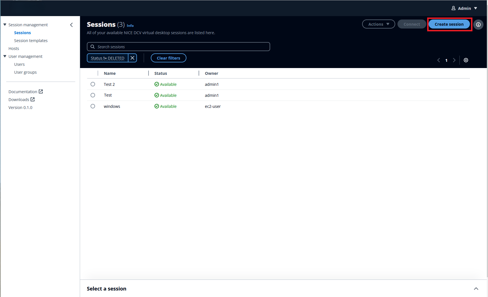
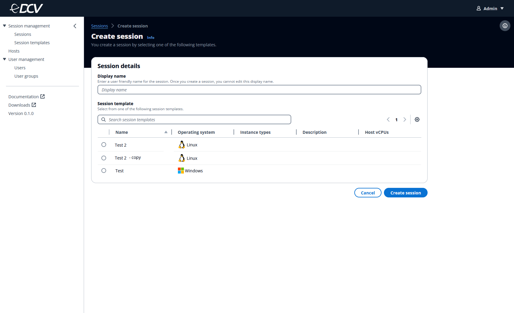
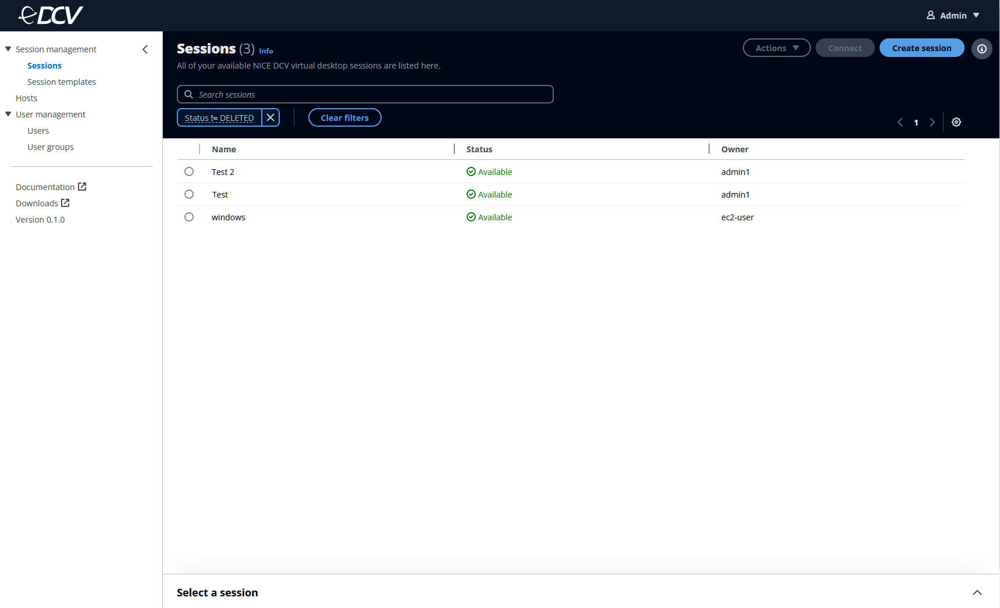

# Creating a session

To use this console, you must create a session. A session is a span of time when
the Amazon DCV server can accept connections from a client. By creating a new session,
your default level of access is **owner**, which gives you admin
permissions.

To create a new session, you must select a template already provided by the
administrator. Session templates are specified parameters that you can create a
session with. If there are no templates available to choose from, contact the
administrator to create a template and assign it to you.

1. Select **Sessions** under the **Session management** tab.
2. Select the **Create session** button.

 3. In **Display name**, enter a user friendly name for your
session.

###### Note

After you create a session, you can't edit this name. 4. Select a **Session template**. 5. Select the **Create session** button.

The newly created session will appear in the Sessions dashboard. It may take a few
minutes to create the session. In that time, you won't be able to connect to or
close the session.

