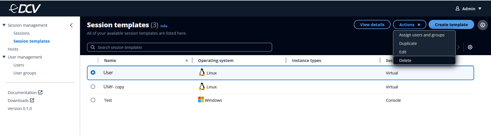

# Deleting a session

template

You can delete a session template when you're completely done with it.

###### Note

Deleting a session can't be undone. Active sessions that were created with a
deleted template won't be affected. However, any assigned users will no longer
see the template available when they create a new session.

1. Select the session template that you want to delete.
2. Click on the **Actions** button.
3. Select **Delete** from the drop-down menu.

 4. Click on the **Delete** button in the window that
appears.
