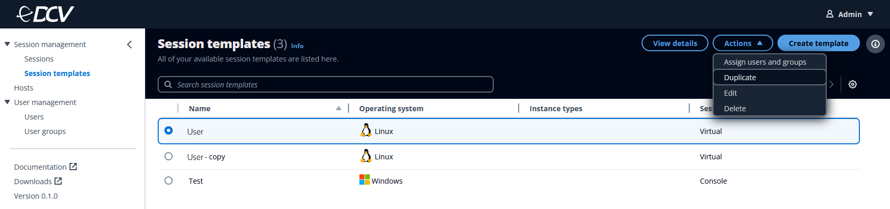

# Duplicating a session

template

Instead of creating a new session template, you can choose to duplicate an
existing session template and change its parameters to your specifications.

1. Select the session template that you want to duplicate.
2. Click on the **Actions** button.
3. Select **Duplicate** from the drop-down menu. This will
   take you to the **Configure template details** page.

 4. Change any of the information in the **Configure template
details** page.

This page chooses the parameters of your session template. These
parameters define the details of the session and create boundaries for what
kind of hosts a session can be created on. See [Session template details](session-templates.md#session-template-details "session-templates.md#session-template-details") for
more information. 5. Assign users or user groups to the session template.

You can assign a session template for existing users or groups to use when
creating sessions. You can do this either during template creation or after
a template has already been created. For more information, see [Assigning a
session template to users or groups](assigning-session-template.md "assigning-session-template.md"). 6. Select the **Create template** button.
